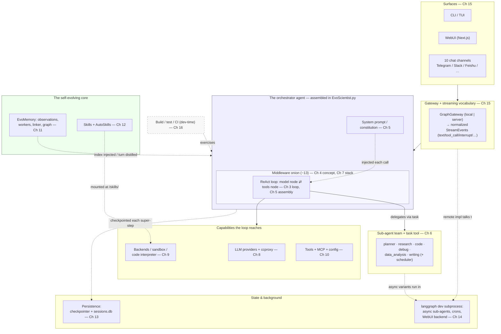

# Chapter 2 — The Whole System on One Page

> **This chapter answers:**
> - What are the major moving parts of EvoScientist, and how do they fit together?
> - What are the three layers of the stack, and which one is actually "the repo"?
> - When you type a request like *"survey recent methods for X"*, what path does it take through the system?
> - How should you read the rest of this book — is there a shortcut for what I want?

Chapter 1 gave you the *why*: research is a long, multi-stage grind, and the authors made a specific bet — don't build an agent from scratch, *configure* a general-purpose agent framework for the research domain, then wrap it in a memory that grows across sessions and a skill set that grows with it. That was the philosophy. This chapter turns the philosophy into a map.

Everything that follows in the book zooms into some region of one diagram. So before we descend into any single mechanism, you need the whole machine in your head at once — coarse, but complete. This is the "粗" (coarse orientation) that later chapters turn into "细" (fine detail). Read this chapter as a table of contents drawn as a picture: by the end you should be able to point at any box and say "that's Chapter N, and I know roughly what it does and why it's there." You will not understand each box deeply yet — that's fine, that's the rest of the book — but you will never again be lost about *where a thing lives*.

## The three-layer stack: which one is "the repo"?

The single most important idea from Chapter 1, restated structurally: **almost none of the "agent-ness" lives in the EvoScientist repository.** The agent loop, the tool-calling machinery, the graph that drives it — all of that is borrowed from two libraries underneath. What EvoScientist adds is *disciplined configuration* of those libraries for one domain (running scientific experiments), plus the machinery to make that agent improve over time and run everywhere.

That borrowing forms a three-layer stack. We always name it in the same order, **bottom-to-top by wrapping**:

```
┌─────────────────────────────────────────────────────────────┐
│  EvoScientist   ← THE REPO you are reading                   │
│  EvoScientist/EvoScientist.py + ~13 middleware + prompts +   │
│  backends + subagent YAML + memory + skills + surfaces       │
│  "configures"                                                │
├─────────────────────────────────────────────────────────────┤
│  deepagents     (a pip dependency, ~=0.6.12)                 │
│  create_deep_agent → adds a virtual filesystem, sub-agents,  │
│  skills, memory hooks, summarization                         │
│  "wraps"                                                     │
├─────────────────────────────────────────────────────────────┤
│  LangChain      (a pip dependency)                           │
│  create_agent → compiles the actual ReAct loop as a          │
│  LangGraph state machine (model ⇄ tools)                     │
└─────────────────────────────────────────────────────────────┘
```

Read this stack two ways at once, and both matter.

Read it **top-down as delegation**: EvoScientist *configures* deepagents, which *wraps* LangChain. When you ask EvoScientist to do something, control flows down through the layers to reach the actual agent loop, then results flow back up.

Read it **bottom-up as constraint**: LangChain is the substrate; deepagents can only do what LangChain lets it; EvoScientist can only do what deepagents exposes. Each layer's shape is dictated by the layer beneath it. This is why so much of EvoScientist's cleverness (Chapter 7) looks like it's *working around* the layers below — it is. The lower layers are the ground rules, and the repo plays a hard game within them.

Let us name each layer with just enough intuition to hold it, and no more — because two later chapters own the precise definitions, and pre-empting them would confuse you.

**LangChain** is the LLM-application framework EvoScientist ultimately builds on. Its factory `create_agent` compiles a *ReAct loop* — the reason→act→observe cycle where a chat model either emits a tool call (a structured request to run a named function) or stops. Under the hood, `create_agent` builds this loop as a *LangGraph state machine*: a graph of named steps ("nodes") passing one shared state object between them, with a `"model"` node and a `"tools"` node wired in a cycle. **Chapter 3 makes all of this precise** — what a state graph is, how the loop's router decides model-or-stop, what a checkpointer and a thread are. For now, hold one image: a model talking to tools in a loop, driven by a little state machine.

**deepagents** is the "batteries-included" agent framework that wraps `create_agent`. Its factory `create_deep_agent` takes that bare loop and bolts on the things a serious agent needs: a *virtual filesystem* (the agent reads and writes files through a uniform interface), *sub-agents* (specialist agents the main agent can delegate to via a `task` tool), skills, memory hooks, and automatic conversation summarization. Crucially, deepagents is where the *middleware* idea lives — a way to hook the agent's lifecycle and intercept its model and tool calls, composed as an ordered "onion." **Chapter 4 makes deepagents precise** — the middleware hooks, the backend interface, the `task` tool's internals. For now: deepagents is the layer that turns "a model in a loop" into "an agent with a filesystem and a team."

**EvoScientist** is the repository in front of you — the top layer, and the only one whose source you are studying. Everything the repo does, it does by handing configuration to `create_deep_agent`: which chat model, which tools, which backend, which sub-agents, which middleware, which system prompt. The one file where this assembly happens is `EvoScientist/EvoScientist.py`, and we will look at the exact call in a moment.

So: **which layer is the repo?** Only the top one. When this book says "the code," it almost always means EvoScientist's code — the configuration layer — not the two dependencies it stands on. Chapters 3 and 4 are the exception: they teach the borrowed foundations precisely *because* you cannot read a configuration layer without understanding what it configures.

## The master diagram

Here is the whole system on one page. Every region is tagged with the chapter (or chapters) that zoom into it. This is the book's signature device: from Chapter 3 onward, every chapter opens by naming which region of *this* map it is entering.



**Reading direction.** The heavy arrows read **top-down**, and they follow a *request*: it enters at a surface (you typing in the CLI, or a Slack message), passes through the gateway, and reaches the orchestrator agent — the main agent, which we always call **the orchestrator**. Inside the orchestrator, the request meets the middleware onion (outermost middleware first), then the ReAct loop, which may delegate to a sub-agent or reach out to a capability. The dotted arrows are *cross-cutting* relationships that don't fit a single top-down pass: the system prompt is injected into every model call, memory is both injected in and distilled out, state is checkpointed after every step, and the build/test region (drawn to the side, dashed) exercises the whole thing at development time.

But recall the second reading of the stack. The dependency arrows also read **bottom-up**: the persistence, the backends, the LLM layer are constraints the agent is built *on top of*. The orchestrator can only checkpoint the way LangGraph checkpoints; it can only reach files the way the backend allows. When a later chapter feels like it's explaining a workaround, that's the bottom-up constraint showing through the top-down flow.

Notice what sits at the exact center: the orchestrator agent, drawn as a system prompt plus a middleware onion wrapped around a model⇄tools loop. That nesting is not decoration — it *is* the architecture. The loop (Chapter 3) is borrowed from LangChain. The onion (Chapters 4 and 7) is borrowed from deepagents but *filled* by EvoScientist. The system prompt (Chapter 5) is written by EvoScientist. Everything else on the diagram is either something the loop reaches out to, or something that feeds the loop from the side.

## One request, end to end

Diagrams are static; the system is not. Let's walk one request through it, at altitude. Imagine you type into the CLI:

> `survey recent methods for retrieval-augmented generation`

Here is the journey, each step naming the chapter that owns the detail.

**1. The surface receives your text.** You're in the CLI, one of ten-plus surfaces. The CLI is the *entry point* for the whole program: `pyproject.toml:104-108` registers four command aliases — `evoscientist`, `EvoScientist`, `evosci`, `EvoSci` — all pointing at the same function, `EvoScientist.cli:main`. That function lives at `EvoScientist/cli/__init__.py:67`. The CLI, the WebUI, and the chat channels are all *thin renderers*: none of them contains agent logic; each just captures input and displays output. **Chapter 15** dissects the surfaces.

**2. The gateway hands the request to the agent.** Between every surface and the agent sits a seam called the *gateway* — a small interface (`GraphGateway`) that offers "create a thread, stream events" and hides whether the agent runs in-process (local) or in a separate server. Your text becomes a message on a conversation *thread* (an id grouping one conversation's history), and the gateway asks the agent to run. **Chapter 15** covers the gateway and the streaming vocabulary that carries results back.

**3. The orchestrator's model→tools loop turns.** Now we're inside the deep agent — the graph that `create_deep_agent` compiled. The orchestrator's chat model reads your request (plus its system-prompt constitution and any injected memory) and decides what to do. Surveying literature means searching, so it likely emits a tool call — say, a web search — the loop runs the tool, feeds the result back to the model, and the model reasons again. This reason→act→observe cycle is the ReAct loop of **Chapter 3**; every turn of it is wrapped by the middleware onion of **Chapters 4 and 7**, which is where adaptive tool selection, error handling, context trimming, and human-approval gates splice in.

**4. Maybe the loop delegates to a sub-agent.** A literature survey is a big sub-task. Rather than do everything in the main context, the orchestrator can call the `task` tool to hand the whole job to the `research` sub-agent — a specialist with its own prompt and its own fresh context. Sub-agents run as nested graphs (synchronously) or, for some roles, as background remote graphs. **Chapter 6** covers the team and the delegation mechanics; the `task` tool's internals are **Chapter 4**.

**5. Memory is injected on the way in and distilled on the way out.** Before the model call, EvoScientist injects an *observation index* — a compact listing of what it has learned in past sessions — so the agent can recall relevant prior findings. After the turn finishes, a background *memory worker* reads the trajectory and distills durable *observations* (atomic Markdown notes) that a linker later connects into a graph. This is the self-evolving loop of **Chapter 11**; the skills mined from that graph are **Chapter 12**.

**6. Results stream back, and state is checkpointed.** As the model produces text, tool calls, and thinking, the agent emits normalized *streaming events* that flow back up through the gateway to your terminal, rendered live. And after every super-step (one round of the graph advancing), the state is snapshotted by a *checkpointer* into a single SQLite file, so you can close the terminal and `/resume` later. Streaming is **Chapter 15**; persistence — and why naive persistence would explode into gigabytes — is **Chapter 13**.

That is the entire book in one request. Every scene above is a chapter; the master diagram is the seating chart.

## "Configure, don't build," shown structurally

Chapter 1 stated the design bet as a slogan: *configure, don't build.* Now you can see it as a single function call.

Everything that makes an EvoScientist agent an *EvoScientist* agent — not just a generic deep agent — is bundled into a dictionary of keyword arguments and handed to deepagents. The assembly happens in `_build_base_kwargs`, at `EvoScientist/EvoScientist.py:516-525`:

```python
    return {
        "name": "EvoScientist",
        "model": chat_model if chat_model is not None else _ensure_chat_model(),
        "tools": list(base_tools),
        "backend": base_backend,
        "subagents": subs,
        "middleware": base_middleware,
        "system_prompt": _configured_system_prompt(cfg),
        "skills": list(DEFAULT_SKILL_SOURCES),
    }
```

Read this dictionary as a shopping list, and it *is* the master diagram in code form. `model` is the LLM provider layer (Chapter 8). `tools` and the MCP servers folded in elsewhere are Chapter 10. `backend` is the sandbox and filesystem (Chapter 9). `subagents` is the team (Chapter 6). `middleware` is the onion (Chapters 4 and 7) — the single richest field, holding the ~13 middleware that *are* EvoScientist's cleverness. `system_prompt` is the constitution (Chapter 5). `skills` are the skill mounts (Chapter 12). Not one of these keys implements an agent loop; each is a *choice* about how the borrowed loop should behave.

That dictionary is then handed to `create_deep_agent`, at `EvoScientist/EvoScientist.py:886-888`:

```python
        _EvoScientist_agent = create_deep_agent(
            **kwargs,
        ).with_config({"recursion_limit": cfg.recursion_limit})
```

This is the *one place* the main agent graph is built. `create_deep_agent` — the deepagents factory — consumes those kwargs and compiles them, ultimately, into the LangChain/LangGraph loop. The trailing `.with_config({"recursion_limit": ...})` sets the maximum number of super-steps before LangGraph aborts a run (a guard against infinite tool loops); EvoScientist overrides it from its own config here. **Chapter 5** walks this assembly line by line — including *why* it's wrapped in a function that only runs on first use.

That "only on first use" detail is visible right at the module's boundary, and it's worth pausing on because it's your first taste of how much thought the repo puts into *not* doing work. Look at the agent module, `EvoScientist/EvoScientist.py`. It exposes the agent lazily:

```python
def __getattr__(name: str):
    if name == "EvoScientist_agent":
        return _get_default_agent()
```

That's `EvoScientist/EvoScientist.py:892-894` — a module-level `__getattr__` (a Python feature, PEP 562, that lets a module intercept attribute access). When some other code writes `from EvoScientist import EvoScientist_agent`, this function runs and builds the agent *then*, not at import time. The package's own front door, `EvoScientist/__init__.py`, does the same trick for its *other* public exports (`EvoScientist/__init__.py:44-65`): each name maps to a module to import only when first touched. The payoff is that fast commands — listing config, running `--help`, the onboarding wizard — never pay the cost of spinning up the LLM, the backends, and the whole middleware onion. **Chapter 5** explains this *lazy factory* pattern properly. For now, just register the shape: heavy assembly, deferred until needed, behind one function.

The lesson of this section is the lesson of the whole book. When you go looking for "where EvoScientist's intelligence is implemented," you will not find a clever agent algorithm. You will find a carefully populated dictionary and a single factory call. The intelligence is in the *choices* — which model, which middleware, which prompt, which team — and in the memory and skills that let those choices improve themselves. That's what "configure, don't build" means once it stops being a slogan and becomes a keyword-argument dictionary at `EvoScientist.py:516`.

## How to read the rest of this book

The map is drawn; now here's how to travel it. There are four routes, depending on why you're here.

**Route 1 — the ten-minute overview.** Read **Chapters 1, 2, and 17**. Chapter 1 gives the motivation, this chapter gives the map, and Chapter 17 traces one real research request through every mechanism end-to-end. You'll finish knowing *what* EvoScientist is and *how it hangs together* without descending into any single implementation. If you're evaluating the project or briefing a colleague, this is your route.

**Route 2 — "I want to build an agent framework."** Read **Chapters 3, 4, 5, 7, and 9**. This is the load-bearing spine for engineers: how an agent loop actually works (3), what deepagents adds and the middleware idiom (4), how EvoScientist assembles its agent (5), the middleware stack where the real customization lives (7), and backends plus safe code execution (9). These five chapters teach you to build systems *like* EvoScientist, not just to read this one.

**Route 3 — "show me the self-evolving magic."** Read **Chapters 1, 11, and 12**. Chapter 1 frames why self-evolution matters; Chapter 11 is EvoMemory, the knowledge graph made of Markdown files that grows every turn; Chapter 12 is AutoSkills, which mines that graph into new reusable skills under human approval. This is the pair of differentiators that make EvoScientist more than a well-configured agent.

**Route 4 — cover to cover.** The chapters are ordered so that every concept is taught before it's used (the plan proves this with a dependency-layer argument). If you read straight through, you will never hit a forward reference you can't resolve. This is the slowest route and the most complete; it's the one that ends with you able to add a provider, write a middleware, define a sub-agent, or debug a stuck checkpoint — and understand *why* each piece is shaped the way it is.

Whichever route you take, the master diagram above is your anchor. Keep it open. Every chapter from here tells you, in its first breath, which box it's climbing into.

## 要点 / Takeaways

- **EvoScientist is a three-layer stack, named bottom-to-top by wrapping: LangChain → deepagents → EvoScientist.** LangChain provides the agent loop (as a LangGraph state machine); deepagents wraps it with a filesystem, sub-agents, skills, and the middleware idea; EvoScientist configures all of that for research. **Only the top layer is "the repo."**
- Read the stack **two ways**: top-down as delegation (a request flows down to the loop and back), and bottom-up as constraint (each layer can only do what the one below permits). Later "workarounds" are the bottom-up constraint showing through.
- **The master diagram is the book's table of contents drawn as a picture.** Its center is the orchestrator: a system prompt plus a middleware onion wrapped around a model⇄tools loop. Every region is tagged with the chapter that owns it, and every later chapter opens by naming its region.
- **One request** flows: surface → gateway → orchestrator's ReAct loop → (maybe) a `task` call to a sub-agent → memory injected and later distilled → results streamed back and state checkpointed. That single path is the whole book in miniature.
- **"Configure, don't build" is literally a keyword-argument dictionary** (`EvoScientist.py:516`) handed to `create_deep_agent` (`EvoScientist.py:886`). The intelligence lives in the *choices* — model, tools, backend, sub-agents, middleware, system prompt, skills — plus the memory and skills that improve those choices over time. Assembly is deferred via a lazy factory so fast CLI commands stay fast.
- **Four reading routes**: ten-minute overview (1, 2, 17); build-an-agent-framework (3, 4, 5, 7, 9); self-evolving magic (1, 11, 12); or cover-to-cover, whose ordering guarantees no unresolved forward reference.

## Sources

| Topic | Where it lives in the repo |
|---|---|
| The three-layer stack; the one place the agent graph is built | `EvoScientist/EvoScientist.py` (esp. `:886` `create_deep_agent(...)`) |
| The configuration kwargs dictionary ("configure, don't build") | `EvoScientist/EvoScientist.py:489-525` (`_build_base_kwargs`) |
| Lazy factory / deferred assembly (module `__getattr__`) | `EvoScientist/__init__.py:44-65`; `EvoScientist/EvoScientist.py:827-902` |
| CLI entry points (the surface where a request begins) | `pyproject.toml:104-108`; `EvoScientist/cli/__init__.py:67` (`main`) |
| Data-flow overview (contributor's view) | `CONTRIBUTING.md` |

When the book and the code disagree, **the code wins** — this map is drawn to help you read the repo, not to replace it.
