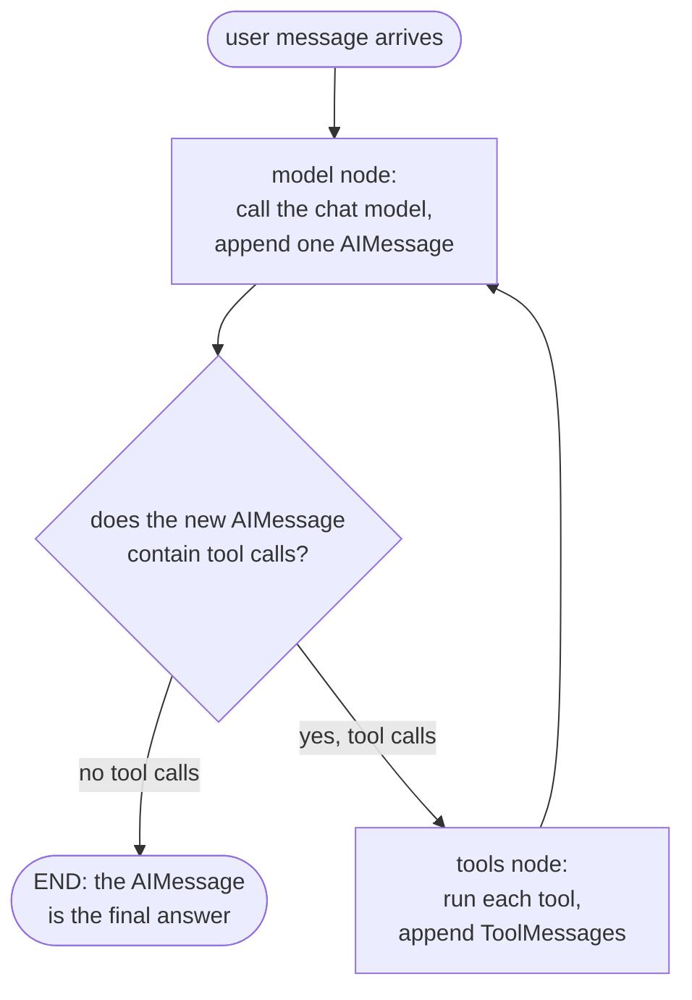
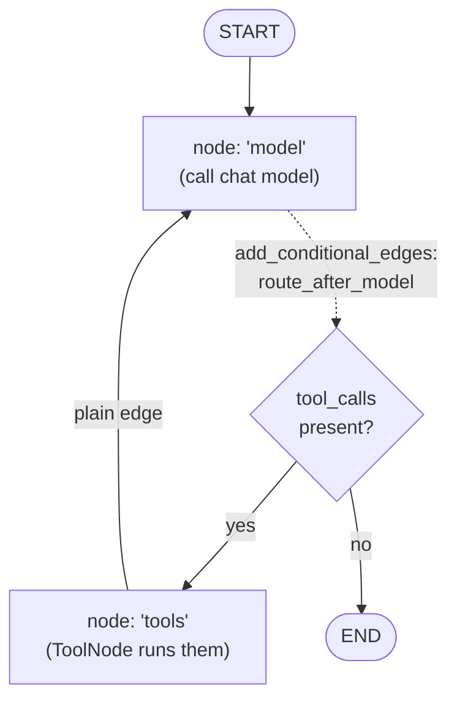

# Chapter 3 — How an Agent Loop Actually Works

> **This chapter answers:**
> - What is a *chat model*, and what is a *tool call*?
> - What is the *ReAct loop* (reason → act → observe), and why is it the heart of every agent?
> - What does LangChain's `create_agent` build, and what is *LangGraph* underneath it?
> - What is a *StateGraph* — its nodes, its shared state, its conditional edges — and how do the model and the tools wire into a loop?
> - What is a *checkpointer* and a *thread*, and how does a conversation pause and resume?

This is the foundations chapter, and almost everything later in the book rests on it. Chapter 2 gave you the master map: three layers — **LangChain → deepagents → EvoScientist** — stacked so that each wraps the one below. This chapter zooms into the region the map labels *the orchestrator agent (create_deep_agent graph: model node ⇄ tools node)*, but at its very bottom. Before you can understand what EvoScientist *adds*, you have to understand what it *borrows*: the plain machinery of an agent loop, which lives entirely in LangChain and LangGraph, not in EvoScientist's own source.

Here is the honest and slightly surprising fact that makes this chapter necessary. Almost none of the "agent-ness" of EvoScientist is written in EvoScientist. The loop that lets a model call a tool, read the result, and decide what to do next is supplied by two pip-installed libraries. EvoScientist configures that loop; it does not implement it. So this chapter teaches the borrowed substrate as a concept, grounds it at the single line where EvoScientist reaches for it (`EvoScientist/EvoScientist.py:886`), and leaves you with a mental model precise enough that no later chapter has to explain a forward reference. Because the LangChain and LangGraph source is not vendored in the repo, the framework internals here are taught as concepts and, where I show framework-shaped code you cannot find in the repo, it is **clearly labeled illustrative pseudocode**. Everything I quote with a `path:line` is real EvoScientist code.

We build in three passes, as the pedagogy demands: first the intuition (an agent is a model in a loop), then the mechanism (the ReAct loop and the graph that runs it), then the detail (the actual `create_agent` graph, the router, the checkpointer, the pause-and-resume primitive).

---

## 3.1 Intuition: an agent is a model in a loop with tools

Start with a scenario, no code. You ask a research assistant: *"How many papers on retrieval-augmented generation were published on arXiv in 2024, and what were the three most cited?"* A person cannot answer this from memory. They will *reason* ("I need to search arXiv, then rank by citations"), *act* ("run a search query"), *observe* the results, then reason again ("now I have 400 hits; I need to sort them"), act again, and keep looping until they can finally *reason* their way to a written answer. The loop — think, do something in the world, look at what came back, think again — is not incidental to research. It *is* research.

An LLM on its own cannot do this. A large language model (**LLM** — a neural network trained to predict the next token of text) is a pure function of text in, text out. It has no arms. It cannot run a search, open a file, or execute a script. Given the question above, a bare LLM can only produce plausible-sounding text, possibly a hallucinated citation count, because it has no way to *check* anything against the world.

An **agent** closes that gap by putting the model inside a loop and handing it *tools* — functions it is allowed to invoke. The model still only emits text, but now some of that text is a structured request that says "please run the function `search_arxiv` with query `retrieval-augmented generation`." A surrounding program — call it the **runtime** — notices that request, actually runs the function, and feeds the result back to the model as more text. The model reads the result and either asks for another tool or writes its final answer. That surrounding loop, plus the tools, is the entire idea of an agent. Hold this one sentence in your head for the rest of the book:

> **An agent is a chat model running in a loop, with tools it can call and whose results it reads back.**

Everything else — EvoScientist's memory, its sub-agents, its middleware, its ten chat channels — is scaffolding around this loop. Get the loop, and the rest is decoration on a machine you already understand.

---

## 3.2 The parts: chat models, messages, and tool calls

Before the loop, three vocabulary items, taught from zero.

### 3.2.1 The chat model and its message types

Raw LLMs are awkward to program against: each vendor has its own request format, and the input is a flat blob of tokens. Frameworks smooth this over with a **chat model** — *the LLM wrapped behind a uniform interface that takes messages and returns a message*. "Messages" is the key word. Instead of one text blob, a conversation is a list of typed messages, and each message has a *role* saying who is speaking. You will meet four roles throughout this book:

- A **SystemMessage** carries standing instructions — the agent's character and rules. It is prepended once and rarely changes. (EvoScientist's system message is elaborate enough that Chapter 5 calls it the agent's "constitution.")
- A **HumanMessage** is what the user said.
- An **AIMessage** is what the model produced. Crucially, an AIMessage can carry *two* kinds of payload at once: free-form text ("Let me search for that…") **and** a list of structured tool-call requests.
- A **ToolMessage** carries the *result* of running one tool, fed back into the conversation so the model can read it. Each ToolMessage is tagged with the id of the tool call it answers.

A chat model, then, is a function whose signature is roughly `list[Message] -> AIMessage`. You give it the running transcript; it appends one AIMessage. That is the whole contract, and it is the interface EvoScientist speaks to every LLM provider through (Chapter 8 shows how a dozen "providers" all reduce to this same interface pointed at different servers).

### 3.2.2 What a tool call actually is

A **tool call** is *a structured request the model emits asking the runtime to run a named function*. It is not the model running anything — the model has no ability to run anything. It is the model *asking*. Mechanically, a tool call is a small structured object riding inside an AIMessage, carrying three things: a unique `id`, the `name` of the tool to run, and the `args` (a dictionary of arguments). The model was trained to emit these in a fixed schema, so the runtime can reliably parse them out.

Here is the round trip made concrete, using our arXiv example. The list of messages grows one entry per step:

```
1. SystemMessage:  "You are a research assistant. You may call search_arxiv."
2. HumanMessage:   "How many RAG papers were on arXiv in 2024, top 3 by citations?"
3. AIMessage:      text="I'll search arXiv."
                   tool_calls=[{ id:"c1", name:"search_arxiv",
                                 args:{ query:"retrieval-augmented generation",
                                        year:2024 } }]
   --- runtime sees a tool_call, runs search_arxiv, gets back 412 hits ---
4. ToolMessage:    tool_call_id="c1"  content="412 results. Top by citations: …"
5. AIMessage:      text="In 2024 there were 412 arXiv papers on RAG. The three
                         most cited were …"     tool_calls=[]   ← none: we're done
```

Notice the two decisive moments. At step 3 the AIMessage carries a tool call, so the runtime does work and appends a ToolMessage. At step 5 the AIMessage carries text but **no** tool calls — that is the model's way of signaling "I'm finished; this is the answer." The presence or absence of tool calls on the latest AIMessage is the single fact the loop pivots on. Remember that; it is the hinge of the whole mechanism.

A tool itself, on the runtime side, is just a function the framework knows about. In LangChain you mark a plain Python function as a tool with the `@tool` decorator, which reads the function's name, docstring, and type hints to build the schema the model needs in order to know the tool exists and how to call it. EvoScientist defines its tools exactly this way; you can see the pattern in `EvoScientist/middleware/ask_user.py:366`, where a `@tool`-decorated function named `_ask_user` becomes a tool the model can invoke. We will not dwell on tool authoring here (Chapter 10 does) — for now, a tool is "a named function the model is allowed to request."

---

## 3.3 The ReAct loop: reason → act → observe

Now assemble the parts into the loop. The pattern is called **ReAct** — a contraction of *Reason + Act* — and the **ReAct loop** is *the reason→act→observe cycle: model → (if tool calls) tools → model → … → stop*. It is the oldest and most durable idea in modern agents, and it is exactly the human research loop from §3.1, mechanized.

The loop has precisely three moves, repeated:

1. **Reason.** Call the chat model on the current message list. It appends one AIMessage.
2. **Branch on that AIMessage.** If it contains tool calls, go to step 3 (*act*). If it contains no tool calls, the loop is over — the AIMessage *is* the final answer.
3. **Act, then observe.** Run each requested tool, wrap each result in a ToolMessage, append them to the list, and go back to step 1. The next model call now *observes* the results.

That is the entire control flow. There is no separate "planner" or "executor" — the model is the planner *and* the decider, expressed through the tool-calls-or-not choice it makes on every turn. Here it is as a diagram; read it clockwise, starting from the top:



Follow the two arrows out of the diamond. "No tool calls" exits the loop; "yes" runs the tools and loops back to the model. Every agent in this book — the main orchestrator, and each of the six sub-agents — is some version of this one picture. What differs between them is *which tools* they have and *what system prompt* shapes their reasoning, never the shape of the loop.

One more property worth naming now, because it explains a lot of later design. The loop is *stateless between calls to the model except through the message list*. The model does not "remember" step 3 when it runs step 5; it re-reads the whole transcript each time. This is why growing history is a first-class engineering problem (Chapters 7 and 13 both wrestle with it) and why "the messages" are the thing that gets checkpointed, pruned, and summarized. The transcript is the agent's entire working memory.

---

## 3.4 From loop to graph: what `create_agent` builds

You could write the ReAct loop in §3.3 as a `while` loop in twenty lines of Python. Real frameworks don't, and the reason is worth understanding before we look at the machinery, because it is the design bet that shapes everything above it.

### 3.4.1 Why a graph instead of a `while` loop (intuition)

A naive `while` loop works until you want any of the following: to *pause* the agent mid-run and ask a human to approve a dangerous action; to *save* the exact state so a crashed process can resume where it left off; to *stream* each step to a UI as it happens; to *insert* custom behavior around each model call without editing the loop body; or to run *parallel* branches. Bolting these onto a hand-rolled `while` loop turns it into a tangle. Every one of these is something EvoScientist needs (approval → Chapter 7; resume → Chapter 13; streaming → Chapter 15; custom behavior → Chapter 4's middleware; parallelism → sub-agents in Chapter 6).

The frameworks solve this by not writing a loop at all. They describe the agent as a **graph** of steps over a shared piece of data, and hand that graph to a generic engine that knows how to run graphs — an engine that already knows how to checkpoint, pause, stream, and resume *any* graph. The loop becomes data (a graph description) instead of code (a `while` block), and all the hard cross-cutting features are provided once by the engine rather than re-solved per agent. This is the classic "interpreter over a data structure" move, and it is why the library that provides the engine — **LangGraph** — sits at the very bottom of our three-layer stack.

### 3.4.2 The two libraries and their division of labor

Two libraries collaborate here, and keeping them straight prevents most later confusion:

- **LangChain** is *the LLM-application framework EvoScientist builds on; it provides `create_agent`, `@tool`, and the message types*. Think of it as the ergonomic front door.
- **LangGraph** is *the state-machine library under LangChain; it models computation as a graph of nodes over shared state*. Think of it as the engine room.

The bridge between them is one function. **`create_agent`** is *LangChain's factory that compiles a ReAct agent into a runnable graph*. You hand it a chat model, a system prompt, and a list of tools; it returns a compiled LangGraph graph wired up as the ReAct loop. In illustrative form (this is **pseudocode** for the general shape — `create_agent`'s real body lives in the pip-installed `langchain` package, not in the EvoScientist repo):

```python
# ILLUSTRATIVE PSEUDOCODE — the conceptual shape of create_agent
compiled_graph = create_agent(
    model=some_chat_model,      # the chat model to call
    system_prompt="You are …",  # standing instructions
    tools=[search_arxiv, ...],  # functions the model may call
    middleware=[...],           # optional hooks — Chapter 4's subject
)
# compiled_graph is now a runnable object: you can invoke() or stream() it.
```

The word "compiles" is exact. `create_agent` does not run anything; it *builds a graph* and compiles it into a runnable object. To see what that graph is, we need LangGraph's core vocabulary — which the ledger has assigned this chapter to define. We take those definitions next, in order, so nothing is used before it is taught.

---

## 3.5 The StateGraph in detail: nodes, state, and conditional edges

A **StateGraph** is *a LangGraph graph: named nodes (functions) that read/write one typed shared state object*. Unpack that phrase piece by piece, because each piece is a ledger term the rest of the book leans on.

### 3.5.1 Nodes

A **node** is *one step in a StateGraph*. Concretely, a node is a function: it receives the current shared state and returns an update to that state. A ReAct agent needs exactly two nodes, and they are the two boxes in the §3.3 diagram:

- the **`"model"` node** — calls the chat model on the current messages and returns the new AIMessage as an update;
- the **`"tools"` node** — runs whatever tool calls the last AIMessage requested and returns the resulting ToolMessages as an update.

Nodes are named (the strings `"model"` and `"tools"` are their identities in the graph), which is how edges refer to them and how streaming and debugging tools point at "the step that ran."

### 3.5.2 Shared state and reducers

Every node reads from and writes to one **state** — *the shared data threaded through the graph*. For a ReAct agent, the most important field of the state is `messages`: the growing transcript from §3.2. The `"model"` node appends an AIMessage to `messages`; the `"tools"` node appends ToolMessages to `messages`. The state is *typed* — it is declared as a schema (a `TypedDict` or dataclass) so LangGraph knows what fields exist.

But "append" hides a subtlety that the ledger term **reducer** captures: *a reducer says how each update merges in*. When a node returns `{"messages": [new_ai_message]}`, does LangGraph *replace* the whole `messages` list with a one-element list, or *append* to what's there? The answer depends on the field's reducer. The `messages` field is declared with an *append* reducer (LangChain provides one called `add_messages`), so returning a message means "add this to the transcript," not "overwrite the transcript." Reducers are how a StateGraph accumulates history instead of clobbering it, and they are the reason a node can return just *its* contribution rather than the entire new state. This detail matters again in Chapter 13, where the message channel's snapshot-and-delta storage — its *delta channel* — is exactly the reducer's machinery viewed from the persistence side; note the pointer, and we move on.

### 3.5.3 The conditional edge: the branch that makes it a loop

Nodes are wired together by edges. An ordinary edge is unconditional: "after the `"tools"` node, always go to the `"model"` node." That gives you the bottom arrow of the §3.3 diagram — tool results always flow back for the model to observe. But the *other* branch, the one out of the diamond, cannot be a fixed edge, because whether the loop continues *depends on the data*. That is what a **conditional edge** is: *a router that picks the next node from the current state*. LangGraph lets you attach one with a function commonly called `add_conditional_edges`: you give it a source node and a small routing function, and after the source node runs, LangGraph calls your function on the current state to decide where to go next.

For a ReAct agent the routing function is almost trivially simple, and it is the exact hinge from §3.2:

```python
# ILLUSTRATIVE PSEUDOCODE — the ReAct router, in spirit
def route_after_model(state) -> str:
    last = state["messages"][-1]          # the AIMessage just produced
    if last.tool_calls:                   # did the model ask for tools?
        return "tools"                    # → run them, then loop back
    return END                            # → no tool calls: stop, we're done
```

The router reads the last AIMessage. If it has `tool_calls`, it routes to the `"tools"` node; otherwise it routes to the special sentinel `END`, which stops the graph. `END` is LangGraph's built-in "there is no next node" marker. **This conditional edge is the loop.** The `"model"→"tools"` conditional edge plus the plain `"tools"→"model"` edge together form the cycle in the diagram; the ReAct loop *is* this two-node graph with this one router.

### 3.5.4 ToolNode: the built-in "tools" node

You do not have to write the `"tools"` node by hand. LangGraph ships one: **ToolNode** is *LangGraph's built-in node that executes the tool calls in the last model message*. Given the list of tools you registered, ToolNode reads the last AIMessage, finds each tool call, looks up the matching function by name, runs it with the provided args, and packages each return value into a ToolMessage tagged with the originating tool-call id. If the AIMessage had three tool calls, ToolNode runs all three (it can run them concurrently) and appends three ToolMessages. This is the standard `"tools"` node behind essentially every LangGraph agent, EvoScientist's included — though, as Chapters 4 and 7 will show, EvoScientist wraps the surrounding calls in middleware to add its own behavior (approval prompts, error normalization) without replacing ToolNode itself.

Putting §3.5 together, here is the graph `create_agent` compiles, now labeled with the real vocabulary:



One shared, typed state (its `messages` field carrying the transcript through a reducer that appends). Two named nodes. One conditional edge that routes model→tools or model→END, and one plain edge tools→model. That is a complete ReAct agent, and it is precisely what LangChain's `create_agent` returns as a compiled, runnable graph.

---

## 3.6 Grounding it: where EvoScientist reaches for this loop

Everything so far is domain-neutral machinery. Now let's see the single place in the EvoScientist codebase where all of it is summoned. It is one statement, at `EvoScientist/EvoScientist.py:886`:

```python
        _EvoScientist_agent = create_deep_agent(
            **kwargs,
        ).with_config({"recursion_limit": cfg.recursion_limit})
    return _EvoScientist_agent
```

This is the build site we'll follow — the `_get_default_agent()` factory, which compiles the graph *without* a checkpointer for use by `langgraph dev` and notebooks. (There is a sibling factory, `create_cli_agent()` at `EvoScientist.py:1046`, that calls `create_deep_agent` the same way but hands it a checkpointer for the CLI's multi-turn, resumable sessions — the dossier calls these the "two factories," and Chapter 5 walks both. When we reach persistence in §3.7, keep in mind that the checkpointered path is this sibling, not the line quoted here.) Read the build call against the three-layer stack. `create_deep_agent` is the **deepagents** layer's factory (Chapter 4 is entirely about it); its job is to gather a chat model, a system prompt, a filesystem, sub-agents, skills, and middleware, and then — internally — call LangChain's `create_agent` to compile them into exactly the StateGraph you just learned. In other words, `create_deep_agent(**kwargs)` bottoms out in `create_agent`, which bottoms out in a compiled LangGraph StateGraph with a `"model"` node, a ToolNode, and the ReAct conditional edge. The dossier confirms this chain (`EvoScientist.py:886` → `create_deep_agent` → `langchain.agents.create_agent` → `StateGraph` wired `model⇄tools`). EvoScientist writes the configuration; the loop itself is entirely borrowed.

### 3.6.1 recursion_limit: the loop guard

The `.with_config({"recursion_limit": cfg.recursion_limit})` at the end deserves its own paragraph, because it names a term you will meet again. A ReAct loop can, in principle, run forever: the model keeps emitting tool calls, tools keep returning results, and the loop never reaches `END`. LangGraph guards against this with **recursion_limit** — *the max super-steps before LangGraph aborts, guarding against infinite tool loops*. (We define *super-step* precisely in §3.7; for now read it as "one advance of the graph," roughly one trip through a node.) When the count of super-steps in a single run exceeds the limit, LangGraph raises an error instead of spinning forever.

What is instructive is EvoScientist's *value*. The config default is set at `EvoScientist/config/settings.py:251`:

```python
    recursion_limit: int = 1_000_000
```

and the comment just above it, at `settings.py:247-250`, explains the reasoning:

```python
    # 1,000,000 is "effectively unlimited" — typical research turns use
    # 200-1000 steps; reaching 1M would cost ~$10K in tokens, by which point
    # rate limits, context overflow, or API quota errors would trip first.
    # Lower (e.g., 5000) if you want a tighter safety net against runaway loops.
```

Two design points hide in that comment. First, why override the limit at all? Because deepagents ships its own hardcoded default (the dossier notes it is `9_999`), and a long research turn — survey, plan, run, debug, iterate — can legitimately run many hundreds of steps, which a 9,999 ceiling might not clear on the worst runs. So EvoScientist raises it to "effectively unlimited." Second, why not simply remove the guard? Because the guard is defense against a *bug*, not a budget. The author's reasoning is that money and API limits will halt a genuinely runaway loop long before a million steps do, so the recursion limit is set high enough never to interfere with real work while still existing as a backstop. The `.with_config(...)` call is how a caller stamps such run-level settings onto a compiled graph without rebuilding it — the same mechanism, incidentally, that carries the `thread_id` we're about to meet.

---

## 3.7 Super-steps, checkpointers, and threads: how a conversation survives

We have a loop that runs. Now the harder question: how does a *conversation* — many turns, possibly across process restarts, possibly paused for a human — persist and resume? This is the second half of what LangGraph buys you, and it rests on three linked ideas.

### 3.7.1 The super-step

LangGraph advances a graph in discrete rounds. A **super-step** is *one round of the graph advancing all active nodes; the unit a checkpoint is saved after*. The term comes from the "bulk synchronous parallel" model of computation, but the intuition you need is simple: a super-step is one synchronized tick of the engine. In a ReAct agent, running the `"model"` node is one super-step; running the `"tools"` node is the next; running the `"model"` node again is the next. The engine does not save state in the middle of a node — it saves *between* super-steps, when the graph is at a clean, well-defined boundary. That boundary is what makes reliable persistence possible: there is always a consistent snapshot to fall back to.

### 3.7.2 The checkpointer

A **checkpointer** is *the component that snapshots graph state after each super-step so a run can resume*. Wire a checkpointer into a compiled graph, and after every super-step LangGraph serializes the current state — the whole transcript in `messages`, plus any other state fields — and hands it to the checkpointer to store. If the process dies, or the run is paused, or the user closes their terminal and comes back tomorrow, the latest checkpoint is a faithful snapshot of exactly where the loop stood. Resuming means loading that snapshot and continuing the graph from the next super-step. Nothing about the loop code changes; persistence is a property the engine adds *around* the same graph.

EvoScientist supplies a checkpointer that writes these snapshots into a single SQLite file. That much you should hold now; the *how* — and a real bug about the checkpoint file growing to multiple gigabytes because LangGraph writes a full snapshot every super-step — is Chapter 13's story, built on a custom `PruningCheckpointer`. This chapter deliberately stops at the concept, because the concept is what later chapters reference. (Note the forward pointer; do not expect the pruning mechanism here.)

### 3.7.3 The thread and thread_id

A checkpointer stores many conversations, so each needs an identity. A **thread** is *the id grouping one conversation's chain of checkpoints*, and its identifier is the **thread_id**. Every checkpoint the checkpointer writes is keyed by a thread_id; all the checkpoints sharing a thread_id form the timeline of one conversation. To *resume* a conversation, you run the graph again with the same thread_id, and the checkpointer loads that thread's latest checkpoint as the starting state. To *start fresh*, you use a new thread_id. This is why "new chat," "resume chat," and "switch model" in EvoScientist all reduce to choices about which thread_id to run against.

The thread_id reaches the graph through a run-level config object, under a `configurable` key. You can see EvoScientist building exactly this config at `EvoScientist/stream/events.py:833`:

```python
    config: dict[str, Any] = {"configurable": {"thread_id": thread_id}}
```

That dictionary is the `config["configurable"]` channel LangGraph reads to find the thread_id (and other per-run settings). It is passed into the run a few lines later, when EvoScientist actually drives the graph — the subject of §3.8. The pattern `{"configurable": {"thread_id": ...}}` is worth memorizing: it is how *every* surface in EvoScientist — CLI, WebUI, and all ten chat channels — tells the same compiled agent *which conversation* a message belongs to.

---

## 3.8 Running the graph: streaming and the pause primitive

Two last pieces complete the picture: how EvoScientist *drives* the graph and reads results out of it, and how the graph can *pause* for a human and later resume.

### 3.8.1 Driving the graph with astream_events

A compiled graph is a runnable object. The blunt way to run it is `invoke(...)`: hand it an input and the config, get back the final state when the whole loop finishes. But a research turn can run for minutes across hundreds of super-steps, and a user watching a terminal wants to *see* the model think, see each tool fire, see partial text as it streams. So EvoScientist runs the graph in *streaming* mode, asking the engine to emit an event for each thing that happens. The call is at `EvoScientist/stream/events.py:866`:

```python
            stream_result = agent.astream_events(
                astream_input,
                config=config,
                version="v3",
                transformers=[UpdatesTransformer],
            )
```

`astream_events` is LangGraph's asynchronous streaming interface: instead of returning one final answer, it yields a sequence of fine-grained events as the graph advances — "the model started producing text," "a tool call was requested," "a tool returned," "the run finished." Note `config=config`: this is the very `{"configurable": {"thread_id": …}}` dictionary from §3.7.3, so the streamed run is anchored to a thread and its checkpoints. The `version="v3"` selects the event-protocol version, and the whole vocabulary of events that comes out — how nineteen-odd named events get translated into what a UI renders — is Chapter 15's territory. For this chapter, the load-bearing fact is narrow and important: EvoScientist reads its agent's activity as a *stream of events keyed to a thread*, not as one blocking call, and that is what makes live UIs and mid-run pauses possible.

### 3.8.2 interrupt(): pausing for a human, and resuming

The final primitive is the one that makes an agent *cooperative* with a person. **interrupt()** is *LangGraph's pause-for-human primitive; resumed later with `Command(resume=…)`*. When code running inside a node calls `interrupt(payload)`, LangGraph does something remarkable: it stops the graph right there, snapshots the state through the checkpointer (there is always a clean boundary because interrupt raises a control-flow signal, not a plain return), and surfaces the `payload` to the outside world as "the graph is waiting for input." The run does not fail and does not busy-wait — it is *parked*. Later, the outside world resumes the exact same graph, on the same thread, by running it again with a special input: `Command(resume=answer)`. LangGraph loads the parked checkpoint, and the original `interrupt(...)` call *returns* the `answer` as if it had been a normal function call all along. From the node's point of view, `interrupt()` simply blocked until a human replied.

EvoScientist uses this primitive directly, and you can read it in the `ask_user` tool at `EvoScientist/middleware/ask_user.py:378`:

```python
            response = interrupt(ask_request)
            return _parse_answers(response, questions, tool_call_id)
```

When the agent decides it needs to ask the user a clarifying question, it calls the `ask_user` tool; inside, `interrupt(ask_request)` parks the graph and hands `ask_request` (the questions) to the UI. The user answers; the surface resumes the graph with `Command(resume=…)`; `interrupt(...)` returns the `response`; and the very next line, `_parse_answers(...)`, turns that response into the ToolMessage the loop expects — as if the tool had computed an answer normally. The class docstring at `ask_user.py:352` states the mechanism plainly: "The tool uses LangGraph `interrupt()` to pause execution and wait for user input."

This one primitive underlies two features the book returns to. It is the engine behind **HITL** (human-in-the-loop) approval — pausing before a risky tool like `execute` so a human can approve it, which Chapter 7 builds as middleware — and it is the engine behind `ask_user`, the agent proactively asking a question. Both are the same move: park the graph at a clean checkpoint, surface a payload, resume with an answer. And note *why* it works at all: it works because the graph is checkpointed. Interrupt-and-resume is not a separate mechanism from §3.7 — it is checkpointing used for a human's benefit instead of a crash's. The pieces interlock: super-steps give clean boundaries, the checkpointer snapshots at those boundaries, the thread_id names the timeline, and interrupt exploits all three to let a person step into the loop.

---

## 3.9 Takeaways

You now hold the borrowed substrate the whole book stands on. In one machine: a **chat model** turns a list of typed messages into one AIMessage; that AIMessage either carries **tool calls** or does not; a **ReAct loop** runs the model, branches on that fact, runs tools when asked, feeds results back, and repeats until an AIMessage arrives with no tool calls. LangChain's `create_agent` doesn't implement this as a `while` loop — it compiles it into a LangGraph **StateGraph**, and the LangGraph engine gives you persistence, streaming, and pausing for free around *any* graph.

要点 / Key points to carry forward:

- **An agent is a chat model in a loop with tools.** Everything EvoScientist adds is scaffolding on this one loop.
- **Messages are the agent's whole working memory.** Four roles — System, Human, AI, Tool — and the model re-reads the transcript on every call. Growing transcripts are therefore a recurring engineering problem (Chapters 7, 13).
- **A tool call is a request, not an action.** The model asks; the runtime (the ToolNode) acts. The presence or absence of tool calls on the latest AIMessage is the hinge the loop turns on.
- **The ReAct loop is a two-node StateGraph:** a `"model"` node and a ToolNode, joined by a **conditional edge** that routes model→tools when tool calls exist and model→END otherwise. That conditional edge *is* the loop.
- **State flows through the graph via reducers;** the `messages` field appends rather than overwrites, which is why a node returns only its contribution.
- **`recursion_limit` is the loop guard.** EvoScientist raises it to an effectively-unlimited 1,000,000 (`settings.py:251`) on the reasoning that cost and rate limits stop true runaways first, while keeping the backstop.
- **Persistence is the engine's job, not the loop's.** After each **super-step**, the **checkpointer** snapshots state, keyed by **thread_id**, into the run's `config["configurable"]`. Same thread_id resumes a conversation; a new one starts fresh.
- **`interrupt()` parks the graph for a human and `Command(resume=…)` wakes it up** — the shared engine behind HITL approval (Chapter 7) and `ask_user`. It works *because* the graph is checkpointed.
- **The grounding line to remember:** `EvoScientist.py:886` — `create_deep_agent(**kwargs).with_config({"recursion_limit": ...})` — is the build call we followed (its checkpointered sibling `create_cli_agent` at `:1046` is the CLI path), and it bottoms out, through deepagents, in exactly the `create_agent` StateGraph you now understand.

With the loop, the graph, the checkpointer, and the interrupt primitive in hand, you are ready for Chapter 4, which climbs one layer up the stack to **deepagents** — the framework that wraps `create_agent`, adds a virtual filesystem, sub-agents, skills, and (the book's central idiom) the middleware onion that lets EvoScientist bend this loop to its will without ever forking it.

---

## Sources

| Topic | Where it lives |
|---|---|
| The main graph is built here (`create_deep_agent` → `create_agent`); `recursion_limit` override | `EvoScientist/EvoScientist.py:886-888` |
| `recursion_limit` default value and its rationale | `EvoScientist/config/settings.py:247-251` |
| `thread_id` carried in `config["configurable"]` | `EvoScientist/stream/events.py:833` |
| Driving the graph with `astream_events(version="v3")` | `EvoScientist/stream/events.py:866-871` |
| `interrupt()` used to pause for a user; resume with `Command(resume=…)` | `EvoScientist/middleware/ask_user.py:352-379` |
| A `@tool`-decorated function becoming a tool | `EvoScientist/middleware/ask_user.py:366` |
| HITL via middleware (not `interrupt_on=` kwarg); why | `EvoScientist/EvoScientist.py:858-871` |

The framework internals themselves — the body of `create_agent`, the `StateGraph`/`ToolNode`/`add_conditional_edges` classes, the `astream_events` engine, and the `interrupt`/`Command` primitives — are **not vendored in this repo**. They live in the pip-installed `langchain`, `langgraph`, and `deepagents` packages. This chapter teaches them as concepts and grounds them at the exact lines where EvoScientist *uses* them; any illustrative framework code above is labeled pseudocode. As always in this book: **when the book and the code disagree, the code wins.**
