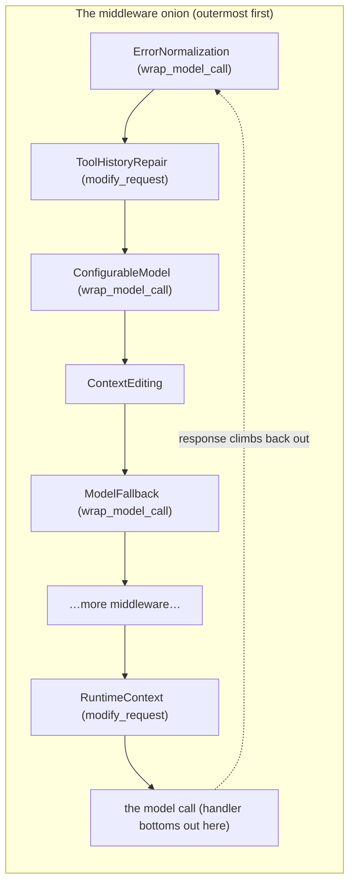

# Chapter 4 — deepagents and the Middleware Onion

> **This chapter answers:**
> - What does **deepagents** add on top of LangChain's `create_agent`, and why not just use `create_agent` directly?
> - What is **middleware**, and what does each of its hooks (`wrap_model_call`, `wrap_tool_call`, `modify_request`, `after_agent`) actually intercept?
> - How do middleware compose into an "onion," and why does the *order* of the list change the behavior?
> - What is a **backend** / **virtual filesystem**, and what is the **`task` tool** — at the concept level?

On the master map from Chapter 2, this chapter zooms into three tightly linked regions of the middle layer: the **middleware onion** that wraps the orchestrator's model⇄tools loop, the **backends** that give the agent a filesystem, and the **`task` tool** that lets the orchestrator hand work to sub-agents. Chapter 3 gave you the raw engine — the ReAct loop compiled into a LangGraph `StateGraph`, driven by LangChain's `create_agent`. That engine is generic: it knows how to call a model, route to tools, and stop. It knows *nothing* about scientific research, memory, sandboxes, or teams of specialist agents. This chapter is about the layer that turns that generic engine into something you could build a research assistant on — and, more importantly, about the single idea that carries the entire rest of the book. Once you understand middleware well, Chapters 5 through 15 can say "a middleware that clears old tool results" or "a middleware that injects the observation index" and you will know exactly what that means and where it plugs in.

We build up in three stages. First, the *why*: what problem deepagents solves and why EvoScientist configures it instead of writing an agent from scratch. Second, the central idiom: the `AgentMiddleware` class and its hooks, taught from zero and then walked through two real, small EvoScientist middleware line by line. Third, the two supporting concepts — backends and the `task` tool — at the altitude a reader needs to follow the rest of the book, with forward pointers to the chapters that own their details.

---

## 4.1 Why a "batteries-included" layer exists

Recall the three-layer stack from Chapter 2: **LangChain → deepagents → EvoScientist**, named bottom-to-top by wrapping. LangChain's `create_agent` (the factory that compiles a ReAct agent into a runnable graph, from Chapter 3) is the bottom. EvoScientist is the top. **deepagents** is the layer in the middle — the "batteries-included" agent framework that wraps `create_agent` and that EvoScientist configures.

Here is the tension deepagents resolves. `create_agent` gives you a correct but *bare* agent: a model in a loop with whatever tools you hand it. But almost every serious agent — one that does real, multi-step work rather than answering a single question — needs the same handful of capabilities, and none of them are in `create_agent`:

- A **filesystem** the agent can read from and write to, so its work survives across many model calls (a research run produces code, logs, plots, a report — those cannot live only in the chat transcript).
- A way to **delegate** to specialist sub-agents, so one giant model call doesn't have to plan, search, code, debug, analyze, and write all at once.
- **Skills** — reusable capability packages the agent can pull in on demand (Chapter 12 owns these).
- **Summarization**, so a long run doesn't overflow the model's context window (the maximum number of tokens the model can attend to, from Chapter 3).

If you built each of these yourself on top of `create_agent`, you would re-implement the same plumbing in every project: a file-tool suite, a sub-agent dispatcher, a prompt that teaches the model how to use them, a summarizer that watches the token count. deepagents is that plumbing, packaged once and configured through arguments. That is precisely the "configure, don't build" bet from Chapter 1 made concrete one layer down: EvoScientist doesn't re-implement filesystems or delegation, it *inherits* them from deepagents and configures them for research.

The entry point is `create_deep_agent`, deepagents' factory that adds a virtual filesystem, sub-agents, skills, memory, and summarization on top of `create_agent`. An agent built this way — one that comes with a filesystem, sub-agent delegation, and skills out of the box — is a **deep agent**. The name is deepagents' own; think of "deep" as "does long, multi-step work," not "deep learning."

You have already seen where EvoScientist calls it. Chapter 3 quoted one of the two factories that build the main graph — `_get_default_agent()`, the checkpointer-less one:

```python
_EvoScientist_agent = create_deep_agent(
    **kwargs,
).with_config({"recursion_limit": cfg.recursion_limit})
```

That is `EvoScientist/EvoScientist.py:886-888`, reached via `from deepagents import create_deep_agent` at `EvoScientist.py:852`. Everything EvoScientist-specific arrives through that `**kwargs` dict — the model, the tools, the backend, the sub-agents, the system prompt, and, most importantly for this chapter, the middleware. Chapter 5 dissects how that dict is assembled; here we care about what deepagents *does* with it.

Internally, `create_deep_agent` does exactly what you'd expect from a wrapper: it builds a list of middleware, joins the pieces of the system prompt, and then calls `create_agent`. The last lines of the factory make the wrapping literal:

```python
    return create_agent(
        model,
        system_prompt=final_system_prompt,
        tools=_tools,
        middleware=deepagent_middleware,
        ...
    ).with_config(
        {
            "recursion_limit": 9_999,
            ...
        }
    )
```

That is `deepagents/graph.py:865-887` (deepagents is a pip dependency; the source here is the checkout of `deepagents ~=0.6.12`, the version EvoScientist pins). Two things to notice. First, `create_deep_agent` really is a thin shell over `create_agent` — the ReAct loop you learned in Chapter 3 is unchanged; deepagents just pre-loads it with a curated middleware stack (`deepagent_middleware`) and a composed prompt (`final_system_prompt`). Second, deepagents sets its own `recursion_limit` of `9_999` here — and EvoScientist immediately overrides it with a second `.with_config` back at `EvoScientist.py:888`, because the last `.with_config` wins. (Chapter 3 covered `recursion_limit` as the loop guard, set to a very high value in EvoScientist.)

So `create_deep_agent`'s job is to take the ingredients EvoScientist hands it and turn them into a `create_agent` call with the right middleware and prompt. To go further we need the one concept that word `middleware` keeps standing in for.

---

## 4.2 Middleware: the central idiom

### 4.2.1 Intuition: hooks around the loop

Here is the mental model to hold for the rest of the book. The ReAct loop from Chapter 3 has exactly two interesting moments per turn: **the model is about to be called**, and **a tool is about to be run**. A **middleware** (in LangChain's vocabulary, an `AgentMiddleware`) is a class that lets you wrap code *around* those two moments — and around the whole turn — to inspect, modify, retry, replace, or veto what happens.

The classic analogy is web-server middleware, and it holds up well. In a web framework, a request comes in, passes through a stack of middleware (authentication, logging, compression), reaches your handler, and the response travels back out through the same stack in reverse. Each middleware sees the request on the way in and the response on the way out, and can change either. Agent middleware is the same shape, but the "request" is a **model call** or a **tool call** instead of an HTTP request.

Why is this the right abstraction for an agent framework? Because it lets you add behavior *without touching the loop*. The generic ReAct loop stays generic; every domain-specific decision — "swap the model if config changed," "clear old tool results when history gets long," "append today's date to the prompt," "wrap provider exceptions into one error type" — lives in its own small middleware class that plugs in from the outside. The dossier's one-line summary of EvoScientist's cleverness is worth repeating: *the core loop is generic ReAct; everything domain-specific is a middleware.* Learning middleware is learning the seam along which EvoScientist customizes a borrowed engine.

### 4.2.2 Mechanism: the hooks and the handler

`AgentMiddleware` is defined in LangChain at `langchain/agents/middleware/types.py:380`. It is a base class with a set of methods — **hooks** — that you override. Each hook fires at a specific point in the agent's lifecycle. You only implement the hooks you care about; the rest inherit no-op defaults. The four you will meet again and again in this book, and their glosses, are:

| Hook | Fires | Shape |
|---|---|---|
| `wrap_model_call` / `awrap_model_call` | around every model call | receives the request *and a handler*; you call the handler to run the model |
| `wrap_tool_call` / `awrap_tool_call` | around every tool call | receives the tool request *and a handler*; you call the handler to run the tool |
| `modify_request` | just before a model call | receives the request, returns a (possibly modified) request |
| `after_agent` / `aafter_agent` | once, after the whole turn ends | receives final state; used for cleanup / follow-up work |

(The `a`-prefixed variants — `awrap_model_call`, `awrap_tool_call`, `aafter_agent` — are the async versions, for when the agent runs on an event loop. EvoScientist implements both sync and async where a hook can be reached either way; you will see this in the first walkthrough.)

The distinction that trips people up first is between the two *styles* of hook, so let's be precise. `modify_request` is a **transform**: request in, request out. It cannot see the response, cannot retry, cannot short-circuit — it just rewrites the outgoing request. `wrap_model_call` is a **wrapper**: it receives the request *and a `handler`* — a callback that, when you call it, actually runs the model (through all the inner middleware and finally the model itself) and returns the response. Because *you* decide whether and when to call `handler`, a `wrap_model_call` can do far more than `modify_request` can:

- Call `handler(request)` once and return its result — the pass-through case.
- Modify the request first, then call `handler` — the same effect as `modify_request`.
- Wrap `handler(request)` in a `try/except` and retry or substitute on failure — this is how **model fallback** and **error normalization** work (Chapter 7).
- Call `handler` and then rewrite the response before returning it.
- Skip `handler` entirely and return a canned response — a short-circuit.

LangChain's own docstring for `wrap_model_call` states the contract exactly: *"Middleware can call the handler multiple times for retry logic, skip calling it to short-circuit, or modify the request/response. Multiple middleware compose with first in list as outermost layer."* (`langchain/agents/middleware/types.py:487-490`.) Hold on to that last sentence — it is the whole reason the stack is called an onion, and we return to it in §4.3.

Two data types flow through these model hooks, and both are worth naming now because later chapters lean on them. A **`ModelRequest`** is a small object bundling everything a model call needs: the `model`, the `messages`, the `system_message`, the `tools`, and a few settings (`langchain/agents/middleware/types.py:89-104`). A **`ModelResponse`** wraps what comes back — usually a single `AIMessage` (`types.py:272-286`). The subtle, important detail: a `ModelRequest` is treated as **immutable**. You do not mutate its fields in place; you call `request.override(...)` to get a *new* request with some fields replaced, leaving the original untouched (`types.py:202`). Assigning directly to a field even emits a deprecation warning (`types.py:168-200`). This immutability is what makes the onion composable — an outer middleware's request is never silently changed underneath it by an inner one; each layer explicitly produces the request it passes inward.

With the mechanism in hand, let's read two real EvoScientist middleware. Both are short, and between them they show every one of the four hooks.

### 4.2.3 Detail: a `wrap_tool_call` middleware

The cleanest first example is `ToolErrorHandlerMiddleware`, EvoScientist's ~70-line middleware that catches tool exceptions. Its module docstring states the problem it exists to solve, which is the best kind of motivation — a real gap in the underlying framework:

```python
"""Middleware that catches tool execution exceptions and converts them to error ToolMessages.

Without this, an MCP tool (or any tool) that raises an exception at runtime
crashes the entire agent loop because LangGraph's default ToolNode error handler
only catches argument-validation errors (ToolInvocationError), not execution
errors.
...
"""
```

That is `EvoScientist/middleware/tool_error_handler.py:1-11`. Recall from Chapter 3 that the `ToolNode` is LangGraph's built-in node that runs the tool calls in the last model message. Its default error handling is narrow: it catches *argument-validation* errors — the model called a tool with the wrong argument types — but if the tool's own code raises at runtime (a network call fails, an MCP tool server dies), that exception propagates up and kills the whole graph run. For an agent meant to grind through a long research task, one flaky tool crashing the entire session is unacceptable. This middleware closes that gap. Here is the class:

```python
class ToolErrorHandlerMiddleware(AgentMiddleware):
    """Catch tool execution exceptions and return them as error ToolMessages."""

    name = "tool_error_handler"

    def wrap_tool_call(
        self,
        request: ToolCallRequest,
        handler: Callable[[ToolCallRequest], ToolMessage | Command[Any]],
    ) -> ToolMessage | Command[Any]:
        try:
            return handler(request)
        except Exception as exc:
            if _GraphInterrupt is not None and isinstance(exc, _GraphInterrupt):
                raise
            return _build_error_message(request)
```

That is `tool_error_handler.py:36-51`. Read it against the mechanism from §4.2.2 and it is almost self-explanatory. The middleware subclasses `AgentMiddleware` and overrides one hook, `wrap_tool_call`. That hook receives a `request` (a `ToolCallRequest` — the tool-call counterpart of a `ModelRequest`) and a `handler` — the callback that actually executes the tool. The body is the wrapper pattern in its purest form: call `handler(request)` inside a `try`; if it succeeds, return the result untouched; if it raises, convert the exception into a `ToolMessage` with `status="error"` instead of letting it crash the loop. This is exactly the "error to fallback" pattern from LangChain's docstring, applied to tools instead of models.

The one subtle line is the `GraphInterrupt` check. Recall from Chapter 3 that `interrupt()` pauses the graph to wait for a human, and it does so by *raising* a special `GraphInterrupt` exception that LangGraph catches at the top of the run. That is not an error — it is a control signal. If this middleware swallowed it like any other exception, the agent could never pause for human approval (the mechanism behind HITL, Chapter 7). So the middleware re-raises `GraphInterrupt` explicitly and only converts *real* exceptions. This is a recurring shape you should file away: middleware that catch broadly must always let control-flow signals like `GraphInterrupt` pass through untouched.

The error message itself is built by a small helper:

```python
def _build_error_message(request: ToolCallRequest) -> ToolMessage:
    tb = traceback.format_exc()
    tool_name = request.tool_call.get("name", "unknown_tool")
    logger.error("Tool %r raised an exception:\n%s", tool_name, tb)
    content = (
        f"[TOOL ERROR] Tool '{tool_name}' failed with an exception:\n\n{tb}\n"
        "You may retry the tool call, try an alternative approach, "
        "or inform the user about the failure."
    )
    return ToolMessage(
        content=content,
        tool_call_id=request.tool_call["id"],
        name=tool_name,
        status="error",
    )
```

That is `tool_error_handler.py:66-80`. Two design choices are worth pausing on. The `ToolMessage` is tagged with the original `tool_call_id` (from `request.tool_call["id"]`) — Chapter 3 explained that a `ToolMessage` must carry the id of the tool call it answers, or the model can't match result to request; even an *error* result must obey that contract. And the content isn't just a stack trace — it appends a plain-English instruction telling the model what it can do next: retry, try another approach, or tell the user. The middleware turns a crash into a *recoverable observation* the agent can reason about. That is the whole philosophy of middleware in one small function: intercept a failure at the framework seam and hand the model something it can act on, without any change to the loop.

Finally, notice the class also defines `awrap_tool_call` (`tool_error_handler.py:53-63`) — the async twin, with identical logic but `await handler(request)`. A middleware author writes both because a tool can be executed on either a sync or an async path depending on how the agent is driven, and the protection must hold on both.

### 4.2.4 Detail: a `modify_request` (and `wrap_model_call`) middleware

The second example moves to the *model* side and shows the `modify_request` hook. `RuntimeContextMiddleware` injects the current date into every model call, so the model can resolve relative references like "yesterday" or "next week." Static text baked into the system prompt can't do this — the date changes between turns — so it must be injected fresh per request. Here is the hook:

```python
    def modify_request(self, request: ModelRequest) -> ModelRequest:
        """Append runtime context to the system prompt."""
        from deepagents.middleware._utils import append_to_system_message

        new_system = append_to_system_message(
            request.system_message,
            self._runtime_context(),
        )
        return request.override(system_message=new_system)
```

That is `EvoScientist/middleware/runtime_context.py:55-63`. This is the transform pattern, and it is the concrete embodiment of the immutability rule from §4.2.2. The middleware takes the incoming `request`, builds a new system message by appending a small `<runtime_context>` block to the existing one, and returns a *new* request via `request.override(system_message=new_system)`. It never mutates `request` in place. The `_runtime_context()` helper (`runtime_context.py:48-53`) just formats today's date and timezone into a template — the injected text ends up looking like:

```
<runtime_context>
Current date: 2026-07-26
Local timezone: PDT (UTC-07:00)

Use this context to resolve relative time references like today, yesterday, and
next week.
</runtime_context>
```

(the template is at `runtime_context.py:14-20`). One detail rewards attention: it uses deepagents' `append_to_system_message` rather than string concatenation. that helper preserves the Anthropic prompt-cache breakpoints already set on the message (*prompt caching* is the provider's reuse of an unchanged message prefix to cut cost and latency — we return to it in Chapters 7 and 8) — appending as a new content block instead of rebuilding the string, so the cached prefix stays intact. Even a two-line injection has to respect the caching machinery it sits inside.

Now, the same class *also* implements `wrap_model_call` and `awrap_model_call`, and comparing them to `modify_request` makes the two hook styles click:

```python
    def wrap_model_call(
        self,
        request: ModelRequest,
        handler: Callable[[ModelRequest], ModelResponse],
    ) -> ModelResponse:
        """Inject runtime context before the sync model handler."""
        return handler(self.modify_request(request))
```

That is `runtime_context.py:65-71` (with the async twin at `:73-79`). Read what it does: it calls `self.modify_request(request)` to produce the date-injected request, then passes that to `handler` and returns the model's response. In other words, for this middleware `wrap_model_call` is just `modify_request` plus running the model — a pure pass-through wrapper. So why implement both? Because different points in the surrounding machinery invoke different hooks, and a request-transforming middleware is most robust when it offers the transform through both the simple `modify_request` door and the general `wrap_model_call` door. It is a small illustration of a general truth: `modify_request` is the *convenience* hook for "just rewrite the request," and `wrap_model_call` is the *general* hook that can do that and much more.

Between these two middleware you have now seen `wrap_tool_call` (+ async), `modify_request`, and `wrap_model_call` (+ async) in real, quoted EvoScientist code. The fourth hook, `after_agent`, fires once when the whole turn finishes; EvoScientist uses it to kick off the background memory worker that distills the finished trajectory into observations. You'll meet that in Chapter 11 — for now, just know `after_agent` is the "post-turn cleanup / follow-up" hook, and that memory distillation is one such follow-up.

---

## 4.3 The onion: why order matters

### 4.3.1 Intuition and the diagram

You now understand a single middleware. The framework's real power is that middleware *compose*: you hand `create_deep_agent` a *list* of them, and they nest like the layers of an onion. LangChain's docstring stated the rule flatly — *"Multiple middleware compose with first in list as outermost layer."* The first middleware in the list is the **outermost**; it runs first on the way in and last on the way out, wrapping everything after it. The **onion** (or **middleware stack**) is that ordered nesting.

Picture a request diving through the layers to reach the model, then the response climbing back out:



Read it top-to-bottom for a request on its way in, and bottom-to-top for the response on its way out — each layer's `handler` call is what descends to the next. `ErrorNormalization` is drawn outermost on purpose (we'll see why in a moment); `RuntimeContext` sits deep, close to the model. The nesting is *literal*: when `ErrorNormalization.wrap_model_call` calls its `handler`, that handler *is* `ToolHistoryRepair`'s processing, whose handler is `ConfigurableModel`'s, and so on down to the actual model call at the bottom. The response then unwinds back up through every `except` clause and post-processing step in reverse.

### 4.3.2 Mechanism: order is behavior

Because middleware nest, **the order of the list is not cosmetic — it is behavior.** An outer middleware wraps every inner one, so it sees exceptions the inner ones raise, and it sees the request *before* inner ones have transformed it. Change the order and you change what wraps what.

The canonical case is exactly why `ErrorNormalization` sits outermost. Chapter 7 will tell its full origin story (a nasty `orjson` serialization bug), but the shape is this: some provider SDKs raise exceptions that, if they escape unwrapped, serialize into a useless error payload the WebUI can't classify. `ErrorNormalizationMiddleware` catches those exceptions and rewraps them into one clean, serializable error type. For that to work, it must catch exceptions raised by *any* inner middleware and by the model call itself — so it has to be the outermost layer. Put it in the middle and any exception raised by a middleware *outside* it would slip past unnormalized. Its own module docstring makes the placement a stated contract: it "sits at the model-call boundary" and catches exceptions "including exceptions surfaced through inner middlewares" (`EvoScientist/middleware/error_normalization.py:1-32`; the ordering comment is at `EvoScientist.py:766-769`).

The same logic explains a subtler ordering. EvoScientist places `ConfigurableModelMiddleware` *before* `ModelFallbackMiddleware`, and the code comment says why in plain terms:

```python
    # ``ConfigurableModelMiddleware`` is placed first so it wraps
    # ``ModelFallbackMiddleware``: a configurable.model override sets the
    # PRIMARY model only, leaving the fallback chain free to try its own
    # alternatives instead of re-overriding every retry to the same model.
```

That is `EvoScientist.py:732-735`. `ConfigurableModel` swaps in the model chosen by live config; `ModelFallback` retries down a chain of backup models on failure. If fallback were *outer*, every retry it made would then pass through `ConfigurableModel`, which would stubbornly re-pin the model back to the configured primary — defeating the fallback. Making `ConfigurableModel` outer means it sets the primary once, then hands a request inward that `ModelFallback` is free to re-target. The correctness of the whole retry behavior lives in one list position.

### 4.3.3 Detail: EvoScientist's list

EvoScientist assembles its middleware in one function, `_get_default_middleware` at `EvoScientist.py:659`, and the ordered core of the list reads like this:

```python
    mw = [
        # Outermost — catches provider-SDK exceptions from the model
        # call (including exceptions surfaced through inner
        # middlewares) and normalizes them into a non-dataclass
        # envelope wrapper before anything downstream sees them.
        ErrorNormalizationMiddleware(),
        ToolHistoryRepairMiddleware(),
        ConfigurableModelMiddleware(),
        create_context_editing_middleware(model),
        ModelFallbackMiddleware(events=events),
        ContextOverflowMapperMiddleware(),
        ToolErrorHandlerMiddleware(),
        *create_tool_selector_middleware(
            model=tool_selector_model,
            events=events,
        ),
        create_code_interpreter_middleware(
            timeout=cfg.code_interpreter_timeout,
            max_result_chars=cfg.code_interpreter_max_result_chars,
        ),
    ]
```

That is `EvoScientist.py:765-787`, followed by conditional appends for the scheduler, runtime context, memory, ask-user, and background-execution middleware (`:788-822`). You have already met two of these entries in full — `ToolErrorHandlerMiddleware` at position seven, and `create_runtime_context_middleware()` appended a little further down. **This chapter deliberately stops here.** Enumerating and explaining all ~13-to-17 of these is the entire job of Chapter 7, "The middleware stack: where the cleverness lives." What you need from Chapter 4 is the *reading skill*: given any entry in that list, you can now open its file, find which hook(s) it overrides, and understand where it sits in the onion and why. When Chapter 7 says "the tool selector wraps the model call above 26 tools" or "context editing fires before deepagents' summarizer," those sentences are now legible.

One more structural fact matters, and it is easy to miss: EvoScientist's list is not the *whole* onion. `create_deep_agent` splices EvoScientist's middleware into a larger stack it builds itself. From the factory's docstring, deepagents assembles a **base stack** (todo-list, skills, filesystem, sub-agent, summarization, patch-tool-calls), then inserts *"user middleware"* — EvoScientist's list — then a **tail stack** (harness-profile middleware, prompt caching, memory, human-in-the-loop) (`deepagents/graph.py:350-378`, and the assembly at `:773-835`). So the real onion around the model is deepagents' scaffolding on the outside and inside, with EvoScientist's ~13 custom layers in the middle. The Filesystem and SubAgent middleware from deepagents' base stack are the very things that give the agent its file tools and its `task` tool — which brings us to the last two concepts of the chapter.

---

## 4.4 Backends and the virtual filesystem

### 4.4.1 Intuition

Middleware gave the agent *behavior*. Backends give it a *place to keep things*. When the agent reads a file, writes a report, runs a shell command, or greps its own memory, those operations don't hit your real disk directly — they go through a **backend**, a uniform interface that could be backed by many different kinds of storage. The paths the agent sees (everything rooted at `/`) form a **virtual filesystem**: a `/`-rooted namespace mapped onto real storage by a backend. The agent thinks it is writing to `/workspace/experiment.py`; where those bytes actually land is the backend's business.

Why interpose a backend at all, instead of just letting the agent touch the filesystem? Two reasons that recur through the book. First, **safety**: a research agent runs code and shell commands; you want a confined sandbox, not raw access to the host (Chapter 9). Second, **routing**: different regions of the agent's virtual filesystem should behave differently — its scratch workspace, its skills, and its memory each want different storage and different rules. A backend abstraction lets a single `/`-rooted view sit on top of several distinct stores.

### 4.4.2 Mechanism: one protocol, uniform operations

The abstraction is the **`BackendProtocol`** — deepagents' uniform file-plus-shell interface. It is an abstract base class defining the operations every backend must support, and reading its method list tells you exactly what "filesystem" means to a deep agent (`deepagents/backends/protocol.py:329`):

- `ls` — list a directory
- `read` — read a file (with line numbers, `cat -n` style)
- `write` — create a file
- `edit` — exact string replacement in a file
- `grep` — search file contents for a pattern
- `glob` — find files matching a wildcard pattern
- (each with an `a`-prefixed async twin: `als`, `aread`, `awrite`, …)

A related extension, `SandboxBackendProtocol` (`protocol.py:803`), adds `execute` — running a shell command — for backends that live in an isolated environment. That `execute` capability is what the deepagents docs mean when they say the `execute` tool "allows running shell commands if the backend implements `SandboxBackendProtocol`" (`graph.py:290-292`): the *tool* is generic, but whether it can actually run a command depends entirely on which backend is mounted. This is the payoff of the protocol — the agent's file and shell tools are written once, against `BackendProtocol`, and work identically no matter what storage sits behind them.

### 4.4.3 Detail: CompositeBackend routes by prefix

EvoScientist doesn't use one backend — it uses several, glued together by a **`CompositeBackend`**: a backend that routes each call by its path prefix to a different underlying backend. You can read the entire composition in EvoScientist in a handful of lines:

```python
    return CompositeBackend(
        default=ws_backend,
        routes={
            "/skills/": sk_backend,
            "/memories/": mem_backend,
        },
    )
```

That is `EvoScientist.py:650-656`. The logic is exactly what it looks like: a path starting with `/skills/` is served by the skills backend (`sk_backend`), a path starting with `/memories/` by the memory backend (`mem_backend`), and everything else — the agent's working directory — by the default workspace backend (`ws_backend`). `CompositeBackend` itself just checks each path against its routes, longest prefix first, and delegates (`deepagents/backends/composite.py:107` and the routing helper at `:74-104`). So from the agent's point of view there is one seamless virtual filesystem rooted at `/`; underneath, three different storage strategies coexist — a sandboxed workspace, a merged skills view, and a Markdown-file memory store. The dossier's phrasing is apt: the whole backend architecture fits in about forty lines.

The details of what each of those backends *is* — the workspace sandbox, dangerous mode, the command validator that keeps `execute` safe — belong to **Chapter 9**, and the memory and skills backends belong to Chapters 11 and 12. Here it is enough that you can read the composition above and know what it means: one virtual filesystem, routed by prefix to purpose-built backends.

---

## 4.5 The `task` tool and sub-agents, at the concept level

The last capability deepagents contributes is **delegation**, and its mechanism is elegant enough to state precisely even before Chapter 6 fleshes out the details. The orchestrator (the main agent) does not call sub-agents through some special channel. It calls a *tool* — the **`task` tool** — and that tool's implementation runs an entire nested sub-graph.

### 4.5.1 Intuition

A **sub-agent** is a specialized agent — a planner, a researcher, a coder, and so on — that the orchestrator can hand a self-contained job to. From the orchestrator's model's perspective, delegating looks identical to any other tool call: it emits a tool call named `task` with two arguments, roughly "which sub-agent" and "what to do." The clever part is what happens when that tool runs. Instead of calling an external service, the `task` tool's implementation *invokes a whole other agent graph* — a complete ReAct loop with its own model, tools, and middleware — waits for it to finish, and returns its final answer as the tool result. Delegation is agents-all-the-way-down: a tool call that, under the hood, is another agent run.

### 4.5.2 Mechanism

You can see this exactly in deepagents' `task` implementation. When the tool fires, it prepares a *fresh* state for the sub-agent:

```python
        subagent_state["messages"] = [HumanMessage(content=description)]
        return subagent, subagent_state
```

That is `deepagents/middleware/subagents.py:665`. The sub-agent's message history is built from scratch — just a single `HumanMessage` carrying the `description` the orchestrator passed. This is the key property, and Chapter 6 will lean on it hard: sub-agents are **stateless** with respect to the parent. The sub-agent never sees the orchestrator's conversation history; it sees only the task description. Then the tool invokes the sub-agent's graph and returns:

```python
        with _subagent_tracing_context():
            result = subagent.invoke(subagent_state, subagent_config)
        return _return_command_with_state_update(result, runtime.tool_call_id)
```

That is `deepagents/middleware/subagents.py:692-694`. `subagent.invoke(...)` runs the *entire* sub-agent graph synchronously — a nested ReAct loop, executing as a single tool call inside the parent's loop — and its last `AIMessage` is packaged back into a `ToolMessage` for the parent (tagged, as always, with `runtime.tool_call_id`). The parent's model then continues its own loop with that result in hand. deepagents wires this up through its `SubAgentMiddleware`, one of the base-stack middleware `create_deep_agent` always installs; that middleware builds the `task` tool and also adds a fragment to the system prompt listing which sub-agents exist so the model knows what it can delegate to.

Chapter 6 owns the rest: EvoScientist's actual roster of six research sub-agents plus a scheduler, how they're loaded from YAML, and the *second*, entirely different mechanism — `AsyncSubAgent` — by which some sub-agents run as background remote graphs instead of nested in-process invocations. For now, the concept-level fact is enough: **the `task` tool is the seam of delegation, and it works by running a nested sub-graph over a fresh, isolated state.**

### 4.5.3 Two names to file away

Two more deepagents terms appear at the edges of this machinery, and you should recognize them when later chapters use them, though neither is owned here. The first is **`DeepAgentState`** and its **`DeltaChannel`**. Recall from Chapter 3 that a `StateGraph` threads a shared state object through its nodes, and that the `messages` list uses a reducer to append new messages. deepagents subclasses the standard agent state into `DeepAgentState` and stores `messages` on a `DeltaChannel` — a specialized reducer whose one-line docstring states its purpose: *"AgentState with `DeltaChannel` on messages to reduce checkpoint growth from O(N²) to O(N)"* (`deepagents/graph.py:65-68`). In plain terms, naively snapshotting the entire message list into every checkpoint makes storage blow up quadratically as a conversation grows; the delta channel stores periodic full snapshots plus incremental writes instead. That is a real, load-bearing optimization — and it is also the source of a subtle pruning hazard that **Chapter 13** unpacks in full when it builds EvoScientist's custom checkpointer. Here, just register the name.

The second is **`HarnessProfile`**. deepagents lets you register a per-model "profile" that tunes the agent for a specific model family — it can swap the base system prompt, append a model-specific suffix, exclude certain tools, or add extra middleware, all keyed on which model is in use (you can see profiles woven through `create_deep_agent` at `graph.py:593`, `:816`, `:857`). This is why a deep agent driven by an Anthropic model and one driven by an OpenAI model can behave slightly differently without any change to EvoScientist's own code. We name it here only so the term isn't a surprise later; no chapter walks it in depth, but Chapters 5 and 8 touch its effects.

---

## 4.6 Takeaways

You now hold the central idiom of the entire book. To consolidate:

- **deepagents** is the "batteries-included" layer between LangChain and EvoScientist. Its factory **`create_deep_agent`** wraps `create_agent` and pre-loads it with a filesystem, sub-agent delegation, skills, memory, and summarization — capabilities every serious agent needs and none of which live in raw `create_agent`. EvoScientist configures it rather than reimplementing it (`EvoScientist.py:852,886`; `deepagents/graph.py:865`).
- A **middleware** (`AgentMiddleware`) is a class that hooks the agent's lifecycle. The four hooks that matter: **`wrap_model_call`/`awrap_model_call`** (wrap the model call, with a `handler` you choose whether/when to call), **`wrap_tool_call`/`awrap_tool_call`** (same, for tools), **`modify_request`** (a pure request transform), and **`after_agent`/`aafter_agent`** (post-turn follow-up).
- A `wrap_*` hook receives a `handler` callback, which makes it far more powerful than `modify_request`: it can retry, short-circuit, or rewrite the response. A `ModelRequest` is **immutable** — you call `request.override(...)`, never mutate — and that immutability is what makes the stack composable.
- Middleware compose into an **onion**: first-in-list is outermost. **Order is behavior** — `ErrorNormalization` must be outermost to catch all inner exceptions; `ConfigurableModel` must wrap `ModelFallback` so retries can re-target. You can now read any entry in `_get_default_middleware` and place it in the onion; Chapter 7 walks the full stack.
- A **backend** (`BackendProtocol`) is a uniform read/write/edit/ls/grep/glob (+`execute`) interface, independent of storage. A **`CompositeBackend`** routes by path prefix, giving the agent one **virtual filesystem** over several stores (`EvoScientist.py:650`). Chapter 9 details the sandbox.
- The **`task` tool** is how the orchestrator delegates to a **sub-agent**: it is a tool whose implementation runs a *nested sub-graph* over a *fresh, stateless* message list built from just the task description (`deepagents/middleware/subagents.py:665,693`). Chapter 6 owns the roster and the async variant.
- Two names to carry forward: **`DeepAgentState`/`DeltaChannel`** (message storage that keeps checkpoints from growing quadratically — Chapter 13) and **`HarnessProfile`** (per-model tuning of prompt, tools, and middleware).

From here on, when a chapter says "a middleware that…," you know precisely what kind of object that is, which hook it overrides, and where it sits in the onion. That sentence is now a complete thought.

---

## Sources

| Topic | Where to look (repo-relative) |
|---|---|
| `create_deep_agent` called by EvoScientist | `EvoScientist/EvoScientist.py:852`, `:886-888` |
| The middleware list, ordered | `EvoScientist/EvoScientist.py:659`, `:765-822` |
| `ConfigurableModel` before `ModelFallback` (order rationale) | `EvoScientist/EvoScientist.py:732-735` |
| `wrap_tool_call` example (tool error handling) | `EvoScientist/middleware/tool_error_handler.py` |
| `modify_request` / `wrap_model_call` example (runtime date) | `EvoScientist/middleware/runtime_context.py` |
| Error normalization must be outermost (contract) | `EvoScientist/middleware/error_normalization.py:1-32` |
| Backend composition (CompositeBackend + routes) | `EvoScientist/EvoScientist.py:616-656` |
| `create_deep_agent` internals, prompt + middleware assembly | `deepagents/graph.py:260-887` (pip dep, `deepagents ~=0.6.12`) |
| `AgentMiddleware` hooks, `ModelRequest`/`ModelResponse`/`override` | `langchain/agents/middleware/types.py:89-694` (pip dep) |
| `BackendProtocol` / `SandboxBackendProtocol` | `deepagents/backends/protocol.py:329`, `:803` (pip dep) |
| `CompositeBackend` prefix routing | `deepagents/backends/composite.py:74-107` (pip dep) |
| `task` tool: fresh stateless state + nested `invoke` | `deepagents/middleware/subagents.py:665`, `:692-694` (pip dep) |
| `SubAgentMiddleware` (builds `task` tool, base stack) | `deepagents/graph.py:785-798` (pip dep) |
| `DeepAgentState` / `DeltaChannel` | `deepagents/graph.py:65-68` (pip dep) |

**deepagents and langchain are pip dependencies, not vendored in EvoScientist** — their code is grounded here against a source checkout of the pinned versions. When this book and the code disagree, **the code wins**: the repo is the law, and this chapter is a guide to reading it.
