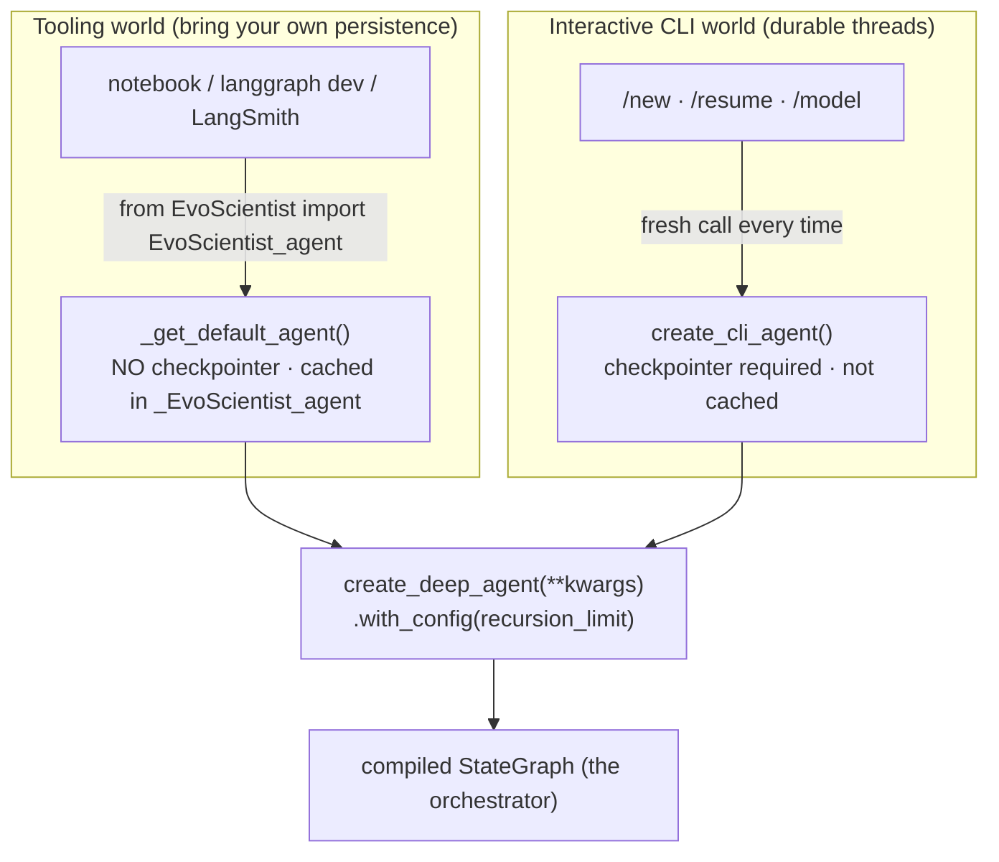
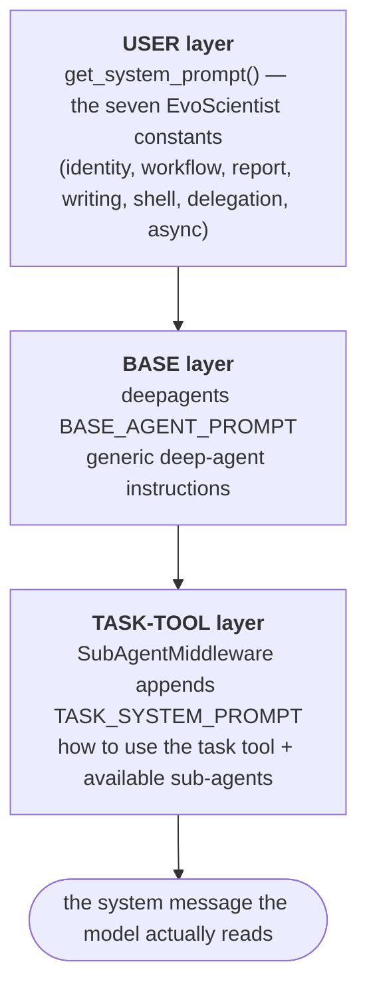

# Chapter 5 — Assembling the Agent and Its Constitution

> **This chapter answers:**
> - How does EvoScientist actually build its agent, and why is it built *lazily*?
> - What are the "two factories," and why does one take a checkpointer and the other not?
> - How can `/model` swap the model mid-session without corrupting a live conversation?
> - What is in the agent's system prompt, and how is it assembled from parts?

Look back at the master diagram from Chapter 2. Two of its regions carry the tag "Ch 5." One is the box in the center — **the orchestrator agent**, the `create_deep_agent` graph with its model node and tools node. The other is the panel labeled **system prompt / constitution**. Chapters 3 and 4 taught you how that box *runs*: the ReAct loop compiled into a LangGraph `StateGraph`, wrapped in a middleware onion, sitting on a backend. What they deliberately left open is how EvoScientist *fills that box in* — where the chat model comes from, which tools and sub-agents and middleware get handed to `create_deep_agent`, and what standing instructions the model reads on every single turn.

This chapter is the seam between the borrowed machinery and EvoScientist's own configuration. The book's design bet — *configure, don't build* (Chapter 1) — becomes concrete here, in one file, `EvoScientist/EvoScientist.py`, whose entire job is to assemble a dictionary of arguments and hand it to a factory it did not write. And once the agent is assembled, we turn to its second half: `prompts.py`, the agent's **constitution** — the system prompt (the standing instructions prepended to every model call) that tells a general research agent that it is, specifically, EvoScientist. We will read both files closely. By the end you will understand not just *what* gets configured, but *why the assembly is shaped the way it is* — because the shape is driven by two hard requirements that a naïve builder would get wrong: startup must be fast, and switching models mid-conversation must never break the conversation.

Read this chapter as two movements. The first is about *building the agent* — laziness, the two factories, and the safe-switch machinery. The second is about *what the agent believes* — the four-source prompt stack. They meet in one function, `_build_base_kwargs`, which is where "configure, don't build" stops being a slogan and becomes a Python dictionary.

---

## 1. Why the agent is built lazily

### The problem: not every command needs an agent

Start with a scenario. You type `EvoSci config list` to see your current settings, or `EvoSci onboard` to run the first-run setup wizard, or just `EvoSci --help`. None of these commands runs the research agent. They print some text and exit. Yet all of them begin the same way: Python imports the `EvoScientist` package.

Now consider what building the agent actually costs. To construct the orchestrator, EvoScientist must instantiate an LLM client (an HTTP connection to a model provider), compose thirteen or so middleware, build a `CompositeBackend` over the filesystem, load seven sub-agent definitions from YAML files, and — if MCP servers are configured (Model Context Protocol, an open standard for plugging in external tool servers; Chapter 10) — *spawn subprocesses* to connect to them. That is heavy. If every import paid that cost, `EvoSci --help` would hang for seconds spinning up model clients it will never call.

The module's own docstring states the design goal in its first breath:

```python
"""EvoScientist Agent graph construction.
...
All heavy initialization (deepagents, backends, LLM, middleware) is deferred to first
use so that importing this module is fast and non-agent CLI commands
(``EvoSci config list``, ``EvoSci onboard``) never pay the cost.
"""
```

*(`EvoScientist/EvoScientist.py:1-6`)*

This is the **lazy factory** design: build the agent only on first use, so fast CLI commands never pay the agent-init cost. "Factory" because the module's public role is to *manufacture* a configured agent on demand; "lazy" because it defers that manufacturing until someone actually asks for the product.

### The mechanism: `None` globals plus a module `__getattr__`

How do you make an *import* cheap but a *use* complete? The intuition is a light switch that wires itself the first time you flip it. The module ships with the wiring absent — a set of placeholders — and installs it only when something reaches for the light.

The placeholders are module-level globals initialized to `None`:

```python
_config = None
_chat_model = None
...
_auxiliary_chat_model = None
...
# Default agent (no checkpointer) — used by langgraph dev / LangSmith / notebooks.
_EvoScientist_agent = None
```

*(`EvoScientist/EvoScientist.py:58-82`)*

Importing the module assigns a handful of `None`s. That is nearly free. But the module also *documents* that you can write `from EvoScientist import EvoScientist_agent` and get a fully built agent. There is no variable named `EvoScientist_agent` — only `_EvoScientist_agent`, which is `None`. So how does the import succeed?

The trick is **PEP 562**, a Python feature that lets a module define a function named `__getattr__`. Python calls it whenever someone accesses a module attribute that does not exist as a normal name. It is the module-level analogue of the `__getattr__` you may know on classes: a fallback lookup hook. EvoScientist uses it to turn attribute access into lazy construction:

```python
def __getattr__(name: str):
    if name == "EvoScientist_agent":
        return _get_default_agent()
    # Backward compat for module-level names
    if name == "chat_model":
        return _ensure_chat_model()
    if name == "SYSTEM_PROMPT":
        return _configured_system_prompt(_ensure_config())
    if name == "backend":
        return _get_default_backend()
    raise AttributeError(f"module {__name__!r} has no attribute {name!r}")
```

*(`EvoScientist/EvoScientist.py:892-902`)*

Now the story closes. `from EvoScientist import EvoScientist_agent` looks up an attribute that does not exist as a plain name, so Python calls `__getattr__("EvoScientist_agent")`, which runs `_get_default_agent()` and returns a real, fully constructed agent. The consumer's code reads as if `EvoScientist_agent` were an ordinary global; the module quietly built it on first touch. Same story for `chat_model`, `SYSTEM_PROMPT`, and `backend` — each name is a lazy façade over a builder function. Any *other* name raises `AttributeError`, exactly as a normal missing attribute would.

The result is a clean division: `import EvoScientist` costs a few `None` assignments; *reaching for the agent* pays the full construction cost, once, and caches it. Fast commands never reach.

### Caching, and the bug that keyed the cache

Laziness alone would build the agent once and hand back that same instance forever. That is fine — until the user changes the model mid-session with the `/model` slash command (a user control message parsed separately from prompt text; Chapter 10). Now "build once, cache forever" is exactly wrong: the cached chat model is bound to the *old* model, and the session must pick up the new one.

EvoScientist solves this by keying the cache. The chat model (the LLM wrapped behind a uniform messages-in/message-out interface; Chapter 3) is cached alongside a small tuple recording *which* model built it:

```python
_chat_model = None
# Track the (model, provider) binding of _chat_model so cache invalidates
# when config.model/provider change (e.g. via /model). Without this,
# _ensure_chat_model() returns the stale cached instance even after
# _ensure_config(new_cfg) has overwritten the active config — causing
# /model switch to lag one step (see issue #179).
_chat_model_key: tuple[str | None, str | None] | None = None
```

*(`EvoScientist/EvoScientist.py:59-65`)*

The comment is not decoration — it is the scar tissue of a real bug. Read the accessor and you can see the fix in motion:

```python
def _ensure_chat_model():
    ...
    cfg = _ensure_config()
    key = (cfg.model, cfg.provider)
    if _chat_model is None or _chat_model_key != key:
        _replace_chat_model(_build_chat_model(cfg), key)
    return _chat_model
```

*(`EvoScientist/EvoScientist.py:152-165`)*

The rebuild condition is `_chat_model is None or _chat_model_key != key`. The first clause is ordinary laziness — nothing cached yet, build it. The second clause is the safety net: the config now names a `(model, provider)` pair that differs from the one that built the cached instance, so the cache is *stale* and must be rebuilt. Without that second clause, `_ensure_chat_model()` would happily return the old client even after the config had already been updated — the switch would appear to succeed but not take effect until the *next* rebuild. That is the "lag one step" the comment warns about.

> **📁 事故档案 (Origin Story) — the `/model` switch that lagged a step (issue #179)**
>
> **背景 (Background).** EvoScientist caches its chat model so a multi-turn CLI session does not rebuild an HTTP client on every message. The natural first cut caches a single `_chat_model` global: build on first use, return it thereafter.
>
> **经过 (What happened).** The `/model` command updates the active config to a new `(model, provider)` and then asks for a chat model. But the config-update step and the model-cache step were separate. Updating `_config` did *not* invalidate `_chat_model`. So the next call to `_ensure_chat_model()` saw a non-`None` cache and returned the *old* client — the one bound to the previous model. The switch silently lagged: it seemed to take effect only after some later event happened to rebuild the model.
>
> **代价 (Cost).** A user runs `/model` to move to a stronger (or cheaper) model, sees the command accepted, and keeps working — on the wrong model, with no error to tell them. The class of bug where a cache and its invalidation condition drift apart is among the hardest to notice, because everything *looks* fine.
>
> **机制化 (Mechanized).** The fix, recorded in the comment at `EvoScientist.py:60-65`, is to make the cache **keyed**. Alongside `_chat_model` lives `_chat_model_key`, the `(model, provider)` tuple that built it. `_ensure_chat_model()` compares the current config's key against the stored key; a mismatch forces a rebuild. The cache can no longer serve a value the config has invalidated. Every write to the trio of model globals then funnels through *one* function, `_replace_chat_model` (`:136-149`), so the instance, its key, and the derived default agent can never drift out of sync again — the comment there calls it the "single write point."

Notice the shape of the fix: not "add more state" but "make the existing state *self-describing* enough that staleness is detectable." A keyed cache carries its own invalidation condition. This is a pattern you will meet again in Chapter 13, where the persistence layer keys its pruning on the checkpoint namespace to avoid an analogous drift.

### The auxiliary model: a cheaper hand for background work

Before we leave the model globals, meet a second one. Not every LLM call the system makes deserves the main model. When a background agent distills a finished turn into memory notes (the memory worker; Chapter 11), or the tool selector picks which tools to expose this turn (Chapter 7), or the scheduler fires an unattended task (Chapter 6), the work is routine and high-volume. Paying flagship-model prices for it is waste.

So EvoScientist keeps a second cached model — the **auxiliary model**, a cheaper or faster model used for background and helper LLM calls rather than the user-facing conversation. It is resolved and cached exactly parallel to the main model, with one important shortcut:

```python
def _ensure_auxiliary_chat_model():
    ...
    cfg = _ensure_config()
    aux_model = cfg.auxiliary_model or cfg.model
    aux_provider = cfg.auxiliary_provider or cfg.provider
    if (aux_model, aux_provider) == (cfg.model, cfg.provider):
        return _ensure_chat_model()
    key = (aux_model, aux_provider)
    if _auxiliary_chat_model is None or _auxiliary_chat_model_key != key:
        _auxiliary_chat_model = get_chat_model(model=aux_model, provider=aux_provider)
        _auxiliary_chat_model_key = key
    return _auxiliary_chat_model
```

*(`EvoScientist/EvoScientist.py:168-191`)*

Read the resolution first: the auxiliary model *defaults to the main model*. `cfg.auxiliary_model or cfg.model` means "use the configured auxiliary if set, otherwise the main model," and likewise for the provider. Then the guard on line 185 is the shortcut that matters: if the resolved auxiliary pair equals the main pair — the common case, when the user never configured a separate cheap model — the function returns the *main* cached instance directly. No second client is built; the two names simply point at the same object. Only when the auxiliary genuinely differs does a second keyed cache come to life, invalidated the same way the main cache is. The design gives you a cheaper background model for free if you want one, and costs nothing if you don't.

You will see the auxiliary model flow into `get_chat_model` (the single door onto the provider layer, from Chapter 8) and out to the workers of Chapters 6, 7, and 11. Here, all you need is the gloss: *the auxiliary model is the cheaper hand the system uses for its own housekeeping, falling back to the main model when none is configured.*

---

## 2. The two factories

We have talked loosely about "building the agent." In fact `EvoScientist.py` has **two** builder functions, and the difference between them resolves a nuance Chapter 3 flagged. Recall that Chapter 3 pointed at `create_deep_agent(...).with_config({"recursion_limit": ...})` as the one place the graph is built — then noted, in a correction, that there are actually *two* sibling factories, one with a checkpointer and one without. This is where we settle that.

The two factories are `_get_default_agent()` (`:827-889`) and `create_cli_agent()` (`:910-1049`). They build the *same* kind of agent — both end in `create_deep_agent(**kwargs)` — but they serve two different worlds, and the dividing line is the **checkpointer** (the component that snapshots graph state after each super-step so a run can resume; Chapter 3).

### The default agent: no checkpointer, for the tooling world

`_get_default_agent()` is the agent behind the lazy `EvoScientist_agent` façade you met earlier. It is what you get from `from EvoScientist import EvoScientist_agent` in a notebook, and what the `langgraph dev` server (the local LangGraph server subprocess; Chapter 14) and LangSmith tracing load. Its defining trait: **no checkpointer**.

```python
def _get_default_agent():
    """Build the default agent (no checkpointer) on first access.
    ...
    """
    global _EvoScientist_agent
    if _EvoScientist_agent is None:
        from deepagents import create_deep_agent
        ...
        _EvoScientist_agent = create_deep_agent(
            **kwargs,
        ).with_config({"recursion_limit": cfg.recursion_limit})
    return _EvoScientist_agent
```

*(`EvoScientist/EvoScientist.py:827-889`)*

Why no checkpointer here? Because these consumers *bring their own* persistence. The `langgraph dev` server manages checkpoints itself; a notebook user is exploring interactively and does not need durable multi-turn threads; LangSmith just wants to trace a run. Handing them a checkpointer would be redundant at best and conflicting at worst. So the default agent is the "bare" graph, cached in `_EvoScientist_agent` under the same laziness as everything else — `if _EvoScientist_agent is None:` builds it once.

### The CLI agent: a checkpointer, and a fresh build per command

`create_cli_agent()` is the real entry point for the interactive command line. Here durable multi-turn conversation is the whole point: you close your laptop, come back tomorrow, run `/resume`, and your session is intact. That requires a checkpointer, and if the caller does not supply one, the factory installs a default:

```python
    if checkpointer is None:
        from langgraph.checkpoint.memory import InMemorySaver

        checkpointer = InMemorySaver()
```

*(`EvoScientist/EvoScientist.py:968-971`)*

The `InMemorySaver` is a non-persistent fallback — fine for a throwaway session, but the CLI normally passes a real SQLite-backed checkpointer (the `PruningCheckpointer` of Chapter 13). The other structural difference from the default factory is that `create_cli_agent` is **not cached**. It is called *fresh* on `/new` (start a new conversation), `/resume` (reopen an old one), and `/model` (switch the model) — each of which wants a newly built graph, not a reused one. Where `_get_default_agent()` guards its work behind `if _EvoScientist_agent is None:`, `create_cli_agent` simply builds and returns every time.

The following diagram captures the split:



Both roads lead to the same `create_deep_agent(**kwargs)` call. The kwargs dict — the payload both factories assemble — is the subject of Section 4. But first there is a subtler feature of `create_cli_agent` to understand, because it is the mechanism that makes `/model` *safe*.

---

## 3. The pure path: build-verify-then-commit

### Intuition: swap the engine without stalling the car

Here is a design tension worth stating plainly. A user is mid-conversation. They run `/model gpt-5` to switch models. Building the new agent might *fail* — the model name is wrong, the provider is unreachable, an API key is missing. If the switch has already scribbled the new model into the module's global state by the time it fails, the live session is now half-switched: the config says one thing, the cached model says another, and the conversation is corrupted. The user did nothing wrong, but their session is broken.

The safe discipline is familiar from database transactions: **build and verify the new thing entirely before touching anything the live session depends on, and commit only on success.** If the build fails, nothing changed; the session sails on with its original model, no cleanup needed. EvoScientist calls this the **pure path**, and it is baked into the signature of `create_cli_agent`.

### Mechanism: two paths, selected by the arguments

`create_cli_agent` can run in two modes depending on how it is called. The docstring lays out the contract:

```python
    """Create agent with checkpointer for CLI multi-turn support.
    ...
    **Pure path:** when *both* ``config`` and ``chat_model`` are explicit, this
    writes none of the cached config/model module globals (``_config``,
    ``_chat_model``, ``_chat_model_key``, ``_EvoScientist_agent``) — the agent
    is built purely from the passed-in locals.  The caller commits the switch
    on success via ``set_active_config`` / ``set_chat_model_instance`` (see
    ``/model``).  Otherwise the existing module-global path runs (langgraph
    dev, notebooks, and CLI startup, which pass ``config=`` only).
    """
```

*(`EvoScientist/EvoScientist.py:919-931`)*

And the selector is a single `if`:

```python
    # Pure path only when BOTH config and chat_model are explicit: build from
    # locals and write no module globals. Otherwise keep the legacy
    # global-writing behavior — callers that pass config= only (CLI startup,
    # langgraph dev) rely on it to seat the active config/model.
    if config is not None and chat_model is not None:
        cfg = config
        _apply_env_from_config(cfg)
    else:
        cfg = _ensure_config(config)
        chat_model = None
```

*(`EvoScientist/EvoScientist.py:957-966`)*

Read the branch carefully. When *both* `config` and `chat_model` are passed explicitly (the pure path), `cfg` is bound to the passed-in config *local variable* and the passed-in `chat_model` is used as-is. Crucially, `_apply_env_from_config` only sets API-key environment variables *if unset* (it is idempotent, per its docstring at `:104-111`) — it does **not** cache the config as the module global `_config`. So the whole agent is built from locals; not one of the four cached globals is written. If the build then throws, the session's globals are exactly as they were.

The `else` branch is the ordinary, global-writing path used at CLI startup and by `langgraph dev`: `_ensure_config(config)` seats the config as the active global, and `chat_model` is forced to `None` so that downstream construction falls back to `_ensure_chat_model()` (which reads and writes the caches). This is the legacy behavior — perfectly correct when you *want* the build to become the session state.

### Detail: the `/model` command, build then commit

The proof that the pure path buys safety is in the `/model` command itself. Read its core sequence:

```python
        temp_cfg = copy.copy(cfg)
        temp_cfg.model = model_name
        temp_cfg.provider = provider
        ...
        try:
            new_chat_model = _build_chat_model(temp_cfg)
            new_agent = _load_agent(
                workspace_dir=ctx.workspace_dir,
                checkpointer=ctx.checkpointer,
                config=temp_cfg,
                chat_model=new_chat_model,
                events=events,
            )
        except Exception as e:
            ctx.ui.append_system(f"Failed to switch model: {e}", style="red")
            return

        # Agent built with no global mutation — commit the switch atomically.
        ...
        cfg.model = model_name
        cfg.provider = provider
        set_active_config(cfg)
        set_chat_model_instance(new_chat_model, (model_name, provider))
        ctx.agent = new_agent
```

*(`EvoScientist/commands/implementation/model.py:150-185`)*

This is the transaction in miniature. First a *copy* of the config, `temp_cfg`, gets the new model and provider — the live `cfg` is untouched. Then `_build_chat_model(temp_cfg)` constructs the new model without writing globals (it is the pure counterpart to `_ensure_chat_model`, per its docstring at `:123-133`), and `_load_agent(..., config=temp_cfg, chat_model=new_chat_model, ...)` routes into `create_cli_agent`'s **pure path** — both `config` and `chat_model` explicit — so the whole verification build touches no module state. If *anything* in that `try` fails, the `except` prints an error and returns; the comment at `:145-149` notes the pure path means "a failure below leaves the session on the original model with no snapshot/restore needed."

Only past the `try` — with a fully built, verified agent in hand — does the **commit** happen: `set_active_config` seats the new config, `set_chat_model_instance` installs the already-built model into the keyed cache without rebuilding it, and `ctx.agent` is swapped to the new graph. The comment at `:172-180` stresses that these are "pure assignments and cannot fail, so the session can never be left half-switched." That is the whole point: all the fallible work happened before any global was touched; the commit is a handful of assignments that cannot throw.

### The tension it resolves — and the footgun it carries

The pure path resolves a genuine conflict. On one side, module-level caching makes the common case fast and simple: build once, reuse. On the other, that same shared mutable state is a landmine during a *risky rebuild* like `/model`, where a failed build must not poison the session. The design keeps both by giving `create_cli_agent` two personalities: a global-writing personality for the paths that *want* to seat state (startup), and a pure personality for the path that must *verify before committing* (`/model`).

But there is a cost, and the code is honest about it. `create_cli_agent` and its sibling `_get_default_agent` — and within `create_cli_agent`, the two branches — must stay behaviorally in sync. They construct backends and middleware and kwargs the same way; if one drifts, you get a bug that appears only on `/model` (or only in `langgraph dev`) and nowhere else. EvoScientist mitigates this by funneling the shared work through single sources of truth: `_get_default_middleware` builds the middleware list for *both* factories (`:1015-1020` calls it "the single source of truth so the CLI agent never drifts from the default chain"), and `_build_base_kwargs` builds the kwargs for both. The two-paths-must-agree footgun is real; the defense is to give the two paths as little *independent* code as possible. Keep that in mind whenever you touch either factory: a change in one is almost always a change owed to the other.

---

## 4. The kwargs dict: "configure, don't build" made concrete

Everything so far has been about *how* the agent is built — laziness, the two factories, the pure path. Now the *what*. Both factories converge on `_build_base_kwargs`, and this function is the single clearest embodiment of the book's thesis. It does not implement an agent loop, a tool router, or a delegation mechanism. It assembles a dictionary and hands it to a factory it did not write:

```python
    return {
        "name": "EvoScientist",
        "model": chat_model if chat_model is not None else _ensure_chat_model(),
        "tools": list(base_tools),
        "backend": base_backend,
        "subagents": subs,
        "middleware": base_middleware,
        "system_prompt": _configured_system_prompt(cfg),
        "skills": list(DEFAULT_SKILL_SOURCES),
    }
```

*(`EvoScientist/EvoScientist.py:516-525`)*

Eight keys. That is the entire "agent" that EvoScientist builds — a spec, handed to `create_deep_agent`. Each key is a doorway to a different region of the system, and the book is organized so that each doorway has a chapter that owns it. Walk them in order:

| Key | What it is | Owned by |
|---|---|---|
| `name` | the literal string `"EvoScientist"` — the identity the ownership filter and memory system key on | this chapter (and Ch 13's `agent_name` filter) |
| `model` | the chat model — the passed-in one on the pure path, else `_ensure_chat_model()` | Ch 8 (provider layer) |
| `tools` | the hand-assembled tool list: `think_tool`, `skill_manager`, plus MCP tools | Ch 10 (tools + MCP) |
| `backend` | the `CompositeBackend` routing `/skills/` and `/memories/` over the workspace | Ch 9 (backends + sandbox) |
| `subagents` | the loaded sub-agent specs (six research agents + scheduler + general-purpose) | Ch 6 (the team) |
| `middleware` | the ~13-entry onion from `_get_default_middleware` | Ch 7 (the stack) |
| `system_prompt` | the assembled constitution from `get_system_prompt()` | **this chapter, Section 5** |
| `skills` | the skill source paths, defaulting to `("/skills/",)` | Ch 12 (skills + AutoSkills) |

Look at line 518 — `"model": chat_model if chat_model is not None else _ensure_chat_model()` — and you can see the pure path threading through. When `/model` supplied an explicit `chat_model`, it goes straight into the kwargs; otherwise the function falls back to the keyed cache. The same conditional appears on the `chat_model` argument all the way up the call chain, so a single explicit model passed at the top reaches every place a model is needed without ever writing a global. This is why the pure path can be pure: the plumbing threads the model down as a *parameter*, never fetching it from a cache along the way.

The lines *before* the return do the gathering. `load_subagents` reads the YAML files (Chapter 6), `_ensure_general_purpose_subagent` re-materializes deepagents' built-in general-purpose sub-agent so EvoScientist's own middleware attaches to it too (`:368-382`), `_inject_subagent_middleware` gives each sub-agent its error handling and memory middleware, and `_maybe_swap_async_subagents` decides — based on runtime topology — whether the async-flagged sub-agents run in-process or as remote graphs (all Chapter 6). There is a near-identical function, `load_mcp_and_build_kwargs` (`:528-608`), which does the same assembly but first loads MCP tools and folds them in; the tail of *that* function is byte-for-byte the same eight-key dict (`:599-608`). Which one runs depends on whether MCP is configured and which deploy mode the process is in — the branching you saw at `:873-884`.

The teaching point is not any single key. It is the *shape*: EvoScientist's contribution to "building an agent" is choosing what goes in eight slots. The agent-ness lives in `create_deep_agent` (Chapter 4) and, below it, `create_agent` and the LangGraph `StateGraph` (Chapter 3). EvoScientist configures; it does not build. And of those eight slots, exactly one is authored in prose rather than assembled from other modules — `system_prompt`. That is the constitution, and it is where we turn now.

---

## 5. The system prompt as constitution

### Intuition: instructions the model reads before every word you say

A base chat model is a general-purpose next-token predictor. Ask it to run experiments and it will *try*, but it has no idea it is "EvoScientist," no six-phase workflow, no house style for reports, no rule against inventing citations, no notion of when to delegate to a sub-agent. All of that has to be *told* to it — and told on **every turn**, because the model has no memory between calls beyond the message history it is shown. The vehicle for that standing instruction is the system prompt: the block of text prepended to the message list before the model sees the conversation.

Chapter 1 called EvoScientist's system prompt its **constitution**, and the metaphor is exact. A constitution is the standing law the agent operates under — who it is, how it works, what it must never do — as distinct from the day-to-day instructions in any single user message. EvoScientist's constitution is not a template with holes to fill; it is a concatenation of seven hand-written constants, each governing one aspect of the agent's conduct. `prompts.py` is, as the dossier puts it, the best "read one file, get the philosophy" artifact in the whole repo.

### Mechanism: seven constants, concatenated in order

The assembly function is short and does exactly what it says:

```python
    sections = [
        EVOSCIENTIST_IDENTITY,
        EXPERIMENT_WORKFLOW,
        REPORT_TEMPLATE,
        WRITING_GUIDELINES,
        shell_guidelines,
        DELEGATION_STRATEGY,
        ASYNC_NOTIFICATIONS,
    ]
    return "\n".join(sections)
```

*(`EvoScientist/prompts.py:437-446`)*

No Jinja, no format strings threading in runtime values, no conditional includes beyond one. Just seven constants joined by newlines. Each names a domain of the agent's behavior:

- **`EVOSCIENTIST_IDENTITY`** — who the agent is and its operating principles.
- **`EXPERIMENT_WORKFLOW`** — the six-phase research process (Intake → Plan → Execute & Debug → Evaluate & Iterate → Write Report → Verify).
- **`REPORT_TEMPLATE`** — the recommended structure for a final report.
- **`WRITING_GUIDELINES`** — style rules for any written output.
- **`SHELL_GUIDELINES`** — limits and usage rules for the `execute` tool.
- **`DELEGATION_STRATEGY`** — when and how to delegate to sub-agents.
- **`ASYNC_NOTIFICATIONS`** — how to triage `[Async tasks update]` signals from async sub-agents.

Two of these repay a closer look. The identity constant is where the agent's *character* is written:

```python
EVOSCIENTIST_IDENTITY = """# Identity

You are EvoScientist, a self-evolving AI research scientist. You are not a workflow executor — you are a research collaborator that grows alongside your human partner across sessions.
...
- **Take initiative.** Propose the next useful step rather than waiting for micro-instructions. The human is on-the-loop (reviewing direction at checkpoints), not in-the-loop (approving every action).
...
- **Stay grounded.** Never invent data, citations, or results. Say "I don't know" or "this is unverified" when that's true. Concrete beats aspirational.
```

*(`EvoScientist/prompts.py:29-41`)*

Read those lines against Chapter 1. "The human is on-the-loop … not in-the-loop" is the product's core stance — **human-on-the-loop** — stated to the model *as a behavioral instruction*. "Never invent data, citations, or results" is scholarly rigor made into standing law. The philosophy the book has been describing in prose is, quite literally, prompt text the model reads on every turn.

The workflow constant is the six-phase workflow you met in Chapter 1 — and here is the payoff of that early chapter's promise that "the workflow *is* the system prompt." It is assembled from sub-sections into `EXPERIMENT_WORKFLOW` at import time:

```python
    sections = [
        _EXPERIMENT_WORKFLOW_PREAMBLE,
        _build_intake_scope(),
        _EXPERIMENT_WORKFLOW_EXECUTION,
        _EXPERIMENT_WORKFLOW_REFLECTION_AND_CLOSE,
    ]
    return "\n\n".join(section.strip() for section in sections)
...
EXPERIMENT_WORKFLOW = _build_experiment_workflow()
```

*(`EvoScientist/prompts.py:201-210`)*

We do not re-teach the six phases here — Chapter 1 owns them, with the exact labels **Intake → Plan → Execute & Debug → Evaluate & Iterate → Write Report → Verify**. The point at *this* altitude is that those phases are not a diagram in the docs; they are `_build_intake_scope()`, `_EXPERIMENT_WORKFLOW_EXECUTION` (which holds Steps 2, 3, and 4 at `:91-139`), and `_EXPERIMENT_WORKFLOW_REFLECTION_AND_CLOSE` (Steps 5 and 6 at `:183-192`) — Python strings, concatenated, shipped to the model.

### One constant that varies: sandbox vs dangerous shell

Six of the seven constants are fixed text. The seventh, `SHELL_GUIDELINES`, has two variants, and the choice depends on config. In the default sandbox — the confined virtual `/` the agent operates in (Chapter 9) — the agent is told about a virtual workspace and a timeout. In **dangerous mode** — the flag that drops workspace confinement for real-filesystem access (Chapter 9) — it is told, in bold, that it operates on the host filesystem with real absolute paths. The builder picks the variant:

```python
    shell_guidelines = (
        _build_shell_guidelines(dangerous=True, cwd=cwd)
        if dangerous
        else SHELL_GUIDELINES
    )
```

*(`EvoScientist/prompts.py:432-436`)*

And the caller in `EvoScientist.py` supplies that flag from config, injecting the *real* working directory only when the agent will actually see real paths:

```python
def _configured_system_prompt(cfg) -> str:
    # In dangerous mode the agent works on the real filesystem; give it the real
    # cwd so it can use absolute paths instead of the virtual `/` workspace root.
    real_cwd = str(_paths_mod.resolve_virtual_path("/")) if cfg.dangerous_mode else None
    return get_system_prompt(
        dangerous=cfg.dangerous_mode,
        cwd=real_cwd,
    )
```

*(`EvoScientist/prompts.py`, called from `EvoScientist/EvoScientist.py:281-288`)*

This is the *one* place the constitution flexes to configuration. Everything else — identity, workflow, report template, style, delegation, async triage — is the same for every session. And notably, *dynamic per-turn values are not here at all*: the current date and timezone are injected fresh on each turn by `RuntimeContextMiddleware` (the `modify_request`/`wrap_model_call` middleware we walked in Chapter 4), not baked into the prompt, so the constitution stays a stable document while the volatile facts arrive at the last moment. The docstring at `:417-421` states this explicitly.

### The four-source stack: the prompt is built by three packages

Here is the twist that closes the chapter. `get_system_prompt()` produces EvoScientist's *contribution* to the system prompt — but it is not the whole prompt the model sees. Recall from Chapter 4 that deepagents wraps `create_agent` and that middleware can rewrite the request. Both facts apply here. The final system prompt is assembled by **three packages in a fixed order** — a pattern we will call **system prompt layering**: the final instructions the model reads are stacked from multiple independent sources, each contributing one layer, in a fixed precedence.

The layers, in the order they concatenate:



The first two layers are glued together inside deepagents' `create_deep_agent`. Its own code concatenates your `system_prompt` argument with its `BASE_AGENT_PROMPT`:

```python
    base_prompt = _apply_profile_prompt(_profile, BASE_AGENT_PROMPT)
    if system_prompt is None:
        final_system_prompt: str | SystemMessage = base_prompt
    ...
        final_system_prompt = system_prompt + "\n\n" + base_prompt
```

*(deepagents `graph.py:857-863` in the inspected `deepagents` source)*

The ordering is deliberate and documented in deepagents' own docstring: the final prompt is `USER -> (BASE or CUSTOM) -> SUFFIX`, and the first invariant is that "**`USER` is always at the front, so caller instructions take precedence** over SDK and profile content regardless of which model is selected" (`graph.py:116-134`). EvoScientist's constitution is the `USER` layer, so it leads; deepagents' generic deep-agent instructions follow as `BASE`. (The `CUSTOM` and `SUFFIX` slots come from a `HarnessProfile`, deepagents' per-model tuning mechanism, named in Chapter 4; when a profile is active it can replace `BASE` or append a `SUFFIX`. For our purposes the load-bearing fact is the *ordering*: EvoScientist first.)

The third layer arrives later, at model-call time, from middleware. `SubAgentMiddleware` — the middleware that owns the `task` tool (the delegation seam from Chapter 4) — appends its own `TASK_SYSTEM_PROMPT` to the system message inside a `wrap_model_call` hook:

```python
    def wrap_model_call(self, request, handler):
        """Update the system message to include instructions on using subagents."""
        if self.system_prompt is not None:
            new_system_message = append_to_system_message(request.system_message, self.system_prompt)
            return handler(request.override(system_message=new_system_message))
        return handler(request)
```

*(deepagents `middleware/subagents.py:848-857`)*

That `TASK_SYSTEM_PROMPT` documents *when to use the task tool*, *the sub-agent lifecycle*, and — filled in from the loaded specs — *which sub-agents are available* (`:392-421`). It is added by middleware rather than baked into `get_system_prompt()` for a precise reason: the roster of sub-agents is a runtime fact, not a compile-time constant, and middleware runs with the assembled agent in hand.

So the system message the model reads is not one document but a layered stack: **EvoScientist's constitution** on top (identity, workflow, rigor), **deepagents' base** beneath it (how to be a deep agent), and **the task-tool documentation** appended by middleware (how to delegate). Three packages, one prompt, USER-first. When you read a strange instruction in the model's behavior and go hunting for where it came from, this is the map: check EvoScientist's seven constants first, then deepagents' base, then the sub-agent middleware.

---

## 6. 要点 (Takeaways)

- **The lazy factory keeps startup cheap.** `EvoScientist.py` initializes its agent-related globals to `None` and builds the real objects only on first access, via a PEP 562 module `__getattr__` (`:892-902`). Fast commands like `EvoSci config list` never pay the cost of spinning up model clients, backends, and middleware.
- **The chat-model cache is keyed to detect staleness.** `_chat_model` travels with `_chat_model_key = (model, provider)`; `_ensure_chat_model()` rebuilds on a key mismatch. This is the fix for the issue-#179 bug where `/model` lagged a step because config changes did not invalidate the model cache. All writes to the model globals funnel through the single write point `_replace_chat_model`.
- **There are two factories, split on the checkpointer.** `_get_default_agent()` builds a checkpointer-less agent (cached) for notebooks / `langgraph dev` / LangSmith, which bring their own persistence. `create_cli_agent()` builds a checkpointer-backed agent fresh on every `/new`, `/resume`, and `/model` for durable CLI conversations.
- **The pure path makes `/model` safe.** When both `config` and `chat_model` are passed explicitly, `create_cli_agent` builds from locals and writes no module globals, so the new agent can be *built and verified* before any live state is touched. `/model` then commits atomically with pure assignments (`set_active_config`, `set_chat_model_instance`) that cannot fail. The cost is a footgun: the pure and global-writing paths must stay in sync, mitigated by funneling shared work through `_get_default_middleware` and `_build_base_kwargs`.
- **The auxiliary model is a cheaper hand for housekeeping.** `_ensure_auxiliary_chat_model()` resolves a separate, cheaper model for memory workers, the tool selector, and the scheduler — and transparently returns the main model when none is configured, so it costs nothing to leave unset.
- **"Configure, don't build" is an eight-key dict.** `_build_base_kwargs` assembles `{name, model, tools, backend, subagents, middleware, system_prompt, skills}` and hands it to `create_deep_agent`. Each key is a doorway to a chapter; EvoScientist chooses the contents, deepagents and LangChain supply the agent-ness.
- **The system prompt is a layered constitution.** `get_system_prompt()` concatenates seven hand-written constants (identity, six-phase workflow, report template, writing rules, shell rules, delegation, async triage), with only the shell section varying by dangerous mode. The final prompt the model reads is a four-source stack — EvoScientist's `USER` layer first, deepagents' `BASE` beneath, then the `task`-tool docs appended by `SubAgentMiddleware`, with an optional `HarnessProfile` `SUFFIX` — assembled by three packages in a fixed, USER-first order.

With the agent assembled and its constitution written, the next three chapters open the doorways this one only named: Chapter 6 walks the sub-agent team behind the `subagents` key, Chapter 7 walks the middleware onion behind the `middleware` key, and Chapter 8 walks the provider layer behind the `model` key.

---

## Sources

| Topic | Authoritative file(s) |
|---|---|
| Lazy factory, `None` globals, PEP 562 `__getattr__` | `EvoScientist/EvoScientist.py:1-6, 58-82, 892-902` |
| Chat-model cache, keying, single write point (issue #179) | `EvoScientist/EvoScientist.py:59-65, 136-166` |
| Auxiliary model resolution & fallback | `EvoScientist/EvoScientist.py:168-191` |
| The two factories (default vs CLI) | `EvoScientist/EvoScientist.py:827-889, 910-1049` |
| Pure path vs global-writing path | `EvoScientist/EvoScientist.py:919-931, 957-966` |
| `/model` build-verify-commit sequence | `EvoScientist/commands/implementation/model.py:130-190` |
| The kwargs dict ("configure, don't build") | `EvoScientist/EvoScientist.py:489-525, 528-608` |
| System-prompt assembly (seven constants) | `EvoScientist/prompts.py:29-41, 200-210, 400-446` |
| Shell guidelines sandbox vs dangerous variant | `EvoScientist/prompts.py:293-303, 432-436`; `EvoScientist/EvoScientist.py:281-288` |
| Four-source prompt stack (BASE, TASK, ordering) | deepagents `graph.py:114-144, 857-863`; deepagents `middleware/subagents.py:392-421, 848-857` |

*When the book and the code disagree, **the code wins** — read the files above and trust them over this prose.*
