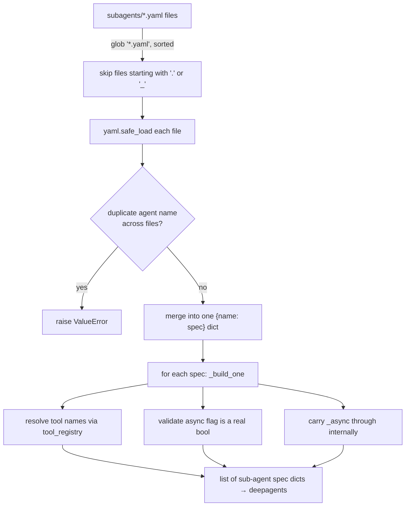
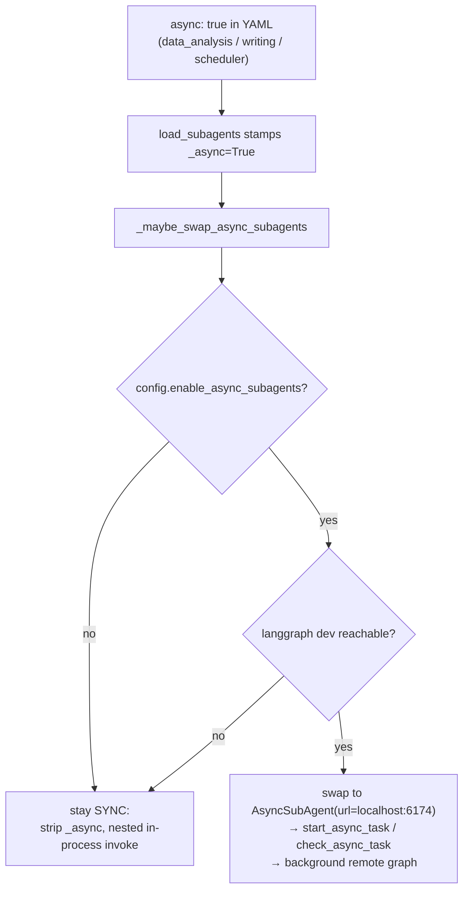

# Chapter 6 — The Team: Sub-Agents and Delegation

> **This chapter answers:**
> - Who are EvoScientist's sub-agents, and what is each one for?
> - How is a sub-agent defined and loaded — and why in YAML rather than in code?
> - What actually happens when the orchestrator calls the `task` tool — and why does a sub-agent start from a blank slate?
> - Why are some sub-agents "async", and how is that a *completely different* execution mechanism from the rest?

On the master diagram from Chapter 2, find the box labeled **"Sub-agent team + `task` tool (sync) and async sub-agents (remote)."** That is this chapter's territory. Chapter 4 already stood at its edge: it taught the `task` tool as a *mechanism* — a nested sub-graph run over a fresh, stateless state — and it introduced the word **sub-agent** as a concept (a specialized agent the orchestrator delegates to). What it deliberately left blank was the roster: *who* those specialists actually are, and *why they were split up the way they were*. This chapter fills that box in. It names all seven sub-agents, reads their definitions out of the actual YAML files, walks the loader that turns those files into agent specs, then replays the sync-dispatch mechanism from Chapter 4 — now with real names attached — before revealing that three of those same YAML files can resolve into a second, wholly different execution path depending on how EvoScientist is running.

The through-line to hold onto: **a sub-agent is a declaration, not a hard-wired object.** The same seven declarations feed two machines. Understanding which machine runs when, and why the designers built two, is the payoff of the chapter.

---

## 1. Why a team at all? (intuition)

Start with the problem, because the roster only makes sense once you feel the pressure that produced it.

The orchestrator — EvoScientist's main agent, the system prompt plus middleware onion wrapped around a model⇄tools loop (Chapter 2) — runs a long research campaign: survey the literature, plan experiments, write and debug code, analyze results, write a report. If *one* agent did all of that in one conversation, its message history — its entire working memory, as Chapter 3 framed it — would swell with everything: half-read web pages, stack traces, matplotlib warnings, discarded plan drafts. Every model call would re-read that pile. Two costs follow. First, **money and latency**: every token in the history is re-sent on every turn, so an agent that has been running for an hour pays for an hour of accumulated clutter on its next single decision. Second, and worse, **focus**: a model asked to debug a CUDA error reasons better when its context is *the CUDA error*, not the CUDA error buried under a literature survey and three plan revisions.

The classic organizational answer is division of labor. You do not want one person who is simultaneously the librarian, the engineer, the statistician, and the technical writer, each half-remembering the others' work. You want a small team of specialists, each handed a crisp brief, each returning a crisp result. The orchestrator becomes a manager: it decides *what* needs doing and *who* should do it, then reads back only the finished deliverable.

That is exactly the shape EvoScientist adopts. The orchestrator delegates a focused piece of work to a specialist **sub-agent**, and the sub-agent runs in its *own* isolated conversation, sees only the brief it was handed, does the job, and reports one answer back. The orchestrator's own history never fills with the sub-agent's scratch work — only with the one-paragraph result. Chapter 1 gave this a memorable slogan: **"the org chart is the eval suite."** The team was not drawn on a whiteboard for elegance; each role maps to a capability the project is benchmarked on (surveying, coding-and-execution, data analysis). We will make that mapping concrete once you have met the roster.

---

## 2. The roster: six research specialists and a seventh worker

Here is the honest count first, because the project's own documentation is of two minds about it. The README markets **"6 sub-agents."** The repository contains **seven** YAML files under `EvoScientist/subagents/`. Both are true, and the discrepancy is meaningful rather than sloppy: the six are the *research* specialists that participate in an interactive research session; the seventh, `scheduler`, is a different animal — an unattended worker fired by a timer, with no human in the loop, described in the next section. When this book says "the six sub-agents," it means the research six; the scheduler is called out by name.

The six research sub-agents map one-to-one onto the six-phase workflow from Chapter 1 (Intake → Plan → Execute & Debug → Evaluate & Iterate → Write Report → Verify). Read the table as an org chart:

| YAML file | agent name | what it is for | tools | async? |
|---|---|---|---|---|
| `planner.yaml` | `planner-agent` | design experiment stages, success signals, dependencies — no web, no code | `think_tool` | no |
| `research.yaml` | `research-agent` | web research on methods/baselines/datasets, one topic at a time | `tavily_search`, `think_tool` | no |
| `code.yaml` | `code-agent` | implement runnable experiment code, minimal and reproducible | `think_tool` (+ built-ins) | no |
| `debug.yaml` | `debug-agent` | root-cause runtime failures, apply minimal verifiable patches | `think_tool` (+ built-ins) | no |
| `data_analysis.yaml` | `data-analysis-agent` | compute metrics, make plots, summarize insights | `think_tool` (+ built-ins) | **yes** |
| `writing.yaml` | `writing-agent` | draft a paper-ready Markdown report | `think_tool` (+ built-ins) | **yes** |
| `scheduler.yaml` | `scheduler` | unattended single scheduled task, end to end | `think_tool`, `tavily_search`, `skill_manager` | **yes** |

Two things in that table deserve a second look before we open the files. First, the tool lists are *deliberately thin*. A `code-agent` YAML lists only `think_tool` explicitly, yet the agent obviously writes files and runs commands — because `write_file`, `read_file`, `edit_file`, `ls`, and `execute` are deepagents *built-ins* granted to every sub-agent automatically (the `scheduler.yaml` comment on lines 3–4 spells this out: "`write_file / read_file / edit_file / ls / execute` are DeepAgents built-ins (always present)"). The YAML `tools:` list adds *domain* tools on top of that floor. Second, three files carry `async: true`. Note *which* three: `data_analysis`, `writing`, `scheduler` — the long-running ones. Hold that observation; Section 5 is built on it.

### 2.1 Reading two definitions in full

A sub-agent is nothing more than a name, a description, a tool list, a skills mount, a system prompt, and an optional async flag. The best way to internalize that is to read two of them. Start with the planner, the most structured of the six, because its prompt encodes a small state machine.

```yaml
planner-agent:
  description: "Plan experiments: stages, success signals, and dependencies (no web search, no implementation)."
  tools: [think_tool]
  skills: ["/skills/"]
  system_prompt: |
    You are the planner-agent. You do NOT implement code. You create and update experimental plans
    that are practical to run locally.

    You may be invoked in two modes:
    1) PLAN MODE: produce an initial experimental plan.
    2) REFLECTION MODE: update the plan based on stage results.
```
— `EvoScientist/subagents/planner.yaml:1-16`

The `description:` field is not documentation for humans — it is the sentence the orchestrator's model reads when deciding whom to call. It is written in the imperative and it states the *boundaries* as loudly as the job: "no web search, no implementation." The `tools: [think_tool]` line then *enforces* that boundary structurally; recall that `think_tool` is a no-op reflection tool (its value is its docstring — Chapter 10), so the planner is given a place to reason and nothing to *act* with. It literally cannot search the web or run code, because those tools are not in its list. Design and enforcement agree.

The system prompt introduces something the other five lack: **two modes**, PLAN and REFLECTION, selected by the *first line of the brief* the orchestrator sends ("The caller should start the task with either: MODE: PLAN / MODE: REFLECTION"; `planner.yaml:13-16`). This is the same specialist used at two different phases of the workflow — Phase 2 (Plan) hands it `MODE: PLAN` and gets Markdown back; Phase 4 (Evaluate & Iterate) hands it `MODE: REFLECTION` plus the stage results and gets *structured JSON* back (`planner.yaml:30-51`): completed items, unmet success signals, stage modifications, new stages. The planner is thus a small mode-switched function, and the mode is passed in-band through the brief — a pattern that only works because, as we are about to see, the brief is the sub-agent's *entire* input.

Now read the research agent, which sits at the opposite pole — loose, heuristic, budget-bounded:

```yaml
research-agent:
  description: "Web research for methods/baselines/datasets (one topic at a time, return actionable notes + sources)."
  tools: [tavily_search, think_tool]
```
— `EvoScientist/subagents/research.yaml:1-3`

```
    ## Hard Limits
    - Simple queries: 2-3 searches maximum
    - Complex queries: up to 5 searches maximum
    - Stop after 5 searches regardless
```
— `EvoScientist/subagents/research.yaml:25-28`

Here the specialization shows up as a *budget*. The research agent has a real acting tool this time — `tavily_search` (the Tavily web-search tool, wired only when `TAVILY_API_KEY` is present; Chapter 10) — and the danger with a web-search agent is that it searches forever. So the prompt hard-codes a stopping discipline: two to five searches, then stop, with an explicit "reflect after each search using `think_tool`" loop (`research.yaml:16`, "**CRITICAL:** Use `think_tool` after each search"). Notice that this is *prose*, not a code-level counter. Nothing in the runtime enforces "5 searches maximum"; the constraint lives in the system prompt and the model is trusted to honor it. That is a recurring EvoScientist stance — the constitution from Chapter 5 called it "flexible, not rigid templates" — and it is worth naming the tradeoff plainly: a prompt-level limit is cheap and adjustable but not guaranteed, whereas a runtime counter would be guaranteed but rigid. The project bets on the model's compliance and keeps the knob in text.

The remaining four research prompts follow the same skeleton and you can skim them: `code.yaml` tells the code-agent to keep changes "minimal, reproducible, and easy to run," write outputs under `/artifacts/`, and never touch `/skills/` (`code.yaml:9-14`); `debug.yaml` asks for a one-paragraph root cause plus repro-and-verify steps (`debug.yaml:9-16`); `data_analysis.yaml` demands "Do not invent numbers; compute from files or state what is missing" and report uncertainty (`data_analysis.yaml:14-19`); `writing.yaml` forbids fabricated results or citations and prescribes a seven-section report layout (`writing.yaml:12-28`). Every one of them is a paragraph of role, a paragraph of guardrails, and a required output shape. There is no cleverness here on purpose — the cleverness is in *which* six roles exist and *how* they are dispatched, not in any single prompt.

### 2.2 Roster ↔ benchmark map

Return to "the org chart is the eval suite." The correspondence is not decorative:

- `research-agent` is the engine behind the **DeepResearch Bench** surveys — its whole job is exactly the benchmark's task (gather methods/baselines/datasets, cite sources, don't fabricate).
- `code-agent` + `debug-agent` are what **AstaBench Code & Execution** measures — write runnable code, then recover when it fails.
- `data-analysis-agent` is **AstaBench Data Analysis** — metrics, plots, honest uncertainty.
- `planner-agent` and `writing-agent` bracket the pipeline (decide the experiments, report them) and support the end-to-end **ResearchClawBench** run.

Each benchmark stresses one seat on the org chart. If a benchmark score sags, the design tells you which prompt to sharpen. That is the practical value of letting the eval suite dictate the team.

---

## 3. Definition and loading: why YAML, and the custom loader

You have now read sub-agents *as YAML*. The natural question — the one the pedagogy of this book insists we answer before moving on — is: **why YAML at all?** deepagents does not ask for it. When you call `create_deep_agent` (Chapter 4), the framework expects sub-agents defined *inline in Python*, as dictionaries passed to the `subagents=` kwarg. EvoScientist could have written seven Python dicts in `EvoScientist.py` and been done. It chose instead to externalize them to files and write a *custom loader* to read them back. The loader itself tells you why, in its docstring:

```python
    NOTE: This is a custom utility. deepagents does not natively load subagents
    from files - they're normally defined inline in the create_deep_agent() call.
    We externalize to YAML here to keep configuration separate from code.
```
— `EvoScientist/utils.py:121-123`

"Keep configuration separate from code" is the whole rationale, and it is the same **"configure, don't build"** philosophy Chapter 2 identified as EvoScientist's structural signature, applied here to the team. A sub-agent's *identity* — its prompt, its allowed tools, its skills, its long-running-ness — is configuration data, not program logic. Putting it in YAML means a maintainer (or an experiment) can retune the debug-agent's prompt or hand the research-agent a new tool without editing, re-reading, or re-testing Python. It also gives the roster a single, greppable home: one file per agent, the directory is "the canonical single source of truth for sub-agent prompts, tools, skills, and metadata" (`subagents/__init__.py:3-4`). The cost is that EvoScientist must now own the code that turns files into the dicts deepagents wanted in the first place. That code is `load_subagents`.

### 3.1 What the loader does (mechanism)

`load_subagents` (`EvoScientist/utils.py:112-274`) takes a directory path and a `tool_registry` — a `name → tool` dictionary — and returns a list of sub-agent spec dicts ready for deepagents. The flow is: glob the directory for `*.yaml`, merge every file into one `{agent-name: spec}` mapping, then convert each spec into deepagents' expected shape while resolving the string tool names against the registry.



Several of the loader's decisions are small teaching moments — guards that encode a lesson about a footgun someone presumably hit. Take them one at a time.

**One file per agent, `.yaml` only.** The glob is `config_path.glob("*.yaml")` (`utils.py:170`), and the docstring is emphatic that `.yml` is *intentionally* not supported: "keeps one canonical extension and avoids the dev-vs-wheel packaging mismatch" (`utils.py:128-129`). The reasoning, expanded at `utils.py:163-168`, is a packaging concern — the wheel ships `subagents/*.yaml` as package data, and allowing `.yml` too would mean a parallel entry in `pyproject.toml` and a class of bug where a file loads in a dev checkout but vanishes from the installed package. One extension, one glob, no drift.

**Skip `.`- and `_`-prefixed files.** `if yml.name.startswith(".") or yml.name.startswith("_"): continue` (`utils.py:171-172`). Dotfiles are editor swap files (`.foo.yaml.swp`); an underscore prefix marks a file as private or disabled. This is how you park a work-in-progress `_experimental.yaml` in the directory without it silently joining the team.

**Duplicate names raise, loudly.** Because every file is merged into one flat namespace, two files that both define `code-agent` would collide. The loader catches it before the merge (`utils.py:183-188`) and raises `ValueError("Sub-agent 'code-agent' defined in multiple files; …")`. A silent last-write-wins would be a nightmare to debug; a hard failure at load time is a gift.

**The `async:` bool footgun.** This is the sharpest of the guards, and it is worth reading in full:

```python
        async_val = spec.get("async", False)
        if not isinstance(async_val, bool):
            # Reject quoted-string yaml values like ``async: "false"`` —
            # ``bool("false")`` is ``True`` (non-empty string), which silently
            # flips the agent into async mode. Fail loud instead.
            raise ValueError(
                f"Subagent {name!r}: 'async' must be a boolean, "
                f"got {type(async_val).__name__}: {async_val!r}"
            )
```
— `EvoScientist/utils.py:233-241`

Here is the trap. In YAML, `async: false` parses to the Python boolean `False`, but `async: "false"` (quoted) parses to the *string* `"false"`. And in Python, `bool("false")` is `True`, because every non-empty string is truthy. So a maintainer who fat-fingers quotes around the flag would, without this guard, *silently* route their sub-agent through the completely different async execution path we meet in Section 5 — the failure would show up not as an error but as a mysteriously remote-running agent. The loader refuses to guess: the value must be an actual YAML boolean, or it raises. This is a two-line guard standing in front of a whole class of runtime confusion, and it is the kind of detail that repays reading source over trusting documentation.

Once past the guards, `_build_one` (`utils.py:205-269`) assembles the deepagents dict: `name`, `description`, `system_prompt` (or a `system_prompt_ref` resolved against a prompt table), optional `model` and `skills`, and the resolved `tools` list. Tool names are looked up in the registry (`utils.py:246-247`); a name not in the registry logs a warning and is skipped rather than crashing (`utils.py:262-263`), so a missing optional tool degrades the sub-agent instead of killing the whole agent build. Finally it stamps an internal `_async` field (`utils.py:267`) carrying the YAML flag forward — an underscore-prefixed key that, as its comment warns, "must be popped before passing to deepagents" (`utils.py:230-232`). Remember that field; it is the seam between the two execution mechanisms.

---

## 4. Sync dispatch: the `task` tool, now with real names

We can now replay Chapter 4's `task`-tool mechanism concretely. Chapter 4 told you the *shape*: the orchestrator calls a `task` tool, and the sub-agent runs as a nested sub-graph over a fresh, stateless state. This section shows you the exact lines, and — more importantly — explains *why* statelessness is the deliberate heart of the design.

### 4.1 The mechanism, line by line

When the orchestrator's model decides to delegate, it emits a tool call to `task` with two arguments: `subagent_type` (which specialist) and `description` (the brief). deepagents' `SubAgentMiddleware` built that tool and injected, into the orchestrator's system prompt, a listing of every available `subagent_type` and this instruction about how to write the brief:

```
3. Each agent invocation is stateless. You will not be able to send additional messages to the agent, nor will the agent be able to communicate with you outside of its final report. Therefore, your prompt should contain a highly detailed task description for the agent to perform autonomously and you should specify exactly what information the agent should return back to you in its final and only message to you.
```
— `deepagents/middleware/subagents.py:292`

So the orchestrator is *told*, in its own prompt, that delegation is one-shot: a detailed brief in, one report out, no back-channel. Now watch what the tool does when it fires. The core is `_validate_and_prepare_state`:

```python
        subagent = _select_subagent(subagent_type, runtime)
        # Create a new state dict to avoid mutating the original
        subagent_state = {k: v for k, v in runtime.state.items() if k not in _EXCLUDED_STATE_KEYS}
        subagent_state = {k: v for k, v in subagent_state.items() if k not in private_state_keys}
        subagent_state["messages"] = [HumanMessage(content=description)]
        return subagent, subagent_state
```
— `deepagents/middleware/subagents.py:661-666`

Read that last-but-one line slowly, because it is the whole point. The sub-agent's state is built by copying the parent's state — but then the `messages` key, which Chapter 3 established as *the agent's entire working memory*, is **overwritten** with a brand-new list containing exactly one message: `HumanMessage(content=description)`. The parent's entire conversation — every user turn, every prior tool result, every earlier delegation — is *gone*. The sub-agent boots into a conversation whose only content is the brief. It shares the parent's *files* (the state copy carries the virtual filesystem and `/skills/` and `/memories/` routes) but not the parent's *history*. That is what "stateless" means precisely: **stateless in conversation, not in workspace.**

The tool then runs the sub-agent as a full nested LangGraph invocation, synchronously, inside the tool node:

```python
        subagent_config: RunnableConfig = {"configurable": {"ls_agent_type": "subagent"}}
        with _subagent_tracing_context():
            result = subagent.invoke(subagent_state, subagent_config)
        return _return_command_with_state_update(result, runtime.tool_call_id)
```
— `deepagents/middleware/subagents.py:691-694`

`subagent.invoke(...)` is a complete ReAct loop — the sub-agent's own model⇄tools cycle, its own super-steps — running to completion *inside a single tool call of the parent's loop*. From the orchestrator's vantage point, one tool call took a while and came back with a string. From the sub-agent's vantage point, it lived an entire life and died. And what comes back is compressed to a single message: `_return_command_with_state_update` walks the sub-agent's final messages backward to the last `AIMessage` with non-empty text and wraps *only that* into one `ToolMessage` for the parent (`subagents.py:621-636`). Metrics, retries, dead ends, the twelve searches the research-agent ran — none of it enters the orchestrator's history. One brief in, one paragraph out.

```mermaid
sequenceDiagram
    participant O as Orchestrator loop
    participant T as task tool (tool node)
    participant S as Sub-agent sub-graph
    O->>O: model emits tool call<br/>task(subagent_type, description)
    O->>T: run task in tool node
    Note over T: build fresh state:<br/>messages = [HumanMessage(description)]<br/>(parent history dropped; files kept)
    T->>S: subagent.invoke(fresh_state)
    Note over S: full ReAct loop runs to completion<br/>(its own model⇄tools super-steps)
    S-->>T: final messages
    Note over T: extract last AIMessage text →<br/>one ToolMessage
    T-->>O: ToolMessage (the report)
    O->>O: loop continues with report in history
```

### 4.2 Tension: isolation buys focus but costs context

State-of-mind now: *why would you throw away the parent's history?* Isn't that discarding information the sub-agent might need? Yes — and that is the tension, so let us name both sides honestly rather than pretend the design is free.

**The isolation pays for three things.** First, **token cost**: the sub-agent's every model call re-sends only its own short history, not the parent's hour-long campaign, so a delegated debug is priced like a fresh debug, not like a debug appended to everything that came before. Second, **focus**: a model reasoning about one CUDA stack trace, with nothing else in context, reasons better than one sifting that trace out of a literature survey — this is the whole organizational argument from Section 1, now enforced mechanically. Third, **the orchestrator's own cleanliness**: because only the final report flows back, the manager's history stays a sequence of decisions-and-deliverables instead of drowning in every specialist's scratch work, which keeps *its* future turns cheap and focused too. Isolation, in other words, protects both ends of the delegation.

**The cost is real.** A stateless sub-agent knows *only what the brief tells it*. If the orchestrator writes a lazy brief — "debug the training script" — the debug-agent has no idea which script, what the error was, or what has already been tried, because it cannot see the conversation where all of that was established. The design pushes this cost onto the *quality of the brief*, and it addresses it in two coordinated places. The framework tells the orchestrator to write "a highly detailed task description" (that prompt line above). And EvoScientist's own constitution reinforces it: the `DELEGATION_STRATEGY` section (Chapter 5) instructs "Provide concrete file paths, commands, and success signals in each task so the sub-agent can respond precisely" (`prompts.py:325-326`). Statelessness is not a limitation the design tolerates; it is a constraint the design *leans into*, trading "the sub-agent can rummage through history" for "the sub-agent gets a clean, complete, cheap brief" — and then it invests prompt engineering in making the briefs good. The shared *filesystem* softens the edge: the sub-agent may not see the conversation, but it can read `/artifacts/` and `/experiment_log.md`, so durable state travels through files while ephemeral chatter does not.

### 4.3 The delegation strategy the orchestrator follows

One more piece completes the sync picture: *how* the orchestrator decides whom to call and whether to call several at once. That decision lives in the constitution, in the `DELEGATION_STRATEGY` constant (`prompts.py:309-362`), and its bias is explicit:

```
## Default: Use 1 Sub-Agent
For most tasks, a single sub-agent is sufficient:
```
— `EvoScientist/prompts.py:314-315`

```
## Key Principles
- Bias towards a single sub-agent — add concurrency only when the workload is genuinely independent.
- Avoid premature decomposition — one focused task per sub-agent.
```
— `EvoScientist/prompts.py:358-361`

The default is *one* sub-agent per task, and parallelism is permitted "only when experiments are independent" — comparing Method A vs B vs C on the same data, or running one method across datasets X, Y, Z (`prompts.py:329-334`). The strategy even lists the *sequential* cases where you must not parallelize: hyperparameter tuning (each round needs the last result), debug→fix→re-run (you must observe the outcome), ablation design (you must know which components matter first) — `prompts.py:336-339`. This conservatism is not timidity. When the orchestrator does launch several `task` calls in one turn, each spins up its own independent nested sub-graph over its own fresh state, and their results come back independently — which is exactly why they must be *provably* independent, because a stateless sub-agent cannot coordinate with its siblings mid-flight. (Parallel delegation is also, as Chapter 4 previewed and Chapter 7 details, precisely why HITL is implemented as middleware rather than the `interrupt_on=` kwarg — the kwarg would cascade to every sub-agent and two of them pausing at once would deadlock LangGraph. The conservatism and that design choice are two views of the same constraint.)

---

## 5. Async sub-agents: the same YAML, a different machine

Everything in Section 4 was *synchronous and in-process*: the sub-agent ran inside the parent's tool node, on the same Python process, and the parent *blocked* until it finished. For most sub-agents that is right — a plan or a debug is quick, and you want the answer before continuing. But look again at which three YAML files carry `async: true`: `data_analysis`, `writing`, `scheduler`. Their own comments explain the selection — data-analysis is "Long-running (typically 30-120s for compute + plots)" (`data_analysis.yaml:5`), writing is "typically 30-180s for full report" (`writing.yaml:5`). Blocking the orchestrator for three minutes while a report renders is a bad experience: the human is staring at a frozen prompt while nothing else can happen. For work that is both slow *and* independent, you want **fire-and-continue**, not fire-and-wait.

That is what an **async sub-agent** is: a sub-agent that runs as a separate *remote* graph in the `langgraph dev` subprocess (the local LangGraph server we meet properly in Chapter 14), launched in the background and *non-blocking*, so the orchestrator kicks it off, gets a `task_id` back immediately, and keeps working. The key insight — the one this chapter exists to deliver — is that **the same YAML declaration resolves to two totally different execution mechanisms depending on runtime topology.** Whether `data_analysis` runs as a nested in-process `invoke` (Section 4) or as a remote background graph is *not* decided in the YAML. The YAML only says "this one is async-*capable*." What actually happens is decided at agent-build time, by `_maybe_swap_async_subagents`.

### 5.1 The swap (mechanism)

Recall that `load_subagents` stamped each spec with an internal `_async` field. `_maybe_swap_async_subagents` (`EvoScientist.py:385-486`) reads that field and decides, per sub-agent, which machine it gets. Two runtime conditions must *both* hold for the swap to happen; otherwise the async-flagged sub-agents fall back to ordinary sync dispatch. Read the two guards:

```python
    cfg = cfg if cfg is not None else _ensure_config()
    if not getattr(cfg, "enable_async_subagents", False):
        # Async fully disabled — strip the internal flag before handoff.
        for s in subs:
            s.pop("_async", None)
        return subs
```
— `EvoScientist/EvoScientist.py:409-414`

First condition: the user must have turned the feature on with `config.enable_async_subagents`. If not, every sub-agent — async-flagged or not — stays sync; the function simply strips the internal `_async` field (because it is not a key deepagents understands) and returns the list unchanged. The flag was declarative all along; here it either arms a swap or is quietly discarded.

```python
    from .langgraph_dev.manager import is_async_subagents_available

    if not is_async_subagents_available():
        logging.getLogger(__name__).warning(
            "enable_async_subagents=true but langgraph dev is not reachable; "
            "falling back to in-process sync delegation for all sub-agents."
        )
```
— `EvoScientist/EvoScientist.py:419-425`

Second condition: the `langgraph dev` subprocess must actually be *reachable*. This is the crucial defensive check. Async sub-agents run *as remote graphs on that subprocess*; if the subprocess never came up — port conflict, missing binary — then routing a sub-agent to its dead URL would produce "hangs and confusing tool errors" (`EvoScientist.py:416-418`). So even with the feature enabled, an unreachable server means graceful fallback to sync, with a warning. The topology decides. This is why the same declaration can behave two ways on two machines running identical code: on a laptop with `langgraph dev` up and the flag set, `writing-agent` goes remote; on a laptop without it, the very same `writing.yaml` runs in-process. Neither the YAML nor the orchestrator's prompt changes — only the runtime around them.

When both conditions hold, the swap replaces each async-flagged spec with a deepagents `AsyncSubAgent` reference pointing at the local server:

```python
    from deepagents import AsyncSubAgent

    port = int(getattr(cfg, "langgraph_dev_port", 6174))
    out = []
    agent_specs: dict[str, AsyncSubAgent] = {}
    for s in subs:
        name = s.get("name")
        if name in async_specs:
            spec = AsyncSubAgent(
                name=name,
                description=async_specs[name],
                graph_id=name,
                url=f"http://localhost:{port}",
            )
```
— `EvoScientist/EvoScientist.py:443-461`

An `AsyncSubAgent` is not a compiled sub-graph waiting in the parent's process — it is a *pointer* (`graph_id` + `url`) to a graph that lives in the `langgraph dev` subprocess on `localhost:6174` (the default port; the number is a small joke, 6174 being Kaprekar's constant). deepagents' `AsyncSubAgentMiddleware` sees these references and, instead of adding the blocking `task` tool for them, exposes a different pair of tools: `start_async_task` (kick off a background run, return a `task_id` immediately) and `check_async_task` (poll status/result when the orchestrator wants it) — `deepagents/middleware/async_subagents.py:184-185`. The orchestrator's interaction model flips entirely: from "call `task`, block, read the report" to "call `start_async_task`, get a ticket, keep working, later call `check_async_task` to redeem it." That is why EvoScientist's constitution carries an entire `ASYNC_NOTIFICATIONS` section (Chapter 5) teaching the orchestrator that a `[Async tasks update]` message is "a SIGNAL of background completion, not a new request" (`prompts.py:368-393`) — a whole behavioral protocol that only exists because of this second mechanism.

Two supporting touches finish the swap. When a swap actually happens, the function appends an `AsyncWatcherMiddleware` so background launches spawn a watcher that notifies the user on completion (`EvoScientist.py:469-475`), and it patches deepagents so the CLI's live `(model, provider)` selection reaches those remote graphs (`EvoScientist.py:481-484`) — otherwise a sub-agent frozen in the subprocess would keep using a stale model after the user ran `/model`. Both are consequences of the remote-graph split; a sync sub-agent, sharing the parent's process, needs neither.



### 5.2 Where the remote graph comes from, and why it has full parity

If `data-analysis-agent` runs as a remote graph, *something* had to compile that graph inside the `langgraph dev` subprocess. That something is `build_async_subagent_graph` in `subagents/_factory.py`, and it closes the loop on why the two mechanisms produce *the same behavior* despite different plumbing. The factory loads the very same YAML through the very same `load_subagents`, reuses "the main EvoScientist agent's chat model, backend, and middleware so the deployed sub-agent has full capability parity with its in-process synchronous counterpart: same workspace files, same `/skills/` and `/memories/` routes, same error-handling and context-overflow middleware" (`_factory.py:10-14`). A `data-analysis-agent` behaves identically whether it runs in-process or remote, because it is built from one definition either way — the topology changes *where* it runs, not *what* it is. The factory also honors one difference we flagged in the roster: for the `scheduler`, it swaps in the cheaper **auxiliary model** (Chapter 5) rather than the main model (`_factory.py:111-114`), because an unattended timer task does not warrant the flagship model — the sole place a sub-agent's *model* differs from the orchestrator's. The full `langgraph dev` deployment story — how that subprocess is launched and managed — is Chapter 14's; here it is enough that the async mechanism *targets* it.

### 5.3 The seventh agent, in its native habitat

Which brings us back to the honest "6 vs 7." The `scheduler` (`scheduler.yaml`) is `async: true` like the two research async agents, but it is a different *kind* of thing, and now you have the vocabulary to say why. It is not delegated to during an interactive session at all. It is fired by a **cron** — a recurring scheduled run (Chapter 14) — as an unattended, fire-and-forget worker, and its prompt makes the difference stark:

```
    You are the scheduler: an UNATTENDED background worker that runs ONE
    scheduled task to completion on a timer. No human is present — never ask
    questions; make reasonable assumptions and proceed.
```
— `EvoScientist/subagents/scheduler.yaml:11-13`

"No human is present — never ask questions." The six research sub-agents assist a human-supervised campaign; the scheduler runs alone on a timer, does one task end to end, and stops. It uses the auxiliary model (Section 5.2), it is granted a slightly broader tool floor (`think_tool`, `tavily_search`, `skill_manager`) so it can be self-sufficient, and its "task is the user message" — the cron's instruction *is* the brief. That is why the README's "6" and the repo's "7" are both correct: the scheduler is on the roster of YAML files, but it is a worker, not a teammate. Marketing counts the collaborators; the code counts the definitions.

---

## 6. Two loose ends: the general-purpose agent and per-sub-agent middleware

Two smaller functions run alongside the loader and the swap, and both exist for the same underlying reason, so they are worth a paragraph together.

`_ensure_general_purpose_subagent` (`EvoScientist.py:368-382`) inserts deepagents' built-in general-purpose sub-agent — a catch-all agent for tasks that fit none of the six specialists — into the list *if it is not already present*. Its docstring states the purpose in one line: "Materialize DeepAgents' default subagent so our middleware wraps it" (`EvoScientist.py:369`). deepagents would add this agent automatically, but *without* EvoScientist's custom middleware onion. By materializing it explicitly and inserting it into the same list the loader produced (`EvoScientist.py:376-382`), EvoScientist guarantees the general-purpose agent goes through the same treatment as every hand-authored one.

That treatment is `_inject_subagent_middleware` (`EvoScientist.py:291-367`), which loops over every sub-agent dict and appends a stack of middleware to each: `ErrorNormalizationMiddleware`, context-editing, runtime-context, `ToolErrorHandlerMiddleware`, `ContextOverflowMapperMiddleware`, and (when enabled) memory middleware (`EvoScientist.py:338-365`). The docstring says why this matters: without it, "subagent tool errors are caught by LangGraph's default ToolNode handler which produces terse messages without tracebacks or retry guidance — reducing the subagent's ability to self-recover" (`EvoScientist.py:300-302`). The lesson is that a sub-agent is not a lesser citizen. It gets its *own* middleware onion (Chapter 4), because it runs its own full ReAct loop and needs the same error handling, context management, and memory access the orchestrator has. The two functions together enforce one invariant: **every agent EvoScientist runs — the six specialists, the scheduler, and the general-purpose fallback — is a first-class agent wearing the full onion.** (These middleware are Chapter 7's subject; here they matter only as proof that sub-agents are built to the same standard as the orchestrator.)

---

## 7. 要点 / Takeaways

- **The roster is seven YAML files, honestly "6 + 1."** Six *research* specialists — `planner-agent` (PLAN/REFLECTION modes), `research-agent` (web, 2–5 searches, then stop), `code-agent`, `debug-agent`, `data-analysis-agent`, `writing-agent` — plus a seventh `scheduler`, an unattended cron-fired worker. README markets 6; the repo has 7; both are right. The org chart mirrors the eval suite.
- **Sub-agents are configuration, not code.** They live in `subagents/*.yaml` and are read by a *custom* loader, `utils.py:load_subagents`, because deepagents normally wants them inline — EvoScientist externalizes to keep config out of code ("configure, don't build"). The loader's guards (one file/agent, `.yaml` only, duplicate-name raises, and the `async:`-must-be-a-real-bool check that defuses `bool("false") == True`) are small lessons in defensive loading.
- **Sync dispatch = the `task` tool = a nested, stateless invoke.** The tool overwrites the sub-agent's `messages` with a single `HumanMessage(description)`, so the sub-agent never sees the parent's conversation — only its brief. It runs a complete ReAct loop synchronously inside one parent tool call and returns only its final `AIMessage` as one `ToolMessage`.
- **Statelessness is a deliberate trade.** Conversation isolation buys token savings, focus, and an uncluttered orchestrator history; it costs the sub-agent all context beyond its brief. The design pays that cost by demanding *detailed briefs* (framework prompt + `DELEGATION_STRATEGY`) and by sharing the *filesystem* even while hiding the *history* — stateless in conversation, not in workspace.
- **Delegate one at a time by default.** `DELEGATION_STRATEGY` biases to a single sub-agent and parallelizes only for provably independent work — the same constraint that forces HITL to be middleware rather than a cascading kwarg.
- **The same YAML resolves to two execution mechanisms.** `async: true` marks a sub-agent *capable* of async, but `_maybe_swap_async_subagents` decides at build time: only when `enable_async_subagents` is set *and* `langgraph dev` is reachable does it swap the spec for an `AsyncSubAgent(url=localhost:6174)` — a non-blocking remote graph driven by `start_async_task`/`check_async_task`. Otherwise the identical YAML runs in-process and sync. Topology, not the file, picks the machine.
- **Every agent wears the full onion.** `_inject_subagent_middleware` gives each sub-agent its own error-handling/context/memory stack, and `_ensure_general_purpose_subagent` re-materializes deepagents' built-in so it, too, is wrapped. A sub-agent is a first-class agent, not a lesser one.

---

## Sources

| Topic | Authoritative file(s) |
|---|---|
| The six research sub-agents + scheduler (roster, prompts, tools, async flags) | `EvoScientist/subagents/planner.yaml`, `research.yaml`, `code.yaml`, `debug.yaml`, `data_analysis.yaml`, `writing.yaml`, `scheduler.yaml` |
| Why YAML; the custom loader and its guards | `EvoScientist/utils.py:112-274` (docstring `:121-123`; async-bool guard `:233-241`) |
| Where the roster is assembled into agent kwargs | `EvoScientist/EvoScientist.py:_build_base_kwargs :489-525`, `load_mcp_and_build_kwargs :528-608` |
| Sync `task`-tool dispatch (fresh stateless state, nested invoke, single-message return) | `deepagents/middleware/subagents.py:292, 655-694, 610-638` |
| Async swap: two runtime conditions, `AsyncSubAgent`, watcher, model-passthrough patch | `EvoScientist/EvoScientist.py:_maybe_swap_async_subagents :385-486` |
| `start_async_task`/`check_async_task` tools | `deepagents/middleware/async_subagents.py:184-194` |
| Remote-graph factory with full capability parity; scheduler uses auxiliary model | `EvoScientist/subagents/_factory.py:1-125` |
| Delegation strategy (1-by-default, parallelize only when independent) | `EvoScientist/prompts.py:DELEGATION_STRATEGY :309-362` |
| Async notification protocol | `EvoScientist/prompts.py:ASYNC_NOTIFICATIONS :368-393` |
| Per-sub-agent middleware + general-purpose materialization | `EvoScientist/EvoScientist.py:_inject_subagent_middleware :291-367`, `_ensure_general_purpose_subagent :368-382` |

*When this book and the code disagree, the code wins — the roster and its mechanics live in the files above, and they evolve.*
