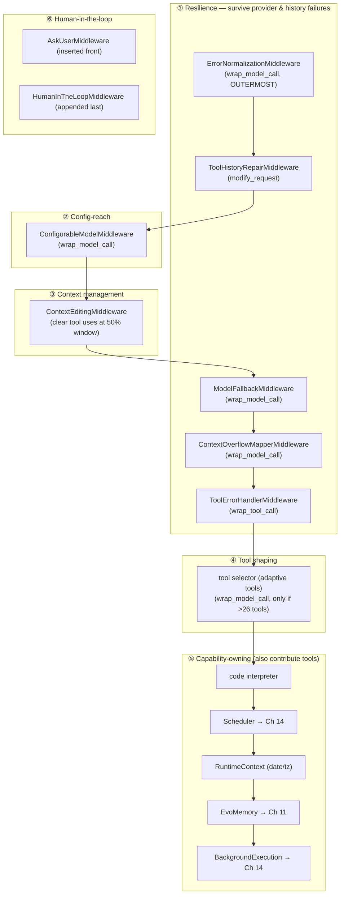

# Chapter 7 — The Middleware Stack: Where the Cleverness Lives

> **This chapter answers:**
> - If the agent loop is borrowed from LangChain and deepagents, where does EvoScientist's *own* cleverness actually live?
> - What are the main middleware in EvoScientist's stack, and what does each one do?
> - Why is the stack ordered the way it is — why is one middleware first and another last?
> - Why is human approval (HITL) attached as a *middleware* rather than a simple `interrupt_on=` keyword argument?

In Chapter 4 we zoomed into one region of the master diagram — the middleware onion around the model and tool calls — and learned the *concept*: a middleware (an `AgentMiddleware` subclass) is a class that hooks the agent's lifecycle to intercept or modify model and tool calls, and the onion is the ordered list of those middleware wrapping every call, outermost first. We walked two of them line by line to make the idiom concrete, and we established the principle that "order is behavior." This chapter zooms into the *same* region, but where Chapter 4 taught you what a single layer is, Chapter 7 shows you the whole onion — all thirteen-to-seventeen layers of it — and makes the case that this stack is where nearly all of EvoScientist's domain intelligence actually lives.

That claim deserves to be stated plainly up front, because it reframes the entire codebase. The ReAct loop is generic: model → tools → model → stop, compiled by `create_agent`, wrapped by `create_deep_agent`, unchanged from what any deepagents user gets. The system prompt is EvoScientist's constitution, yes, but a constitution is words — it tells the agent what to do, not how the runtime behaves around it. Everything that makes EvoScientist *robust* (survives a provider hiccup, recovers a truncated conversation, degrades gracefully when a model errors), everything that makes it *scale* (trims its own context, hides irrelevant tools, falls back to a second model), and much of what makes it *capable* (background jobs, scheduled tasks, self-evolving memory) is a middleware layer. If you wanted to understand EvoScientist by reading exactly one function, `_get_default_middleware` in `EvoScientist/EvoScientist.py:659` would be the one. It is the assembly manifest for the cleverness.

We will not treat all seventeen middleware as equals — that would be a reference table, not a chapter. Instead we group them by the job they do, develop the load-bearing ones deeply enough that you understand not just *what* they do but *why they are written the way they are*, and mention the rest in passing. Then we spend real time on two decisions that reward scrutiny: the *order* of the stack (where "order is behavior" stops being a slogan and starts being a set of concrete constraints), and the choice to make human approval a middleware. Both are cases where the code took a road that looks needlessly indirect until you see the failure it was avoiding.

## The manifest: one function that lists the cleverness

Let's start where the code starts. `_get_default_middleware` builds a Python list `mw` and returns it; that list becomes the `middleware=` argument to `create_deep_agent`. The heart of the function is a list literal at `EvoScientist/EvoScientist.py:765`:

```python
mw = [
    # Outermost — catches provider-SDK exceptions from the model
    # call (including exceptions surfaced through inner
    # middlewares) and normalizes them into a non-dataclass
    # envelope wrapper before anything downstream sees them.
    ErrorNormalizationMiddleware(),
    ToolHistoryRepairMiddleware(),
    ConfigurableModelMiddleware(),
    create_context_editing_middleware(model),
    ModelFallbackMiddleware(events=events),
    ContextOverflowMapperMiddleware(),
    ToolErrorHandlerMiddleware(),
    *create_tool_selector_middleware(
        model=tool_selector_model,
        events=events,
    ),
    # Interpreter prompt must land before runtime/memory context, so this
    # middleware sits ahead of runtime_context in the stack.
    create_code_interpreter_middleware(
        timeout=cfg.code_interpreter_timeout,
        max_result_chars=cfg.code_interpreter_max_result_chars,
    ),
]
```

After this literal, the function *conditionally appends* the rest depending on config: a scheduler middleware if scheduling is enabled, a runtime-context middleware always, memory middleware if memory is on, a memory-lifecycle middleware if a worker is needed, an `AskUserMiddleware` inserted at the *front* if interactive asking is allowed, and a background-execution middleware for the main agent only (`EvoScientist/EvoScientist.py:788-822`). The conditionals matter: the stack is not a fixed seventeen layers but a *computed* list, shrinking for an async sub-agent (which must not, say, spawn local OS processes or pause for a user who cannot answer) and growing for the interactive CLI agent. Recall from Chapter 6 that an async sub-agent runs as a remote graph in the `langgraph dev` subprocess; the `for_async_subagent` flag threaded through this function is what strips its stack down to a safe subset.

Notice already that the list has *comments inside it* explaining placement — "Outermost", "must land before runtime/memory context." Those comments are the design rationale made durable, and we will lean on them heavily when we get to ordering. First, though, let's understand the layers themselves, grouped by purpose.

Here is the whole onion, grouped, read outermost-first (the first middleware in the list wraps all the others):



Read the arrows as "wraps": `ErrorNormalization` wraps everything to its right, so it is the *last* to see an exception bubbling out and the *first* line of the manifest. The groups are a teaching device, not a code structure — the actual list interleaves them for ordering reasons we will explain. Let's take them one group at a time.

## Group ①: Resilience — surviving the messiness of real providers

The single largest category of EvoScientist's middleware exists for one reason: LLM providers are unreliable and inconsistent, and a research run that dies on the first 500-error is useless for the long, unattended sessions EvoScientist is built for. Five middleware form a resilience shell around the model and tool calls, each catching a different class of failure and turning it into something the rest of the system can handle.

### Error normalization: one exception shape to rule them all

The outermost layer is **error normalization** — a middleware that wraps heterogeneous provider exceptions into one serializable error. To understand why it needs to exist, and why it needs to be *outermost*, it helps to hear the specific bug that motivated it. This is a documented incident: the mechanism was mechanized *because* of a traceable failure, and the failure is written into the middleware's own docstring.

> **事故档案 / Origin story: the orjson dataclass fast-path** (Background → What happened → Cost → Mechanized)
>
> **背景 (Background).** EvoScientist streams events to its WebUI over Server-Sent Events (SSE). When something goes wrong deep in a model call, that error has to be serialized to JSON and sent down the wire so the UI can show the user *why* the run failed — was it a quota problem? An auth problem? A rate limit? A wrong model name? The serialization goes through `langgraph_api`'s `json_dumpb`, which calls `orjson.dumps(obj, default=default, option=OPT_SERIALIZE_DATACLASS)`. The `default=` hook is EvoScientist's chance to build a rich error *envelope* — a dict with `error`, `class`, and `provider` fields the UI can branch on.
>
> **经过 (What happened).** Some provider SDKs — `openrouter.errors.*` was the culprit — decorate their exception classes with `@dataclass`. And orjson has a *fast path* for dataclasses: when it sees one, it enumerates the fields directly and **skips the `default=` hook entirely**. So the wire payload came out as the raw SDK fields — `{"message": …, "status_code": …, "body": …, "headers": null, ...}` — with none of the envelope. The docstring at `EvoScientist/middleware/error_normalization.py:1-13` narrates exactly this: the fast-path "enumerates the fields directly and skips the `default=` hook that builds our envelope."
>
> **代价 (Cost).** The WebUI had "no way to distinguish quota / auth / rate-limit / model-not-found" (`error_normalization.py:12-13`). Every provider failure looked like an undifferentiated blob. The UI couldn't tell the user to top up their credits versus fix their API key.
>
> **机制化 (Mechanized).** The fix is `ErrorNormalizationMiddleware`. It sits at the model-call boundary, catches `BaseException` from the downstream `handler()`, and — *if the request's model is a recognized provider client* — re-raises the exception wrapped in `ProviderStreamError`, which is a plain `Exception` subclass, **not a dataclass** (`error_normalization.py:14-21`). No dataclass, no fast-path, no skipped hook: the envelope survives serialization. The wrapper carries the SSE envelope pre-baked on its instance attributes.

Two design choices in this middleware are worth pausing on because they teach how careful this kind of code has to be. First, the wrap decision keys on the **model, not the exception** (`error_normalization.py:22-31`): "Every exception raised inside a call to a recognized provider model gets wrapped — SDK exceptions, httpx errors, langchain-wrapper failures, and even builtins like `RuntimeError`." At the middleware boundary you can tell *which provider* was in use but not the exception's precise origin, so a uniform envelope is more useful than gambling on the exception class. Second, some exceptions must *not* be wrapped: the helper `_should_pass_through` at `error_normalization.py:49-74` lets anything from `langgraph.errors.*` propagate untouched. That includes control-flow signals like `GraphInterrupt` — the very mechanism EvoScientist's HITL relies on. Wrapping a `GraphInterrupt` in a "provider error" envelope would corrupt the interrupt/resume protocol we met in Chapter 3. So error normalization is deliberately blind to graph-level signals and sees only provider failures. This is the first embodiment of "order is behavior": this middleware is outermost precisely so that it is the final catch for exceptions surfaced through *all* the inner layers, and it is written to know which exceptions are not its business.

### Tool-history repair: healing a conversation that was cut off mid-thought

Recall the recurring frame from Chapter 3: messages are the agent's whole working memory. A conversation is an alternating list — Human, AI (maybe with tool calls), Tool (the results), AI, and so on. Strict providers like OpenAI enforce a rule on that list: every assistant tool call must be followed by a matching tool result. If the model emitted a tool call and then the run *died* — cancelled, crashed, timed out — before the tool produced a result, the saved conversation now contains a "dangling" tool call, and the next time you try to resume, the provider rejects the whole request.

`ToolHistoryRepairMiddleware` closes that gap. Its docstring at `EvoScientist/middleware/tool_history_repair.py:1-20` states the contract: it rewrites the outgoing request so "every dangling tool call is closed with a synthetic error result and every orphan `ToolMessage` (a result whose originating call is gone) is dropped." It uses the `modify_request` hook — the one from Chapter 4 that lets a middleware rewrite the request *before* the model sees it, without touching the persisted state. That last point is important and the docstring calls it out: the middleware only rewrites the request, so it heals the *view* the provider gets without mutating the thread's stored history. And it runs on *every* request at the model boundary, not just at agent start, so an interruption that happens partway through a long run gets healed too (`tool_history_repair.py:18-20`). This is repair-as-you-go, not repair-once.

### Model fallback: retrying down a chain of models

**Model fallback** is a middleware that retries a failed model call down a configured chain of models. The intuition is a hot spare: if your primary model returns an error — the vendor is down, rate-limited, having a bad minute — try the next model in a list you configured with `/model-fallback`, then the next, until one succeeds or the list runs out. The mechanism is a `wrap_model_call` hook that first tries the primary and, on exception, walks the chain (`EvoScientist/middleware/model_fallback.py:356-387`).

What makes this middleware more than a naive try/except is its discipline about *which* errors are eligible for fallback. Two classes of error are explicitly *not* retried, and the docstring at `model_fallback.py:8-12` names both. A **malformed request** (an HTTP 400, a client-side bug in how EvoScientist built the request) will fail identically on every model, so retrying is pointless and slow — re-raise it so the real bug surfaces. A **context-length breach** (the conversation is too big for the window) is not a transient failure either; it needs summarization, not a different model. The middleware carries substring tables — `_CONTEXT_LIMIT_PATTERNS`, `_MALFORMED_REQUEST_PATTERNS`, `_AUTH_ERROR_PATTERNS` at `model_fallback.py:37-60` — to classify a provider's error message, and `_guard_and_fallback` at `model_fallback.py:307` checks non-fallbackable conditions *first*, re-raising immediately for those and only walking the chain for genuinely retryable failures. The context-length case in particular is a handoff: it re-raises so the next middleware in this group can convert it into a signal that summarization understands.

### Context-overflow mapping: turning a 400 into a summarize signal

That next middleware is `ContextOverflowMapperMiddleware`. Its whole job, per `EvoScientist/middleware/context_overflow.py:1-8`, is translation: when a provider returns a 400 that means "context too long," this middleware detects it and re-raises it as a standard `langchain_core.exceptions.ContextOverflowError`. Why bother renaming an error? Because deepagents ships its own `SummarizationMiddleware` that knows how to catch `ContextOverflowError`, compress the conversation, and retry — but only if the error arrives in the shape it expects. Providers each phrase "you sent too many tokens" differently; this middleware normalizes those dialects into the one exception type the summarizer's `except` clause is watching for. It is a small adapter, but it is the seam that lets a generic deepagents feature respond to a dozen providers' idiosyncratic 400s.

### Tool-error handling: a failed tool becomes a message, not a crash

The last resilience layer works on the *tool* side rather than the model side. We met `ToolErrorHandlerMiddleware` in Chapter 4 as one of our two walked examples, so a reminder suffices: it uses `wrap_tool_call`, and when a tool raises, it converts the exception into an error `ToolMessage` fed back to the model rather than letting it crash the run — while re-raising `GraphInterrupt` untouched so HITL still works (`EvoScientist/middleware/tool_error_handler.py:49,61`). The pattern rhymes with the model-side layers: catch the messy failure, turn it into something the agent loop can metabolize, but let control-flow signals pass through.

Step back and look at the shape of Group ①. Every one of these middleware follows the same recipe — catch a category of real-world failure, transform it into a form the rest of the system already handles, and be careful never to swallow a control-flow signal. That recipe *is* EvoScientist's resilience, and it lives entirely in middleware.

## Group ②: Config-reach — making `/model` cross a process boundary

`ConfigurableModelMiddleware` solves a problem that only exists because EvoScientist is, quietly, a distributed system. Here is the scenario, straight from its docstring at `EvoScientist/middleware/configurable_model.py:1-16`. The deployed async sub-agents run in a separate `langgraph dev` subprocess (Chapter 6), and their model is *frozen into the compiled graph at subprocess boot time*. Now the user types `/model` in the CLI to switch models. That command changes the CLI process's model state — but the subprocess graph is a different process; it still uses whatever model it booted with. The user changed models everywhere *except* the async sub-agents, which is exactly the kind of silent inconsistency that erodes trust.

The fix is a middleware that reads the model fresh on *every* call. Its `wrap_model_call` (`configurable_model.py:148-168`) pulls `model` and `model_provider` out of the live `RunnableConfig` — the per-run config object we met in Chapter 3 as `config["configurable"]` — and, if an override is present, rebuilds the chat model and swaps it in via `request.override(model=new_model)`. The CLI's patched `start_async_task` injects the current model into `client.runs.create(config=...)`, so the override rides along with each remote run and the subprocess graph re-resolves its model from the config instead of from its stale boot-time value. When there is no override, the middleware is a pure pass-through (`configurable_model.py:15-16`) — which is why it is safe to install on the in-process CLI agent too, where it simply does nothing.

Two details in this middleware are the sort of thing you only get right after being burned. First, a warning baked into the class docstring at `configurable_model.py:88-91` (the module note at `:22-27` states the same rule): the correct way to read the config from inside a middleware is `langgraph.config.get_config()`, *not* `request.runtime.config` — an earlier version tried the latter, and because `Runtime` does not actually have a `config` field, it "silently no-op'd." A silent no-op in the exact code meant to fix a silent staleness bug: the comment is there so nobody re-introduces it. Second, `_resolve` (`configurable_model.py:131-146`) caches built models under a `(model, provider)` key behind a `threading.Lock`, because middleware instances are *shared across concurrent requests* in a long-lived `langgraph dev` worker. This is the async cousin of a subtle correctness concern: the same middleware object may be executing two model calls at once, so its mutable state has to be thread-safe. Notice this is where the middleware sits in the manifest — first among the model-call layers, before `ModelFallbackMiddleware` — and that placement is deliberate. We will return to exactly why in the ordering section.

## Group ③: Context management — trimming history before it overflows

Long research sessions accumulate enormous conversation histories: every tool call, every multi-kilobyte search result, every file the agent read. Left alone, that history grows until it blows past the model's context window — the maximum number of tokens the model can attend to at once — and the run fails. EvoScientist manages this in two stages, and the first stage is a middleware called **context editing**: a middleware that clears old tool-call/result pairs once history passes roughly 50% of the window.

The intuition is a gardener pruning early rather than waiting for the plant to outgrow its pot. The mechanism, in `EvoScientist/middleware/context_editing.py`, wraps LangChain's built-in `ContextEditingMiddleware` with EvoScientist's own settings. The core is a single `ClearToolUsesEdit` edit at `context_editing.py:52-59`:

```python
return ContextEditingMiddleware(
    edits=[
        ClearToolUsesEdit(
            trigger=compute_context_editing_trigger(model),
            keep=5,
            exclude_tools=["think_tool"],
        ),
    ],
)
```

Read this closely. The `trigger` is not a fixed token count but is *computed from the model's context window*: `compute_context_editing_trigger` at `context_editing.py:21-35` returns 50% of the model's best-known window (falling back to 100,000 tokens when the window is unknown). Fifty percent is aggressive on purpose, and the docstring says why: "This fires well before `SummarizationMiddleware` (~85% / 170k)." That is the two-stage design. When history crosses the halfway mark, context editing *clears old tool-use exchanges* — it strips out the bulky tool calls and their results that the agent no longer needs — cheaply, by just dropping them. Only if history keeps growing to ~85% does deepagents' more expensive `SummarizationMiddleware` kick in and pay an LLM call to compress what remains. Cheap pruning first, expensive summarization as a backstop.

Two parameters guard against pruning too greedily. `keep=5` retains the five most recent tool-use exchanges, because a multi-step tool chain often needs its recent results to stay coherent. And `exclude_tools=["think_tool"]` protects the agent's reflections from being cleared — `think_tool` (Chapter 10's no-op reflection tool, whose value is its docstring) records the agent's reasoning, and clearing that would erase the thread of thought that ties a long session together. Notice `think_tool` shows up again as a protected item; it will appear a third time in the tool selector, which tells you something about how load-bearing the agent's own reflection is to the design.

## Group ④: Tool shaping — hiding tools the agent doesn't need this turn

By the time you add EvoScientist's base tools, the code interpreter, memory tools, scheduler tools, background-process tools, and any MCP tools the user has plugged in (Chapter 10), the agent can be looking at a *lot* of tools. Every tool definition costs tokens in the prompt, and a model handed forty tools makes worse choices than one handed the eight that matter. The **tool selector (adaptive tools)** is a middleware that, above roughly 26 tools, uses an LLM to pick a relevant subset per turn.

The intuition is a good assistant who lays out only the instruments the surgeon needs for *this* operation instead of wheeling in the entire supply closet. The mechanism has a threshold, and the threshold is the whole trick. Look at `EvoScientist/middleware/tool_selector.py:40-42`:

```python
# Default threshold: only run tool selection when tools exceed this count.
# Base tools are ~14; selector activates when MCP tools push count above 26.
DEFAULT_TOOL_THRESHOLD = 26
```

The selector costs an *extra LLM call* — you spend one model round-trip asking a model which tools to keep, before the real model call. That is only worth it when the token savings exceed the extra call, which is why the selector *does nothing* below the threshold. `_ConditionalToolSelectorMiddleware.wrap_model_call` (`tool_selector.py:160-166`) opens with exactly this early exit: `if len(request.tools) <= self._threshold: return handler(request)`. Base tools alone (~14) never trip it; it activates only once MCP or other additions push the count past 26. This is adaptive in the truest sense: the middleware is installed unconditionally but *self-suppresses* until the situation warrants the overhead.

When it does run, it wraps LangChain's `LLMToolSelectorMiddleware`, which asks a model (the auxiliary model — the cheaper, faster model from Chapter 5) to pick a subset given the current messages. But some tools must *never* be filtered out, and the always-include set at `tool_selector.py:43-51` is a small piece of hard-won wisdom:

```python
DEFAULT_ALWAYS_INCLUDE_TOOLS: frozenset[str] = frozenset(
    {
        "think_tool",
        "task",
        "read_memory",
        "record_observation",
        "search_observations",
    }
)
```

The `create_tool_selector_middleware` docstring at `tool_selector.py:290-297` justifies each one, and the reasons are concrete, not decorative. `think_tool` is "required every step for structured reflection." `task` — the delegation tool from Chapter 6 — is core, and *tested*: the docstring reports the selector model "never auto-selects it (0/5 complex queries)," so leaving it to the selector would silently disable the agent's ability to delegate. The memory tools are "referenced by memory prompts; filtering them makes the agent unable to use memory even when the prompt tells it to." That last clause is the cautionary tale of the whole group: a tool the *system prompt instructs the agent to use* must not be hidden by a token-saving optimization, or the agent will be told to do something it is no longer equipped to do.

The selector is also a small master class in graceful degradation. Its wrapper (`tool_selector.py:193-216`) tracks whether the *downstream* handler was reached: if the selection LLM call itself fails, it distinguishes a genuine provider failure (auth, quota — surface it, because falling back to "use all tools" would just hit the same failing provider) from a mere structured-output shape error (degrade quietly to using all tools, `tool_selector.py:210-214`). The optimization is allowed to fail, but it fails *toward* correctness — worst case, the agent sees every tool, exactly as if the selector weren't there.

## Group ⑤: Capability-owning middleware — layers that also bring tools

Everything so far has been a middleware that *modifies* the model or tool calls without adding new capabilities. But EvoScientist uses middleware for a second pattern that Chapter 4 hinted at: a middleware can *own a capability end-to-end*, contributing both the runtime behavior *and* the tools the agent calls to invoke it. The signal is a `self.tools` attribute on the middleware — deepagents collects those and adds them to the agent's tool set.

Three middleware do this, and each one is a whole subsystem covered by a later chapter, so here we only name them and note the pattern. `SchedulerMiddleware` (`EvoScientist/middleware/scheduler.py:1-7`) contributes three tools — `schedule_task`, `list_scheduled_tasks`, `cancel_scheduled_task` — *and* injects scheduling instructions plus the current schedule into the request; the scheduler subsystem is Chapter 14's subject. `BackgroundExecutionMiddleware` contributes the background-process tools (`run_in_background`, `check_process`, and friends) at `EvoScientist/middleware/background.py:158`, and it is main-agent-only because async sub-agents run on `langgraph dev` and must not spawn local OS processes — that "background process" concept, distinct from an async task and a cron, is also Chapter 14. And `EvoMemoryMiddleware` (`EvoScientist/middleware/memory.py:261`) builds its tool list conditionally — `search_observations`, `read_memory`, `record_observation` — and does what the dossier calls "dynamic system prompt rewriting," injecting the agent's profile and an observation index into every request. EvoMemory is the self-evolving memory at the heart of the project and gets all of Chapter 11.

Two more capability layers round out this group. The code interpreter middleware exposes the sandboxed QuickJS REPL as a tool (Chapter 9 owns it, including why `execute` is deliberately excluded from its pass-through-call allowlist so it can't bypass HITL). And `RuntimeContextMiddleware`, the second middleware we walked in Chapter 4, is the small honest one: on every call it appends a `<runtime_context>` block with the current date and timezone (the `RUNTIME_CONTEXT_TEMPLATE` at `EvoScientist/middleware/runtime_context.py:14`, appended around `:48-61`), so the agent always knows what day it is without that fact being baked staticly into the system prompt. It is the reason the constitution can stay timeless while every individual call is timestamped fresh.

The lesson of Group ⑤ is architectural: in EvoScientist, "a feature" and "a middleware" are frequently the same object. A capability that needs both a per-call hook *and* a tool the model can call is naturally expressed as one middleware that provides both — the wiring stays local, and the whole feature can be enabled or disabled by a single line in the manifest.

## Group ⑥: Human-in-the-loop — and why it is a middleware

We come to the last group, and to the chapter's subtlest design decision. Chapter 1 named **HITL (human-in-the-loop)**: pausing before a risky tool for human approval, distinct from the human-*on*-the-loop stance where the human reviews direction at checkpoints rather than every action. Chapter 1 named it; this chapter owns the *mechanism*. And the mechanism is built on the primitives from Chapter 3: `interrupt()` pauses the LangGraph graph and hands control back to the caller, and `Command(resume=…)` feeds an answer back in to continue.

There are two human-in-the-loop middleware, and they do related but distinct jobs. `AskUserMiddleware` gives the agent an `ask_user` tool — a way for the agent to *proactively* ask the human a question mid-run, pausing via `interrupt()` until the human answers. It is inserted at the *front* of the stack (`EvoScientist/EvoScientist.py:805-808`) and only when interactive asking is enabled and this is not an async sub-agent — because an async sub-agent runs where "the parent only holds a `task_id` and has no UI path to surface (or resume) an interrupt — the sub-agent would hang forever the first time it called `ask_user`" (`EvoScientist.py:672-677`). Approval, the other direction, is `HumanInTheLoopMiddleware` — LangChain's own middleware — which pauses *before* the agent runs a risky tool so a human can approve or reject it.

Now the interesting part. `HumanInTheLoopMiddleware` is configured with an `interrupt_on` dict naming exactly the risky tools — `execute`, `run_in_background`, `schedule_task` (`EvoScientist.py:862-871`):

```python
# HITL on main agent only (mirrors create_cli_agent). Use middleware,
# not interrupt_on= kwarg — the kwarg propagates to every subagent and
# breaks parallel execute calls (multi-pending-interrupt LangGraph
# error). See PR #202.
if not cfg.auto_approve:
    mw.append(
        HumanInTheLoopMiddleware(
            interrupt_on={
                "execute": True,
                "run_in_background": True,
                "schedule_task": True,
            }
        )
    )
```

Here is the puzzle. `create_deep_agent` accepts an `interrupt_on=` keyword argument directly — you could hand it the same dict and get approval prompts without touching middleware at all. EvoScientist deliberately does *not*. It appends a middleware instead. The comment tells you why, and it is worth a proper sidebar because it is exactly the kind of decision that looks like needless indirection until you meet the failure.

> **⚠️ Subtle gotcha: why HITL is a middleware, not a kwarg** (PR #202)
>
> The `interrupt_on=` keyword on `create_deep_agent` is a convenient shortcut — but it *cascades*. Set it once at the top, and deepagents propagates that interrupt policy down to **every sub-agent** the main agent can delegate to. Now recall from Chapter 6 that the main agent can fire multiple `task` calls in *parallel*. If two parallel sub-agents each hit a risky tool at the same time, each raises its own `interrupt()` — and LangGraph does not support two pending interrupts on the same run. The result is the "multi-pending-interrupt LangGraph error": parallel `task` calls break outright.
>
> Attaching approval as a *middleware on the main agent only* keeps the interrupt policy from cascading. The main agent — the one surface where a human is actually watching and can answer — gets the approval gate; sub-agents run without it, so parallel delegation stays intact. This is the reason both factories (`_get_default_agent` at `EvoScientist.py:858-871` and `create_cli_agent` at `EvoScientist.py:1022-1034`) append the middleware locally rather than passing the kwarg down, and it is why `subagents/_factory.py` deliberately skips `interrupt_on=` at the deepagents level too (`EvoScientist.py:677-679`).

This is "order is behavior" wearing its most consequential face. The *scope* of a middleware — which agent it is attached to — is itself a design lever. Approval is a main-agent concern because the main agent is where the human is; making it a middleware, rather than a global kwarg, is what lets EvoScientist confine that concern to exactly the right agent. Tie this back to Chapter 1's product stance: EvoScientist is human-*on*-the-loop by default, and HITL approval is the narrow exception — a gate only in front of genuinely risky tools, only on the surface a human is watching. The mechanism's shape follows directly from that stance.

## The event-sink seam: how middleware talk without importing the UI

Several middleware we have met need to *report* something to a human — the tool selector wants to say "I narrowed 40 tools down to 8," model fallback wants to narrate "primary failed, trying the backup." But middleware live deep in the agent's core, and the UI (Rich console, Textual app, a chat channel) lives far away on the surface. If middleware imported UI code directly, the dependency arrows would run backward — the core would depend on the presentation — and you could never run a middleware headless, or in a test, without dragging a UI along.

EvoScientist solves this with a classic *dependency inversion*: instead of middleware calling the UI, middleware call an abstract interface, and the UI supplies a concrete implementation from the outside. That interface is **MiddlewareEventSink**, a `Protocol` (Python's structural-typing interface — any object with the right methods satisfies it, no inheritance required) defined at `EvoScientist/middleware/events.py:44`. Its methods are the vocabulary of things middleware can report: `on_tool_selection_started`, `on_tool_selection`, `on_tool_selection_ended`, and `emit_fallback_notice` (`events.py:56-70`). Crucially, the module's own docstring at `events.py:1-8` states the invariant: this module "lives deliberately inside `middleware/` so the dependency direction is always **frontends → middleware**, never the reverse. Middleware reports facts about what happened during a model call; a frontend supplies a sink implementation that owns its own display state and renders (or ignores) those facts."

The seam has three implementations, and their existence is what proves the abstraction earns its place. `NoOpSink` (`events.py:112-147`) drops every event — used for every headless path and every sub-agent stack, "where there is no frontend to render middleware events." `RunScopedEventSink` (`events.py:167-192`) is a proxy: a main agent may be built *before* any frontend exists, so this sink defers to whatever sink the active `stream_agent_events` call bound for the current run, via a `ContextVar`. And a real frontend supplies the third, which actually renders. Because of this seam, the *same* `ToolSelectorMiddleware` reports into a live Textual widget when you run interactively, into nothing when you run a test, and into a JSON stream when you run headless — with no code change and no UI import inside the middleware. The sink's docstring even spells out a threading contract (`events.py:22-35`): sink methods may be called from any thread and must be non-blocking, because "a sink that blocks stalls the model call that emitted the event." This is the exact discipline the streaming layer in Chapter 15 relies on; the events flowing through this seam become the streaming events that reach every surface.

## The tension: more middleware is more power *and* more fragility

It would be dishonest to present this stack as an unqualified win. The middleware architecture is genuinely why EvoScientist can survive flaky providers, trim its own context, and grow capabilities cleanly — but every layer you add is a layer that *runs on every call*, and a layer whose position relative to the others is load-bearing. The design bought power at the price of latency and order-fragility, and the code shows it paying that price knowingly.

The latency cost is visible in the very features that manage it. The tool selector *is an extra LLM call* — you spend a model round-trip to save tokens on the next one — which is precisely why it self-suppresses below 26 tools rather than running unconditionally. Context editing fires at 50% specifically so the *cheap* pruning runs before the *expensive* summarization ever needs to. Every "wrap the model call" middleware adds a stack frame the request passes through twice (once in, once out); with a dozen of them, that is a dozen frames on the hottest path in the system. The design's answer to latency is not to have fewer layers but to make the expensive ones *conditional* — threshold-gated, config-gated, or self-suppressing.

The order-fragility cost is subtler and shows up in the manifest's comments. Consider the placement of `ConfigurableModelMiddleware` *before* `ModelFallbackMiddleware`. The comment at `EvoScientist.py:732-735` explains it is not arbitrary:

```python
# ``ConfigurableModelMiddleware`` is placed first so it wraps
# ``ModelFallbackMiddleware``: a configurable.model override sets the
# PRIMARY model only, leaving the fallback chain free to try its own
# alternatives instead of re-overriding every retry to the same model.
```

Trace it: if fallback were *outside* configurable-model, then every fallback retry would pass back through the configurable layer and get re-overridden to the same primary model the config named — the fallback chain would try the same failing model over and over. Putting configurable-model outside fallback means the override applies once, to the primary, and the fallback chain is then free to try its *own* alternatives. The two middleware compose correctly only in this order; swap them and fallback silently stops working. Likewise the comment at `EvoScientist.py:781-782` — "Interpreter prompt must land before runtime/memory context, so this middleware sits ahead of runtime_context in the stack" — encodes a dependency between how two middleware inject text into the request. And the whole resilience group is ordered so that `ErrorNormalization` is outermost (final catch for everything inner), `ModelFallback` is inside it (so a fallback that ultimately fails still gets normalized), and `ContextOverflowMapper` sits where the context-length error that fallback *re-raises* can be caught and re-shaped for the summarizer.

This is what "order is behavior" costs. The stack is not a set — it is a sequence, and several adjacent pairs have a correct order and an incorrect one, with the incorrect one failing silently rather than loudly. EvoScientist mitigates this the only honest way: by writing the *why* of each placement into a comment next to the code, so the next person to reorder the list has to read the rationale first. The manifest is not just a list; it is a list with its reasoning attached, and that reasoning is the real documentation of the stack.

## Takeaways / 要点

- **The cleverness is the stack.** EvoScientist's ReAct loop is borrowed and generic; almost everything domain-specific lives as one of the ~13-17 middleware assembled in `_get_default_middleware` (`EvoScientist.py:659`). To read the cleverness, read that one function.
- **Resilience is a shell of middleware.** Error normalization (outermost), tool-history repair, model fallback, context-overflow mapping, and tool-error handling each catch a class of real-world failure and turn it into something the system already handles — while carefully letting control-flow signals like `GraphInterrupt` pass through untouched.
- **Optimizations self-suppress.** The tool selector runs only above 26 tools; context editing prunes cheaply at 50% before summarization pays for compression at 85%. Expensive middleware are conditional, and always-include sets (`think_tool`, `task`, memory tools) protect capabilities a token-saving pass could otherwise silently disable.
- **`ConfigurableModelMiddleware` makes `/model` cross a process boundary**, re-reading the live `RunnableConfig` per call so a model switch in the CLI reaches async sub-agents frozen in the `langgraph dev` subprocess.
- **A middleware can own a whole capability.** Scheduler, background execution, and EvoMemory contribute both a per-call hook and the tools the agent calls — "the feature is the middleware." (Chapters 11 and 14.)
- **HITL is a middleware, not a kwarg, on purpose.** `interrupt_on=` on `create_deep_agent` would cascade to every sub-agent and break parallel `task` calls with a multi-pending-interrupt error (PR #202). Attaching `HumanInTheLoopMiddleware` to the main agent only confines approval to the surface where a human is watching — the mechanism's scope follows the human-on-the-loop stance.
- **`MiddlewareEventSink` is a dependency-inversion seam** that lets middleware report facts (tool selection, fallback narration) to a frontend without importing UI code — the same middleware renders to a widget, to nothing, or to a JSON stream depending on the injected sink. (Chapter 15.)
- **Order is behavior, and it costs.** More layers mean more latency and more order-fragility; several adjacent pairs have exactly one correct order (configurable-model wraps fallback; error normalization is outermost) with the wrong order failing silently. The manifest documents each placement's rationale inline — that reasoning *is* the documentation.

## Sources

When the book and the code disagree, **the code wins** — these are the files to check.

| Topic | Authoritative file(s) |
|---|---|
| The middleware manifest and its ordering comments | `EvoScientist/EvoScientist.py:659-824` |
| HITL as middleware, not kwarg (PR #202) | `EvoScientist/EvoScientist.py:858-871`, `:1022-1034` |
| Error normalization + the orjson dataclass story | `EvoScientist/middleware/error_normalization.py:1-74` |
| Tool-history repair | `EvoScientist/middleware/tool_history_repair.py:1-20` |
| Model fallback + eligibility rules | `EvoScientist/middleware/model_fallback.py` |
| Context-overflow mapping | `EvoScientist/middleware/context_overflow.py:1-8` |
| Configurable model (config-reach across subprocess) | `EvoScientist/middleware/configurable_model.py:1-27, :131-196` |
| Context editing (50% trigger, keep=5, exclude think_tool) | `EvoScientist/middleware/context_editing.py:21-60` |
| Tool selector (threshold 26, always-include set, degradation) | `EvoScientist/middleware/tool_selector.py:40-51, :160-216, :290-297` |
| Capability-owning middleware (tools via `self.tools`) | `EvoScientist/middleware/scheduler.py`, `background.py:158`, `memory.py:261` |
| MiddlewareEventSink seam | `EvoScientist/middleware/events.py:1-35, :44-70, :112-192` |
