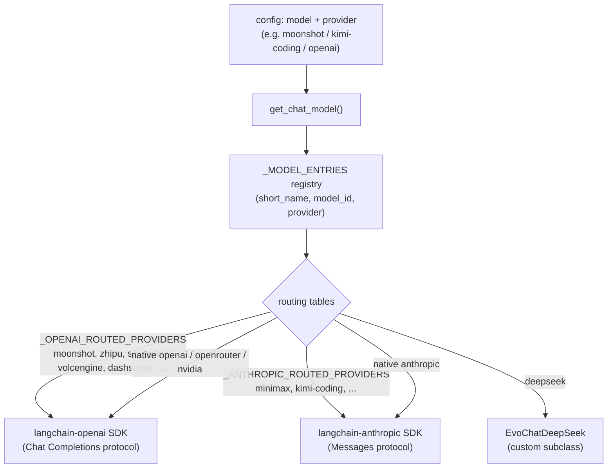

# Chapter 8 — One Config, Many Model Providers

> **This chapter answers:**
> - How does one config field switch EvoScientist between Anthropic, OpenAI, Google, DeepSeek, OpenRouter, Kimi, and a dozen more backends?
> - Why is it true that "most providers are really just the same two SDKs pointed at a different URL"?
> - How is a model's "thinking" (its hidden reasoning) turned on, and why does every vendor need a different knob?
> - Why does a small provider layer accumulate a 1,237-line farm of monkey-patches?
> - What is ccproxy, and why would you hand the agent a *subscription login* instead of an API key?

On the master map from Chapter 2, the agent — a system prompt wrapped in a middleware onion around a model⇄tools loop (Chapter 3) — sits above a slab labelled **LLM provider layer + ccproxy**. That slab is this chapter. Everything above it, all the way up to the six-phase workflow, is written against *one* chat model object: something you hand messages and get a message back from. This chapter is about the seam directly beneath that object — the code that, from a single line in a config file like `model: claude-sonnet-4-6`, decides *which company's servers* answer, *which SDK* speaks to them, *which URL* they live at, *whether the model is allowed to think out loud*, and *how it authenticates*. It is a small directory (`EvoScientist/llm/`, ~2,860 lines) doing a genuinely hard job: presenting fifteen-odd incompatible backends as one uniform thing to everyone above it.

We build the chapter in the order a reader needs, not the order the files sit on disk. First the big idea — that "provider" is mostly a lie, and almost every backend is one of two SDKs aimed somewhere new. Then the registry and the single entry point that resolves a name into a live model. Then the two routing tables that make the lie work. Then "thinking," which is where the uniformity cracks and each vendor demands its own handling. Then the monkey-patch farm, framed not as mess but as the inevitable tax of an abstraction layer. Finally ccproxy, the optional trick that lets a Claude Pro or ChatGPT *subscription* stand in for a metered API key.

## 8.1 The core insight: "provider" is mostly a base URL

Start with intuition. Suppose you already know how to talk to OpenAI's API: you POST a JSON list of messages to `https://api.openai.com/v1/chat/completions` with your API key in a header, and you get back a JSON message. Now a dozen other companies — Moonshot (Kimi), Zhipu (GLM), Alibaba (Qwen/DashScope), SiliconFlow, ByteDance (Doubao/Volcengine), and more — want your business. The cheapest way for them to win it is *not* to invent a new protocol; it is to speak the one you already know. So they stand up a server that accepts the exact same request shape at a *different* address — say `https://api.moonshot.cn/v1` — and tell you: point your existing OpenAI client here, swap the key, done.

That is the whole trick, and it is EvoScientist's central design bet in this layer. The module docstring lists the "providers" it supports — "Anthropic, OpenAI, Google GenAI, MiniMax (Anthropic-compatible), NVIDIA, SiliconFlow, OpenRouter, ZhipuAI, Volcengine, DashScope, DashScope-Code, DeepSeek, Ollama, and custom OpenAI/Anthropic-compatible endpoints" (`EvoScientist/llm/models.py:1-8`) — but underneath, almost all of them collapse into **two real SDKs**: `langchain-openai` (which speaks the OpenAI Chat Completions protocol) and `langchain-anthropic` (which speaks the Anthropic Messages protocol). Everything else is those two SDKs pointed at a new base URL with a new key.

Let us make two terms precise before we lean on them.

- A **chat model** (defined in Chapter 3) is the uniform object the rest of the code holds: it takes a list of messages and returns a message, hiding whatever HTTP happens underneath.
- A **base URL** is the address prefix the SDK sends its requests to. Change it, and the same client talks to a different vendor's servers — the request *body* is unchanged.

We can now name this chapter's central concept, the one the ledger reserves for Chapter 8:

> **Provider routing** — switching LLM vendors by pointing the *same* SDK at a different base URL and API key, instead of writing a new client per vendor. The vendor name in your config is resolved to a `(base_url, api-key)` pair, and the underlying `provider` is quietly reset to `openai` or `anthropic` so one of the two real SDKs does the work.

Why is this the right bet, and what did it cost? The payoff is enormous leverage: adding a new OpenAI-compatible vendor is, in the happy case, *one line* in a table — a base URL and the name of an environment variable. EvoScientist did not write, and does not maintain, a client for Zhipu or DashScope or Volcengine; it maintains a *row*. The cost is that this only works to the extent every vendor's "compatibility" is honest, and it never fully is. Each one gets some detail subtly wrong — how it serializes message content, how it handles reasoning traces, which parameters it rejects. The gap between "claims OpenAI-compatible" and "actually behaves like OpenAI" is exactly the surface area of the monkey-patch farm we reach in §8.5. Hold that tension: the two-SDK bet is what makes fifteen backends cheap, and the patch farm is what that cheapness costs.



Read the diagram top-down: a name enters, the registry turns it into a concrete `model_id` and a provider, and the routing tables funnel almost everything into one of the two SDK boxes. DeepSeek is the one backend that gets a bespoke subclass, for reasons we reach in §8.4.

## 8.2 The registry and the single door

Before routing can route anything, EvoScientist needs to know what models exist. It keeps that knowledge in a flat list of triples (abridged here — the real list is ~170 entries):

```python
# Model registry: list of (short_name, model_id, provider)
# Allows same short_name across different providers.
_MODEL_ENTRIES: list[tuple[str, str, str]] = [
    ...
    ("gpt-5.4", "gpt-5.4", "openai"),
    ...
    ("kimi-k3", "kimi-k3", "moonshot"),
    ...
    ("kimi-k3", "moonshotai/kimi-k3", "openrouter"),
    ...
    ("kimi-for-coding", "kimi-for-coding", "kimi-coding"),
]
```

`EvoScientist/llm/models.py:159-330` is one long literal list, and each entry is a triple: a **short name** (the friendly label you put in config, like `kimi-k3`), a **model_id** (the exact identifier the vendor's API wants, like `moonshotai/kimi-k3`), and a **provider** (which backend serves it). The design choice worth pausing on is the comment on line 158: *"Allows same short\_name across different providers."* The same friendly name `kimi-k3` appears twice — once under `moonshot` (`:319`) and once under `openrouter` (`:254`) — because the same underlying model is sold through more than one storefront. This is a list, not a dict, precisely so that duplication is legal.

From that list two things are derived. A public dict flattens it for the common case:

```python
# Public dict for simple lookups (last entry wins for duplicate names).
MODELS: dict[str, tuple[str, str]] = {
    name: (model_id, provider) for name, model_id, provider in _MODEL_ENTRIES
}

DEFAULT_MODEL = "claude-sonnet-4-6"
```

`models.py:334-338`. Because a dict can hold each key once, *"last entry wins"* — if you look up `kimi-k3` in `MODELS` you get whichever provider was listed last. That is a deliberate default-picking mechanism: the *ordering* of `_MODEL_ENTRIES` encodes preference. (The ordering comments around `models.py:160-178` spell this out: custom-endpoint entries are listed *before* the native Anthropic/OpenAI ones, so that for a bare short name the native provider wins the "last entry" tiebreak.) And `DEFAULT_MODEL` is the fact the whole book has been quietly assuming since Chapter 1: absent any config, EvoScientist runs on `claude-sonnet-4-6`.

Everything funnels through one function — `get_chat_model()` at `models.py:485` — which is the single door between "a name" and "a live chat model." Its signature is disarmingly plain:

```python
def get_chat_model(
    model: str | None = None,
    provider: str | None = None,
    **kwargs: Any,
) -> Any:
```

You may pass a short name, a full model ID, an explicit provider override, or nothing at all. The first job is resolution — turning whatever you passed into a definite `(model_id, provider)`:

```python
    model = model or DEFAULT_MODEL

    # Look up short name in registry (provider-aware)
    model_id = None
    if provider:
        # Try exact match with provider first
        for name, mid, p in _MODEL_ENTRIES:
            if name == model and p == provider:
                model_id = mid
                break
    if model_id is None and model in MODELS:
        model_id, default_provider = MODELS[model]
        provider = provider or default_provider
```

`models.py:508-520`. Read it as a priority ladder. If you named *both* a model and a provider, the code scans the *list* for the exact `(name, provider)` pair — this is how you disambiguate `kimi-k3` on moonshot from `kimi-k3` on openrouter (`:512-517`). If that fails, it falls back to the flattened `MODELS` dict and takes the last-entry-wins default provider (`:518-520`). And if the name is in neither — say you pasted a brand-new full model ID — it treats the string as the model ID directly and *infers* the provider from its prefix: `claude-*` → anthropic, `gpt-*`/`o1` → openai, `gemini*` → google, `ollama:*` → ollama, else anthropic (`:522-537`). The important property: after this block, `provider` and `model_id` are always both set. Everything downstream can assume that.

## 8.3 The two routing tables

Now the provider-routing idea from §8.1 becomes literal code. Two module-level dicts, right at the top of the file, are the heart of the whole scheme:

```python
# Providers routed through the OpenAI provider with a custom base_url.
# Maps provider name → (base_url or None, env var for API key).
_OPENAI_ROUTED_PROVIDERS: dict[str, tuple[str | None, str]] = {
    "moonshot": (_MOONSHOT_BASE_URL, "MOONSHOT_API_KEY"),
    "siliconflow": (_SILICONFLOW_BASE_URL, "SILICONFLOW_API_KEY"),
    "zhipu": (_ZHIPU_BASE_URL, "ZHIPU_API_KEY"),
    "zhipu-code": (_ZHIPU_CODE_BASE_URL, "ZHIPU_API_KEY"),
    "volcengine": (_VOLCENGINE_BASE_URL, "VOLCENGINE_API_KEY"),
    "dashscope": (_DASHSCOPE_BASE_URL, "DASHSCOPE_API_KEY"),
    "dashscope-code": (_DASHSCOPE_CODE_BASE_URL, "DASHSCOPE_API_KEY"),
    "custom-openai": (
        None,
        "CUSTOM_OPENAI_API_KEY",
    ),  # base_url from CUSTOM_OPENAI_BASE_URL env
}
```

`models.py:107-119`. Each key is a "provider" the user can name; each value is the two things you need to make the OpenAI SDK talk to it — *where* (a base URL) and *which environment variable holds the key*. That is the entire cost of supporting Moonshot, Zhipu, Volcengine, and DashScope: four rows. The `custom-openai` row is the escape hatch — its base URL is `None` because it comes from an environment variable at call time, so a user can point EvoScientist at *any* OpenAI-compatible endpoint the authors have never heard of.

The Anthropic side is the same idea, shorter:

```python
_ANTHROPIC_ROUTED_PROVIDERS: dict[str, tuple[str | None, str]] = {
    "minimax": (_MINIMAX_ANTHROPIC_BASE_URL, "MINIMAX_API_KEY"),
    "kimi-coding": (_KIMI_CODING_BASE_URL, "KIMI_API_KEY"),
    "custom-anthropic": (None, "CUSTOM_ANTHROPIC_API_KEY"),
}
```

`models.py:123-127`. MiniMax and Kimi's coding plan both expose Anthropic-*compatible* endpoints, so they route through `langchain-anthropic`.

The pivot — the single most important line in this chapter — happens inside `get_chat_model` where an OpenAI-routed provider is handled:

```python
    # OpenAI-routed providers → route through OpenAI provider with base_url
    elif provider in _OPENAI_ROUTED_PROVIDERS:
        _original_provider = provider
        base_url_default, api_key_env = _OPENAI_ROUTED_PROVIDERS[provider]
        ...
        if base_url:
            kwargs["base_url"] = base_url
        api_key = os.environ.get(api_key_env, "")
        if api_key:
            kwargs["api_key"] = api_key
        ...
        provider = "openai"
```

`models.py:594-625`. Walk the four moves. It remembers the *real* provider in `_original_provider` (line 596) — that memory matters later, because some patches need to know the request *really* came from Moonshot even though the SDK thinks it is OpenAI. It looks up the base URL and key-env from the table. It stuffs `base_url` and `api_key` into the kwargs that will be handed to the SDK. And then, the pivot: `provider = "openai"` (line 625). From this line onward the code has *forgotten* it was ever Moonshot. As far as the SDK is concerned, this is a plain OpenAI request — that happens to be aimed at `api.moonshot.cn`.

The Anthropic-routed branch mirrors it exactly, ending in `provider = "anthropic"` at `models.py:718`. Once resolved, both branches converge on the same call at the bottom of the function:

```python
    if _uses_native_deepseek:
        chat_model = EvoChatDeepSeek(model=model_id, **kwargs)
    else:
        chat_model = init_chat_model(model=model_id, model_provider=provider, **kwargs)
```

`models.py:761-764`. `init_chat_model` is LangChain's factory (introduced in Chapter 3) that, given a provider name and a model ID, builds the right SDK's chat model. By the time we reach it, `provider` is only ever `openai`, `anthropic`, `google-genai`, `openrouter`, `nvidia`, or `ollama` — the *real* SDKs — never `moonshot` or `minimax`. The dozen third-party vendors have already been dissolved into two.

This is provider routing in its purest form: the config said `moonshot`, the registry resolved a model ID, the table supplied a URL and key, the provider was reset to `openai`, and one general-purpose SDK carried the request to a completely different company's servers. Add a new OpenAI-compatible vendor tomorrow and — barring quirks — you add one row.

## 8.4 Thinking: where the uniformity cracks

The two-SDK bet holds beautifully for the *shape* of a request. It breaks the moment you want the model to **reason**.

First the concept, from zero. Modern frontier models can produce a hidden **chain-of-thought** — an internal scratchpad of tokens where the model works a problem out before committing to an answer. The ledger's canonical gloss:

> **Reasoning / thinking** — a model's hidden chain-of-thought, produced before its visible answer; controlled per-vendor via "effort" or "budget" knobs.

Turning this on usually improves hard-task quality and always costs more (those thinking tokens are billed). The trouble for a uniform provider layer is that **every vendor spells the knob differently.** Anthropic calls it `thinking` and wants either an adaptive mode or an explicit token budget. OpenAI calls it `reasoning` and wants an *effort* level (`low`/`high`/`xhigh`). Google wants a boolean `include_thoughts`. Ollama wants `reasoning=True`. There is no common parameter — so the abstraction that made requests uniform cannot make *thinking* uniform. EvoScientist's answer is a single function that branches on the provider *family* and sets each vendor's knob correctly.

That function is `_apply_auto_config` (`models.py:423-482`), called near the end of `get_chat_model` (`:725`). Its contract is stated in the docstring: *"Only sets keys that the caller hasn't already provided, so explicit user settings are never overridden"* (`:432-433`) — auto-configuration, not tyranny. The Anthropic branch:

```python
    # Anthropic: extended thinking
    if provider == "anthropic" and "thinking" not in kwargs:
        ...
        elif "fable" in model_id or model_id.endswith(
            ("opus-5", "sonnet-5", "4-6", "4-7", "4-8")
        ):
            kwargs["thinking"] = {"type": "adaptive", "display": "summarized"}
            kwargs.setdefault("effort", "max")
        else:
            kwargs["thinking"] = {"type": "enabled", "budget_tokens": 10000}
```

`models.py:436-459`. Newer Claude models (the 4-6/4-7/4-8 and 5 generations) get `adaptive` thinking with `effort="max"`; older ones get an explicit 10,000-token budget. The OpenAI branch speaks a different dialect entirely:

```python
    # OpenAI (native, not third-party routed): reasoning
    if provider == "openai" and not is_third_party and "reasoning" not in kwargs:
        _default_effort = (
            "xhigh"
            if (... or "codex" in model_id)
            else "high"
        )
        _eff = _resolve_reasoning_effort(_default_effort)
        kwargs["reasoning"] = {"effort": _eff, "summary": "auto"}
```

`models.py:461-474`. Here the knob is `reasoning={"effort": ...}` — `xhigh` for the newest and Codex models, `high` otherwise, overridable via the `EVOSCIENTIST_REASONING_EFFORT` environment variable. Google gets `include_thoughts=True` (`:477-478`) and Ollama gets `reasoning=True` (`:481-482`). One function, four vendor dialects, all driven off the resolved provider name.

### When thinking must be turned *off*

The subtler half of the story is where EvoScientist *disables* thinking — because leaving it on breaks multi-turn conversations. This is the deep detail worth understanding, because it explains a term we are about to make load-bearing.

When a thinking model answers, its reasoning comes back attached to the message as `reasoning_content` — a separate field alongside the visible text. On some providers the model *requires* that, on the next turn, you send its own prior `reasoning_content` back to it. If you drop it, the API rejects the request. The problem is that LangChain's generic OpenAI path does not always preserve `reasoning_content` when it serializes history — so on multi-turn requests, the field silently vanishes and the vendor returns an error. EvoScientist saw this concretely as SiliconFlow and pre-K3 Moonshot "error 20015," and its fix is to simply not enable thinking on those endpoints:

```python
        # SiliconFlow: disable thinking — LangChain drops reasoning_content
        # from history, causing error 20015 on multi-turn requests.
        if provider == "siliconflow":
            kwargs.setdefault("extra_body", {})["enable_thinking"] = False
        ...
        if provider == "moonshot" and not model_id.startswith("kimi-k3"):
            kwargs.setdefault("extra_body", {})["thinking"] = {"type": "disabled"}
```

`models.py:614-624`. Read this as a tradeoff made honestly: better to run a capable model in non-thinking mode than to let it think and then crash on the second message. Note the carve-out — `kimi-k3` is exempt (`:623`) because K3 is *always* thinking and Moonshot's K3 guide forbids the older `thinking` parameter. That single `startswith` check is the seam between "thinking optional" and "thinking mandatory," and it will reappear.

### reasoning_content passback, and why DeepSeek gets its own class

Now name the term the SiliconFlow comment was dancing around:

> **reasoning_content passback** — echoing a thinking model's own prior reasoning back to it on the next turn, because the provider requires the reasoning trace to be present in the conversation history it receives.

DeepSeek is the one provider that requires this so firmly, and preserves it so poorly through the generic path, that EvoScientist gives it a *custom chat model subclass* rather than a routing-table row. That is why the diagram in §8.1 had a third box. The subclass is tiny:

```python
class EvoChatDeepSeek(OpenAICompatContentMixin, ChatDeepSeek):
    """ChatDeepSeek with EvoScientist's media and history compatibility."""

    def _get_request_payload(
        self,
        input_: LanguageModelInput,
        *,
        stop: list[str] | None = None,
        **kwargs: Any,
    ) -> dict[str, Any]:
        payload = super()._get_request_payload(input_, stop=stop, **kwargs)
        if is_deepseek_thinking_disabled(self.extra_body):
            return payload
        ...
        return _inject_reasoning_content(messages, payload)
```

`EvoScientist/llm/deepseek.py:57-80`. It overrides exactly one method — the point where the request body is assembled — and, unless thinking is off, calls `_inject_reasoning_content` to copy each prior assistant turn's captured reasoning back into the serialized payload. That helper walks the assistant messages and, for each, writes the `reasoning_content` it had stashed earlier back onto the outgoing message (`deepseek.py:30-54`). It is the passback made literal: the model's own scratchpad, handed back to it so the next turn is legal.

Where does the stashed reasoning *come from* in the first place? From a patch on the OpenAI SDK's parser — which is our bridge to the patch farm. `_patch_openai_capture_reasoning_content` (`patches.py:737-770`) wraps the SDK's message-decoding functions so that any `reasoning_content` field on an incoming message or streaming chunk is copied into the resulting `AIMessage`'s `additional_kwargs`:

```python
        def _patched_dict_to_msg(_dict, *args, **kwargs):
            msg = _orig_dict_to_msg(_dict, *args, **kwargs)
            rc = _dict.get("reasoning_content") if isinstance(_dict, dict) else None
            if isinstance(rc, str) and rc and hasattr(msg, "additional_kwargs"):
                msg.additional_kwargs["reasoning_content"] = rc
            return msg
```

`patches.py:747-752`. LangChain's own parser throws `reasoning_content` away; this patch catches it on the way in so the DeepSeek subclass can throw it back on the way out. Capture on ingress, echo on egress — two halves of one round-trip, split across two files because they patch two different SDK seams.

### The Kimi-over-Anthropic case: a spoofed User-Agent

Before leaving thinking, one memorable example that ties routing and thinking together. Moonshot sells a "Kimi Coding" plan through an *Anthropic-compatible* endpoint — so `kimi-coding` lives in `_ANTHROPIC_ROUTED_PROVIDERS` and routes through `langchain-anthropic`. But Kimi's gate for that plan checks *who is calling*: it expects the request to come from Anthropic's own Claude Code CLI. EvoScientist is not Claude Code, so it lies:

```python
        # Kimi Coding Plan requires claude-code User-Agent header
        if provider == "kimi-coding":
            kwargs.setdefault("default_headers", {})["User-Agent"] = "claude-code/0.1.0"
        provider = "anthropic"
```

`models.py:715-718`. A single spoofed `User-Agent` header, `claude-code/0.1.0`, convinces Kimi's server that Claude Code is on the line — after which `provider` resets to `anthropic` and the normal Anthropic SDK carries the request. It is a two-line embodiment of the whole chapter: a vendor pretends to be Anthropic-compatible, EvoScientist pretends to be Claude Code, and one general SDK does the actual work. (Because K3-family Kimi is always-thinking, this model also trips the mandatory-thinking path in `_apply_auto_config` we saw at `models.py:450-452`, and a structured-output patch we meet next.)

## 8.5 The monkey-patch farm

`patches.py` is 1,237 lines. A first reaction is to see a mess. The right reaction is to see a *ledger of every place a vendor broke the compatibility promise.* Frame it as a principle, in four beats.

**Intuition.** An abstraction layer is a promise: "everyone below me behaves the same." Vendors do not honor that promise uniformly — each one breaks a *different* assumption. So the layer accumulates one patch per broken assumption. The size of the patch farm is not sloppiness; it is a direct measurement of how much the vendors disagree.

**Precise statement.** Every patch in `patches.py` follows one shape — *"wrap an existing method/function to fix upstream bugs, applied at import time or on first use"* (`patches.py:2-4`) — and each targets exactly one incompatibility, documented in a comment header. The module docstring (`patches.py:1-21`) is literally a table of contents of vendor bugs.

**Embodiments.** Three concrete ones, each fixing a different broken assumption.

The first assumption vendors break: *"assistant message content is a string."* Anthropic and modern LangChain represent a message's content as a *list of typed blocks* (a text block, an image block, a thinking block). Strict OpenAI-compatible endpoints — SiliconFlow, many custom endpoints — reject that; they want a plain string and raise "sequence expected string." So `_flatten_message_content` collapses the block list back into a string, dropping thinking/reasoning blocks but preserving images and files in their original positions:

```python
def _flatten_message_content(content: Any) -> str | list[Any] | Any:
    """Convert list-of-blocks content to a string, preserving media blocks.

    Thinking/reasoning blocks are dropped.  When a media block (image or file)
    is present, returns a list in the ORIGINAL order ...
    """
```

`patches.py:225-232`. The wiring around it (`_patch_openai_compat_content`, `:584`) is applied only for third-party OpenAI-compatible providers, and the call site in `get_chat_model` (`models.py:772-782`) carefully *exempts* Moonshot, Kimi-coding, native DeepSeek, and mandatory-thinking Kimi — because flattening would strip the thinking blocks that always-thinking Kimi *requires*. One patch, gated by a precise list of who needs it and who would be broken by it.

The second broken assumption: *"reasoning survives serialization."* That is the capture patch we already met at `patches.py:737-770` — LangChain drops `reasoning_content`, so EvoScientist re-captures it. It is a patch that exists *only* because an earlier assumption (that the SDK preserves everything the vendor sends) turned out false.

The third: *"structured output can use forced tool-calling."* When you ask a model to return JSON matching a schema, the usual trick is a forced `tool_choice` — make the model call a tool whose arguments are the JSON. But an always-thinking Kimi model rejects a forced tool choice (it wants to think first), returning a 400. So for exactly those models, EvoScientist swaps the method to `json_schema` instead:

```python
        def _patched(self, schema=None, *, method="function_calling", **kwargs):
            if method == "function_calling":
                from .models import _is_mandatory_thinking_kimi
                if _is_mandatory_thinking_kimi(self.model):
                    method = "json_schema"
            return _orig(self, schema, method=method, **kwargs)
```

`patches.py:1037-1049`. Notice how it reuses the *same* `_is_mandatory_thinking_kimi` predicate (`models.py:151-154`) that governed thinking in §8.4 — the "is this model always thinking?" question shows up in three different patches, all pointing back to one function. That is the abstraction layer's connective tissue: a single fact about a vendor, consulted everywhere its consequences bite.

**Violation.** Remove any one of these and a specific, real breakage returns: SiliconFlow raises "sequence expected string," DeepSeek loses its reasoning and errors on turn two, Kimi K3 returns a 400 on every structured-output call. The patch farm is large because the alternative — for each vendor bug — is a user-visible crash.

### Origin story: the openrouter pin

Not every incompatibility gets a patch. Sometimes the honest engineering move is to *give up patching and pin the dependency* — and EvoScientist's history has a documented case, worth telling as a four-beat origin story because the git log preserves the whole arc.

> **事故档案 / Origin story: the `openrouter<0.11` pin**
>
> **背景 (Background).** OpenRouter is a meta-provider — one endpoint that resells hundreds of models. EvoScientist reaches it through the `openrouter` Python SDK, layered under `langchain-openrouter`. Streaming responses arrive as Server-Sent Events (SSE), a long-lived HTTP stream of incremental chunks.
>
> **经过 (What happened).** OpenRouter's SDK release `0.11.0` introduced SSE regressions — the commit that dealt with it, `e9857dd` (PR #373, 2026-07-22), is titled *"pin openrouter below 0.11 to avoid SSE stream regressions,"* and its sub-commits tell the story: `fix(openrouter): address SSE stream leak by closing response iterator`, then `refactor(openrouter): pass through SDK args in SSE leak patch`, then `test(openrouter): make SSE leak tests version-agnostic` — and finally `fix(openrouter): remove SSE stream leak patch and update dependencies`. They tried to patch the leak, generalized the patch, tested it across SDK versions, then **deleted the patch entirely**.
>
> **代价 (Cost).** A monkey-patch against a moving third-party SDK is a maintenance liability: it can silently rot as the SDK changes, and it has to be kept version-aware forever. The team had already spent three commits building and hardening one before concluding it wasn't worth carrying.
>
> **机制化 (Mechanized).** The resolution lives in one line of `pyproject.toml`, with the reason inline:
> ```toml
>     # 0.11.0+ SSE regressions: teardown noise + mid-turn ReadTimeout
>     "openrouter>=0.10.8,<0.11.0",
> ```
> `pyproject.toml:28-29`. Where §8.5's other patches say "the SDK is wrong, work around it," this one says "the *new* SDK is wrong, so don't take the new SDK." A version pin *is* a patch — the cheapest, most honest kind — and the comment on line 28 turns the pin into documentation, so the next maintainer knows exactly which upgrade to avoid and why. The dossier calls this pattern "pinning as an incident log"; Chapter 16 returns to it across the whole dependency list.

## 8.6 ccproxy: a subscription login where an API key should be

Everything so far assumed you pay per token with an API key. The last piece of the provider layer removes that assumption. Many developers already pay a flat monthly fee for **Claude Pro/Max** or **ChatGPT Plus / Codex** — a subscription that authenticates with an OAuth login, not an API key. Could EvoScientist run on that subscription instead of a separate metered key?

First, two terms. **OAuth** (Open Authorization) is the "log in with your account" flow: instead of a static secret key, you obtain a short-lived *token* by authenticating interactively, and clients send that token. An **API key**, by contrast, is a single static secret you paste into config. The subscription plans hand you OAuth tokens; the SDKs want API keys. Something must bridge the two — and that something is:

> **ccproxy** — an external local proxy (run as a subprocess, never imported) that lets a Claude Pro/Max or ChatGPT/Codex subscription's OAuth token stand in for an API key. EvoScientist points its SDK's base URL at ccproxy on `127.0.0.1`, and ccproxy attaches your real OAuth credentials to each upstream request.

The word "external" is load-bearing. The module docstring is explicit: *"ccproxy is invoked via subprocess (not Python imports) so the `ccproxy-api` package is truly optional at runtime"* (`ccproxy_manager.py:1-9`). EvoScientist never `import`s ccproxy; it launches the `ccproxy` binary as a child process and talks to it over HTTP. If you never turn OAuth mode on, none of this code runs and the dependency need not even be installed.

The lifecycle is orchestrated by `maybe_start_ccproxy` (`ccproxy_manager.py:336-399`). Follow it at the concept level. It reads two config fields — `anthropic_auth_mode` and `openai_auth_mode`, each `"api_key"` or `"oauth"`:

```python
    anthropic_oauth = getattr(config, "anthropic_auth_mode", "api_key") == "oauth"
    openai_oauth = getattr(config, "openai_auth_mode", "api_key") == "oauth"

    if not anthropic_oauth and not openai_oauth:
        return None
```

`ccproxy_manager.py:353-357`. If neither provider is in OAuth mode, the function returns immediately — the common path pays nothing. If OAuth *is* requested but the `ccproxy` binary isn't installed, it raises with an install hint rather than failing silently (`:359-363`). It then shells out to `ccproxy auth status` for each provider to confirm you're actually logged in (`:366-380`), and only then starts the proxy.

Starting it is a health-poll. `start_ccproxy` launches `ccproxy serve --port <port>` as a subprocess and then loops, hitting the proxy's own health endpoint until it answers or a deadline passes:

```python
    deadline = time.monotonic() + _CCPROXY_HEALTH_TIMEOUT_SECONDS
    while time.monotonic() < deadline:
        if proc.poll() is not None:
            raise RuntimeError(...)
        if is_ccproxy_running(port):
            return proc
        time.sleep(0.3)
```

`ccproxy_manager.py:248-256`, where `_CCPROXY_HEALTH_TIMEOUT_SECONDS = 180` (`:24`) and `is_ccproxy_running` polls `http://127.0.0.1:{port}/health/live` (`:180`). The generous 180-second budget is because a cold ccproxy can take a while to come up. If the subprocess dies during the wait, the loop notices via `proc.poll()` and raises instead of hanging forever.

Once healthy, EvoScientist rewrites the environment so the *normal* provider code from §8.3 unwittingly routes through ccproxy. For Anthropic:

```python
    os.environ["ANTHROPIC_BASE_URL"] = f"http://127.0.0.1:{port}/claude"
    os.environ["ANTHROPIC_API_KEY"] = "ccproxy-oauth"
```

`ccproxy_manager.py:313-314`. Two moves, both clever. The base URL now points at the local proxy — and recall that `get_chat_model` already reads `ANTHROPIC_BASE_URL` and applies it (`models.py:546-548`), so no special-casing is needed there. And the API key is set to the **sentinel** string `"ccproxy-oauth"` — not a real secret, but a *marker*. The real OAuth token lives inside ccproxy; the SDK just needs *some* non-empty key to proceed, and this particular value doubles as a flag that other code can detect. The Codex path is symmetric, pointing `OPENAI_BASE_URL` at `.../codex/v1` with the same sentinel (`:327-328`).

That sentinel is how the patch layer recognizes it's talking to ccproxy's Codex adapter:

```python
def _is_ccproxy_codex() -> bool:
    ...
    return (
        ("127.0.0.1" in base_url or "localhost" in base_url)
        and api_key == "ccproxy-oauth"
        and "/codex/" in base_url
    )
```

`patches.py:189-202`. Localhost, plus the sentinel key, plus a `/codex/` path — three markers together — and only then does EvoScientist switch into its Codex compatibility mode. This detection is why, back in `get_chat_model`, the native-OpenAI branch flips on the **Responses API** for ccproxy Codex:

```python
            _is_openai_proxy = _is_ccproxy_codex()
            if _is_openai_proxy:
                # Use Responses API for ccproxy: bypasses the format chain
                # converter (Chat→Responses→Chat) which returns 502 ...
                kwargs.setdefault("use_responses_api", True)
```

`models.py:558-564`. One more term: OpenAI now offers two request formats — the older **Chat Completions** API (the messages-in/message-out shape every OpenAI-compatible vendor copies) and the newer **Responses API** (a richer format built for reasoning models and stateful items). ccproxy's Codex backend wants the Responses API; forcing the older Chat Completions shape makes ccproxy's internal converter chain choke with a 502. So detection → Responses API, plus Codex-shaped headers spoofed so the backend doesn't reject the request as coming from too old a client (`models.py:576-584`) — a header trick in the same spirit as the Kimi User-Agent spoof.

### Origin story: model_mappings = []

One detail in the ccproxy setup is worth telling as an origin story, because it is a silent-corruption bug the code went out of its way to prevent.

> **事故档案 / Origin story: `model_mappings = []`**
>
> **背景 (Background).** When EvoScientist starts ccproxy, it generates a config file, `ccproxy.toml`, and passes it with `--config`. By default, ccproxy ships with "model mappings" for its Codex plugin: rules that rewrite the model name in a request before forwarding it upstream.
>
> **经过 (What happened).** Those default mappings rewrite *any* `gpt-*`, `o1-*`, `o3-*`, or `claude-*` model to `gpt-5.3-codex`. So a user who carefully configured, say, `gpt-5.5` would have their request silently forwarded as `gpt-5.3-codex` — a *different* model than they asked for — and on accounts that don't have `gpt-5.3-codex` at all, the request would simply fail.
>
> **代价 (Cost).** Silent model substitution is one of the worst failure modes in an LLM system: the run completes, produces plausible output, and the user has no idea a different model answered. Debugging it means suspecting the proxy, which almost nobody would.
>
> **机制化 (Mechanized).** EvoScientist writes a config that disables the mappings entirely:
> ```python
>         "[plugins.codex]\n"
>         "model_mappings = []\n",
> ```
> `ccproxy_manager.py:206-207`. The docstring above it spells out exactly why (`:189-194`): with no mappings, *"the requested model reaches the Codex backend unmodified."* An empty list, chosen deliberately, so the model the user configured is the model that runs. And if the config can't even be written, `start_ccproxy` logs a loud warning that mappings will rewrite `gpt-*` models (`ccproxy_manager.py:231-236`) — failing loudly where the default would fail silently.

## 8.7 A note on the auxiliary model

One term brushes against this chapter but belongs to another. Some of EvoScientist's work — distilling memory (Chapter 11), selecting tools, running the scheduler — is background housekeeping that doesn't need the most expensive model. For that it uses an **auxiliary model** (introduced in Chapter 5): a cheaper or faster model used for background work. The resolution logic, `_ensure_auxiliary_chat_model` (`EvoScientist.py:168-191`), simply resolves `(cfg.auxiliary_model or cfg.model, cfg.auxiliary_provider or cfg.provider)` and — importantly — *"returns the main `_ensure_chat_model()` instance directly"* when the auxiliary pair equals the main pair (`:185-186`), so no second client is built unless it's genuinely different. The only thing to note *here* is that when the auxiliary model *is* distinct, it flows through the very same `get_chat_model` door and the very same routing tables you've just learned. There is no second provider layer for background work — one door serves both. Chapter 5 owns how the auxiliary model is configured; Chapter 11 shows what it does.

## 8.8 要点 / Takeaways

- **"Provider" is mostly a base URL.** The dozen third-party vendors EvoScientist supports are not separate SDKs — they are `langchain-openai` and `langchain-anthropic` pointed at a different address with a different key. This is *provider routing*, and it is what makes fifteen backends cost roughly fifteen table rows.
- **One registry, one door.** `_MODEL_ENTRIES` (a list of `(short_name, model_id, provider)` triples) is the catalogue; `get_chat_model()` is the single function that resolves a name into a live chat model, with a priority ladder (exact match → default dict → prefix inference) that always lands on a definite provider and model ID.
- **The two routing tables do the trick.** `_OPENAI_ROUTED_PROVIDERS` and `_ANTHROPIC_ROUTED_PROVIDERS` map each vendor to `(base_url, api-key env)`, then reset `provider` to `openai`/`anthropic` so one real SDK carries the request. The original provider is remembered because later patches need it.
- **Thinking is where uniformity breaks.** Every vendor spells reasoning differently — Anthropic `thinking`, OpenAI `reasoning` effort, Google `include_thoughts`, Ollama `reasoning` — so `_apply_auto_config` branches per family. On providers that drop `reasoning_content` from history (SiliconFlow, pre-K3 Moonshot), thinking is *disabled* to avoid crashing multi-turn; DeepSeek gets a custom subclass that performs *reasoning_content passback* — echoing prior reasoning back each turn.
- **The patch farm measures vendor disagreement.** `patches.py`'s 1,237 lines are one patch per broken compatibility assumption: content-flattening for strict OpenAI-compat endpoints, reasoning-content capture, `json_schema` structured output for always-thinking Kimi. When patching a moving SDK costs more than it's worth, the honest fix is a version pin (`openrouter<0.11`).
- **ccproxy turns a subscription into an API key.** An optional local subprocess (never imported) bridges OAuth subscription tokens to the SDKs by rewriting `ANTHROPIC_BASE_URL`/`OPENAI_BASE_URL` to `127.0.0.1` and setting the sentinel key `"ccproxy-oauth"`. Codex mode switches to the Responses API; `model_mappings = []` stops ccproxy silently rewriting your model to `gpt-5.3-codex`.

## Sources

*The book is a guide; the repo is the law. **When this chapter and the code disagree, the code wins.***

| Topic | Authoritative file(s) |
|---|---|
| The model registry, `MODELS` dict, `DEFAULT_MODEL` | `EvoScientist/llm/models.py:157-338` |
| `get_chat_model()` entry point + name resolution | `EvoScientist/llm/models.py:485-537` |
| Provider routing tables + the `provider = "openai"/"anthropic"` pivot | `EvoScientist/llm/models.py:107-127`, `:594-718` |
| Reasoning/thinking per family; disabling thinking | `EvoScientist/llm/models.py:423-482`, `:614-624` |
| Kimi-over-Anthropic User-Agent spoof | `EvoScientist/llm/models.py:715-718` |
| reasoning_content passback (capture + echo) | `EvoScientist/llm/patches.py:737-770`, `EvoScientist/llm/deepseek.py:30-81` |
| The monkey-patch farm (content flatten, structured output) | `EvoScientist/llm/patches.py` (docstring `:1-21`; `:225-275`, `:1028-1054`) |
| openrouter pin origin story | `pyproject.toml:28-29`; commit `e9857dd` (PR #373) |
| ccproxy lifecycle, health-poll, env rewrite, sentinel | `EvoScientist/ccproxy_manager.py:175-399` |
| ccproxy Codex detection + Responses API | `EvoScientist/llm/patches.py:189-202`, `EvoScientist/llm/models.py:553-584` |
| Auxiliary model resolution (Ch 5 owns) | `EvoScientist/EvoScientist.py:168-191` |
