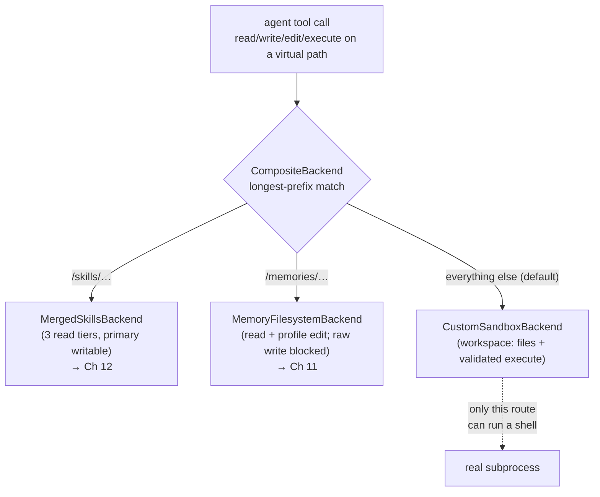

# Chapter 9 — Backends, the Sandbox, and Running Code Safely

> **This chapter answers:**
> - When the agent reads a file or runs a shell command, *where does the call actually go*, and how does `CompositeBackend` decide?
> - What is the **workspace sandbox**, what exactly does **dangerous mode** remove — and what does it never, under any flag, remove?
> - How is a shell command checked for safety, and why is the checker a hand-rolled, deliberately *incomplete* shell parser rather than a real one?
> - What is **PTC** and the **code interpreter**, and why is the `execute` tool pointedly kept out of them?

On the master diagram from Chapter 2, this chapter zooms into the region labelled **Backends / sandbox / code interpreter** — the layer that sits between the agent's tools and the real world of files and processes. Everything above it in the book has been about *deciding what to do*: the ReAct loop (Chapter 3), the deepagents framework and its middleware onion (Chapter 4), the provider layer that supplies the model (Chapter 8). This chapter is about *doing it safely*. When the model emits a tool call to `read_file`, `write_file`, or `execute`, that call does not touch your disk directly. It passes through a backend — the uniform file-and-shell interface you met at concept level in Chapter 4 — and, for anything that runs a shell, through a sandbox that rewrites, validates, and sometimes rejects the command before a single byte hits your filesystem. Getting this layer right is what separates "an agent that can help you run experiments" from "an agent that can `rm -rf` your home directory because the model hallucinated a path." We will build the picture from the top down: first the routing map, then the sandbox and what dangerous mode does to it, then the command validator up close, and finally the QuickJS code interpreter and the one deliberate hole in its capability list.

## 9.1 Recap: what a backend is, and why there are several

From Chapter 4 you already have the core idea, so this is a reminder, not a re-teaching. A **backend** (recall: the `BackendProtocol` — a uniform interface exposing `read` / `write` / `edit` / `ls` / `grep` / `glob` / `execute` / `download` / `upload`) is the object every file-and-shell tool runs against, *regardless of where the bytes actually live*. The agent's tools never call `open()` or `subprocess.run()` themselves; they call methods on a backend, and the backend decides what those methods mean. You also met **CompositeBackend**, deepagents' backend that routes each call to a different sub-backend by matching the path's prefix, and the **virtual filesystem** — the clean, `/`-rooted view of paths the agent sees, which a backend maps onto real storage underneath.

Why more than one backend? Because "a file" means different things in different parts of the agent's world. A file under `/memories/` is a memory note that must only be created through the memory tools, never by a raw write. A file under `/skills/` is a read-only capability package the agent may consult but not casually overwrite. A file in the working directory is scratch space the agent should be free to create, edit, and run. One flat filesystem cannot express those three different *policies*; a set of specialized backends, each enforcing its own rules, can. So EvoScientist defines a small class hierarchy of them, and stitches them together with `CompositeBackend`. Here is the whole hierarchy at a glance, before we look at any code:

```
BackendProtocol  (abstract interface — from deepagents)
├─ FilesystemBackend            real dir OR virtual root, files only, NO shell
│   ├─ ReadOnlyFilesystemBackend    write/edit/upload → error
│   └─ MemoryFilesystemBackend      raw write blocked; edit only under /profile/
├─ LocalShellBackend            FilesystemBackend + execute() runs real subprocesses
│   └─ CustomSandboxBackend         + command validation + path auto-correct + dangerous mode
│       └─ AutoskillProposalSandboxBackend   blocks raw writes, reroots /autoskill-proposals/
└─ MergedSkillsBackend          implements BackendProtocol directly: 3 read tiers, 1 writable
```

The split into two chains matters. `FilesystemBackend` and its subclasses can move files around but have *no* `execute` — they physically cannot run a shell command, which is exactly why they are safe to mount at `/memories/` and `/skills/`. Only the `LocalShellBackend` chain can run subprocesses, and `CustomSandboxBackend` is the subclass that wraps that power in EvoScientist's safety machinery. `MergedSkillsBackend` sits off to the side because it isn't a single storage location at all — it merges three skill directories (workspace, global, built-in) into one namespace, a story that belongs to Chapter 12; here it appears only as one of the routes on the composite.

## 9.2 The routing map: the whole backend architecture in ~40 lines

The place where these pieces come together is `_get_default_backend()` in `EvoScientist/EvoScientist.py:616-656`. It is worth reading as a single unit because it *is* the backend architecture — there is no larger, hidden assembly elsewhere. It builds three backends and hands them to one composite.

The workspace backend comes first:

```python
    ws_backend = CustomSandboxBackend(
        root_dir=workspace_dir,
        virtual_mode=True,
        timeout=cfg.sandbox_execute_timeout,
        dangerous=cfg.dangerous_mode,
    )
```
*(`EvoScientist/EvoScientist.py:635-640`)*

This is the backend that handles everything the agent does by default — reading and writing scratch files, running `python train.py`, calling `git`. It is rooted at `workspace_dir` (the working directory of the session), runs with `virtual_mode=True` so the agent sees clean `/`-rooted paths, and carries the `dangerous` flag straight from config. Note the timeout wiring: `cfg.sandbox_execute_timeout` becomes the default kill deadline for any command this backend runs. Then the two specialized routes:

```python
    sk_backend = MergedSkillsBackend(
        primary_dir=user_skills_dir,
        global_dir=global_skills_dir,
        secondary_dir=SKILLS_DIR,
    )
    mem_backend = MemoryFilesystemBackend(
        root_dir=memory_dir,
        virtual_mode=True,
    )
```
*(`EvoScientist/EvoScientist.py:641-649`)*

`sk_backend` is the three-tier skills merge (Chapter 12's subject), and `mem_backend` is the memory backend that permits reads and profile edits but blocks raw file creation, forcing observations to go through the memory tools (Chapter 11). Finally, the composite that ties them together:

```python
    return CompositeBackend(
        default=ws_backend,
        routes={
            "/skills/": sk_backend,
            "/memories/": mem_backend,
        },
    )
```
*(`EvoScientist/EvoScientist.py:650-656`)*

Read that as a routing table. When any tool touches a path, `CompositeBackend` finds the longest matching prefix among its routes and dispatches the call there; anything that matches no route falls through to `default`. So a call to `/memories/2026-07/note.md` lands on `mem_backend`, a call to `/skills/pdf/SKILL.md` lands on `sk_backend`, and a call to `/experiments/run.py` — matching neither — lands on the workspace sandbox. Three backends, three policies, one clean namespace.



One structural fact reads straight off this map and is easy to miss: **only the default route can run a shell command at all**, because only `CustomSandboxBackend` inherits `execute` from `LocalShellBackend`. The `/skills/` and `/memories/` backends are pure filesystem backends with no `execute` method. This is defense by construction — there is no path the agent can name under `/skills/` or `/memories/` that would run a subprocess, because those routes physically lack the capability. When we get to dangerous mode, hold onto this: even when the workspace opens up to the whole real filesystem, these two routes stay exactly as confined as they are now.

## 9.3 The workspace sandbox

Now zoom into the default route. The **sandbox** (also called the **workspace**) is the confined virtual `/` the agent operates in by default: every path the model uses is interpreted relative to one real workspace directory on disk, and the machinery around `CustomSandboxBackend` works hard to *keep* it that way even when the model tries — usually by accident — to escape.

Why would the model try to escape? Not maliciously, but out of habit. A model trained on millions of shell sessions has deeply learned that files live at absolute paths like `/Users/alice/project/train.py`. When it wants to run your training script, its instinct is to write the full absolute path it imagines. But in the sandbox, the *real* workspace might be at some session-specific directory the model has never been told about, and a bare `/Users/alice/...` either points nowhere or, worse, points at your actual home directory outside the workspace. So the sandbox has two jobs that pull in the same direction: **auto-correct** the model's habitual absolute-path mistakes back into the workspace, and **reject** anything that genuinely tries to reach outside it or do something catastrophic.

The auto-correction lives in `CustomSandboxBackend._resolve_path` (`EvoScientist/backends.py:1179-1229`), which intercepts every *file* operation — `read`, `write`, `edit`, `ls`, `grep`, `glob` — before it resolves to a real path. Its docstring enumerates the four mistakes it fixes:

```
      1. /Users/.../<cwd>/file.py      → /file.py (full cwd match — safest)
      2. /<ws_name>/file.py            → /file.py
      3. /Users/name/.../<ws_name>/f   → /f  (strip at LAST <ws_name>/)
      4. /Users/name/file.py           → /file.py (keep basename)
```
*(`EvoScientist/backends.py:1184-1187`)*

Each rule handles a flavour of the same error. If the model wrote the full working-directory path (`cwd_str`), the code strips it exactly (`EvoScientist/backends.py:1201-1204`) — the safest case, because the match is unambiguous. If the model wrote `/<ws_name>/file.py` — using the workspace *folder name* as if it were the root — that prefix is stripped (`:1207-1211`). And if the model wrote some other absolute system path, the code searches for the workspace-name marker with `rfind`, deliberately using *last*-occurrence search rather than first: as the comment at `:1216-1218` explains, the parent path itself might contain the workspace name as a substring, and the boundary we care about is the one nearest the file. If nothing matches, it falls back to the basename (`:1226`). The philosophy here is important and stated in the class docstring at `:1131`: *auto-correct common LLM path mistakes instead of crashing*. A stricter backend could simply error out on any absolute path; this one tries to guess the charitable interpretation, because a agent that fails a task over a path-formatting nit is a worse agent than one that quietly does what was obviously meant.

That handles *file* operations. Shell commands are harder, because a command is a string that can contain paths anywhere inside it — in arguments, inside quotes, buried in a `python -c "..."` snippet — and the same auto-correct-or-reject policy has to apply to all of them. That is the subject of the next two sections. But first, the flag that changes the rules.

## 9.4 Dangerous mode as defense-in-depth

Sometimes confinement is the wrong default. If you actually want the agent to operate on a real project living at a real path on your disk — editing files in `/Users/alice/bigproject`, not in a session-scoped scratch workspace — the whole virtual-workspace apparatus is in your way. For that, EvoScientist has **dangerous mode**: a single boolean that drops workspace confinement and lets the agent work on real absolute paths anywhere on disk. The name is a warning label, and this section is about reading that label precisely, because the interesting engineering is in what dangerous mode does *not* touch.

We will teach this as a design principle, in four beats: the intuition, the precise statement, where it lives in the code, and what breaks if you get it wrong.

**Intuition.** Think of the safety machinery as a series of gates, not one wall. Some gates enforce *where* the agent may go (stay inside the workspace); other gates enforce *what* the agent may never do (never `sudo`, never `rm -rf /`). Dangerous mode opens the location gates — it says "you may go anywhere" — while leaving the never-do gates fully shut. Removing one layer of protection does not remove all of them; that layering *is* the safety property, and it has a name.

**Precise statement.** Defense-in-depth means: no single control is trusted to be the whole defense, so weakening one leaves others intact. In EvoScientist, dangerous mode weakens exactly the path-confinement layer and *nothing else*. Concretely, when `dangerous=True`: `virtual_mode` is forced to `False`, path auto-correction is skipped, and the confinement checks (`..` traversal, `~/` and `cd /` patterns, absolute-system-path rejection) are all bypassed — **but** the catastrophic-pattern block (`rm -rf /`) and the privileged-command blocklist (`sudo`, `chmod`, `chown`, `mkfs`, `dd`, `shutdown`, `reboot`) are *always* enforced. And dangerous mode implies auto-approve, because a human who has already accepted real-filesystem risk gains nothing from being asked to confirm each step.

**Embodiments in the code.** Trace the boolean through the layers. At `CustomSandboxBackend.__init__` it forces off the virtual mode:

```python
        self._dangerous = dangerous
        if dangerous:
            # Real paths require the legacy (non-virtual) resolution path so the
            # parent backend returns absolute paths as-is.
            virtual_mode = False
```
*(`EvoScientist/backends.py:1161-1165`)*

In `_resolve_path`, the very first line short-circuits all auto-correction:

```python
        if self._dangerous:
            return super()._resolve_path(key)
```
*(`EvoScientist/backends.py:1192-1193`)*

In the command validator, the path-confinement checks are wrapped in `if not dangerous:` while the blocklist and destructive-pattern checks sit outside that guard — we will read that code in the next section. And the config layer couples in the auto-approve implication in `__post_init__`:

```python
        if self.dangerous_mode:
            self.auto_approve = True
```
*(`EvoScientist/config/settings.py:479-480`)*

That coupling lives in config, not in the CLI parser, so it holds no matter how dangerous mode got set — command-line flag, environment variable, or `config set` (the comment at `:476-478` says so explicitly). The last embodiment is the one from §9.2: the `/skills/` and `/memories/` routes are built with `virtual_mode=True` unconditionally in `_get_default_backend`, so *only the default `/` route* opens up. The comment at `EvoScientist/EvoScientist.py:633-634` states this directly — dangerous mode opens `/` to the real filesystem while skills and memories stay confined.

The clearest way to hold all this is a table of what changes versus what is invariant:

| Aspect | Default (confined) | Dangerous mode | Always, regardless |
|---|---|---|---|
| `virtual_mode` | `True` | forced `False` | — |
| Path auto-correction (`_resolve_path`) | on | skipped | — |
| `..` traversal / `~/` / `cd /` / absolute-path checks | enforced | skipped | — |
| `rm -rf /` and other `_DESTRUCTIVE_PATTERNS` | — | — | **always enforced** |
| `BLOCKED_COMMANDS` (`sudo`/`chmod`/`dd`/…) | — | — | **always enforced** |
| `/skills/`, `/memories/` routes | virtualized | virtualized | **always virtualized** |
| auto-approve | as configured | implied `True` | — |

**Violation — what breaks without the layering.** Suppose someone had implemented dangerous mode as a single master switch that disabled *all* validation — the natural, lazy reading of "dangerous means no checks." Then the first time the model, working on a real project, decided to "clean up" and emitted `sudo rm -rf /` (models do hallucinate destructive cleanup commands), the command would run against your real root filesystem with elevated privileges. The whole point of splitting the checks into location-gates and never-do-gates is that *the never-do-gates were never the thing you turned off*. Dangerous mode buys you reach; it does not buy you a foot-gun. That is defense-in-depth doing its job: the design refuses to make "let me work on real files" and "let me destroy the machine" the same choice.

## 9.5 Validating a shell command — and why the parser is intentionally partial

We reach the heart of the sandbox: the validator that decides whether a shell command is safe to run. Two things make this genuinely hard, and understanding them is the difference between reading `validate_command` as a pile of regexes and reading it as a considered design.

The first difficulty: **a shell command is not a list of paths — it is a tiny program**. `python train.py && ssh gpu-box 'cd /data && python eval.py' | tee /Users/alice/out.log` contains a local command, a remote command that runs on a *different machine* (where `/data` is perfectly legal), a pipe, and a local output path. A naive "reject any command containing `/Users/`" would wrongly block the remote command's paths, which aren't local at all. To do the right thing, the validator has to understand *enough* shell structure to tell these positions apart.

The second difficulty, and the key design decision: **the validator does not need to be a correct shell — it needs to be a conservative gatekeeper.** This is why the tokenizer is hand-rolled and deliberately incomplete. Its docstring says so outright:

```python
    """Tokenize enough shell syntax to find quoted SSH remote commands.

    This is intentionally small: it tracks words, quotes, and command
    separators, but does not try to be a full POSIX shell parser.
    """
```
*(`EvoScientist/backends.py:72-75`)*

Why not use Python's `shlex`, or a real POSIX parser? Because the goal is validation, not execution. A full parser's job is to reproduce the shell's exact semantics; a validator's job is only to find the *dangerous positions* — where an executable name sits, where an SSH remote command begins and ends, where an absolute local path appears as an operand. It needs to be *conservative* (never let a dangerous command through) but not *complete* (it may reject some exotic-but-safe command it can't parse, and that's an acceptable cost). A hand-rolled tokenizer that tracks words, quotes, and separators (`_shell_token_spans`, `EvoScientist/backends.py:71-158`) is small enough to audit line by line and can't be tricked by the corners of POSIX quoting that a re-used general parser might mishandle in ways nobody on the team fully understands. There is a tension here — a real parser would be more precise — and the design resolves it in favour of a small, auditable, conservative surface. When the thing you are protecting is the user's filesystem, "I understand exactly what this does" beats "it's more accurate but I'm not 100% sure of the edge cases."

With that framing, `validate_command` (`EvoScientist/backends.py:505-574`) reads cleanly. Its structure is: skip the location checks in dangerous mode, always run the catastrophe and blocklist checks, then run the absolute-path check unless dangerous. First the confinement layer:

```python
    # Path-confinement checks — skipped in dangerous mode.
    if not dangerous:
        # Check for '..' path traversal as a path component
        if _has_traversal_component(command):
            return (
                "Command blocked: contains '..' path traversal. ..."
            )

        for pattern in _PATH_PATTERNS:
            if re.search(pattern, command):
                return (...)
```
*(`EvoScientist/backends.py:527-543`)*

`_has_traversal_component` (`:403-410`) is careful in a way worth pausing on: it splits the command into tokens and checks whether `..` appears as an actual *path component* via `PurePosixPath(token).parts`, not as a substring. That distinction stops it from wrongly blocking a filename like `my..notes.txt` while still catching `../../etc`. The `_PATH_PATTERNS` (`:50-53`) are the `~/` and `cd /` escapes. Then the two checks that live *outside* the `if not dangerous` guard:

```python
    # Catastrophic patterns (e.g. `rm -rf /`) — always enforced.
    for pattern in _DESTRUCTIVE_PATTERNS:
        if re.search(pattern, command):
            return (...)

    # Check for dangerous commands (pipeline-aware) — always enforced.
    for base_cmd in _split_shell_commands(command):
        if base_cmd in BLOCKED_COMMANDS:
            return (
                f"Command blocked: '{base_cmd}' is not allowed in sandbox mode. ..."
            )
```
*(`EvoScientist/backends.py:545-560`)*

This is the invariant layer from §9.4, and note *how* the blocklist check works: it doesn't do a substring search for `"sudo"` (which would false-positive on `sudoku` or a file named `sudo.txt`). Instead `_split_shell_commands` (`:377-400`) uses the tokenizer to break the command at genuine command boundaries — `&&`, `||`, `;`, `|`, `&`, subshell parens, backticks — and collects the *first word of each segment*, i.e. the actual executable in each position. So `echo sudo` is fine (`sudo` is an argument, not the executable) but `foo && sudo rm` is caught (`sudo` is the executable of the second segment). This is exactly the "understand enough structure to find the dangerous position" principle in action. Finally, the absolute-system-path check, again gated on dangerous mode:

```python
    # Absolute-system-path check — skipped in dangerous mode.
    # Catches attacks like: python -c "os.remove('/Users/foo/file')"
    if not dangerous:
        escaped_paths = _extract_all_paths(command, allow_prefixes=allow_prefixes)
        if escaped_paths:
            path_sample = escaped_paths[0]
            return (...)
    return None
```
*(`EvoScientist/backends.py:562-574`)*

The comment names the threat model: a path smuggled *inside* a quoted `python -c` string, which no amount of argument inspection would catch, because to the outer shell it's just a string. `_extract_all_paths` (`:471-502`) scans the whole command with a regex for absolute paths under the system prefixes (`/Users`, `/home`, `/tmp`, `/etc`, …), *including inside quotes*, and returns any it finds. Two refinements make it precise rather than paranoid. It skips paths in *executable position* — `/usr/bin/python script.py` should not be blocked just because the interpreter lives at an absolute path — using `_collect_executable_positions` (`:413-450`) to find those offsets. And it honours an **allowlist** of prefixes via `_is_under_allowed_prefix` (`:453-468`): the skills and memories directories are real absolute paths on disk, so when a prepared command legitimately references them, they must be exempt from the system-path block. That helper is boundary-aware — it anchors on `/` so that `/A/skills_evil` does not sneak past the allowlist for `/A/skills` (the comment at `:456-458` calls out exactly this trap). A validator that got that boundary wrong would either leak (admit a look-alike directory) or nag (reject legitimate skill paths); getting it right is the difference between a gate and a sieve.

## 9.6 Preparing a command for execution: masking, rewriting, validating

`validate_command` is the judge, but something has to prepare the command before the judge sees it — rewriting the model's virtual paths into real ones, and carefully *not* rewriting the parts that must be left alone. That preparation is `prepare_sandbox_command` (`EvoScientist/backends.py:1073-1120`), and it is shared between `CustomSandboxBackend.execute` and the background-process tools precisely so both enforce *identical* rules (its docstring, `:1078-1080`, makes that sharing the whole point — you never want two code paths that disagree about what's safe). The order of operations is the interesting part, because each step exists to protect a later one.

It begins with SSH, the trickiest case:

```python
    ssh_error = _validate_ssh_remote_command_format(command)
    if ssh_error:
        return command, ssh_error

    command, ssh_replacements = _mask_ssh_remote_commands(command)
```
*(`EvoScientist/backends.py:1085-1089`)*

Recall the problem from §9.5: in `ssh gpu-box 'cd /data && python eval.py'`, the string `'cd /data ...'` runs on a *remote* machine, where `/data` is a legitimate absolute path that the local sandbox has no business rewriting or rejecting. So the code first *requires* the remote command to be a single quoted token (`_validate_ssh_remote_command_format`, `:358-374`) — a rule that makes the remote span unambiguous — then **masks** it: `_mask_ssh_remote_commands` (`:348-355`) replaces the remote span and the `ssh` executable token with unique placeholder strings, remembering the originals in `ssh_replacements`. For the rest of the pipeline the remote command simply isn't there; the local path logic can't touch it. At the very end (`:1120`) `_restore_spans` puts the originals back verbatim. This mask-process-restore sandwich is how the validator applies local rules to local text without corrupting remote text.

With SSH safely masked, the local rewrites run:

```python
    if not dangerous:
        ws = cwd_str + "/"
        if ws in command:
            command = command.replace(ws, "./")
    if virtual_mode:
        command = convert_virtual_paths_in_command(
            command=command,
            workspace_name=Path(cwd_str).name,
        )
```
*(`EvoScientist/backends.py:1098-1106`)*

Two rewrites, both skipped in dangerous mode (where the agent legitimately uses real absolute paths, and rewriting would corrupt an `echo` or `grep` argument that merely *contains* the cwd string — the comment at `:1094-1097` spells out that reasoning). First, a literal replacement of the absolute workspace root with `./`. Second, and more interesting, `convert_virtual_paths_in_command` (`:720-784`) — the command-level twin of `_resolve_path`'s auto-correction. It rewrites the model's virtual `/`-rooted paths into workspace-relative ones (`/experiments/run.py` → `./experiments/run.py`), resolves the special `/skills/` and `/memories/` mounts to their real locations, and fixes the same hallucinated-absolute-path mistakes. It also carries a scar from a real bug, fix #237, called out in its docstring at `:730-734`: a command like `python "/skills/my skill/main.py"` used to be truncated at the space inside the skill name, so the pre-processing step now rewrites such a quoted path as a *single* shell token. Only after all this rewriting does the prepared command go to `validate_command` with the skills/memory allowlist attached (`:1109-1117`), and if that returns an error, `prepare_sandbox_command` returns it and the caller must not run the command.

`CustomSandboxBackend.execute` (`EvoScientist/backends.py:1231-1274`) is then thin, as it should be — the safety is all upstream. It calls `prepare_sandbox_command`, bails out with the error as output if one comes back, delegates the actual subprocess to `LocalShellBackend.execute`, and adds one piece of polish: if the subprocess timed out (exit code 124), it rewrites the raw timeout into actionable recovery guidance — re-run with a bigger timeout, or background the process and keep the PID (`:1252-1272`). Even the recovery hint is dangerous-mode-aware: under confinement the suggested log path is `/output.log` (the virtual workspace root), but in dangerous mode it switches to the workspace-relative `./output.log` — precisely because there `/` is the *real* host root, so the advice must never tell the agent to write to `/` (`:1255-1257`). Small touches, but they are what make the sandbox feel like a helpful collaborator rather than a wall of rejections.

## 9.7 PTC and the code interpreter

There is one more way the agent can run code, and it is a different animal entirely. So far, "running code" has meant `execute` handing a shell command to a subprocess on your machine. The **code interpreter** is something else: a sandboxed **QuickJS** (a small, embeddable JavaScript engine) **REPL** — a read-eval-print loop, i.e. an interactive interpreter that evaluates code you feed it and returns the result — exposed to the model as a single tool called `code_interpreter`. The model doesn't get a raw shell; it gets a JavaScript scratchpad that runs *inside* the process, in a memory-safe sandbox, with no access to the host filesystem or network of its own. EvoScientist doesn't build this engine; it comes from `langchain-quickjs`, a pip dependency (not vendored into the repo), and EvoScientist subclasses its middleware to tune it. Why offer a JavaScript REPL at all when the agent already has Python-via-`execute`? Because of what you can wire *into* it — which is where PTC comes in.

**PTC** stands for *pass-through call*: an allowlist of the agent's own tools that are exposed as JavaScript-callable functions *inside* the REPL, so the model can invoke them from JS code. The point is batched fan-out. Normally each tool call costs a full model round-trip — the model emits one call, the runtime runs it, the result comes back, the model emits the next. If the model wants to kick off five async sub-agent tasks, that's five round-trips. But if `start_async_task` is a PTC tool, the model can write one snippet of JavaScript that does `Promise.all([...])` over all five and fires them off in a single turn. The docstring names this the killer use case (`EvoScientist/middleware/code_interpreter.py:93-97`): `Promise.all` over `start_async_task` fans out experiments, writing, and data-analysis in parallel without each dispatch costing a separate LLM round-trip. The allowlist itself is small and pointedly read-only-or-batchable:

```python
_DEFAULT_PTC_ALLOWLIST: list[str] = [
    # Memory lookup (read-only, should precede workspace inspection)
    "search_observations",
    "read_memory",
    # Async sub-agent dispatch (langgraph dev). `task` is excluded — see docstring.
    "start_async_task",
    "check_async_task",
    "update_async_task",
    "cancel_async_task",
    "list_async_tasks",
    # Workspace inspection (read-only, batchable)
    "read_file",
    "grep",
    "glob",
    "ls",
]
```
*(`EvoScientist/middleware/code_interpreter.py:98-113`)*

Every tool on that list is either a read (memory lookups, file inspection) or an async dispatch that benefits from fan-out. What's *not* on the list is the load-bearing decision. The module docstring enumerates the exclusions and their reasons (`:10-19`), and one of them is a genuine security boundary, not a mere optimization judgment:

```
    - ``execute`` (shell) — would bypass ``HumanInTheLoopMiddleware`` approval
```
*(`EvoScientist/middleware/code_interpreter.py:14`)*

Here is the reasoning, and it ties the whole chapter together. Recall from Chapter 1 and Chapter 7 the **HITL (human-in-the-loop)** mechanism: before a risky tool like `execute` actually runs, the agent pauses and asks a human to approve it. That pause is implemented as a middleware wrapping the tool call. But a PTC tool is called from *inside* the QuickJS REPL, as a JavaScript function — it does not travel back out through the normal tool-call path where the HITL middleware sits. So if `execute` were a PTC tool, the model could write `code_interpreter` JavaScript that calls `execute("rm -rf whatever")` and the shell command would run *without ever surfacing the approval prompt*. Every guarantee in this chapter — the validation, the confinement, the blocklist — still applies (the command still goes through `prepare_sandbox_command`), but the *human* checkpoint, the one Chapter 1 called EvoScientist's core stance, would be silently skipped. Excluding `execute` from PTC keeps the one door where a human can say "no" from having a side entrance. The other exclusions are lesser: `write_file`/`edit_file` are side-effectful with no batching benefit, `task` is reserved by the library as a top-level REPL global, and `tavily_search` only exists on a sub-agent — but `execute` is the one where the reason is "security," not "not worth it."

### 事故档案 / Origin story: the leaked REPL slots

> **背景 (Background).** Every QuickJS interpreter is a real resource: a `ThreadWorker` (a worker thread running the JS event loop) plus a QuickJS runtime, one per conversation `thread_id` that ever uses the code interpreter. The upstream `langchain-quickjs` middleware manages these in a registry and evicts each thread's slot in its `after_agent` hook — the lifecycle hook that fires when an agent turn finishes.
>
> **经过 (What happened).** Someone added a well-meaning optimization: a "conditional snapshot" gate that *skipped* the `after_agent` hook on turns where `code_interpreter` was never called, saving about 50 ms/turn of snapshot work. But `after_agent` did double duty — the same hook that took the snapshot also ran the upstream slot eviction (`finally: self._registry.evict(thread_id)`). Skipping the hook skipped the eviction. Meanwhile `before_agent` restores the REPL on every following turn via a get-or-create call. So the sequence "touched turn → skipped-because-untouched turn" left the slot *created but never evicted*.
>
> **代价 (Cost).** Every persistent `thread_id` that ever ran the code interpreter once and then had a quiet turn leaked one `ThreadWorker` plus one QuickJS runtime — permanently, and silently. On a long-lived server with many conversations, the worker threads and runtimes accumulate without bound.
>
> **机制化 (Mechanized).** The fix is stated as a rule right in the class docstring at `EvoScientist/middleware/code_interpreter.py:55-66`: `after_agent` / `aafter_agent` are *intentionally NOT overridden*, so the upstream eviction always runs. A regression test, `test_after_agent_evicts_slot_on_untouched_turn`, guards against anyone reintroducing the gate. The lesson generalizes: an optimization that skips a lifecycle hook inherits responsibility for *everything else that hook was doing* — and cleanup hidden inside a hook you skip does not clean up.

The `EvoCodeInterpreterMiddleware` subclass (`EvoScientist/middleware/code_interpreter.py:52-80`) is therefore small on purpose. Beyond declining to override `after_agent`, it does exactly two things: it appends a "prefer memory tools before the code interpreter" hint to the interpreter's prompt via `_prepare_for_call` (`:69-70`), nudging the model toward EvoScientist's memory-preflight habit (Chapter 11), and it adds an `aclose` method (`:72-80`) that evicts all live REPLs on their worker loops before event-loop shutdown, so a clean exit doesn't strand runtimes. Everything else — the QuickJS sandbox, the PTC wiring, the registry — is inherited from the library.

## 要点 / Takeaways

- **A backend is where file-and-shell tool calls actually go.** `_get_default_backend` (`EvoScientist/EvoScientist.py:616-656`) composes three of them into one namespace: `/skills/` (three-tier merge, Ch 12), `/memories/` (structured writes, Ch 11), and everything else on the workspace `CustomSandboxBackend`. `CompositeBackend` routes each call by longest path prefix.
- **Only the workspace route can run a shell.** The `/skills/` and `/memories/` backends are pure `FilesystemBackend`s with no `execute` — confinement by construction, not by policy.
- **The sandbox both auto-corrects and rejects.** `_resolve_path` charitably fixes the model's habitual absolute-path mistakes back into the workspace instead of crashing; `validate_command` rejects genuine escapes and catastrophes.
- **Dangerous mode is defense-in-depth, not an off switch.** It drops *location* confinement (virtual mode, path auto-correction, confinement checks) but *always* enforces the `rm -rf /` catastrophe pattern and the `BLOCKED_COMMANDS` blocklist (`sudo`/`chmod`/`dd`/…), always keeps `/skills/` and `/memories/` virtualized, and implies auto-approve.
- **The command validator is a hand-rolled *partial* shell parser on purpose.** Its job is conservative gatekeeping, not correct execution: understand enough structure to find the dangerous positions (executable slots, SSH remote spans, quoted paths), stay small enough to audit, and prefer rejecting an odd-but-safe command over admitting a dangerous one.
- **`prepare_sandbox_command` masks SSH remote commands, rewrites virtual paths, then validates** — a shared code path so `execute` and the background-process tools can never disagree about what's safe.
- **PTC exposes read-only/batchable tools as JavaScript-callable inside the QuickJS code interpreter** so the model can `Promise.all`-fan-out in one turn. `execute` is deliberately excluded because a PTC call bypasses the HITL approval middleware (Ch 7) — keeping the human's "no" from having a side entrance.

## Sources

*When this book and the code disagree, the code wins.* These are the files that own each topic in this chapter.

| Topic | Authoritative file(s) |
|---|---|
| Backend hierarchy, routing, sandbox, validator | `EvoScientist/backends.py` |
| Backend composition (`_get_default_backend`) | `EvoScientist/EvoScientist.py` (§ around :616) |
| `BLOCKED_COMMANDS`, destructive/path patterns | `EvoScientist/backends.py:50-68` |
| Hand-rolled tokenizer, SSH masking | `EvoScientist/backends.py:71-355` |
| `validate_command`, path extraction, allowlist | `EvoScientist/backends.py:453-574` |
| `prepare_sandbox_command`, `CustomSandboxBackend` | `EvoScientist/backends.py:1073-1274` |
| `MergedSkillsBackend`, `MemoryFilesystemBackend` | `EvoScientist/backends.py` (:822, :947) |
| Dangerous-mode config + auto-approve coupling | `EvoScientist/config/settings.py:417-480` |
| PTC allowlist, code interpreter, REPL-leak fix | `EvoScientist/middleware/code_interpreter.py` |
| QuickJS engine + base middleware | `langchain-quickjs` (pip dependency, not vendored) |
