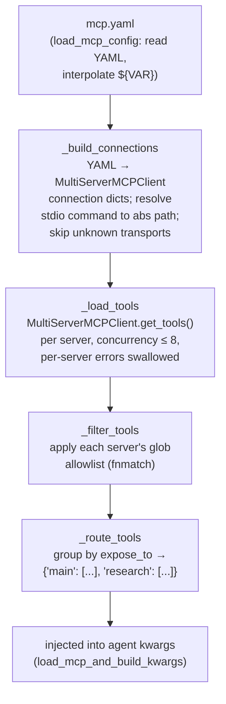

# Chapter 10 — Tools, MCP, and Configuration

> **This chapter answers:**
> - How are the agent's tools defined and registered — is there any auto-discovery, or is it all done by hand?
> - What is **MCP**, and how does EvoScientist connect to external tool servers and route their tools to the right agent?
> - How does a single setting actually resolve when a CLI flag, an environment variable, and a config file all disagree?
> - How is a slash command like `/model` defined once and dispatched identically across the CLI, the TUI, and chat channels?

On the master diagram from Chapter 2, three regions sit off to the side of the main model⇄tools loop, all tagged with this chapter's number: **tools**, **MCP**, and **config**. They are the *extensibility and configuration surface* — the places where a user, an operator, or a plugin author changes what the agent can do and how it behaves, without touching the agent's core reasoning loop. Chapter 5 showed you *how the config drives the build* (the lazy factory that assembles `create_deep_agent(**kwargs)`); this chapter is about the systems that feed it: where tools come from, how MCP smuggles in tools the codebase never wrote, how a setting travels from a YAML file or an env var into running code, and how the interactive `/`-commands that let you retune a live session are wired. None of this is exotic agent research. It is careful plumbing — and the care is the point, because this is the layer a user actually touches.

We'll go in the order a reader builds understanding, not the order files sit on disk: first the tools (the simplest surface, and a recap-and-extend of Chapter 3's `@tool`), then MCP (a new concept, taught from zero), then the config system (the resolution rules), and finally slash commands (which tie the previous three together — `/model`, `/mcp`, `/config` are all slash commands).

---

## 1. Tools: hand-assembled, not auto-discovered

You already met the `@tool` decorator in Chapter 3: it turns a plain Python function into something the agent can call, using the function's name, type hints, and docstring to build the JSON schema the model sees when it emits a **tool call** (a structured request asking the runtime to run a named function). What Chapter 3 didn't tell you is *how a tool goes from a decorated function to something the agent actually has*. There are two broad answers a framework can pick, and EvoScientist picks the un-magical one.

### 1.1 The design choice: no registry, no scan

Many agent and plugin frameworks use **auto-discovery**: you drop a file with a decorated function into a `tools/` directory, and at startup the framework walks the package, finds everything wearing the `@tool` decorator, and registers it automatically. It feels convenient — add a file, get a tool. But it has real costs: import order becomes load-bearing, a syntax error in one tool file can silently drop a tool from the roster, and it becomes genuinely hard to answer the question "what tools does the main agent have, exactly?" because the answer is scattered across whatever happened to be importable.

EvoScientist does the opposite. Every tool is a plain function you can point at, and the list of tools the agent gets is *written out by hand* in one place. There is no scan, no plugin registry, no decorator side-effect that adds a tool to a global list. If you want a tool in the roster, you put it in a Python list. This is the "configure, don't build" philosophy (Chapter 1, Chapter 2) applied to tools: the assembly is explicit, greppable, and boring — which is exactly what you want for the surface a user might extend.

### 1.2 Two real tools, walked

Before we look at the assembly, let's look at two of the tools themselves, because they teach two different things about what a tool *is* in this system.

The first is `think_tool`, and it is almost a joke — until you understand it. Here is the whole implementation, minus its enormous docstring (`EvoScientist/tools/think.py:6`):

```python
@tool(parse_docstring=True)
def think_tool(reflection: str) -> str:
    """Tool for structured reflection and strategic decision-making.
    ...
    """
    return f"Reflection recorded: {reflection}"
```

The function body does nothing. It takes a string and echoes it back with a prefix. There is no I/O, no computation, no state change. So why is it a tool at all? Because the *value of `think_tool` is entirely in its docstring and its existence*. `parse_docstring=True` — the same flag you saw in Chapter 3 — tells LangChain to parse that long structured docstring into the tool's description, the text the model reads when deciding whether to call it. When the model calls `think_tool("...")`, the act of producing that reflection *is* the work: it forces the model to spend a turn writing down what it knows, what the evidence quality is, whether a skill applies. The tool is a **no-op** (a function whose body has no effect) whose purpose is to carve out a deliberate space in the agent's trajectory for reasoning. The docstring at `think.py:14-49` is essentially a checklist — progress, evidence quality, skills leverage, strategy, handoff — that the model is nudged to walk through. This is a genuinely clever pattern: you can steer a model's behavior by giving it a *tool whose only effect is that the model had to think to call it*. Later chapters lean on this — `think_tool` is one of the handful of tools always kept visible even when the tool selector (Chapter 7) hides most others, and context editing (Chapter 7) is configured to never clear its results.

The second tool, `tavily_search`, is a real one — it reaches out to the network — and it teaches conditional registration. Its signature (`EvoScientist/tools/search.py:54`):

```python
@tool(parse_docstring=True)
async def tavily_search(
    query: str,
    max_results: Annotated[int, InjectedToolArg] = 3,
    topic: Annotated[
        Literal["general", "news", "finance"], InjectedToolArg
    ] = "general",
) -> str:
    """Search the web for information on a given query. ..."""
```

Two things worth noticing. First, `max_results` and `topic` are marked `InjectedToolArg` — a LangChain annotation meaning *this argument is filled in by the runtime, not by the model*. The model, reading the schema, only sees `query`; it never chooses `max_results`. This keeps the model's decision surface small (it just asks a question) while letting the code control the mechanics. Second, look at what the tool actually does when called (`search.py:74-92`): it runs the Tavily search in a background thread (`asyncio.to_thread`), then fetches the *full page content* of every result URL concurrently with `httpx` and converts each page to Markdown with `markdownify`. Tavily gives you URLs and snippets; EvoScientist wants the whole page as clean Markdown the model can read, so it does a second fan-out fetch itself. That is a deliberate quality choice — snippets are cheap but shallow; full pages cost more requests but give the research agent real material.

### 1.3 The assembly: `tool_registry` vs `base_tools`

Now the registration. Everything comes together in `_build_base_kwargs` (`EvoScientist/EvoScientist.py:493-525`), the helper Chapter 5 introduced as part of the lazy factory. The relevant lines:

```python
from .tools import skill_manager, tavily_search, think_tool
...
tool_registry = {"think_tool": think_tool}
if os.environ.get("TAVILY_API_KEY"):
    tool_registry["tavily_search"] = tavily_search
base_tools = [think_tool, skill_manager]
```

There is no scan here — the tools are *imported by name* and placed by hand. And there are two distinct collections, which is easy to blur but important to keep straight.

`base_tools` is a plain **list**: it is the tools the *main agent* gets, handed directly to `create_deep_agent(tools=...)` (you can see it become `"tools": list(base_tools)` at `EvoScientist.py:519`). The main agent gets `think_tool` and `skill_manager` (the multi-action tool that installs and lists skills — Chapter 12's territory). Notice `tavily_search` is *not* in `base_tools`: the main agent doesn't search the web itself. It delegates that to sub-agents.

`tool_registry` is a **dict** mapping tool *names* to tool objects. Its job is different: it is the lookup table used when a sub-agent's YAML file lists a tool by name. Recall from Chapter 6 that each sub-agent is defined in a `subagents/*.yaml` file that names the tools it wants as strings. The loader `load_subagents(SUBAGENTS_CONFIG, tool_registry=...)` (`EvoScientist.py:506`) resolves those string names against `tool_registry` to get the actual tool objects. So `tavily_search` lives in the registry (available to any sub-agent whose YAML asks for it, such as the research agent) but not in `base_tools` (not on the main agent).

And here is the conditional registration in action: `tavily_search` is only added to `tool_registry` if `TAVILY_API_KEY` is set in the environment (`EvoScientist.py:498`). No key, no search tool — the whole capability quietly disappears rather than failing at call time with an auth error. This is a recurring EvoScientist habit: *a capability that needs a credential is only offered if the credential exists.* It's the same shape as the config-drives-availability pattern you'll see throughout this chapter.

So, to answer the opening question directly: **there is no auto-discovery.** Tools are plain `@tool` functions, imported by name, and placed by hand into a main-agent list (`base_tools`) and a name→tool registry (`tool_registry`) that resolves sub-agent YAML. The only dynamism is the `if TAVILY_API_KEY` guard — and, as we'll see next, the tools that MCP injects at runtime.

---

## 2. MCP: plugging in tools the codebase never wrote

The tools we just saw are baked into the repo. But a research agent's usefulness is bounded by its tools, and no single codebase can ship every tool anyone might want — a GitHub tool, a Postgres query tool, a company's internal API tool. You could ask every user to fork the repo and add `@tool` functions, but that doesn't scale and doesn't compose. This is exactly the problem **MCP** was invented to solve.

### 2.1 What MCP is (from zero)

**MCP (Model Context Protocol)** is an open protocol — an agreed-upon wire format and handshake — for connecting an agent (the *client*) to an external *tool server* (a separate program that exposes a set of tools). Think of it as USB for agent tools. Instead of writing a bespoke integration for every external capability, you speak one protocol, and any server that also speaks that protocol plugs in. A server might run as a local subprocess you talk to over its standard input/output, or as a remote HTTP endpoint. Either way, when the client connects, it asks the server "what tools do you have?" and the server answers with a list of tool schemas — names, descriptions, argument types — in the same shape the model already understands.

The payoff is decoupling. The GitHub MCP server is written and maintained by whoever wrote it; EvoScientist never imports it, never sees its code, and doesn't need to. A user who wants GitHub tools points EvoScientist at that server, and its tools appear in the agent's roster alongside `think_tool` and `tavily_search`, indistinguishable to the model. MCP turns "add a tool" from "fork the codebase" into "edit a config file."

EvoScientist doesn't implement the MCP wire protocol itself — that would be a lot of low-level plumbing. It uses **langchain-mcp-adapters**, a pip dependency (an optional one — install it with `pip install langchain-mcp-adapters`) that speaks MCP and, crucially, converts the tools an MCP server exposes into ordinary LangChain tool objects — the same `BaseTool` type your `@tool` functions become. That conversion is the whole trick: once an MCP tool is a LangChain tool, the rest of EvoScientist can't tell it apart from a native one. It goes into the same lists, gets picked by the same tool selector, runs through the same middleware.

### 2.2 The config file: `mcp.yaml`

A user declares their MCP servers in `~/.config/evoscientist/mcp.yaml` (following the XDG convention — `XDG_CONFIG_HOME` overrides the default location; see `mcp/client.py:138-148`). Each entry names a server and describes how to reach it. A stdio server looks roughly like this (reconstructed from the fields the loader reads):

```yaml
github:
  transport: stdio
  command: npx
  args: ["-y", "@modelcontextprotocol/server-github"]
  env:
    GITHUB_TOKEN: ${GITHUB_TOKEN}
  tools: ["create_issue", "list_*"]
  expose_to: ["research"]
```

Five fields carry the design of this whole subsystem, so let's name each one:

- **`transport`** — how to talk to the server. The valid set is `{"stdio", "http", "streamable_http", "sse", "websocket"}` (`mcp/client.py:107`). `stdio` means "launch this as a subprocess and talk over its stdin/stdout"; the others are network transports (SSE = *server-sent events*, a one-way HTTP streaming format). stdio servers get a `command` + `args`; URL servers get a `url` + optional `headers`.
- **`env`** with `${VAR}` interpolation — environment variables passed to a stdio subprocess, where `${GITHUB_TOKEN}` is substituted from your actual environment at load time (`_interpolate_env`, `mcp/client.py:156-170`). This keeps secrets out of the YAML file: you reference the env var, you don't paste the token.
- **`tools`** — a *glob allowlist*. The strings here are matched against the server's tool names with shell-style wildcards (`*`, `?`, `[seq]`). `list_*` matches `list_issues`, `list_repos`, and so on. Omit `tools` entirely and *every* tool the server offers is allowed. This is your filter: a server might expose fifty tools when you only want three.
- **`expose_to`** — the *routing* target: which agent(s) get these tools. `"main"` sends them to the main agent; a sub-agent name (like `"research"`) sends them to that sub-agent. Default is `["main"]`. This is the feature that makes MCP fit EvoScientist's multi-agent shape — you don't just add a tool, you say *who* gets it.

### 2.3 The flow: from YAML to routed tools

Here is the whole pipeline in `mcp/client.py`, which you can read as a five-stage funnel. Read it top-to-bottom as data flowing from a config file to a `{agent → tools}` dictionary:



The public entry point is `load_mcp_tools()` (`mcp/client.py:837`), and its job is exactly the four numbered steps in its own docstring: load config, connect to each server, filter per allowlist, route to target agents. Let's walk the three interesting stages.

**Connecting, with two guardrails (`_load_tools`, `mcp/client.py:743`).** The loader builds a `MultiServerMCPClient` from langchain-mcp-adapters and calls `get_tools(server_name=name)` on each configured server. Two design decisions here are worth pausing on. First, concurrency is *capped* at 8:

```python
_MAX_CONCURRENT_CONNECTIONS = 8
...
sem = asyncio.Semaphore(_MAX_CONCURRENT_CONNECTIONS)
```

Why cap it? Because each stdio server is a *subprocess*. A user with twenty MCP servers configured would, without the cap, spawn twenty processes at once on startup — a spike of file descriptors and load. The semaphore (a counter that lets at most 8 tasks proceed at a time) keeps the common 3–7 server case fully parallel while protecting against a fleet (`mcp/client.py:112-115`). Second, per-server errors are *swallowed*:

```python
async def _fetch(name: str) -> tuple[str, list]:
    async with sem:
        _report("start", name)
        try:
            tools = await client.get_tools(server_name=name)
            ...
            return name, tools
        except Exception as exc:
            ...
            _report("error", name, str(exc))
            return name, []
```

If one server is down, misconfigured, or slow to the point of failing, `_fetch` returns an empty tool list for *that server only* (`mcp/client.py:785-802`) and the others still load. One broken server never takes down the whole agent — a small mercy that matters a lot when you're depending on someone else's server that you don't control. And the whole `load_mcp_tools` is itself wrapped so that a total failure returns an empty dict and the agent boots with just its native tools (`mcp/client.py:881-883`).

**Filtering (`_filter_tools`, `mcp/client.py:663`).** Once a server's tools are in hand, the allowlist applies. If the config gave no `tools` field (`allowed_names is None`), everything passes. Otherwise, the code takes a fast path when the patterns are plain names (a set-membership test) and only falls back to `fnmatch` — Python's shell-glob matcher — when a pattern actually contains a wildcard character:

```python
has_wildcards = any(
    any(char in pattern for char in "*?[]") for pattern in allowed_names
)
if not has_wildcards:
    allowed_set = set(allowed_names)
    return [t for t in tools if t.name in allowed_set]
```

This is a small performance nicety, but it also tells you the intended usage: most allowlists are exact names, and globs are the escape hatch for "give me the whole `list_*` family."

**Routing (`_route_tools`, `mcp/client.py:700`).** The last stage is the one that makes MCP a first-class citizen of a multi-agent system. It reads each server's `expose_to` and builds a dictionary keyed by agent name:

```python
expose_to = server_cfg.get("expose_to", ["main"])
if isinstance(expose_to, str):
    expose_to = [expose_to]
for agent_name in expose_to:
    by_agent.setdefault(agent_name, []).extend(filtered)
```

The result is a `dict[str, list]` like `{"main": [...], "research": [...]}`. The special key `"main"` targets the main EvoScientist agent; every other key is a sub-agent name. Note the tolerance in that first line: `expose_to` may be a bare string or a list, and the code normalizes to a list — a small kindness so a user who writes `expose_to: research` (no brackets) isn't punished. Also note the default: no `expose_to` means `["main"]`, so the simplest MCP config — just a server, no routing — gives its tools to the main agent, which is the least-surprising behavior.

Back in `EvoScientist.py`, `load_mcp_and_build_kwargs` (`EvoScientist.py:528`) consumes that dictionary. It pops `"main"` into the main agent's tool list (`"tools": base_tools + mcp_main`, `EvoScientist.py:602`) and injects the rest into the matching sub-agents by name:

```python
for sa in subs:
    if sa_tools := mcp_by_agent.get(sa["name"], []):
        sa.setdefault("tools", []).extend(sa_tools)
```

By the time `create_deep_agent` is called, an MCP tool is just another tool in a list, sitting next to `think_tool`.

### 2.4 Caching by config signature

There's one more design detail worth surfacing, because it echoes a pattern Chapter 5 taught. Connecting to MCP servers is *expensive* — it spawns subprocesses and does network round-trips. But EvoScientist rebuilds the agent fairly often: every `/new`, every `/resume`, every `/model` switch builds a fresh `create_cli_agent`. If each rebuild reconnected to every MCP server, interactive commands would stall for seconds each time.

So MCP tools are cached, keyed by a *signature of the config*: `_load_mcp_tools_cached` (`EvoScientist.py:249`) compares and replays against a signature computed in the helper `_load_mcp_config_once` (`EvoScientist.py:243`). The signature is just the MCP config serialized deterministically:

```python
sig = json.dumps(cfg, sort_keys=True, ensure_ascii=True)
```

If the signature matches the last one seen, the cached tools are replayed (a shallow copy, so callers can't corrupt the cache) and no reconnection happens (`EvoScientist.py:267-268`). The servers are contacted again *only* when `mcp.yaml` actually changes. This is the same "cache by a signature of the inputs, recompute only on change" idea Chapter 5 used for the lazy agent build — here applied to an even more expensive operation. It's why `/mcp add` (which we'll meet in §4) needs a fresh session to take effect: it mutates `mcp.yaml`, which changes the signature, which the *next* agent build notices.

---

## 3. Configuration: how a setting reaches running code

We've now seen two subsystems whose behavior hinges on config — `tavily_search` appears only if `TAVILY_API_KEY` is set; MCP loads only if `mcp.yaml` exists. It's time to look at the config system itself. This is a different thing from Chapter 5's "how config drives the build." There, config was an input to the agent factory. Here, we ask the more basic question: *when the CLI, an environment variable, and a config file all have an opinion about the model, which one wins — and how does that decision get made?*

### 3.1 The shape: one dataclass, one file

All of EvoScientist's settings live in one place: the `EvoScientistConfig` dataclass (`config/settings.py:137`). A **dataclass** is a Python class whose fields are declared as typed attributes with defaults; `EvoScientistConfig` has over a hundred of them. You can see the flavor at `settings.py:156-183` — API keys for every provider (`anthropic_api_key`, `openai_api_key`, …), the default `provider` and `model`, the `auxiliary_model` (the cheaper model for background work — Chapter 5), ports, feature toggles like `enable_scheduler` and `dangerous_mode`, and per-channel settings. Every field has a default, so an `EvoScientistConfig()` with no arguments is a complete, valid config.

On disk, this dataclass is stored as `~/.config/evoscientist/config.yaml` (`get_config_path`, `settings.py:117`). Because that file holds API keys, `save_config` takes care with permissions (`settings.py:564-591`):

```python
config_path.parent.chmod(0o700)
...
config_path.chmod(0o600)
```

`0o600` means "readable and writable by the owner only" — no group, no world access; `0o700` is the same for the directory. This is Unix-standard hygiene for a file with secrets in it: even on a shared machine, another user can't read your keys. (The `chmod` calls are wrapped in `try/except OSError` because some filesystems — Windows, network mounts — don't honor Unix permission bits, and a config save shouldn't crash over that.)

### 3.2 The precedence ladder: CLI > env > file > defaults

Now the central question. A setting can come from four sources, and they are ranked. The ranking is stated verbatim in the docstring of `get_effective_config` (`settings.py:815-825`):

```
Priority (highest to lowest):
    1. CLI arguments (cli_overrides)
    2. Environment variables
    3. Config file
    4. Defaults
```

Read this as a ladder, top rung wins:

```
   ┌──────────────────────────────┐
   │ 1. CLI flag   (--model X)     │  highest — an explicit command wins
   ├──────────────────────────────┤
   │ 2. Env var    (EVOSCIENTIST_…)│  overrides the file for this shell
   ├──────────────────────────────┤
   │ 3. Config file (config.yaml)  │  your persisted preference
   ├──────────────────────────────┤
   │ 4. Dataclass defaults         │  lowest — the fallback if nothing set
   └──────────────────────────────┘
```

The intuition is a hierarchy of *specificity and intent*. Defaults are what the maintainers think is sane. Your config file is your persisted preference. An environment variable is more immediate — it's set for *this shell, this run* — so it overrides the file. And a CLI flag is the most explicit thing of all: you typed it on this exact command, so it beats everything. The rule is "the more deliberately and recently you expressed a preference, the more it wins." Get this ordering wrong and you'd get maddening bugs: a `--model` flag that silently loses to a stale config file, or an env var you can't override on the command line.

The implementation is a three-layer overlay, and it reads exactly like the ladder (`settings.py:832-859`):

```python
load_dotenv(find_dotenv(usecwd=True), override=True)

# Start with file config (includes defaults for missing values)
config = load_config()
data = _config_to_dict(config)

# Apply environment variable overrides
for config_key, env_key in _ENV_MAPPINGS.items():
    env_value = os.environ.get(env_key)
    if env_value:
        ...
        data[config_key] = _coerce_value(env_value, ...)

# Apply CLI overrides (highest priority)
if cli_overrides:
    for key, value in cli_overrides.items():
        if value is not None and key in data:
            data[key] = value

return EvoScientistConfig(**data)
```

Walk it as three writes to one dict. `load_config()` gives you the *file* values (and, for any field the file omits, the dataclass *default*) — that's rungs 3 and 4 in one shot. Then the env loop *overwrites* any key whose env var is set — that's rung 2 stomping on 3. Then the CLI loop overwrites again — rung 1 stomping on everything. Because each layer writes into the same `data` dict, later writes simply win; the precedence *is* the write order. The final `EvoScientistConfig(**data)` materializes the merged result. Two small robustness notes: the env loop only fires `if env_value` (an *empty* env var doesn't count as "set", so `FOO=` won't blank out your config), and the CLI loop only fires `if value is not None` (an unset CLI flag is `None` and skips, so absent flags don't clobber anything).

### 3.3 The env-var bridge: `_ENV_MAPPINGS`

How does the env loop know that the `model_fallbacks` field is controlled by the `EVOSCIENTIST_MODEL_FALLBACKS` environment variable? Through an explicit table, `_ENV_MAPPINGS` (`settings.py:750-812`), mapping each config field name to its environment variable name:

```python
_ENV_MAPPINGS = {
    "anthropic_api_key": "ANTHROPIC_API_KEY",
    ...
    "model_fallbacks": "EVOSCIENTIST_MODEL_FALLBACKS",
    "auxiliary_model": "EVOSCIENTIST_AUXILIARY_MODEL",
    "dangerous_mode": "EVOSCIENTIST_DANGEROUS_MODE",
    ...
}
```

The table has a small but telling naming convention. Provider keys use their *standard* names — `ANTHROPIC_API_KEY`, `OPENAI_API_KEY`, `TAVILY_API_KEY` — the exact names the underlying SDKs (langchain-anthropic, the Tavily client) already read. That's deliberate: it means a user who already has `ANTHROPIC_API_KEY` exported for other tools gets it picked up for free. EvoScientist's *own* settings, by contrast, are namespaced `EVOSCIENTIST_*` to avoid colliding with anything else in your environment. It's the same file, two naming worlds, bridged by this one dict.

There's a subtlety about `.env` files worth calling out. The first line of `get_effective_config` is `load_dotenv(find_dotenv(usecwd=True), override=True)` — it loads a `.env` file from the current directory into the process environment, with `override=True` meaning `.env` values *replace* existing environment variables. So a project-local `.env` participates in the "env var" rung of the ladder, and does so forcefully. This lets you keep per-project settings (a different model for one research project) in a `.env` beside your work.

### 3.4 `apply_config_to_env`: pushing keys back out, but gently

There's a reverse direction too. The config file is the *source of truth* for API keys, but the SDKs that actually make network calls (langchain-anthropic, langchain-openai, the Tavily client) don't read EvoScientist's config — they read environment variables. So EvoScientist has to *push* keys from the config back into `os.environ`. That's `apply_config_to_env` (`settings.py:862`), and its one interesting design choice is in its every line:

```python
if config.anthropic_api_key and not os.environ.get("ANTHROPIC_API_KEY"):
    os.environ["ANTHROPIC_API_KEY"] = config.anthropic_api_key
```

The key is set from config *only if it isn't already in the environment*. Read that guard carefully, because it is what keeps the precedence ladder honest even on this reverse path. If you've explicitly exported `ANTHROPIC_API_KEY` in your shell (rung 2 of the ladder), this function will *not* overwrite it with the file value (rung 3). The explicit env var always wins — exactly as the precedence rule promised. Without the `and not os.environ.get(...)` guard, pushing the file's key would silently clobber your deliberately-set env var, quietly inverting the precedence. The whole function is that same conditional, repeated once per key.

### 3.5 A note on the onboarding wizard

One last config touch-point ties back to Chapter 5's lazy-loading philosophy. First-run setup — asking the user for an API key, picking a model — is handled by a wizard in `config/onboard/`. That wizard is *lazily imported*: the `config` package's `__getattr__` only pulls in `run_onboard` when someone actually accesses it (`config/__init__.py:53-57`):

```python
def __getattr__(name: str):
    if name == "run_onboard":
        from .onboard import run_onboard
        return run_onboard
    raise AttributeError(...)
```

This is the PEP 562 module-`__getattr__` trick from Chapter 5, applied here so that the (relatively heavy) onboarding machinery — prompts, model listings, interactive widgets — never loads unless someone runs `EvoSci onboard`. Every fast path (`EvoSci config list`, `--help`) skips it entirely. The wizard is a feature you pay for only when you use it.

---

## 4. Slash commands: one definition, three surfaces

The final piece of the extensibility surface is the one a user touches most while a session is *running*: **slash commands**. A **slash command** is a user control message — text like `/model`, `/mcp add`, `/new` — that is parsed and handled *separately from prompt text*. When you type `/model claude-opus-4` into the CLI, that isn't a message to the agent; it's a command to the *session*, telling it to swap the model. The leading `/` is the discriminator: input starting with `/` is a command, everything else is a prompt for the agent.

This section ties the whole chapter together, because the flagship commands *are* the subsystems we just covered: `/model` retunes the config, `/mcp` mutates `mcp.yaml`, `/config` edits settings. There are about 18 commands across roughly a dozen implementation files; we'll teach the machinery through one — `/model` — and trust you to read the rest by analogy.

### 4.1 The problem: three surfaces, one behavior

EvoScientist runs from three interactive front-ends (all covered in depth in Chapter 15): the plain **CLI**, the richer **TUI** (a full-screen terminal app), and **channels** (chat platforms like Telegram and Slack). A command like `/model` has to work *identically* from all three. You do not want three copies of the "switch the model" logic drifting apart. So the design goal is: define a command once, dispatch it the same way everywhere.

The solution is a classic one — an abstract base class plus a registry — with one twist that makes it work across surfaces: a **context object** that carries everything a command might need, so the command never reaches out to a specific UI.

### 4.2 The `Command` ABC and the `CommandContext`

Every command subclasses the `Command` abstract base class (`commands/base.py:100`). Its contract is small (`base.py:100-158`): declarative metadata — `name` (like `"/model"`), optional `alias` list, `description`, `subcommands`, and a `requires_agent` flag — plus one abstract method every command must implement:

```python
@abstractmethod
async def execute(self, ctx: CommandContext, args: list[str]) -> None:
    """Execute the command with given context and arguments."""
```

The `requires_agent` flag deserves a note: it's `False` by default, and its comment (`base.py:109-113`) explains why that matters — recovery commands like `/mcp add` must be runnable *even when the agent load is failing*, so they mustn't block waiting for an agent that may never arrive. This is defensive design: if a broken MCP server is hanging your agent build, you can still `/mcp remove` it.

The `execute` method receives a `CommandContext` (`base.py:82-97`), and this dataclass is the linchpin of cross-surface uniformity. It bundles everything a command could plausibly want:

```python
@dataclass
class CommandContext:
    agent: Any
    thread_id: str
    ui: CommandUI
    workspace_dir: str | None = None
    checkpointer: Any = None
    config: Any = None
    channel_runtime: ChannelRuntime | None = None
    graph_gateway: GraphGateway | None = None
    ...
```

The critical field is `ui`, typed as `CommandUI` — and `CommandUI` is a **Protocol** (`base.py:30-63`), Python's structural-typing interface: any object with the right methods *is* a `CommandUI`, no inheritance required. It declares the UI operations a command may perform — `append_system(text)` to print a status line, `wait_for_model_pick(...)` to open an interactive picker, `supports_interactive` to ask whether a picker is even possible. Each of the three surfaces provides its *own* object satisfying this Protocol: the TUI's is a full Textual widget stack, the plain CLI's is a simpler Rich renderer, a channel's routes text back to Telegram. The command doesn't know or care which — it calls `ctx.ui.append_system(...)` and the right thing happens on whatever surface it's running. `graph_gateway` (the seam over local-or-remote graph execution, Chapter 15) is threaded through the same way, so a command can rebuild the agent without importing any surface-specific code. This is dependency injection: the command declares *what it needs* via a Protocol, and each surface *supplies* a conforming implementation.

### 4.3 Registration by import side-effect

How does a command become known to the system? Not by scan — by *self-registration at import time*, the same explicit style as tools. At the bottom of `model.py`, one line (`commands/implementation/model.py:210`):

```python
manager.register(ModelCommand())
```

`manager` is a single global `CommandManager` instance (`commands/manager.py:121`). Importing `model.py` runs that line as a side effect, registering the command. And `commands/implementation/__init__.py` imports every implementation module (`from . import autoskills, channel, general, mcp, model, ...`), so importing the package registers *all* commands at once. `CommandManager.register` (`manager.py:17-24`) stores the command under its name and every alias, normalizing to a leading `/`:

```python
def register(self, command: Command) -> None:
    names = [command.name, *command.alias]
    for name in names:
        name = name.lower()
        if not name.startswith("/"):
            name = f"/{name}"
        self._commands[name] = command
```

It's a plain dict from `/name` to the command object. No magic, greppable — you can point at exactly where `/model` gets registered.

### 4.4 Dispatch, identical everywhere

Dispatch lives in `CommandManager.execute` (`manager.py:82`). It takes the raw input string, splits it with `shlex` (Python's shell-style tokenizer, so quoted arguments survive), looks up the command by the first token, and awaits it:

```python
parts = shlex.split(command_str)
...
cmd_name = parts[0].lower()
args = parts[1:]
cmd = self.get_command(cmd_name)
if not cmd:
    return False
...
await cmd.execute(ctx, args)
await ctx.ui.flush()
return True
```

The `try/except` around `cmd.execute` (`manager.py:108-117`) turns any command exception into a red status line rather than a crash — a mistyped command shouldn't kill your session. It returns `True` if a command ran and `False` if the input wasn't a recognized command (in which case the caller treats it as a prompt for the agent).

Here is the payoff for all that Protocol discipline: **every surface calls the same `execute`.** The plain CLI dispatches at `cli/interactive.py:1333`, the TUI at `cli/tui_interactive.py:3096`, and channels at `cli/channel.py:437` — three call sites, one method, all `await cmd_manager.execute(...)`. Each builds a `CommandContext` with its own `ui` implementation and hands it to the *same* manager running the *same* command objects. The command logic exists exactly once.

### 4.5 `/model`, the build-verify-commit pattern

Finally, let's read `ModelCommand.execute` (`commands/implementation/model.py:68`), because it's the best small illustration of a discipline Chapter 5 introduced and this command depends on. Switching the model at runtime is dangerous: what if the new model name is bad, or its provider isn't configured? You must not leave the session half-switched — on a broken model with no way back.

The core of the switch is `_apply_model` (`model.py:125-207`), and it follows a **build-verify-commit** shape. First it builds a *temporary* config, a copy with only the model and provider changed:

```python
temp_cfg = copy.copy(cfg)
temp_cfg.model = model_name
temp_cfg.provider = provider
```

Then it tries to build a whole new agent on that temp config — and this is where Chapter 5's "pure path" pays off:

```python
try:
    new_chat_model = _build_chat_model(temp_cfg)
    new_agent = _load_agent(
        workspace_dir=ctx.workspace_dir,
        checkpointer=ctx.checkpointer,
        config=temp_cfg,
        chat_model=new_chat_model,
        events=events,
    )
except Exception as e:
    ctx.ui.append_system(f"Failed to switch model: {e}", style="red")
    return
```

The comment above it (`model.py:145-149`) spells out the load-bearing property: `create_cli_agent(config=..., chat_model=...)` is *pure* — passing both an explicit config and chat model touches *none* of the cached module globals. So this verification build has no side effects. If the new model is bad, the build raises, the `except` prints a red error, the function returns — and the session is *untouched*, still on the working model. No snapshot, no rollback, no restore needed, because nothing was mutated to begin with. This is the "test-before-commit" split Chapter 5 promised the `/model` command would demonstrate.

Only *after* a successful build does the code commit, and it does so atomically with pure assignments that cannot fail (`model.py:181-185`):

```python
cfg.model = model_name
cfg.provider = provider
set_active_config(cfg)
set_chat_model_instance(new_chat_model, (model_name, provider))
ctx.agent = new_agent
```

Build a candidate off to the side, verify it fully, and only then — with operations that can't throw — make it live. If anything can fail, it fails *before* touching the running session. That is the discipline that lets you retune a live agent without fear of bricking it, and it's the reason `/model` is safe to run mid-research.

---

## 5. 要点 / Takeaways

- **Tools are hand-assembled, not auto-discovered.** Every tool is a plain `@tool` function, imported by name and placed into `base_tools` (a list — the main agent's tools) or `tool_registry` (a name→tool dict that resolves sub-agent YAML). The only dynamism is credential-gated registration (`tavily_search` only if `TAVILY_API_KEY` is set) and MCP injection.
- **`think_tool` is a no-op whose value is its docstring.** It does nothing but echo its input; its purpose is to force the model to spend a turn reflecting. A tool can shape behavior purely by existing.
- **MCP (Model Context Protocol) plugs external tool servers into the agent** over stdio or HTTP, via the `langchain-mcp-adapters` pip dependency that converts MCP tools into ordinary LangChain tools. Users declare servers in `~/.config/evoscientist/mcp.yaml` with `transport`, `command`/`url`, a glob `tools` allowlist, and `expose_to` routing.
- **The MCP pipeline is a five-stage funnel:** load config → build connections → load tools (concurrency ≤ 8, per-server errors swallowed) → filter by glob allowlist → route by `expose_to` into `{"main": [...], sub-agent: [...]}`. It's cached by a JSON signature of the config, so servers are re-contacted only when `mcp.yaml` changes.
- **Config precedence is CLI > env > file > defaults**, implemented as three successive overwrites of one dict in `get_effective_config` — later writes win, so the write order *is* the precedence. `_ENV_MAPPINGS` bridges config fields to env-var names (provider keys use standard names, EvoScientist settings use `EVOSCIENTIST_*`), and `apply_config_to_env` pushes keys to the environment *only if unset*, so an explicit env var always beats the file.
- **Config lives in one `EvoScientistConfig` dataclass** (100+ fields, all defaulted), stored as `config.yaml` with `0o600` permissions because it holds API keys. The onboarding wizard is lazily imported so fast commands never pay for it.
- **Slash commands are a `Command` ABC + a global `CommandManager` registry, self-registered at import.** A `CommandContext` carries `agent`, `graph_gateway`, and a `CommandUI` *Protocol* so one command runs identically across CLI, TUI, and channels — all three dispatch through the same `cmd_manager.execute`.
- **`/model` demonstrates build-verify-commit:** build a candidate agent on a temporary config via the *pure* `create_cli_agent` path, verify it fully, and only commit with assignments that can't fail — so a bad model switch leaves the live session untouched.

## 6. Sources

*When this book and the code disagree, the code wins.* These are the authoritative files for each topic.

| Topic | File(s) |
|---|---|
| `think_tool` (no-op reflection) | `EvoScientist/tools/think.py` |
| `tavily_search` (Tavily + page-fetch) | `EvoScientist/tools/search.py` |
| Tool assembly (`base_tools` vs `tool_registry`) | `EvoScientist/EvoScientist.py:493-525` |
| MCP client (connect / filter / route) | `EvoScientist/mcp/client.py` |
| MCP config CRUD (`add`/`edit`/`remove`) | `EvoScientist/mcp/client.py:214-315` |
| MCP tool injection into agent kwargs | `EvoScientist/EvoScientist.py:528-608` |
| MCP caching by config signature | `EvoScientist/EvoScientist.py:235-273` |
| `EvoScientistConfig` dataclass | `EvoScientist/config/settings.py:137` |
| Config precedence (`get_effective_config`) | `EvoScientist/config/settings.py:815-859` |
| Env-var mapping table | `EvoScientist/config/settings.py:750-812` |
| `apply_config_to_env` (set-if-unset) | `EvoScientist/config/settings.py:862` |
| Config storage + permissions | `EvoScientist/config/settings.py:106-119, 564-591` |
| Onboarding wizard (lazy import) | `EvoScientist/config/__init__.py:53-58` |
| Command ABC + `CommandContext` + `CommandUI` | `EvoScientist/commands/base.py` |
| Command registry + dispatch | `EvoScientist/commands/manager.py` |
| `/model` (build-verify-commit) | `EvoScientist/commands/implementation/model.py` |
| Cross-surface dispatch call sites | `EvoScientist/cli/{interactive.py:1333, tui_interactive.py:3096, channel.py:437}` |
