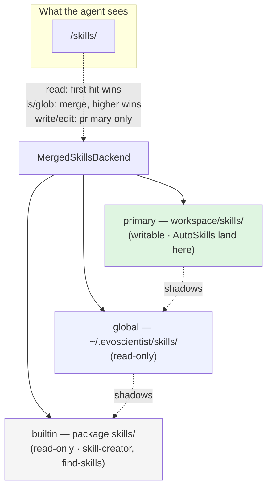
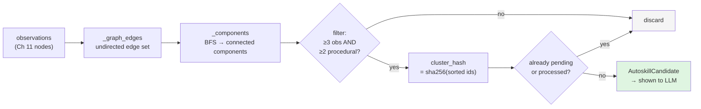

# Chapter 12 — AutoSkills: Mining New Skills from Memory

> **This chapter answers:**
> - What is a *skill*, concretely — and how are skills layered so a workspace skill can override a built-in one?
> - How does the agent *invent* a new skill — where do candidates even come from?
> - Why are AutoSkill candidates literally "connected components of the observation graph," and why a plain graph algorithm instead of asking an LLM to cluster?
> - Who approves a proposed skill before it becomes something the agent can actually use?

Chapter 11 taught you how EvoScientist *remembers*: every finished turn is distilled into observations (atomic Markdown notes with a content-hash id), and a background linker stitches them into a knowledge graph whose edges — `complements`, `contradicts`, `supersedes` — live distributed across each file's YAML frontmatter. That graph grows quietly, session after session. But a growing pile of notes is not yet a *self-evolving scientist*. Notes tell the agent what it once learned; they do not change what it can *do*. This chapter closes that loop. It zooms into the **Skills + AutoSkills** region of the master diagram (Chapter 2) — the last major region of the machine — and shows how EvoScientist mines the observation graph into new, reusable capabilities.

This is the second of the book's two "differentiator" chapters (Chapter 11 was the first). Chapter 1 promised that EvoScientist is *self-evolving*: its memory accumulates *and* its skill catalog grows, both under human review. Chapter 11 delivered the first half. Here we deliver the second and, in doing so, snap the two halves together into a single feedback loop: a turn becomes observations, observations become a graph, a cluster in the graph becomes a *proposed skill*, a human approves it, and the approved skill is mounted back into the agent's filesystem — where the next turn can use it. By the end of this chapter you will have seen every stage of that loop in real code, and you'll understand a small but sharp design lesson buried inside it: *when to reach for a classical algorithm and when to reach for an LLM.*

We build in three movements. First, **what a skill is** — the on-disk artifact and its conventions. Second, **how skills are layered and mounted** — three tiers merged into one virtual namespace, so your workspace can shadow the built-ins. Third, **AutoSkills itself** — how the observation graph is mined into skill proposals, and the human gate that stands between a proposal and a real skill.

---

## 1. What is a skill?

Start with intuition. Chapter 1 named a *skill* as a "packaged capability" and left the mechanism to this chapter. Here is the mechanism, and it is refreshingly humble: **a skill is a directory containing a file called `SKILL.md`.** There is no plugin API, no registration hook, no compiled artifact. A skill is a folder you can `cat`, `git diff`, and email to a colleague.

The `SKILL.md` file has two parts. The top is **YAML frontmatter** (metadata fenced between `---` lines at the top of a Markdown file) carrying exactly two required fields: `name` and `description`. The rest is ordinary Markdown: instructions written *for the agent* on how to perform some task. Optionally, alongside `SKILL.md`, the directory may hold `scripts/` (executable code the agent can run), `references/` (docs the agent loads only when needed), and `assets/` (files used in the output, like templates). This is the "**Claude Skills**" convention — a small open format for teaching an agent a specialized workflow by dropping a folder into its filesystem.

Let's read a real one. EvoScientist ships a handful of built-in skills; the most self-describing is `skill-creator`, the skill for *writing skills*. Its own `SKILL.md` opens like this (`EvoScientist/skills/skill-creator/SKILL.md:1-4`):

```yaml
---
name: skill-creator
description: Create new skills, modify and improve existing skills, and measure skill performance. Use when users want to create a skill from scratch, update or optimize an existing skill, run evals to test a skill, benchmark skill performance with variance analysis, or optimize a skill's description for better triggering accuracy.
---
```

Notice how much work the `description` is doing. It is not a one-liner label — it is a paragraph that says both *what the skill does* and, crucially, *when to use it*. That is deliberate, and the same file explains why in a section it aptly titles "Progressive Disclosure" (`skill-creator/SKILL.md:118-124`):

```markdown
Skills use a three-level loading system to manage context efficiently:

1. **Metadata (name + description)** - Always in context (~100 words)
2. **SKILL.md body** - When skill triggers (<500 lines ideal)
3. **Bundled resources** - As needed (unlimited, scripts can execute without loading)
```

This is the load-bearing idea behind the whole skills format, so let it land. The agent's system prompt (Chapter 5) is a scarce, expensive resource — every token in it is paid for on *every* model call. If each skill dumped its full instructions into the prompt, ten skills would drown the agent's actual instructions. So skills are disclosed *progressively*: only the `name` and `description` of every installed skill are always visible (about 100 words each), enough for the model to *decide* whether a skill is relevant. The full body loads only when the skill "triggers" — when the model, having read the description, chooses to open the file. And bundled scripts may never enter the context window at all: the agent can *run* a script (via the `execute` tool) without ever reading its source. The description is thus the entire triggering mechanism, which is why `skill-creator` advises making descriptions "a little 'pushy' to combat undertriggering" (`skill-creator/SKILL.md:164`).

The skill's own words give the cleanest one-sentence definition (`skill-creator/SKILL.md:39-42`):

```markdown
Skills are modular, self-contained packages that extend agent capabilities by providing
specialized knowledge, workflows, and tools. Think of them as "onboarding guides" for specific
domains or tasks -- they transform a general-purpose agent into a specialized agent
equipped with procedural knowledge and domain expertise.
```

An "onboarding guide" is the right metaphor. When a new colleague joins a team, you don't rewrite their brain; you hand them a document that says "here's how *we* do deployments." A skill is that document, addressed to the agent. And that framing is exactly why AutoSkills, later in this chapter, mines skills preferentially from *procedural* observations (Chapter 11's "how-to" memory type): a good skill captures a *repeatable procedure*, not a one-off fact.

There is a second built-in skill worth a glance, because it shows a skill can be almost entirely a set of shell recipes. `find-skills` (`EvoScientist/skills/find-skills/SKILL.md`) helps the agent discover skills from the open ecosystem; its body is little more than "run `npx -y skills find <query>`, present the results, and install the chosen one with `skill_manager`." A skill, in other words, ranges from a dense multi-page workflow (`skill-creator`) to a thin wrapper around three commands (`find-skills`). Both are just directories with a `SKILL.md`.

---

## 2. Tier-aware mounts: three skill directories, one namespace

Now the layering question from the opening. Skills come from three places, and EvoScientist needs all three to coexist:

- **built-in** skills, shipped inside the installed package (`skill-creator`, `find-skills`, …) — read-only, the same for everyone;
- **global** skills the user installs once and reuses across every project — `~/.evoscientist/skills/`;
- **workspace** skills local to the current project — `WORKSPACE_ROOT/skills/`, where approved AutoSkills land.

The requirement is that the agent should see *one* skills folder, not three, and that a more specific tier should win: a workspace skill named `data-cleaning` should *shadow* a global one of the same name, which should shadow a built-in one. This is precisely the mental model of a Unix `$PATH`, or of CSS specificity, or of Docker image layers — a **stacked overlay** where higher layers override lower ones by name. EvoScientist calls this **tier-aware mounts**: skills merged from workspace > global > builtin into one virtual `/skills/` namespace.

### 2.1 Recap: what a backend is

Before the mechanism, recall from Chapter 9 (and its concept origin in Chapter 4) what a **backend** is: the uniform file-and-shell interface — `read`, `write`, `edit`, `ls`, `grep`, `glob`, `execute` — that the agent's tools run against, regardless of where the bytes actually live. The agent never touches the real disk; it asks its backend to `read("/skills/foo/SKILL.md")`, and the backend decides what that means. Chapter 9 also introduced the `CompositeBackend`, which routes calls by path prefix: everything under `/memories/` goes to the memory backend, everything under `/skills/` goes to the skills backend, and the rest to the workspace backend. Tier-aware mounts are the *specialization* that answers a narrower question: once a call has been routed to `/skills/`, which of the three real directories serves it?

That specialization is a single class, `MergedSkillsBackend` (`EvoScientist/backends.py:947`). Its docstring states the contract exactly (`backends.py:948-958`):

```python
class MergedSkillsBackend(BackendProtocol):
    """Skills backend that merges up to three skill directories.

    Priority (high → low):
    1. primary   — workspace/skills/  (project-local, writable)
    2. global    — ~/.evoscientist/skills/  (user global, read-only)
    3. secondary — EvoScientist/skills/  (built-in, PyPI, read-only)

    Higher-priority skills override lower-priority skills with the same name.
    All directories share the same virtual path namespace (/skills/).
    Only the workspace tier (primary) allows write and edit operations.
    """
```

Two design decisions are already visible in the docstring, and they matter. First, **only the primary (workspace) tier is writable**. The agent can *create* a skill, but only in the project it's working in — it cannot mutate a global or built-in skill out from under other projects. Second, the tier order is fixed and named once, in a single helper so the two places that need it can never drift apart (`backends.py:591-596`):

```python
def _skills_tier_paths() -> tuple[Path, Path | None, Path]:
    """``(USER, GLOBAL or None, BUILTIN)`` — the tier priority chain that
    ``MergedSkillsBackend._backends()`` honors. Single source of truth so
    the resolver and the backend can't silently drift out of order.
    """
    return (paths.USER_SKILLS_DIR, paths.GLOBAL_SKILLS_DIR, _BUILTIN_SKILLS_DIR)
```

This is the same "single source of truth" discipline you saw in Chapter 5 (`_build_base_kwargs`) and Chapter 7 (`_get_default_middleware`): whenever two pieces of code must agree on an ordering, EvoScientist writes the ordering *once* and has both read from it. Here, the *path resolver* (which turns an LLM's `/skills/foo` into a real filesystem path for shell commands) and the *backend* (which serves file reads) both consult `_skills_tier_paths()`, so they cannot disagree about which directory is tier 1.

### 2.2 How the merge actually works, operation by operation

The elegance of `MergedSkillsBackend` is that "three directories, one namespace" is not a monolithic algorithm — it's a *different merge rule per operation*, each one small. Internally the class holds three ordinary filesystem backends and yields them in priority order (`backends.py:980-985`):

```python
    def _backends(self):
        """Yield backends in priority order: primary → global → secondary."""
        yield self._primary
        if self._global:
            yield self._global
        yield self._secondary
```

Every operation is expressed in terms of that ordered generator. Consider the three rules that matter.

**Reading is first-hit wins.** When the agent reads a file, `MergedSkillsBackend` tries each tier in priority order and returns the first one that succeeds (`backends.py:989-1000`):

```python
    def read(self, file_path: str, offset: int = 0, limit: int = 2000) -> str:
        for backend in list(self._backends())[:-1]:
            try:
                result = backend.read(file_path, offset, limit)
                if hasattr(result, "error"):
                    if result.error is None:
                        return result
                elif not str(result).startswith("Error:"):
                    return result
            except (ValueError, FileNotFoundError, OSError):
                pass
        return self._secondary.read(file_path, offset, limit)
```

Read this carefully: it loops over every tier *except the last* (`[:-1]`), returning the first hit; if none hits, it falls through to `self._secondary` (the built-in tier) unconditionally. The effect is exactly the override semantics we wanted — if `workspace/skills/foo/SKILL.md` exists, that's what the agent reads; if not, it falls back to global, then built-in. The peculiar-looking `hasattr(result, "error")` branch is defensive plumbing: different filesystem backends signal "not found" differently (some return a result object with an `.error` field, some return a string starting with `"Error:"`), and this treats both as a miss so the loop moves to the next tier.

**Listing merges, with higher tiers overwriting.** `ls` and `glob` can't stop at the first hit — the agent wants to *see every* skill available. So they iterate the tiers in *reverse* and accumulate into a dict keyed by path (`backends.py:1004-1010`):

```python
    def ls(self, path: str = "/") -> LsResult:
        merged: dict = {}
        for backend in reversed(list(self._backends())):
            result = backend.ls(path)
            for item in result.entries or []:
                merged[item["path"]] = item
        return LsResult(entries=sorted(merged.values(), key=lambda x: x["path"]))
```

The `reversed(...)` is the whole trick. Because Python dict assignment overwrites, and because we insert *lowest priority first* and *highest priority last*, when two tiers hold the same path the last write — the higher-priority tier — wins. This is the classic "paint back-to-front" overlay: draw the built-ins, paint the globals over them, paint the workspace over that. The result is a single flat listing where each skill name appears once, resolved to its highest-priority version. `glob` (`backends.py:1028-1037`) uses the identical pattern; `grep` (`backends.py:1014-1024`) simply concatenates matches from every tier, since a search wants all hits.

**Writing goes only to the workspace.** Finally, `write` and `edit` ignore the tier machinery entirely and go straight to the primary backend (`backends.py:1041-1051`):

```python
    def write(self, file_path: str, content: str) -> WriteResult:
        return self._primary.write(file_path, content)

    def edit(self, file_path, old_string, new_string, replace_all=False):
        return self._primary.edit(file_path, old_string, new_string, replace_all)
```

This enforces the "only workspace is writable" invariant at the narrowest possible point. There is no permission check scattered across the codebase; there is simply no code path by which a write reaches the global or built-in directories, because both are constructed as `ReadOnlyFilesystemBackend` instances (`backends.py:971-978`). Safety by construction, not by vigilance.

Here is the whole overlay in one picture:



The main agent gets exactly this backend mounted at `/skills/`. In `EvoScientist.py`, the default backend construction builds a `MergedSkillsBackend` over the user, global, and built-in directories and routes `/skills/` to it inside the `CompositeBackend` (`EvoScientist.py:641-654`) — so from the model's point of view there is one skills folder, and it never has to know there are three.

### 2.3 Installing skills from the outside world

Tier-aware mounts answer *how skills are served*; a separate module answers *how they get onto disk*. That's `EvoScientist/tools/skills_manager.py`, exposed to the agent as the `skill_manager` tool and to you as slash commands. Its `install_skill` entry point accepts three shapes of source (`skills_manager.py:465-529`): a **local path** (copy the directory), a **GitHub URL**, and a shorthand — `owner/repo@skill-name` — which the `find-skills` skill emits and `_parse_github_url` recognizes by the `@` with no `://` (`skills_manager.py:278-281`):

```python
    # Shorthand: owner/repo@path
    if "@" in url and "://" not in url:
        repo, path = url.split("@", 1)
        return repo.strip(), None, path.strip()
```

For a GitHub source, installation does a **shallow clone** — `git clone --depth 1`, fetching only the latest commit rather than the full history, because a skill install has no use for old commits (`skills_manager.py:305-311`). By default a manual install lands in the *global* tier (`GLOBAL_SKILLS_DIR`), so it's reusable across projects (`skills_manager.py:486-488`).

The detail worth pausing on is *provenance tracking*. Each tier directory carries a sidecar file, `.installed.yaml`, recording where every installed skill came from and — for GitHub installs — the exact upstream commit SHA at install time (`skills_manager.py:71-79`). The reason is drift detection: because the sidecar remembers the commit you installed, EvoScientist can later run `git ls-remote` against the source and tell you a skill has fallen out of date without re-downloading it. It's the same instinct as a lockfile — pin what you installed so you can reason about it later. Keep this provenance idea in mind, because AutoSkills is about to introduce a *second* kind of provenance: a skill born not from a URL but from a cluster of your own memories.

---

## 3. AutoSkills: mining the observation graph

We now arrive at the striking part — the mechanism that makes EvoScientist's skill catalog *grow by itself*. Chapter 1 named it; here we own it.

### 3.1 The intuition: where could a new skill possibly come from?

Step back and ask the honest question. The agent runs research sessions. It accumulates observations. Somewhere in that pile there might be a reusable procedure worth crystallizing into a skill — but *where*? You cannot ask the agent "invent a useful skill" out of thin air; that's a blank-page problem with no grounding. You need *evidence* that a coherent, repeated procedure exists.

Here is EvoScientist's answer, and it is the chapter's central "aha." Chapter 11 already built a graph: observations are nodes, and the linker connected related ones with typed edges (`complements`, `contradicts`, `supersedes`). If several observations are all linked to each other, that is *itself the evidence*. A tight little cluster of interconnected observations — "when the data has missing values, drop the row" `complements` "impute the median for numeric columns" `complements` "always log which rows you dropped" — is the graph *telling you* that these notes belong together, that they describe one recurring workflow. A skill candidate is nothing more mysterious than **a cluster in the observation graph**.

Formally, "a maximal set of nodes where every node is reachable from every other node by following edges" is called a **connected component** of a graph. AutoSkill candidates are exactly the connected components of the observation graph. The mining step is a textbook graph algorithm, run over a graph EvoScientist already has for free.

### 3.2 The teaching point: a classical algorithm as a filter before the LLM

Before the code, sit with *why this is a classical algorithm and not an LLM call*, because it's a transferable lesson about building agentic systems.

You could imagine asking a language model: "here are 400 observations; cluster the related ones and tell me which clusters might make good skills." It would even sort of work. But it would be **expensive** (400 observations is a lot of tokens, on every scheduled run), **non-deterministic** (the same memory graph might yield different clusters on different nights), and **redundant** — the "which observations are related" judgment has *already been made*, deliberately and one edge at a time, by the observation linker in Chapter 11. Re-asking an LLM to rediscover clustering would be paying twice for the same information.

So EvoScientist splits the labor. Finding *which* observations form a candidate cluster is a **mechanical** question with a provably correct, instant, deterministic answer — a graph traversal. Judging whether a cluster represents a *genuinely reusable skill*, and *writing* that skill in good prose — that is a matter of taste and language, which is what LLMs are for. The graph algorithm is a **cheap deterministic filter that runs first**, narrowing hundreds of observations down to a handful of coherent clusters; the expensive LLM only ever looks at those clusters. This is a pattern worth internalizing: *in an agentic system, spend the LLM's attention only where judgment is genuinely required; let a classical algorithm do the sifting it can do for free.* You will see the same instinct in the two size thresholds coming up — cheap arithmetic filters applied before any model is consulted.

### 3.3 Reading `candidates.py`: from frontmatter edges to components

The whole mining computation lives in `EvoScientist/memory/autoskills/candidates.py`. It runs in three moves: build the undirected edge set, extract connected components, and filter them. Let's walk it.

First, two thresholds sit at the top of the file, and they *are* the filter (`candidates.py:20-21`):

```python
MIN_CLUSTER_SIZE = 3
MIN_PROCEDURAL_OBSERVATIONS = 2
```

A candidate must contain at least 3 observations, of which at least 2 are of the `procedural` memory type (Chapter 11: "how-to" knowledge). The first threshold says *a skill needs enough evidence to be a pattern, not a coincidence*; the second says *a skill is a procedure, so the cluster must be procedurally dominated, not just a knot of semantic facts.* These are the cheap arithmetic gates from the previous section, made concrete.

**Move one: build the edge set.** `_graph_edges` walks every observation's `related_observations` (the frontmatter edges from Chapter 11) and collects them into an *undirected* edge set (`candidates.py:70-106`). The core loop:

```python
    document_ids = {document.observation_id for document in documents}
    for document in documents:
        for related in document.related_observations:
            target = str(related["observation_id"])
            if target not in document_ids:
                continue
            ...
            graph_edges.add(_ordered_pair(source, dest))
            # Cluster connectivity is undirected, but supersedes is meaningful
            # only in its original source-to-target direction.
            if relation_value != ObservationRelation.SUPERSEDES.value:
                source, dest = _ordered_pair(source, dest)
```

Three things happen here that repay attention. The `if target not in document_ids: continue` guard drops any edge pointing at an observation that isn't in the current scope — a dangling reference to a deleted or out-of-project note can't drag a phantom node into a cluster. `_ordered_pair` (`candidates.py:66-67`) sorts each edge's two endpoints so that an edge A→B and an edge B→A collapse to the same pair `(A, B)` in the `set` — this is what makes the graph *undirected* for the purpose of clustering. And the comment records a subtle asymmetry: for *connectivity* every relation is treated as an undirected link, but for the human-facing *relation rows* that get attached to the candidate later, `supersedes` keeps its original direction, because "X supersedes Y" is only meaningful one way (the AutoSkills agent needs to know which note is the newer, preferred one). Connectivity is symmetric; meaning is not.

**Move two: extract connected components.** This is `_components` (`candidates.py:124-151`), and since the audience may not have met the algorithm, here is the intuition first. Imagine the observations as islands and the edges as bridges. To find one "connected component," stand on an island, then walk *every* bridge you can reach — including bridges reachable via other islands you've just walked to — coloring each island as you visit it. When you can't reach any new island, you've found one whole landmass. Repeat starting from any island you haven't colored yet. Each landmass is a component. This walk is a **breadth-first search (BFS)**: explore outward layer by layer, using a queue of "islands to visit next."

Here is EvoScientist's BFS:

```python
    seen: set[str] = set()
    components: list[set[str]] = []
    for observation_id in sorted(document_ids):
        if observation_id in seen:
            continue
        queue = deque([observation_id])
        seen.add(observation_id)
        component: set[str] = set()
        while queue:
            current = queue.popleft()
            component.add(current)
            for neighbor in sorted(adjacency.get(current, ())):
                if neighbor not in seen:
                    seen.add(neighbor)
                    queue.append(neighbor)
        components.append(component)
    return components
```

Read it against the islands picture. The outer `for` loop tries each observation as a potential starting island, but the `if observation_id in seen: continue` skips any that a previous walk already colored — so we start a fresh component only on untouched ground. The `deque` (a double-ended queue; `popleft` makes it first-in-first-out, which is what makes this breadth-first rather than depth-first) holds the frontier of islands to explore. The `while queue` loop drains it: pop an island, add it to the current `component`, and enqueue every uncolored neighbor. `seen.add(neighbor)` happens *at enqueue time*, not visit time, which prevents the same island from being queued twice. When the queue empties, the component is complete and we append it. Notice the `sorted(...)` calls in two places: they make the traversal order — and therefore the output — fully **deterministic**, so the same graph always yields the same components in the same order. (This determinism is exactly the property the LLM alternative could not offer, and it's what lets EvoScientist dedupe proposals reliably, as we'll see next.)

**Move three: filter and hash.** The top-level `autoskill_candidates` function (`candidates.py:154-221`) ties it together: load the observations, build edges, run `_components`, and for each component apply the two thresholds (`candidates.py:180-183`):

```python
        if len(component_docs) < MIN_CLUSTER_SIZE:
            continue
        if procedural_count < MIN_PROCEDURAL_OBSERVATIONS:
            continue
```

Components that survive both gates become `AutoskillCandidate` records, each carrying its observations, the relation rows within the cluster (the *evidence* the LLM will read), and one more field that closes the loop back to deduplication — the **cluster_hash** (`candidates.py:200-201`):

```python
        observation_ids = [row["id"] for row in observation_rows]
        cluster_hash = _short_hash({"observation_ids": observation_ids})
```

The `cluster_hash` is a SHA-256 over the *sorted* observation ids of the cluster (`_short_hash`, `candidates.py:62-63`, truncated to 16 hex chars). It is the cluster's stable fingerprint: the *same* set of observations always hashes to the *same* value, regardless of graph traversal order or when the run happens. This is the linchpin of not spamming the human. Once a cluster has been proposed — or approved, or explicitly rejected — its hash is recorded, and future runs check `existing_pending_proposal` and `already_processed` against those recorded hashes (`candidates.py:212-217`) so the same cluster is never re-proposed. It's the identical trick as the content-hash observation id from Chapter 11 and the commit-SHA provenance from §2.3: derive a stable identity from content, and idempotency follows for free.

Here is the whole candidate pipeline:



Everything up to `CAND` is deterministic arithmetic and graph traversal — not a single token spent. Only what falls out the bottom reaches an LLM.

### 3.4 The AutoSkills agent: another background worker

Chapter 11 introduced two background LLM agents — the memory worker and the observation linker — plus the `MemoryScheduler` that coordinates them (a plain batcher, not an LLM agent). AutoSkills adds a third background LLM worker: a slow, conservative agent whose only job is to turn candidate clusters into skill proposals. It runs on the cheaper **auxiliary model** (Chapter 5), like all the background workers, because it is patient background maintenance, not interactive work.

Its graph is built in `EvoScientist/memory/agents/autoskills.py`. Two configuration choices define its character. First, its **backend is deliberately unusual** (`autoskills.py:123-127`, defined in `backends.py:909-944`): it can *read* memories and installed skills but only *write* into a scratch `/autoskill-proposals/` folder. It can look at everything the agent knows and everything the agent can already do, but it cannot touch either — it can only draft a proposal. Second, its **system prompt** encodes the whole editorial policy (`autoskills.py:27-75`), and the most instructive passage is how it treats the graph's relation types as *evidence* (`autoskills.py:43-47`):

```python
        "Candidate relations are context, not automatic approval or rejection "
        "rules. Use `complements` to understand supporting observations, "
        "`contradicts` to capture caveats or conditions where a practice fails, "
        "and `supersedes` to prefer newer guidance over older guidance. If the "
        "relations reveal that no coherent reusable procedure exists, do not "
        "propose a skill.\n\n"
```

Read this against Chapter 11's edge types and appreciate how cleanly the two chapters connect. The linker's edges were built to describe *relationships between memories*; here they are *re-read as instructions for writing a skill*. `complements` edges tell the agent which observations reinforce each other — the skill's supporting steps. `contradicts` edges become the skill's *caveats*: "this practice fails when…". `supersedes` edges tell the agent to prefer the newer note over the older when two conflict. The same graph that organized memory in Chapter 11 now dictates the structure of a new capability. This is the self-evolving loop made literal.

The agent is also told to consult a skill *about writing skills* (`autoskills.py:48-51`): "Use the installed `skill-creator` skill for skill design guidance. Read its SKILL.md before drafting." The very built-in skill we read in §1 is what the AutoSkills agent uses to write good skills — a pleasant recursion where the skill catalog bootstraps its own growth. The agent then writes a `SKILL.md` (and any references) into `/autoskill-proposals/<skill-name>/` and calls the `submit_autoskill_proposal` tool to register it.

### 3.5 Validation: no half-finished skills

`submit_autoskill_proposal` (`EvoScientist/memory/autoskills/proposals.py:394`) does *not* trust the LLM's output. It validates hard before the proposal is allowed to exist, and the validation is a small catalog of the ways an LLM-authored skill can go wrong. The name must sanitize to lowercase kebab-case unchanged (`proposals.py:407-413`; `sanitize_skill_name` at `:71-81` strips anything that isn't `[a-z0-9-]` and collapses doubled hyphens). Inside `_validate_skill_proposal_dir` (`proposals.py:265-333`): the `SKILL.md` must exist and parse; its frontmatter keys must be on an allow-list (no smuggled fields); the frontmatter `name` must match the proposal directory; the `description` must be a non-empty string, contain no angle brackets, and be at most 1024 characters. And the check that most reveals the concern (`proposals.py:330-331`):

```python
    body = content[match.end() :]
    if re.search(r"\[TODO:|\bTODO\b", body):
        errors.append("SKILL.md body must not contain TODO placeholders")
```

An LLM asked to draft a skill will sometimes leave `TODO` scaffolding — "TODO: fill in the edge cases." A skill with a `TODO` in it is worse than no skill: it would *trigger*, load into the agent's context, and then instruct the agent with a placeholder. So a `TODO` is a hard rejection. The validator's whole posture is that a proposal is untrusted machine output that must earn its place; the AutoSkills agent is even told to "edit the proposal folder and submit again" if validation fails (`autoskills.py:73-74`), turning validation into a loop the agent iterates against.

A validated proposal is written to disk with a manifest whose status is, crucially, `"pending"` (`proposals.py:520`). It is *not yet a skill*. It is a pull request waiting for review.

---

## 4. The human gate: from proposal to installed skill

The final question from the opening: who approves a proposed skill? By default, a human does — and the cleanest way to understand the whole AutoSkills flow is as a **pull-request review**, a metaphor the pipeline fits exactly:

| PR review | AutoSkills |
|---|---|
| a commit lands on a branch | a cluster forms in the observation graph |
| CI opens a PR | the AutoSkills agent drafts a `SKILL.md` proposal |
| PR sits in "open" state | proposal manifest status = `pending` |
| a reviewer approves or requests changes | `/autoskills approve <id>` or `/autoskills reject <id>` |
| merge to main | the skill is copied into the workspace tier and mounted |

The review surface is the `/autoskills` slash command (Chapter 10's command mechanism). `/autoskills review` renders the pending proposals in a table; `/autoskills approve <id>` promotes one. Approval is deliberately a *separate, explicit human action* — this is Chapter 1's **human-on-the-loop** stance in miniature. The agent may *propose* changes to its own capabilities all night long, but a person decides which proposals become real. The command handler is thin (`EvoScientist/commands/implementation/autoskills.py:210-241`); it offloads the real work to `approve_skill_proposal` in a thread so the UI doesn't block (`autoskills.py:225-230`).

`approve_skill_proposal` (`proposals.py:563-666`) is where "merge" happens. It re-checks that the proposal is still `pending`, re-runs the *full validation* one more time (a proposal must be valid at approval, not merely at submission — files could have changed), resolves the destination, and copies the folder into the workspace skills tier (`proposals.py:609-613`):

```python
    if skills_dir is not None:
        destination_root = Path(skills_dir).expanduser()
    else:
        destination_root = Path(paths.USER_SKILLS_DIR).expanduser()
    destination = destination_root / skill_name
```

The destination is `USER_SKILLS_DIR` — the **primary, writable tier** of §2. The loop closes precisely here: an approved skill lands in the one tier the running agent's `MergedSkillsBackend` serves at highest priority, so the *next* time the agent starts, the new skill appears in its `/skills/` namespace, its `description` enters the always-on metadata band, and the agent can trigger it. Finally, approval marks the cluster's hash as processed (`proposals.py:659`, `mark_cluster_processed`), so §3.3's dedupe never re-proposes it. The manifest also distinguishes a `create` from an `update` operation (`proposals.py:596`), so AutoSkills can *improve an existing skill* — overlaying new files onto an installed one — not only mint new ones.

There is one escape hatch worth naming honestly, because it's a genuine tension. A configuration knob, `MemorySkillSynthesisMode`, defaults to `REVIEW` but can be set to `AUTO` (`config/settings.py:63-79`). In `AUTO` mode the submit tool approves its own proposal immediately, skipping the human (`memory/autoskills/tools.py:132-142`):

```python
        if (
            proposal.get("status") == "pending"
            and get_effective_config().memory_skill_synthesis_mode
            == MemorySkillSynthesisMode.AUTO
        ):
            approved = approve_skill_proposal(
                memory_dir,
                str(proposal["proposal_id"]),
                workspace_dir=workspace_dir,
            )
```

This is the *fully* self-evolving mode: the agent grows its own skills with no human in the loop. It is off by default, and rightly so — the whole product stance (Chapter 1) is that a human reviews *direction* at checkpoints. `AUTO` trades that safety for autonomy; the fact that it's a single opt-in flag, defaulting to `REVIEW`, tells you where EvoScientist places the default trust boundary. Note too that validation still runs in `AUTO` mode; what `AUTO` drops is *human* judgment, not the *mechanical* guards.

When does all this run? Not on every turn — that would be far too eager. AutoSkills runs on a schedule, as a **cron** (Chapter 14: a recurring run that, in EvoScientist, is a LangGraph cron targeting a hosted graph). `memory/autoskills/schedule.py` translates a friendly cadence — nightly, weekly, or monthly at a chosen `HH:MM` — into a five-field cron expression (`schedule.py:22-34`) and reconciles it against the `langgraph dev` server's cron API (`reconcile_autoskill_schedule`, `schedule.py:89-144`). Or you can fire one immediately with `/autoskills run` (`run_autoskill_now`, `schedule.py:147-172`). The nightly rhythm is right for the task: skill synthesis is slow, cheap-model background maintenance that should happen while you sleep, then present you a short list of proposals in the morning.

---

## 5. The loop, closed

Stand back and see the full circuit, now that every arc is real code:


This is the payoff of Chapter 1's "self-evolving" promise, delivered in full. Chapter 11 grew the memory graph; this chapter mined it into skills; and the skills feed straight back into what the agent can *do* on its next turn. Memory made the agent *know more*; AutoSkills makes it *do more* — and the bridge between the two is a graph algorithm you could have found in a data-structures textbook, deployed exactly where an LLM would have been the wrong tool. The loop is not magic. It is a knowledge graph, a breadth-first search, a validating file copy, and a human clicking "approve."

---

## 要点 / Takeaways

- **A skill is a directory with a `SKILL.md`** — YAML frontmatter (`name` + `description`) plus Markdown instructions, optionally with `scripts/`, `references/`, `assets/`. The **Claude Skills** convention; no plugin API. Only `name`/`description` are always in context (**progressive disclosure**); the body loads only when the skill triggers, so the `description` *is* the trigger.
- **Tier-aware mounts** merge three real directories — workspace > global > builtin — into one virtual `/skills/` namespace via `MergedSkillsBackend`. `read` is first-hit-wins; `ls`/`glob` merge with higher tiers overwriting (paint back-to-front); `write`/`edit` reach only the workspace tier, making the read-only tiers safe *by construction*. The tier order lives in one helper (`_skills_tier_paths`) so resolver and backend can't drift.
- **AutoSkill candidates are the connected components of Chapter 11's observation graph.** A cheap, deterministic BFS finds tightly-linked clusters; two arithmetic gates (≥3 observations, ≥2 procedural) keep only clusters that look like a repeatable procedure. The `cluster_hash` (SHA-256 of the sorted observation ids) is a stable fingerprint that dedupes proposals across runs.
- **The teaching point:** the graph algorithm is a *cheap filter run before the expensive LLM*. Finding which observations cluster is mechanical (and the linker already made the "related?" judgment); *judging and writing* a skill needs an LLM. Spend the model's attention only where judgment is genuinely required.
- **A human gate stands between proposal and skill** (the PR-review flow: cluster → proposal → `pending` → approve → installed). The **AutoSkills agent** (a background LLM worker, on the auxiliary model) drafts a validated `SKILL.md` — no `TODO` placeholders, sanitized name, allow-listed frontmatter — with status `pending`; `/autoskills approve` copies it into the workspace tier where it re-enters `/skills/`. `MemorySkillSynthesisMode.AUTO` can skip the human, but the default is `REVIEW`, honoring **human-on-the-loop**.
- **This closes the self-evolving loop.** Chapter 11 grew the memory; this chapter mines it into skills; the skills feed back into what the agent can do next turn. It runs quietly on a nightly cron.

## Sources

*The book is a guide; the repo is the law. When this chapter and the code disagree, the code wins.*

| Topic | Authoritative file(s) |
|---|---|
| What a skill is; `SKILL.md`; progressive disclosure; anatomy | `EvoScientist/skills/skill-creator/SKILL.md`, `EvoScientist/skills/find-skills/SKILL.md` |
| Tier-aware mounts; `MergedSkillsBackend`; per-operation merge rules | `EvoScientist/backends.py` (`MergedSkillsBackend` `:947`, `_skills_tier_paths` `:591`, main mount `:641`) |
| Installing skills; local/GitHub/`owner/repo@skill`; shallow clone; `.installed.yaml` provenance | `EvoScientist/tools/skills_manager.py` |
| Candidate mining; edges; connected components (BFS); thresholds; `cluster_hash` | `EvoScientist/memory/autoskills/candidates.py` |
| The AutoSkills agent; relations-as-evidence; backend security model | `EvoScientist/memory/agents/autoskills.py`, `EvoScientist/backends.py:909` |
| Proposal validation & submission; no-`TODO` rule; name sanitization | `EvoScientist/memory/autoskills/proposals.py` (`submit` `:394`, `_validate…` `:265`) |
| Human approval gate; copy into workspace tier; `AUTO` mode | `EvoScientist/memory/autoskills/proposals.py` (`approve` `:563`), `EvoScientist/memory/autoskills/tools.py`, `EvoScientist/commands/implementation/autoskills.py`, `EvoScientist/config/settings.py:63` |
| Scheduling on a cron | `EvoScientist/memory/autoskills/schedule.py` |
