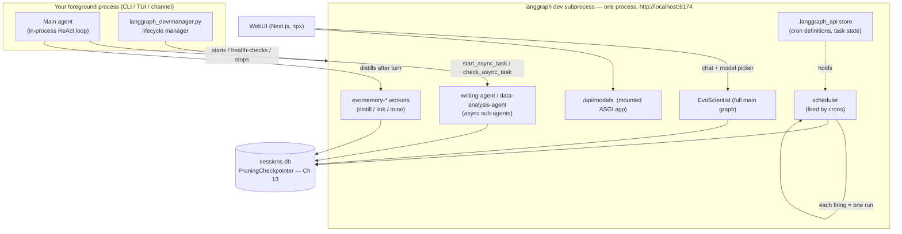

# Chapter 14 — Scheduling, Background Work, and Deployment

> **This chapter answers:**
> - What is the `langgraph dev` subprocess, and why does *one* background server host async sub-agents, scheduled tasks, AND the WebUI backend all at once?
> - How do scheduled tasks actually work — did EvoScientist write its own scheduler? (No. They are LangGraph crons, and the "scheduler" is just the seventh sub-agent from Chapter 6.)
> - What is the difference between a background OS process, an async sub-agent *task*, and a cron *schedule* — three things that all "run in the background" but are not the same?
> - How is EvoScientist deployed as a standalone server, and what does `--tunnel` expose to the world?

For eight chapters now, one phrase has kept appearing and then quietly deferring itself to "Chapter 14." When Chapter 6 explained async sub-agents, it said they run "as a separate remote graph in the `langgraph dev` subprocess" and moved on. When Chapter 11 described EvoMemory's background workers, it noted they run "in the langgraph dev subprocess" and moved on. When Chapter 13 built the `PruningCheckpointer`, it added a variant "for langgraph dev" and moved on. This is the chapter where that subprocess stops being a name and becomes a thing you understand.

On the master diagram from Chapter 2, this is the region labeled **"langgraph dev subprocess (async sub-agents, crons, WebUI backend) → Ch 14."** It sits off to one side of the main agent, connected by a thin arrow to `localhost:6174`. That thinness is deceptive. Everything EvoScientist does *unattended* — sub-agents that don't block your prompt, memory that distills after you walk away, tasks that fire at 7am while you sleep — happens inside that one box. Our job here is to open it, see the single server that hosts all of it, and then follow the code outward to the two things that live on top of it (scheduled tasks and standalone deployment) and the one thing that deliberately does *not* (detached OS processes). We close with the seam-patching, tunneling, and cross-platform care that make the whole arrangement survive contact with real machines.

The arc is: first the server (what it is, why it's shared, how its lifetime is managed), then the surprise that scheduling is nearly free once you have it, then a careful three-way vocabulary distinction that is easy to get wrong, then deployment and its security tension, and finally two "the framework didn't do what we needed, so we patched the seam" stories.

---

## 14.1 The one background server: what `langgraph dev` is

### Intuition: a second copy of the agent, running as a web service

Start from a problem. When you type a prompt into EvoScientist and press Enter, the agent runs *in your terminal process* — the ReAct loop (reason → act → observe, from Chapter 3) turns in the same Python process that's drawing your prompt. That is fine for synchronous work: you ask, it thinks, it answers. But some work must not block your prompt. If you delegate a two-hour data-analysis job to a sub-agent, you don't want your terminal frozen for two hours. If EvoMemory wants to distill your finished conversation into observations (Chapter 11), that distillation shouldn't hold up your next question. And if you scheduled a task to run "every morning at 7," there may be *no terminal open at all* when 7am arrives.

All three needs share one shape: *something has to run the agent (or a sub-agent) outside your foreground process, on its own clock, reachable on demand.* The obvious way to build that is a small server — a long-lived process that speaks HTTP, holds the compiled agent graphs in memory, and runs a graph whenever someone POSTs a request to it. You'd send it "run the writing-agent on this brief" and get back a task id; you'd poll for the result later. You'd register a cron with it and it would fire the graph on schedule. You'd point a web browser's chat UI at it.

EvoScientist does exactly this, but it does not write the server. LangGraph ships one. The command `langgraph dev` — part of the `langgraph-cli` package, a hard dependency — starts a local LangGraph API server: it reads a manifest telling it which graphs to host, loads them, and serves them over HTTP with a full SDK (create threads, stream runs, register crons, read state). EvoScientist's entire "background" story is: **auto-start one `langgraph dev` subprocess, register all the graphs that need to run unattended, and route background work to it.** One server, many tenants.

**`langgraph dev`** — the local LangGraph API server, run as a child process of EvoScientist. It hosts the main agent graph, every async sub-agent, the EvoMemory background workers, and the cron scheduler, all in one process reachable at `http://localhost:6174`. It is the thing every earlier chapter kept forward-referencing.

Why *one* server for all of it, rather than one per concern? Because they all need the same three things — the compiled EvoScientist graphs, the same workspace files, and the same durable checkpoint store — and standing up a second server would mean a second copy of each. The manifest that pins them together is the file we read next.

### Mechanism: the manifest, and who lives in the box

`langgraph dev` is generic; it hosts whatever a `langgraph.json` manifest tells it to. EvoScientist ships one inside its own package. Here it is in full — it is short, and it is the single most important deployment-configuration file in the repo:

```json
{
    "dependencies": ["."],
    "graphs": {
        "EvoScientist": "EvoScientist.langgraph_dev.main_graph:EvoScientist_agent",
        "writing-agent": "EvoScientist.langgraph_dev.graphs:writing_agent",
        "data-analysis-agent": "EvoScientist.langgraph_dev.graphs:data_analysis_agent",
        "scheduler": "EvoScientist.langgraph_dev.graphs:scheduler",
        "evomemory-subagent-worker": "EvoScientist.langgraph_dev.graphs:evomemory_subagent_worker",
        "evomemory-turn-worker": "EvoScientist.langgraph_dev.graphs:evomemory_turn_worker",
        "evomemory-observation-linker": "EvoScientist.langgraph_dev.graphs:evomemory_observation_linker",
        "evomemory-autoskills": "EvoScientist.langgraph_dev.graphs:evomemory_autoskills"
    },
    "checkpointer": {
        "backend": "custom",
        "path": "EvoScientist.sessions.create_checkpointer_for_langgraph_api"
    },
    "config": {
        "recursion_limit": 1000000
    },
    "http": {
        "app": "EvoScientist.langgraph_dev.http:app"
    }
}
```

Read the `"graphs"` block as the guest list. Each key is a graph *name* the server will host; each value is a Python import path `module:attribute` pointing at a compiled graph object. The first, `"EvoScientist"`, is the full main agent — the same orchestrator you talk to in the CLI, re-exported for the server (we'll see why the re-export is non-trivial in §14.6). Then come `writing-agent` and `data-analysis-agent`: the two research sub-agents marked `async: true` (Chapter 6), now materialized as their own server-hosted graphs so the main agent can dispatch to them without blocking. Then `scheduler` — the seventh sub-agent, which §14.2 is entirely about. Then four `evomemory-*` graphs: the memory workers, observation linker, and AutoSkills miner from Chapters 11 and 12, each a background LLM agent that runs after your turn ends. Every unattended actor in the whole system is one line in this list.

The `"checkpointer"` block is the connective tissue back to Chapter 13. It names a *custom* checkpointer factory, `create_checkpointer_for_langgraph_api`, instead of letting the server use its default `InMemorySaver`. This is not a detail — it is issue #277 (Chapter 13's origin story) enforced at the manifest level: an in-memory saver flushes lazily and drops checkpoints on a hard kill, so the server is told to persist through EvoScientist's own pruning SQLite checkpointer. That means threads run *inside* the server land in the same durable store as threads run in your CLI, which is precisely why the WebUI can list and resume conversations you started at the command line.

The `"config"` block sets `recursion_limit` to 1,000,000 — the same loop-guard override from Chapter 3, applied here so server-hosted graphs get the generous ceiling the CLI agent gets. And `"http"` mounts a custom ASGI app onto the same server (§14.5). One manifest, and the generic `langgraph dev` becomes the EvoScientist background server.

Here is the whole arrangement:



Read it as: your foreground process runs the main agent directly, but hands off anything unattended — async tasks, memory distillation, scheduled work — to the single subprocess it manages. That subprocess and your CLI share one checkpoint file, which is what lets any surface see any conversation.

### When does the server start? The `needs_langgraph_dev` gate

Booting a second Python process is not free — it costs seconds of cold-start and a few hundred megabytes of RAM. So EvoScientist does not always start it. Before launching, it asks whether the *current configuration* actually needs a background server at all:

```python
def needs_langgraph_dev(config: EvoScientistConfig) -> bool:
    """Return whether this config needs the background langgraph dev server."""
    if config.enable_async_subagents:
        return True
    if config.enable_scheduler:
        return True
    if config.memory_skill_synthesis_enabled:
        return True
    memory_controls = MemoryControls.from_config(config)
    return memory_controls.worker_needed(
        MemoryObservationTarget.TURN_WORKER
    ) or memory_controls.worker_needed(MemoryObservationTarget.SUBAGENT_WORKER)
```

`langgraph_dev/manager.py:91`. The gate is a disjunction of exactly the features that need a background host: async sub-agents, the scheduler, AutoSkills synthesis, and the two flavors of EvoMemory worker. If you've turned all of those off — a short scripted `EvoSci -p "..."` run in CI, say, where you only want the synchronous planner/research/code sub-agents — the function returns `False` and no subprocess is ever spawned. The comment on `enable_async_subagents` in `config/settings.py:196` spells out exactly these opt-out scenarios: "short scripted EvoSci runs (CI / one-shot `-p`), low-RAM environments, or workflows that only need the synchronous sub-agents." The server exists only when it earns its keep.

### The lifecycle manager: distributed systems in miniature

`langgraph_dev/manager.py` is the lifecycle manager for that one subprocess: start it, health-check it, reuse it if it's already up, restart it when the workspace changes, stop it on exit. The module docstring states the goal plainly — the CLI calls `ensure_langgraph_dev(config, ...)` at startup "so users can run `EvoSci -p "..."` without manually managing the langgraph dev server" (`manager.py:6`). You never type `langgraph dev` yourself; the manager does it invisibly.

The hard part is not starting a subprocess — it's starting *exactly one* when several EvoScientist processes might race for it. Imagine you have a TUI open, a channel bot running, and you fire a headless `-p` command, all in the same second, all discovering "no server is up yet" and all trying to boot one on port 6174. Without coordination, they clobber each other. The manager's answer is **two levels of locking**:

```python
    # Two layers of locking:
    #   1. ``FileLock`` — cross-process coordination. Without it, two CLI
    #      shells (TUI + ``-p`` + ``serve``) racing on the cold-start window
    #      can SIGKILL each other's still-booting subprocesses ...
    #   2. ``_LOCK`` (in-process RLock) — serializes intra-process callers ...
    RUNTIME.pid_dir.mkdir(parents=True, exist_ok=True)
    try:
        with FileLock(str(RUNTIME.lock_file), timeout=_FILE_LOCK_TIMEOUT):
            with _LOCK:
                return _ensure_langgraph_dev_locked(config, workspace_dir)
```

`manager.py:929`. The inner lock, `_LOCK`, is a `threading.RLock` — a *reentrant lock* (one that the same thread may acquire more than once without deadlocking). It serializes callers *within a single Python process*: rapid `/resume` commands, or several channel threads, all reaching for the server at once. It's reentrant because the restart path calls `stop_langgraph_dev` from *inside* its own critical section, and both touch the same module-level state (`manager.py:105`).

But a `threading.RLock` lives in one process's memory; it cannot coordinate across separate CLI invocations. That's the outer lock's job. `FileLock` (from the `filelock` package) is a *cross-process* lock backed by an actual file on disk: whichever process grabs `RUNTIME.lock_file` first proceeds; the others block until it's released, with a 120-second timeout that budgets for a 60-second cold start plus slack. The comment names the exact failure it prevents (`manager.py:243`): Shell B, racing, could see Shell A's still-booting subprocess — port-bound but not yet answering `/ok` — and mistake it for a *stale* process to clean up, then SIGKILL it. With the file lock, Shell B waits, then finds a healthy server and reuses it. If even the 120-second wait times out, the manager degrades gracefully: it logs a warning, sets `_ASYNC_SUBAGENTS_AVAILABLE = False`, and returns — the session falls back to synchronous in-process delegation rather than hanging (`manager.py:945`).

### The workspace sidecar: refusing to serve the wrong files

One subprocess, but which *workspace*? A `langgraph dev` server has one working directory, and the deployed sub-agents' filesystem operations land there (the `CustomSandboxBackend` from Chapter 9 derives its root from cwd). If you have `EvoSci deploy` running for workspace `~/projectA` in one terminal and you open a TUI in `~/projectB` in another, and the TUI blindly reused the running server, its "async" sub-agents would silently read and write *projectA's* files. That's a correctness disaster with no error message.

The guard is a **workspace sidecar**: a tiny JSON file recording which workspace and PID the running server was launched for. It's written atomically — temp file plus `os.replace`, so a concurrent reader never sees a half-written file (`manager.py:180`) — and read on the reuse path. When a process would reuse a server it doesn't own, it compares the sidecar's recorded workspace against its own; on mismatch it raises `WorkspaceMismatchError` rather than proceeding:

```python
                if recorded != ws_path.resolve():
                    raise WorkspaceMismatchError(
                        f"An EvoSci langgraph dev is already running on "
                        f"{_base_url(port)} for workspace {recorded}, but the "
                        f"current process requested workspace {ws_path}. "
                        f"Stop the other EvoSci session (deploy / TUI / serve) "
                        f"or rerun with --workdir {recorded}."
                    )
```

`manager.py:1015`. Notice the error is *actionable*: it names both workspaces and tells you how to resolve it. And notice the graceful-degradation escape hatch below it — if there's no sidecar at all (an older server started before this protocol existed), the manager falls back to a log warning instead of bricking the session (`manager.py:1028`). When the *same* process owns a running server but the workspace has changed (you `/resume`'d a thread from a different workspace), the manager instead stops and relaunches the subprocess with the new workspace (`manager.py:975`), because it owns that process and may safely restart it.

That distinction — *never kill a server you don't own; freely restart one you do* — runs through the whole module. `_kill_owned_stale_process` (`manager.py:438`) will only SIGKILL a port occupant if the PID matches the one *this* installation wrote to its PID file *and* the live process still has `langgraph` in its command line (defense against the OS recycling that PID to something unrelated). A foreign dev server that happened to grab 6174 is left strictly alone.

> **Aside — why port 6174?** The default port is Kaprekar's constant. The config comment is unusually candid (`config/settings.py:203`): "6174 is Kaprekar's constant — a memorable EvoScientist-themed default that avoids collisions with common dev ports (3000/5000/8000/8080) and the langgraph CLI default 2024." A number-theory in-joke that also happens to dodge every port a developer's other tools are likely squatting on. (The WebUI's own front-end port is 4716 — 6174 reversed.)

With the server understood — what it is, what it hosts, when it starts, how its single instance is guarded — we can look at the two features built *on top of it*, starting with the one that turns out to be almost free.

---

## 14.2 Scheduled tasks are just crons (there is no scheduler)

### The surprise, stated plainly

Here is a feature you would expect to be a lot of code: recurring scheduled tasks. "Every morning at 7, survey new papers on arXiv and append a summary to my memory." A naive implementation needs a background thread that wakes on a timer, parses cron expressions, tracks which tasks are due, fires them, handles missed windows across restarts, persists the schedule somewhere durable... it's a small system.

EvoScientist writes almost none of it. The docstring at the top of `cron/schedule.py` says it outright:

```python
"""Thin wrapper over the langgraph dev built-in cron API (langgraph_sdk).

EvoScientist scheduled tasks ARE langgraph crons targeting the ``scheduler``
graph. This module is the single choke-point so the ``/schedule`` command and the
NL ``schedule_task`` tool share one implementation.
"""
```

`cron/schedule.py:1`. A **cron (scheduled task)**, in EvoScientist, is not a bespoke timer — it is a *LangGraph cron*: a recurring run registered with the `langgraph dev` server, which fires a chosen graph on a schedule. The server already knows how to run graphs on cron expressions (it's a standard part of the LangGraph SDK). EvoScientist's contribution is one decision — *which* graph to fire — and a thin wrapper to make registering one convenient.

The graph it fires is `scheduler`, the seventh sub-agent from Chapter 6. Recall that Chapter 6 resolved the "six sub-agents in the README versus seven YAML files in the repo" puzzle: the seventh, `scheduler`, is "an unattended cron-fired fire-and-forget worker" that uses the cheaper auxiliary model (Chapter 5). Now you see the other half of that story. The scheduler isn't a sub-agent the main agent *delegates* to via the task tool; it's a graph the *server* invokes on a timer, with your task's prompt as its input. Its YAML says so directly — `subagents/scheduler.yaml` describes it as an "Unattended background executor for a single scheduled (cron) task," notes it is "Fired by langgraph-dev crons (client.crons.create)," and states "One run = one task." Its system prompt opens: "You are the scheduler: an UNATTENDED background worker that runs ONE scheduled task to completion on a timer. No human is present — never ask questions." That "no human is present" line is load-bearing, and we'll return to it.

### Mechanism: create a cron, it fires the graph

The whole "create a scheduled task" operation is one SDK call:

```python
def create_schedule(
    *, name: str, schedule: str, prompt: str, timezone: str | None = None
) -> Cron:
    """Create a recurring scheduled task on the scheduler graph."""
    # Crons are stored in the langgraph-dev process's .langgraph_api store, not
    # tagged by workspace. Isolation is process-level (see module docstring).
    return _client().crons.create(
        assistant_id=SCHEDULER_GRAPH_ID,
        schedule=schedule,
        input=messages_input(prompt),
        metadata={"run_kind": SCHEDULED_RUN_KIND, "name": name, "prompt": prompt},
        timezone=timezone or _default_timezone(),
    )
```

`cron/schedule.py:50`. `_client()` is a synchronous LangGraph SDK client pointed at `http://localhost:6174` (`cron/schedule.py:35`, via the shared `sdk.py` helpers). `crons.create` registers a cron on the server: `assistant_id="scheduler"` says *which graph* fires, `schedule` is the standard five-field cron expression, `input` wraps your prompt as the human message the scheduler graph receives, and `metadata` stamps a `run_kind` tag so EvoScientist can later find *its own* crons among any others sharing the store. From then on, the server owns the timing. When the expression is due, it creates a thread, creates a run against the `scheduler` graph with your stored prompt, and the scheduler sub-agent executes the task to completion — no EvoScientist process needs to be watching.

Everything else in the module is equally thin. `list_schedules` (`cron/schedule.py:65`) filters by the `run_kind` metadata tag rather than by `assistant_id`, with a good reason spelled out in the docstring: the stored `assistant_id` is a resolved UUID, not the human-readable `"scheduler"` name it was created with, so metadata is the reliable filter. `delete_schedule`, `set_enabled`, and `run_now` are one SDK call each. The comment in the dossier is fair: `cron/schedule.py` (107 lines total) is "how thin a feature is when built on a platform primitive."

### Where crons live, and what "process-level isolation" means

The cron definitions are stored in the `langgraph dev` subprocess's `.langgraph_api` store — the server's own on-disk cache, which the manager deliberately preserves across restarts (`start_langgraph_dev` sets `file_persistence=True` by default so "cron job state across CLI restarts" survives, `manager.py:685`). This is why isolation is *process-level, not data-level*, as the docstring warns (`cron/schedule.py:7`). The crons are not tagged by workspace inside the store. What keeps your `~/projectA` schedules separate from your `~/projectB` schedules is that the manager *restarts the whole subprocess when the workspace changes* (§14.1) — so each workspace effectively gets its own server process with its own `.langgraph_api` cron store. The warning is honest about the flip side: "If you point multiple clients at one hand-started server they will share the same cron store." Isolation-by-restart is a coarse tool, and the code says so.

### Two doors, one room: `/schedule` and the natural-language tools

A user can schedule a task two ways, and both funnel through `cron/schedule.py` — that's what "single choke-point" in the docstring means. The first door is the `/schedule` slash command (Chapter 10). The second is *natural language*: you can just tell the agent "every 10 minutes, check the UK weather and log it," and the agent has tools for it. Those tools live in `middleware/scheduler.py`:

```python
@tool
def schedule_task(name: str, cron: str, prompt: str, timezone: str = "") -> str:
    """Create a recurring scheduled task that runs unattended in the background.

    Translate the user's natural-language timing into a standard 5-field cron
    expression yourself before calling (e.g. 'every 10 minutes' -> '*/10 * * * *',
    'every day at 7am' -> '0 7 * * *', 'every Monday 9am' -> '0 9 * * 1').
    ...
    """
    from ..cron import schedule as crons

    if not crons.is_available():
        return "Scheduler unavailable: the langgraph dev backend is not running."
    try:
        rec = crons.create_schedule(
            name=name, schedule=cron, prompt=prompt, timezone=timezone or None
        )
    except Exception as e:
        return f"Error: {e}"
```

`middleware/scheduler.py:50`. Look closely at where the natural-language-to-cron translation happens: it *doesn't* happen in Python. The tool's `cron` parameter is already a five-field expression, and the docstring instructs the *model* to do the translation — "Translate the user's natural-language timing into a standard 5-field cron expression yourself before calling." The LLM turns "every 10 minutes" into `*/10 * * * *`. This is a recurring EvoScientist pattern: push fuzzy, natural-language reasoning up to the model and keep the Python layer a thin, deterministic pipe. `schedule_task` (and its siblings `list_scheduled_tasks`, `cancel_scheduled_task`) then call straight into the same `cron/schedule.py` functions the slash command uses. Two doors, one room.

The guard `if not crons.is_available()` matters: `is_available` (`cron/schedule.py:43`) just checks whether the `langgraph dev` server is up. If you disabled the scheduler (so `needs_langgraph_dev` returned `False` and no server started), the tool returns a clear "Scheduler unavailable" message instead of a stack trace.

### Keeping the agent aware: `SchedulerMiddleware`

There is one more piece, and it ties back to a Chapter 7 idea. How does the agent know which tasks are *already* scheduled — so it can answer "what have I got running?" and avoid creating duplicates? Through **capability-owning middleware** (Chapter 7's term for middleware that both contributes tools *and* injects the context those tools operate against). `SchedulerMiddleware` does exactly this. Its constructor attaches the three scheduling tools to itself, so wiring the agent only requires appending this one middleware:

```python
    def __init__(self) -> None:
        super().__init__()
        self._cache: str | None = None
        self._cache_at: float = 0.0
        self.tools = [schedule_task, list_scheduled_tasks, cancel_scheduled_task]
```

`middleware/scheduler.py:143`. And on every model call it injects a live `<scheduled_tasks>` block into the system prompt — the current list of crons, freshly fetched (with a 15-second cache so it isn't hammering the SDK every turn):

```python
    def modify_request(self, request: ModelRequest) -> ModelRequest:
        injection = self._injection(self._cached_schedules_block())
        new_system = append_to_system_message(request.system_message, injection)
        return request.override(system_message=new_system)
```

`middleware/scheduler.py:197`. This is the same "static instructions, then a dynamic live-data block" shape as `EvoMemoryMiddleware` (Chapter 11) — the module docstring explicitly says it mirrors that pattern (`middleware/scheduler.py:4`). The static half tells the model *how* to schedule (the `_SCHEDULING_INSTRUCTIONS` at `middleware/scheduler.py:31`, including the crucial reminder to always name an explicit output destination in the prompt, since "a task that never says where to put its output leaves no trace"). The dynamic half tells it *what's currently scheduled*. One small defense worth noticing: the `_clean` helper flattens each task's name and prompt to a single line and strips angle brackets (`middleware/scheduler.py:153`), so a task the user named `<system>` can't inject a fake tag into the prompt block.

There's also a careful async variant. `awrap_model_call` offloads the SDK-touching list-build to a thread:

```python
        block = await asyncio.to_thread(self._cached_schedules_block)
```

`middleware/scheduler.py:216`. The comment explains: "so we never block the event loop or trip langgraph dev's blockbuster detector." That "blockbuster" reference is a thread that runs through this whole chapter — the `langgraph dev` server aggressively polices blocking I/O on its event loop, and EvoScientist has to route every synchronous, blocking call (SDK calls, `os.getcwd`, subprocess spawns) around it. We'll meet its most dramatic consequence in §14.7.

---

## 14.3 The three-way distinction: process vs. task vs. schedule

Now the promised vocabulary lesson — and it *is* a lesson, not a footnote, because three different things in EvoScientist all "run in the background" and confusing them will confuse everything downstream. The codebase itself is fastidious about this, to the point of banning a word.

> **⚠ The three-way distinction (a vocabulary the codebase enforces)**
>
> Three mechanisms let EvoScientist do work outside your foreground turn. They are genuinely different, and `background.py:1` deliberately names all three to keep them apart:
>
> | Term | What it is | Where it runs | Survives restart? |
> |---|---|---|---|
> | **async sub-agent *task*** (Ch 6) | a non-blocking delegation to a sub-agent | a graph *inside* the `langgraph dev` server | yes — state is in `.langgraph_api` + the checkpointer |
> | **cron *schedule*** (§14.2) | a recurring run fired on a timer | the `scheduler` graph inside the `langgraph dev` server | yes — cron definitions persist in `.langgraph_api` |
> | **background *process*** (§14.4) | a single detached OS process running a shell command | a real OS process, *outside* any graph | **no** — tracked in memory only, lost on restart |
>
> The distinguishing axis is *what kind of thing is running.* A **task** and a **schedule** both run *LangGraph graphs* on the server. A **process** runs an *operating-system command* — `python train.py`, `npm run build` — that has nothing to do with agents or graphs at all. It's the difference between "go run this sub-agent for me" and "go run this program for me."
>
> **The banned word.** `background.py:1` states it flatly: the word **"job" is intentionally never used.** "Job" is a tempting umbrella term precisely because it's vague enough to cover all three — which is exactly why it's forbidden. If everything is a "job," nobody can tell whether a "background job failed" means a crashed sub-agent, a missed cron firing, or a shell command that exited nonzero. The names `task` / `schedule` / `process` each point at one mechanism and one only.

Keep this table in view for the rest of the chapter. §14.4 is entirely about the third row — the one that is deliberately *different* from the other two.

---

## 14.4 Background OS processes: the one that is *not* on the server

### Intuition and mechanism

Sometimes the agent needs to run a long shell command that has nothing to do with graphs — kick off a training run, start a dev server, launch a build — and not block the conversation. That's what `background.py` provides, and it's the odd one out in this chapter: it does not touch `langgraph dev` at all. A **background process** is a single detached OS process, launched via the `run_in_background` tool, that runs a shell command and is tracked so you can poll its output, check whether it exited, and kill it. The module docstring draws the boundary explicitly:

```python
"""Background OS-process execution for the sandbox.

A *process* here is a single detached OS process launched via ``run_in_background``
(distinct from an async sub-agent *task* and a future cron *schedule* — the word
"job" is intentionally never used).

The registry is **module-global (process-level)**: processes survive ``/new`` and
``/resume`` within the same CLI process, but are not persisted across a CLI restart.
"""
```

`background.py:1`. That second paragraph is the deliberate contrast with everything else you've learned. Chapter 13 went to great lengths to make conversations *durable* — the whole `PruningCheckpointer` story is about surviving a `SIGKILL`. Async tasks and crons persist in `.langgraph_api`. But background processes are held in a plain in-memory dictionary that is **lost on restart, on purpose**:

```python
_PROCESSES: dict[str, BgProcess] = {}
_LOCK = threading.Lock()
```

`background.py:61`. Why not persist them? Because the *thing being tracked* is an OS process with a live `Popen` handle, and that handle can't be serialized and reloaded. The docstring makes a virtue of this: holding the live handle means `poll()` and `returncode` "stay authoritative (no PID-reuse risk)" — you're asking the actual `Popen` object, not a possibly-recycled PID number, whether the process is alive. Once the CLI exits, the child processes it spawned are outside its lifetime anyway; there's nothing meaningful to resume. This is a case where *not* persisting is the correct design, and reading it against Chapter 13 sharpens both.

Launching is a detached `subprocess.Popen`:

```python
    log_file = open(log_path, "w")
    try:
        popen = subprocess.Popen(
            command,
            shell=True,
            cwd=cwd,
            stdout=log_file,
            stderr=subprocess.STDOUT,
            stdin=subprocess.DEVNULL,
            start_new_session=True,
        )
    finally:
        log_file.close()
```

`background.py:168`. Three choices carry weight. Output is redirected to a per-process log file under `<cwd>/.bg_processes/<id>.log`, so you can tail a long-running command's progress with the `status` tool without the process's stdout flooding your terminal. `stdin=subprocess.DEVNULL` means the command can't block waiting for input that will never come. And `start_new_session=True` makes the child a *process-group leader* — a POSIX concept where a process and all its own children form one group with a shared group id — which is what lets EvoScientist later kill the whole tree cleanly, not just the top command. (The `finally: log_file.close()` closes the *parent's* copy of the file descriptor after the child has inherited its own dup, preventing an fd leak across many launches — the same discipline the manager applies to its subprocess log at `manager.py:738`.)

A daemon watcher thread then blocks on `popen.wait()` and records the exact exit time and fires an optional `on_exit` callback (`background.py:123`), so completion notifications reach you promptly and with an accurate elapsed time, without `background.py` needing to import the notifier — the callback keeps the two decoupled.

### Killing a tree, on two operating systems

The most instructive function here is `_kill_process_tree`, because it confronts a problem that has no single cross-platform answer: how do you kill not just a command but everything it spawned?

```python
def _kill_process_tree(popen: subprocess.Popen, *, forceful: bool) -> None:
    """Kill the process group/tree in a cross-platform way. ..."""
    if os.name == "nt":
        try:
            proc = psutil.Process(popen.pid)
            targets = [proc, *proc.children(recursive=True)]
        except (psutil.NoSuchProcess, psutil.AccessDenied):
            return
        for p in targets:
            try:
                if forceful:
                    p.kill()
                else:
                    p.terminate()
            except (psutil.NoSuchProcess, psutil.AccessDenied):
                pass
    else:
        sig = signal.SIGKILL if forceful else signal.SIGTERM
        try:
            os.killpg(os.getpgid(popen.pid), sig)
        except ProcessLookupError:
            pass
```

`background.py:234`. On POSIX (the `else` branch), the `start_new_session=True` from launch pays off: because the command is a process-group leader, `os.killpg` — "kill process group" — sends one signal to the *entire* group at once (the shell plus any grandchildren it forked). One call, whole tree, done. Windows has no process groups in this sense: `TerminateProcess` (what `Popen.terminate()`/`.kill()` call underneath) only kills the direct child and leaves grandchildren orphaned. So on Windows EvoScientist reaches for `psutil` — a cross-platform process library — to walk the tree with `children(recursive=True)` and signal every descendant by hand. The public `stop()` function (`background.py:266`) wraps this in the familiar graceful escalation: `SIGTERM` first, wait two seconds, then `SIGKILL` for anything that didn't take the hint.

The manager's own `stop_langgraph_dev` (`manager.py:844`) solves the same "tear down a whole process tree" problem, but makes the opposite simplifying choice: rather than branch on the platform, it walks children with `psutil.Process.children(recursive=True)` *uniformly on both operating systems* — its comment at `:844-847` explains why, that "POSIX process groups (`os.killpg`) don't exist on Windows," so psutil "works on both." Same SIGTERM-then-SIGKILL escalation, but one code path instead of two. Worth noticing the contrast: `background.py` optimizes the POSIX case with `killpg` and special-cases Windows, while the manager trades that optimization for a single cross-platform walk.

---

## 14.5 Deployment: `EvoSci deploy` as a standalone server

### Intuition: the same server, but as the whole product

So far the `langgraph dev` subprocess has been a *helper* — a background box next to your foreground CLI. But there's a mode where that box *is* the product. `EvoSci deploy` starts a standalone `langgraph dev` server with no CLI attached to it: no terminal chat loop, no session database of its own, no channel runtime. It exists to be *connected to* — by a web UI, by the LangGraph SDK, by LangSmith Studio. The docstring lists exactly what it drops (`deploy/server.py:8`): "no in-process CLI agent, no session DB, no channel runtime, no TUI. The terminal only shows startup progress, the Ready banner, and then blocks until Ctrl+C."

Crucially, `EvoSci deploy` and the auto-managed CLI subprocess run *the same* `start_langgraph_dev` from the same `manager.py`. The only difference is one environment variable, `EVOSCIENTIST_DEPLOY_MODE`, which selects between two modes: `full` (deploy) versus `stripped` (the CLI's helper subprocess). We met this flag in Chapter 6 as the thing that flips `_ASYNC_SUBAGENTS_AVAILABLE` to `True`. Now the fuller picture: in `full` mode the subprocess loads the complete MCP tool set and its main agent is a live entry point; in `stripped` mode the subprocess *skips* MCP loading, because the CLI's foreground process already loaded those MCP servers — spawning a second copy inside the helper subprocess would just double every MCP server for no benefit (`manager.py:693`). The deploy path wants the full agent because *it is the only agent there is*.

### Mechanism: the deploy command, start to Ready

`deploy/server.py` is a Typer command (Chapter 10's CLI framework). Read top to bottom it's a checklist: load config, resolve the workspace, resolve and validate the port, refuse to start if the port's taken, print a banner, optionally start `ccproxy`, start `langgraph dev` in deploy mode, optionally wait for a tunnel URL, print the Ready banner, then block on a signal until Ctrl+C. The interesting steps are the optional ones.

The `ccproxy` step reuses Chapter 8's OAuth proxy exactly as the CLI does — only if a provider is configured for OAuth:

```python
    if config.anthropic_auth_mode == "oauth" or config.openai_auth_mode == "oauth":
        try:
            from ..ccproxy_manager import maybe_start_ccproxy, stop_ccproxy
            ...
            _ccproxy_proc = maybe_start_ccproxy(config)
            if _ccproxy_proc:
                atexit.register(stop_ccproxy, _ccproxy_proc)
```

`deploy/server.py:174`. `ccproxy` (Chapter 8) is the external proxy that lets a Claude Pro/Max or ChatGPT subscription's OAuth token stand in for an API key. Its lifecycle manager mirrors the `langgraph dev` manager's shape — start it, register `atexit` cleanup — so a deployed server can serve a subscription-authenticated agent to remote clients.

Then the server itself, in deploy mode:

```python
            proc = start_langgraph_dev(
                workspace_dir=Path(ws),
                port=effective_port,
                file_persistence=file_persistence,
                jobs_per_worker=jobs_per_worker,
                deploy_mode=True,
                tunnel=tunnel,
            )
        atexit.register(stop_langgraph_dev, proc)
```

`deploy/server.py:197`. `deploy_mode=True` is what sets `EVOSCIENTIST_DEPLOY_MODE=full`. The command blocks on a `threading.Event` toggled by explicit `SIGINT`/`SIGTERM` handlers (`deploy/server.py:255`), so both Ctrl+C and a `kill` produce a clean shutdown, and the honest final line — it prints "Shutting down (background cleanup may take a few seconds)…" rather than "Stopped," because the actual subprocess teardown runs later via `atexit` and claiming it's already stopped "would be a lie until atexit fires" (`deploy/server.py:273`).

### The security tension: `--tunnel` and its loud warning

Here two design goals genuinely collide. On one hand, you want to *share* a deployed agent — hand a colleague a URL, drive it from your phone, demo it. A localhost server can't do that; it's not reachable from outside your machine. The `--tunnel` flag solves it by passing `--tunnel` through to `langgraph dev`, which shells out to `cloudflared` (Cloudflare's tunnel client) to establish a **Cloudflare quick tunnel** — an on-demand public HTTPS endpoint at a random `*.trycloudflare.com` URL that forwards to your local server. Instant public reachability, no firewall configuration.

On the other hand: that URL has *no authentication*, and the agent behind it *can run shell commands*. Anyone who learns the URL can drive your agent — including, in dangerous mode, real filesystem access. Those two facts multiplied together are a serious risk, and the code refuses to be quiet about it. It's flagged three separate times. The flag's own help text warns:

```python
    tunnel: bool = typer.Option(
        False,
        "--tunnel",
        help="Expose the server over a public Cloudflare tunnel (no auth — "
        "anyone with the URL can drive the agent; trusted use only)",
    ),
```

`deploy/server.py:49`. At startup, if `--tunnel` is set, a loud red banner prints:

```python
    if tunnel:
        console.print(
            "[bold white on red] ⚠ PUBLIC TUNNEL [/bold white on red] "
            "[bold red]Public URL, no auth — share only with people you "
            "trust.[/bold red]"
        )
```

`deploy/server.py:165`. And even the low-level `start_langgraph_dev` docstring repeats it: "SECURITY: the tunnel has no auth and the deployed agent can run shell — only enable for trusted use" (`manager.py:568`). The design *resolves* the tension not by adding auth (a quick tunnel genuinely has none) but by making the cost impossible to trigger accidentally: the flag is off by default, and every path that could enable it shouts. That's the honest resolution — the feature exists because sharing is real and useful, but its price is stated at every door.

Getting the tunnel URL back is its own small craft. `cloudflared` prints the random URL into the server's log a few seconds *after* the local server is already healthy, so `read_tunnel_url` polls the log for a `*.trycloudflare.com` match (`manager.py:789`). The subtle part: it scans only the bytes written *since this subprocess started* (`_LOG_OFFSET_AT_START`, captured just before spawn at `manager.py:665`), so a stale tunnel URL left in the appended-to log by a *previous* session is never mistaken for the live one.

### `GET /api/models`: mounting a custom route on the same server

Recall the `"http"` key in `langgraph.json`. That's a hook the LangGraph API host offers: name an ASGI app and it gets mounted onto the *same* server process as the graphs. EvoScientist uses it for exactly one route — the model registry the WebUI's `/model` picker needs:

```python
async def get_models(_request: Request) -> JSONResponse:
    """Return the model registry as ``{entries, default}``. ..."""
    cfg = await asyncio.to_thread(get_effective_config)
    entries = [
        {"name": name, "model_id": model_id, "provider": provider}
        for name, model_id, provider in await list_model_picker_entries(
            getattr(cfg, "ollama_base_url", None),
            include_custom_ollama=False,
        )
    ]
    return JSONResponse(
        {
            "entries": entries,
            "default": {"name": cfg.model, "provider": cfg.provider},
        }
    )
```

`langgraph_dev/http.py:36`. The docstring explains *why* this lives on the same server rather than as a separate service (`langgraph_dev/http.py:8`): "the WebUI talks to `EvoSci deploy`'s langgraph endpoint anyway, so one origin keeps the WebUI's fetch logic simple — no CORS dance, no extra port to configure." Same origin means no cross-origin headers to negotiate, no second port for the browser to reach. The app is deliberately lightweight — it imports only the config and the model *registry*, never the agent, so hitting this endpoint doesn't drag the whole agent into memory.

And there's the blockbuster thread again. See the `await asyncio.to_thread(get_effective_config)`? The docstring is explicit about it (`langgraph_dev/http.py:56`): `get_effective_config()` calls `find_dotenv(usecwd=True)`, which invokes `os.getcwd()` — "a blocking syscall that langgraph-dev's `blockbuster` middleware refuses to allow on the async event loop (would surface as a 500)." So the config load is offloaded to a thread. Every time EvoScientist code runs *inside* the `langgraph dev` server, this discipline reappears: nothing blocking on the event loop.

### The WebUI backend (forward-ref)

The WebUI itself is a Next.js front-end shipped as an npm package. When you run with `--ui webui`, the CLI shells out to `npx @evoscientist/webui` and points that browser app at this `langgraph dev` server — the WebUI is a *renderer*, and this server is its *backend* (its chat comes through the `EvoScientist` graph, its model picker through `/api/models`). The WebUI's own front-end port defaults to 4716 (`config/settings.py`), while the backend keeps `langgraph_dev_port`. The surface itself — how the browser app renders streaming events — is Chapter 15's subject; here it's enough to see that it is one more tenant of the one server this chapter opened.

---

## 14.6 Patching the seam: stripping a 1.4 MB blob from WebUI reads

Twice in this chapter the framework hasn't done quite what EvoScientist needs, and the fix has been to *patch the seam* rather than fork the framework. The first is subtle and worth walking, because it's a clean example of the pattern — including the canary assertions that make such a patch safe to live with.

The problem: the QuickJS code interpreter (Chapter 9) persists its REPL state across turns as a `_quickjs_snapshot_payload` — a roughly 1.4 MB blob of serialized JavaScript engine state. Upstream `langchain_quickjs` marks that field private with `OmitFromSchema(input=True, output=True)`, meaning "don't show this in state reads." But LangGraph's checkpoint-reading path doesn't honor that annotation: every `getState` call materializes the full delta chain (Chapter 13) back into the complete blob. So when the WebUI reads a thread's state — which it does on every thread switch — it downloads 1.4 MB of REPL internals it will never use. Thread switching feels slow, for no reason the user could guess.

EvoScientist can't easily fix upstream LangGraph, and it doesn't want to disable REPL persistence (which is a feature). So `main_graph.py` swaps the *class* of the compiled graph:

```python
class _EvoFilteredGraph(CompiledStateGraph):
    """Filters ``PrivateStateAttr``-marked state fields from checkpoint reads. ..."""

    async def aget_state(self, config, *, subgraphs=False):
        return _strip_private(await super().aget_state(config, subgraphs=subgraphs))

    def get_state(self, config, *, subgraphs=False):
        return _strip_private(super().get_state(config, subgraphs=subgraphs))
    ...
```

`langgraph_dev/main_graph.py:145`. `_EvoFilteredGraph` is a subclass of the normal compiled graph that overrides the four state-read methods to run every snapshot through `_strip_private`, which removes `_quickjs_snapshot_payload` from the four surfaces where it leaks (the materialized values, the write records, the task results, and the delta-snapshot counters — enumerated with measured sizes in the `_strip_private` docstring at `main_graph.py:55`). The write path is untouched, so cross-turn REPL persistence still works; only the *reads the WebUI sees* are scrubbed.

The swap itself is an in-place `__class__` reassignment:

```python
_agent.__class__ = _EvoFilteredGraph
EvoScientist_agent = _agent
```

`langgraph_dev/main_graph.py:189`. This is legal and safe precisely because the subclass adds *only methods, no new instance attributes* — the memory layout is identical, so reassigning `__class__` just changes which methods resolve, nothing more (the comment at `main_graph.py:185` states this reasoning). The alternative — constructing a fresh `_EvoFilteredGraph` — would require reproducing the entire deep-agent build pipeline, which the swap sidesteps. (There's also a small re-export subtlety here that ties back to Chapter 5: the main agent is built lazily behind a PEP 562 module `__getattr__`, but `langgraph dev`'s symbol resolver inspects module attributes *directly* and doesn't trigger `__getattr__`, so `main_graph.py` re-exports it eagerly to make it visible — `main_graph.py:1`.)

The part that makes this pattern *responsible* rather than reckless is the canary. Monkey-patching internals is fragile: if a future LangGraph version renames a field, `_strip_private` would silently `.get()` its way to a no-op, the blob would come back on the wire, and nobody would notice until users again complained about slow thread switches. So the module asserts, at import time, that the internals it depends on still exist:

```python
_missing_snap = _EXPECTED_SNAPSHOT_FIELDS - set(StateSnapshot._fields)
_missing_task = _EXPECTED_TASK_FIELDS - set(PregelTask._fields)
if _missing_snap or _missing_task:
    raise RuntimeError(
        "LangGraph state shape drifted from the version _strip_private was "
        f"written against. ..."
    )
```

`langgraph_dev/main_graph.py:43`. If a future upstream bump changes the `StateSnapshot` or `PregelTask` shape, the deployment *refuses to start* with an actionable error, rather than silently degrading. A loud failure beats a silent regression. The same class swap is then applied to *every* graph in `langgraph.json` (`main_graph.py:193`), reading the graph list straight from the manifest so a newly-added sub-agent picks up the filter automatically — because async sub-agents get their own thread and their own `/threads/{id}/state` endpoint, and any REPL touch inside one would otherwise leak the blob on that endpoint too.

---

## 14.7 Origin story: why Windows forces the Proactor event loop

The second seam-patch is a cross-platform bug, and it's clean enough to tell as a full origin story.

> **📁 事故档案 / Origin Story — the Windows async-subprocess trap (issue #283)**
>
> **背景 (Background).** The `langgraph dev` server enables a guard called `blockbuster` by default — a middleware that detects blocking I/O accidentally performed on the async event loop and flags it, because a single blocking call can stall an entire async server. This is why, throughout this chapter, EvoScientist has been so careful to offload synchronous work to threads (`asyncio.to_thread` in the scheduler middleware and in `/api/models`). Separately, MCP stdio servers (Chapter 10) are launched as *subprocesses* by the MCP SDK's stdio transport, which spawns them through `anyio.open_process` → asyncio's async-subprocess support.
>
> **经过 (What happened).** On Windows, asyncio has two event-loop implementations: *Selector* and *Proactor*. The Selector loop **does not implement async subprocess creation at all.** So on a Selector loop, the MCP stdio transport silently falls back to a *synchronous* `subprocess.Popen` — inside an `async` function. Under `langgraph dev`, `blockbuster` sees that synchronous spawn on the event loop and raises a `BlockingError`. MCP servers fail to start on Windows, for a reason buried three layers deep in the async stack. (`_winloop.py:1`.)
>
> **代价 (The cost).** A whole feature — MCP tool servers — broke on an entire operating system, and the failure surfaced as an opaque blocking-I/O error rather than "your event loop can't spawn subprocesses." Diagnosing it required knowing that Selector-versus-Proactor even matters, and that the "blocking call" `blockbuster` flagged was actually a *fallback* triggered by the loop's missing capability.
>
> **机制化 (Mechanized).** The Proactor loop *does* support async subprocesses natively, so on Proactor the fallback never happens and the spawn is genuinely async — `blockbuster` is satisfied. `ensure_proactor_event_loop_policy()` forces `WindowsProactorEventLoopPolicy` before any event loop is created:
>
> ```python
> def ensure_proactor_event_loop_policy() -> bool:
>     if sys.platform != "win32":
>         return False
>     import asyncio
>     proactor_policy = getattr(asyncio, "WindowsProactorEventLoopPolicy", None)
>     if proactor_policy is None:
>         return False
>     current = asyncio.get_event_loop_policy()
>     if not isinstance(current, proactor_policy):
>         asyncio.set_event_loop_policy(proactor_policy())
>     return True
> ```
>
> `_winloop.py:31`. Windows has *defaulted* to Proactor since Python 3.8, so this is usually a no-op — but the docstring explains why it's set explicitly anyway (`_winloop.py:16`): "a dependency, IDE, or notebook host may have installed a Selector policy earlier in the process, and the `langgraph dev` subprocess in particular runs code we don't fully control." It must run at import time, before the first loop is created, because "once a loop exists, swapping the policy does not change the already-running loop." And it's called at *both* process entrypoints — the CLI's and the `langgraph dev` subprocess's — because both processes spawn MCP subprocesses and both need the guarantee.
>
> **The rule to remember:** a "blocking I/O" error under `langgraph dev` on Windows may not be blocking I/O at all — it may be an async operation the event loop couldn't perform, silently downgraded to a blocking one. The fix is at the loop-policy layer, not the call site.

---

## 14.8 要点 / Takeaways

- **One background server hosts everything unattended.** `langgraph dev` is a local LangGraph API server, auto-started as a subprocess, hosting the main agent graph, async sub-agents, EvoMemory workers, and the cron scheduler — every actor in `langgraph.json`'s `"graphs"` list. It shares the CLI's checkpoint file (Chapter 13's custom checkpointer, named in the manifest), which is why any surface can see any conversation. It starts only when `needs_langgraph_dev` says the config actually uses one.
- **Its single instance is guarded like a small distributed system.** Two-level locking (cross-process `FileLock` + in-process reentrant `RLock`) prevents racing CLI shells from clobbering each other's cold-start; a workspace sidecar makes a process *refuse* (`WorkspaceMismatchError`) to reuse a server pinned to a different workspace; ownership checks ensure EvoScientist never kills a server it doesn't own. Port 6174 is Kaprekar's constant.
- **Scheduled tasks are LangGraph crons — there is no bespoke scheduler.** `cron/schedule.py` (107 lines) is a thin wrapper over the SDK's `crons.create`, always firing the `scheduler` graph (Chapter 6's seventh sub-agent). Both the `/schedule` command and the natural-language `schedule_task` tool funnel through it; the LLM does the "every 10 minutes" → `*/10 * * * *` translation. `SchedulerMiddleware` injects a live `<scheduled_tasks>` block each turn (capability-owning middleware, Chapter 7). Cron definitions persist in the server's `.langgraph_api` store; isolation is process-level (restart-per-workspace), not data-level.
- **Three background mechanisms, three names, one banned word.** An async sub-agent **task** and a cron **schedule** both run graphs *inside* the server and persist. A background **process** runs an OS command *outside* any graph and is deliberately in-memory-only, lost on restart (the correct choice, since a live `Popen` handle can't be serialized). The word "**job**" is intentionally never used because it blurs all three. `_kill_process_tree` uses `os.killpg` on POSIX and a `psutil` tree-walk on Windows — the standard EvoScientist subprocess-teardown pattern.
- **Deployment is the same server, standalone.** `EvoSci deploy` runs `start_langgraph_dev` in `full` mode (vs. the CLI's `stripped` mode, differing by MCP loading and the `EVOSCIENTIST_DEPLOY_MODE` env var) as a headless, connect-to-me server for UIs and SDK clients. `--tunnel` exposes it via a no-auth Cloudflare quick tunnel — a real security tension, resolved by making the flag off-by-default and warning loudly at three separate places. `GET /api/models` mounts on the same origin (no CORS) via the manifest's `"http"` key.
- **When the framework falls short, patch the seam — with a canary.** `main_graph.py` swaps the compiled graph's `__class__` to strip a 1.4 MB QuickJS blob from WebUI state reads, guarded by import-time assertions that fail loud if LangGraph's internals drift. On Windows, `_winloop.py` forces the Proactor event loop so MCP subprocess spawns stay genuinely async and don't trip `langgraph dev`'s `blockbuster` guard (issue #283).

## Sources

| Topic | Authoritative file(s) |
|---|---|
| `langgraph dev` lifecycle, two-level locking, workspace sidecar, tunnel URL scrape, port 6174 | `EvoScientist/langgraph_dev/manager.py`; `EvoScientist/config/settings.py` (port rationale) |
| The deployment manifest (graphs, custom checkpointer, HTTP mount, recursion_limit) | `EvoScientist/langgraph_dev/langgraph.json` |
| Scheduled tasks as LangGraph crons; the choke-point wrapper | `EvoScientist/cron/schedule.py`; `EvoScientist/langgraph_dev/sdk.py` |
| Scheduling tools + `SchedulerMiddleware` (live `<scheduled_tasks>` injection) | `EvoScientist/middleware/scheduler.py`; `EvoScientist/subagents/scheduler.yaml` |
| Background OS processes; three-way distinction; cross-platform kill | `EvoScientist/background.py` |
| Standalone deployment, `--tunnel` security warning, ccproxy lifecycle | `EvoScientist/deploy/server.py` |
| `GET /api/models` on the same ASGI app | `EvoScientist/langgraph_dev/http.py` |
| Class-swap to strip the QuickJS blob; canary assertions | `EvoScientist/langgraph_dev/main_graph.py` |
| Windows Proactor event-loop fix (issue #283) | `EvoScientist/_winloop.py` |

*When the book and the code disagree, the code wins.*
</content>
</invoke>
