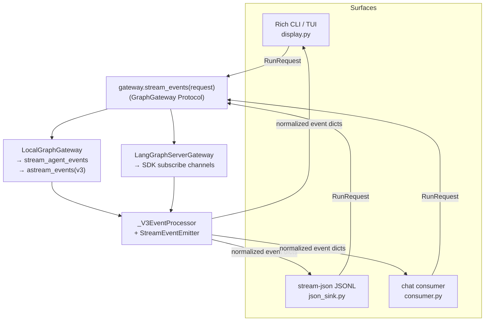
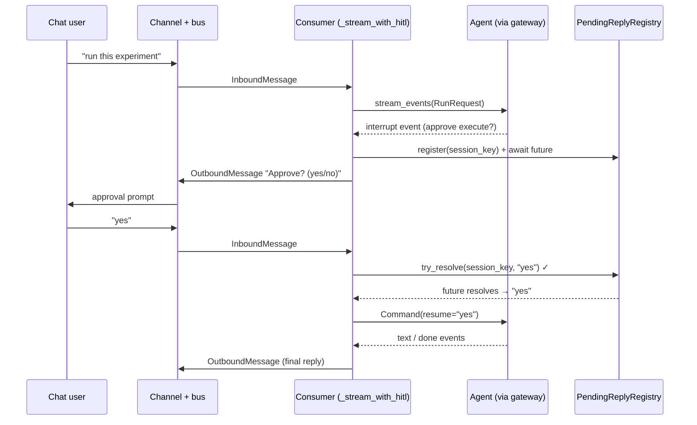

# Chapter 15 — One Engine, Many Surfaces

> **This chapter answers:**
> - How can one agent serve the terminal, a browser WebUI, and ten chat apps at once?
> - What is the *gateway*, and why does it exist — how does one API cover both in-process and remote execution?
> - What is the *streaming event* vocabulary, and how do three different renderers consume the very same events?
> - How is a *channel* (a chat-platform integration) structured, and how do you add a new one?
> - How does human approval (HITL) work over a chat app, not just the terminal?

On the master diagram from Chapter 2, everything you have studied so far lives *inside* one box: the orchestrator agent, its middleware onion, the sub-agent team, the memory, the persistence. This chapter zooms into the two regions that sit *around* that box — the top-left **Surfaces** strip (CLI/TUI, WebUI, and ten chat channels) and the **Gateway + streaming vocabulary** seam directly beneath it. These are the parts a human actually touches. And here is the surprising claim this chapter will prove: none of them contain any real intelligence. The agent is built exactly once, by exactly one factory function. Every surface — a terminal window, a JSONL stream feeding some other program, a Telegram conversation — is a *thin renderer* or *dispatcher* over one shared stream of events. The cleverness is all upstream; the surfaces are plumbing. Understanding how that plumbing stays thin is the whole chapter.

We build up in three movements. First the **streaming event** vocabulary — the common language every surface speaks. Then the **gateway** — the seam that lets a surface run the agent locally *or* against a remote server without knowing which. Then **channels** — the chat-platform layer, which is where the plumbing gets genuinely interesting, because a chat app is a hostile environment for a streaming agent, and the code has to earn its keep.

---

## The thesis, in eighty lines

Before any mechanism, let us look at the single file that makes the whole argument. When you run EvoScientist headlessly — `evosci -p "hello" --output-format stream-json` — the agent's output is emitted as JSONL: one JSON object per line, so another program can read the run event by event. That output format is a "surface" in the sense we mean: a way of turning an agent run into something outside the process can consume. Here is essentially all of it, from `stream/json_sink.py:26`:

```python
async def write_events_as_json(
    events: AsyncIterable[dict[str, Any]],
    out: TextIO,
) -> str:
    final = ""
    async for event in events:
        out.write(json.dumps(event, default=str))
        out.write("\n")
        out.flush()
        if event.get("type") == "done":
            final = event.get("response", "") or ""
    return final
```

Read what this does — and, more importantly, what it *does not* do. It takes an async stream of dictionaries. For each one it calls `json.dumps` and writes a line. It flushes immediately, so a downstream consumer sees events in real time rather than in one buffered gulp at the end. It watches for a dict whose `"type"` is `"done"` to learn the final response text. That is the entire renderer. There is no formatting, no color, no notion of what a "tool call" or a "sub-agent" *is*. The module's own docstring says so at `stream/json_sink.py:9`: *"This module deliberately contains no rendering logic."*

This is the proof of the thesis in miniature. If turning an agent run into machine-readable JSONL takes eighty lines and zero domain knowledge, then the events flowing *into* this function must already be complete, self-describing, and surface-agnostic. Every event is a plain dictionary carrying a `"type"` field; a renderer either serializes it verbatim or pattern-matches on the type and draws something. The two other renderers we will meet — the Rich terminal display and the chat consumer — are more elaborate only because a terminal and a chat app demand more of them, not because the events are richer for them. They drink from the same tap.

The `default=str` argument earns a note. If some event dict happens to carry a value `json.dumps` cannot serialize — say a tool argument that is a rich object rather than a string — `default=str` coerces it to its string form instead of raising. A single un-serializable value would otherwise tear down the whole stream mid-run. This is the sink being defensive about a stream it does not control, which is exactly the posture a thin renderer should take.

So the design has two load-bearing pieces we now need to understand: the **event vocabulary** those dictionaries speak, and the **stream** that produces them. Let us build the vocabulary first.

---

## The streaming event vocabulary

### Intuition: a closed set of boring dictionaries

Imagine you are narrating a chess game to three different audiences at once: a chess engine that wants moves in algebraic notation, a TV commentator who wants drama, and a blind listener who wants plain speech. You would be foolish to invent a separate narration for each. Instead you emit one neutral stream of facts — "white plays knight to f3", "black is now in check", "white resigns" — and let each audience render those facts its own way. The facts are deliberately dull; their dullness is what makes them universally consumable.

EvoScientist does exactly this for an agent run. As the agent thinks, calls tools, delegates to sub-agents, pauses for approval, and finishes, the system emits a stream of neutral facts. We call each fact a **streaming event**: one normalized dictionary with a `"type"` field (`text`, `tool_call`, `interrupt`, `done`, and so on) that any surface can `json.dumps` or pattern-match on. The vocabulary is *closed* — there is a fixed, small set of event kinds — and each event is *flat and boring* by design, so that no surface needs to understand the agent's internals to render it.

### Mechanism: where events are minted

The events are minted by one class, the **`StreamEventEmitter`** (`stream/emitter.py:19`). It is not a stream itself; it is a factory of static methods, each of which builds one `StreamEvent` — a tiny dataclass of just `type` and `data` (`stream/emitter.py:11`). Reading the emitter top to bottom is the fastest way to learn the entire vocabulary, because the method list *is* the vocabulary. Here are two of the roughly eighteen constructors:

```python
@staticmethod
def text(content: str) -> StreamEvent:
    """Text content event."""
    return StreamEvent("text", {"type": "text", "content": content})

@staticmethod
def tool_call(name: str, args: dict[str, Any], tool_id: str) -> StreamEvent:
    """Tool call event."""
    return StreamEvent(
        "tool_call",
        {"type": "tool_call", "name": name, "args": args, "id": tool_id},
    )
```

Notice the redundancy: the `type` is stored both on the `StreamEvent` object *and* inside its `data` dict. That is deliberate. Downstream, only the `data` dict travels — the surfaces receive `event.data`, a plain dictionary — so the `"type"` key has to live inside the dict for `json_sink` to find it and for the chat consumer to switch on it. The outer `StreamEvent.type` is a convenience for code that holds the object before flattening it.

The full roster covers everything a research agent does. There is `thinking` (the model's hidden reasoning, when a provider exposes it — see Chapter 8), `text` (visible assistant output), `tool_call` and `tool_result`, a parallel family of `subagent_start` / `subagent_tool_call` / `subagent_tool_result` / `subagent_text` / `subagent_end` (so a surface can show *which* sub-agent is speaking — recall the roster from Chapter 6), `usage_stats` (token counts), `tool_selection` (the adaptive-tools middleware from Chapter 7 announcing which tools it kept), `summarization` and `summarization_start` (context compaction, Chapter 7), `error`, and the two human-pause events `interrupt` and `ask_user` that we will spend real time on later. Finally there is `done`, carrying the full final response — the event `json_sink` watched for.

The sub-agent events deserve a word, because they solve a problem raw LangGraph creates. When the orchestrator delegates via the `task` tool (Chapter 6), the sub-agent's work happens in a nested namespace that the underlying protocol hides behind opaque path tuples. A surface that wanted to say "the research-agent is now searching" would have nothing human-readable to show. So the emitter carries a `subagent` name and an `instance_id` on every sub-agent event, letting the terminal draw a labeled panel and the chat consumer group a sub-agent's output together. The identity that raw graph namespaces intentionally hide is reconstructed and handed to the surface as a plain string.

### Detail: from raw protocol to normalized events

Where do the raw facts come from, and who calls the emitter? The producer is `stream_agent_events` in `stream/events.py:800`. Its ingestion side is one line of substance (`stream/events.py:866`):

```python
stream_result = agent.astream_events(
    astream_input,
    config=config,
    version="v3",
    transformers=[UpdatesTransformer],
)
```

`astream_events(version="v3")` was named back in Chapter 3 and its meaning deferred to here; this is the payoff. It is LangGraph's streaming interface: as the compiled graph runs, it yields a stream of low-level *protocol* events — content-block deltas, tool-started and tool-finished notifications, interrupt signals — tagged with a `method` (`"messages"`, `"tools"`, `"updates"`, `"values"`, `"input.requested"`) and a namespace path. These raw events are correct but unfriendly: they preserve arrival order and internal structure, not the clean vocabulary a surface wants. The `config` here is the familiar `{"configurable": {"thread_id": ...}}` (Chapter 3), which is how this run is pinned to one conversation's checkpoint chain.

The translation from raw to normalized is the job of the **`_V3EventProcessor`** (`stream/events.py:191`), described by its own one-line docstring as translating "v3 protocol channel events into EvoScientist UI events." Its `process` method (`stream/events.py:227`) is a dispatch on `method`: a `"messages"` event becomes `text` / `thinking` / `subagent_text` events, a `"tools"` event becomes `tool_call` / `tool_result`, an `"updates"` event carrying `__interrupt__` becomes an `interrupt` event, and so on. Every branch ends by calling the emitter. The raw protocol goes in; the closed vocabulary comes out.

There is one wrinkle worth seeing, because it explains why `stream_agent_events` is more than a simple loop. The user-facing sub-agent identities we just praised do not arrive on the raw event stream at all — they come from a *separate* projection that DeepAgents exposes, `stream.subagents`. So `stream_agent_events` runs **two concurrent producers** and merges them through one `asyncio.Queue` (an in-memory FIFO that lets independent coroutines hand items to each other safely). One producer, `_consume_protocol_events` (`stream/events.py:896`), drives the raw v3 stream through the processor; the other, `_consume_subagents` (`stream/events.py:914`), watches the sub-agent projection and emits `subagent_start` / `subagent_end` events, registering each sub-agent's namespace so the processor can attach the right name to that sub-agent's text and tool events. Both producers push normalized event dicts onto the shared queue; the outer loop (`stream/events.py:962`) drains the queue and yields dicts to whoever is iterating. If either producer raises, the exception is put on the queue too, the other producer is cancelled, and the error propagates — a small piece of careful async choreography whose only purpose is to make the merged stream look, from outside, like one tidy sequence of events.

One last robustness detail rewards attention because it connects straight back to Chapter 13's persistence story. If a run dies mid-turn with an exception, LangGraph's checkpoint can be left "interrupted" — its `next` pointer non-empty, as though the graph is parked waiting to resume a node. On the *next* user message LangGraph would then try to resume that broken step instead of starting a fresh turn, producing no output and making the conversation look like it lost all its history. So the `finally` block of `stream_agent_events` calls `_clear_interrupted_graph_state` (`stream/events.py:79`), which force-clears the stuck checkpoint with `aupdate_state(config, None, as_node=END)` — *unless* the graph is parked at a genuine human-in-the-loop pause, which also leaves `next` non-empty but must be preserved so the user's pending question survives. Distinguishing the two is the job of `_snapshot_has_pending_interrupt` (`stream/events.py:63`), which checks for real pending interrupts on the snapshot and its tasks. We will meet that same distinction from the chat side later; hold onto it.

So: raw v3 protocol events enter, two producers normalize them into the closed emitter vocabulary, and `stream_agent_events` yields a clean async stream of `{"type": ...}` dicts. That stream is what `json_sink` writes. It is also what the terminal draws and what the chat consumer reduces into replies. But a surface should not have to *know* about `stream_agent_events` — because sometimes the graph it wants to stream is not even in this process. That is the problem the gateway solves.

---

## The gateway: one API over local and remote execution

### Intuition: a seam so surfaces do not reach into the engine

Picture the codebase *before* the gateway existed (it was retrofitted in v0.1.8 — the package docstring calls itself "the migration seam between UI surfaces and graph execution"). Each surface that wanted to run the agent had to know a great deal: how to resolve a thread id from a prefix, how to construct the LangGraph config, whether the graph was in-process or living inside the `langgraph dev` subprocess (Chapter 14), how to call `stream_agent_events` versus the LangGraph SDK. Every surface re-implemented that knowledge, and every surface got it slightly wrong in its own way. The CLI, the TUI, and the channel consumer each had their own copy.

The **gateway** (`GraphGateway`) is the seam that ends the duplication: it is one authority giving every surface a single thread-and-stream API, over either **local** (in-process compiled graph) or **remote** (`langgraph dev` server) execution. A surface asks the gateway to stream a turn and does not care which backend answers. The package's own guidance, at `gateway/__init__.py:1`, is blunt: "CLI, TUI, channels, and future frontends should depend on this package for thread/run operations instead of reaching directly into `sessions.py`, `stream.events`, or the LangGraph SDK."

### Mechanism: one Protocol, two implementations

`GraphGateway` is defined as a **Protocol** (`gateway/types.py:96`) — Python's structural-typing interface (Chapter 10): any class with the right methods *is* a gateway, no inheritance required. Its surface is small and thread-centric: `create_thread`, `list_threads`, `resolve_thread`, `get_thread_messages`, `delete_thread`, `clone_thread`, `get_state_values` / `update_state_values`, and the one method every renderer actually loops over:

```python
def stream_events(self, request: RunRequest) -> AsyncIterator[GraphEvent]:
    """Stream normalized graph events for the request target."""
```

`GraphEvent` is a type alias for `dict[str, Any]` (`gateway/types.py:16`) — the same normalized event dict we have been discussing. And `stream_events` takes a **`RunRequest`** (`gateway/types.py:35`), a small frozen dataclass described as "a graph turn request, independent of the UI that initiated it." It carries the `message`, the `thread_id`, optional `metadata`, optional `media` (file attachments), and a `target`. The `target` is a `GraphTarget` (`gateway/types.py:22`) that names which graph/workspace the turn hits; for the local backend it also carries the in-process `local_graph` handle, and for the server backend it selects execution by `graph_id`. This is the whole request shape a surface constructs. It says *what* to run, never *how*.

Two classes satisfy the Protocol. **`LocalGraphGateway`** (`gateway/local.py:64`) runs the graph in-process; **`LangGraphServerGateway`** (`gateway/server.py`) talks to a `langgraph dev` server over the LangGraph SDK. A factory, `create_runtime_gateways` (`gateway/runtime.py:31`), picks one based on a `backend` string of `"local"` or `"langgraph_server"` and hands back a `RuntimeGateways` bundle of a thread store plus a graph gateway. A surface calls that factory once at startup and then forgets which backend it got.



Read the diagram top to bottom as one turn's journey: any of the three renderers hands a `RunRequest` to the gateway; the gateway routes to whichever backend is active; and — this is the crucial join — **both backends run the same `_V3EventProcessor`**, so both emit byte-for-byte the same normalized events, which flow back up to whichever renderer asked. The surface at the top never learns whether its turn ran in this process or in a subprocess across a socket.

### Detail: the local backend delegates, the remote backend subscribes

The local implementation is almost anticlimactic, which is the point. `LocalGraphGateway.stream_events` (`gateway/local.py:146`) pulls the `local_graph` out of the target and delegates straight to the function we just studied (`gateway/local.py:159`):

```python
inner = stream_agent_events(
    local_graph,
    request.message,
    request.thread_id,
    metadata=request.metadata,
    media=request.media,
    events=self.events,
)
```

That is the whole local backend: unwrap the `RunRequest` into positional arguments and call `stream_agent_events`. The `events=self.events` argument threads through the frontend's event sink — the `MiddlewareEventSink` from Chapter 7, the dependency-injection seam that lets middleware report tool-selection and other activity without importing any UI code. On the local path the sink is the same instance the frontend injected into the agent's middleware, so the streaming path and the middleware share one sink. On the server path it is `None` — a remote run is headless, and the server owns its own event handling.

The remote implementation lives at `gateway/server.py:600`. Instead of calling `stream_agent_events`, it uses the LangGraph SDK to start a run and then subscribes to a fixed list of server-side channels — `_RUN_SUBSCRIBE_CHANNELS = ["messages", "tools", "updates", "values", "tasks", "lifecycle", "input"]` (`gateway/server.py:43`) — iterating them with `async for event in stream.subscribe(...)` (`gateway/server.py:693`). And then it does the thing that makes local and remote interchangeable: it feeds each subscribed event into a `_V3EventProcessor` (`gateway/server.py:676`) and yields the processor's normalized output (`gateway/server.py:700`), closing with the same `emitter.done(...)` event the local path emits. The proof that local and remote produce identical events is not a comment or a test — it is that both code paths literally construct and drive the *same processor class* over v3-shaped events. Whatever normalization one path does, the other does the same, because it is the same code.

This is the deepest reason the surfaces stay thin. A renderer cannot accidentally grow a dependency on local-versus-remote details, because the gateway never exposes any. All it ever sees is `RunRequest` in, normalized event dicts out.

---

## Three renderers, one stream

We now have the two halves of the seam — the event vocabulary and the gateway that serves it — so we can state the "one engine, many surfaces" claim precisely. There are three renderers, and every one of them consumes the same `gateway.stream_events(request)` async iterator.

The first is the **Rich terminal display** (`stream/display.py`, the largest of the three at over 1,700 lines). Rich is a Python library for styled terminal output — panels, colored text, live-updating regions. When you run EvoScientist interactively in a terminal, this renderer switches on each event's `"type"` and draws: a panel for a tool call, a labeled panel for a sub-agent, streaming text as it arrives, a spinner during thinking. Its size reflects how much a *terminal* demands — layout, colors, live refresh — not any extra richness in the events.

The second is the **stream-json JSONL sink** we opened the chapter with (`stream/json_sink.py`). Its `stream_json` function (`json_sink.py:64`) is the whole headless surface in one call: `return await write_events_as_json(gateway.stream_events(request), sink)`. Same gateway, same request, same events — serialized instead of drawn. That eighty-line file is the shortest renderer precisely because a machine consumer wants the events *as they are*.

The third is the **channel consumer** (`channels/consumer.py`), which reduces the event stream into chat messages. This is the most interesting renderer, because a chat app is the least forgiving surface — it has message-length limits, no live-updating regions, and its own idea of what a "reply" is. The rest of the chapter is about it.

A small but telling contrast: three renderers, three very different lengths — 1,700+ lines, 80 lines, and (for the consumer's streaming core) a few hundred. The variation is entirely on the *rendering* side. The event stream feeding all three is identical. That is the thesis made quantitative.

There is one deliberate exception in the terminal family worth flagging so it does not surprise you later. EvoScientist has two terminal UIs: a Rich-based one (`--ui cli`) and a Textual-based interactive app (`--ui tui`; Textual is a full-screen terminal-UI framework). You might expect two streaming renderers. There is only one. The comment at `cli/tui_runtime.py:59` states it plainly: "The Textual TUI is now a full interactive app... The streaming backend is always Rich." For a single-shot turn, both `--ui cli` and `--ui tui` render through `RichStreamingBackend` (`cli/tui_runtime.py:63`); Textual is used only for the interactive multi-turn shell. The WebUI, meanwhile, is not a Python renderer at all — `--ui webui` shells out to `npx @evoscientist/webui@latest`, a separate Next.js application that points at the `langgraph dev` backend (Chapter 14) and consumes events over the server gateway. Three renderers is the load-bearing count; the surfaces layered on top of them are just packaging.

---

## Channels: one abstraction, ten chat apps

### Intuition: a chat app is a hostile streaming target

Everything so far assumed a cooperative consumer — a terminal that redraws freely, a program that reads JSONL line by line. A chat app is neither. Telegram will reject a message over 4,096 characters. Slack has its own limits and its own markup. A chat user does not want to watch tokens dribble in; they want a message, or a few messages, that read cleanly. Worse, ten different platforms deliver messages by three completely different transport mechanisms, format text three different ways, and each has its own rate limits and quirks.

A **channel** is EvoScientist's answer: one chat-platform integration (Telegram, Slack, Feishu, and seven more) sitting behind a common `Channel` base class. The whole point of the abstraction is that the hard, shared problems — chunking a long reply without mangling a code block, buffering a burst of rapid messages, serializing sends to one chat, retrying with backoff — are solved *once* in the base class, and each concrete platform supplies only what is genuinely platform-specific: how to connect, and how to send one chunk of text.

### Mechanism: the Channel base class and what subclasses owe it

`Channel` is an abstract base class (`channels/base.py:258`) that mixes in tracing and plugin behavior. Its contract with subclasses is stated in the docstring: subclasses *must* implement `start()` (connect and authenticate) and `_send_chunk()` (send one platform-specific text chunk), and *may* override a handful of formatting and readiness hooks. Everything else — the interesting machinery — is inherited. Concretely, the base class owns:

- **Text chunking that respects code fences** (`chunk_text`, `channels/base.py:34`), so a long reply is split into platform-sized pieces without breaking a Markdown code block across a boundary.
- **A five-stage inbound middleware chain** (`_build_inbound_middlewares`, `channels/base.py:365`) that every incoming message passes through: Dedup, AllowList, Pairing, GroupHistory, MentionGating.
- **Per-sender debounce buffering** (`queue_message`, `channels/base.py:1057`), which coalesces a rapid burst of messages into one turn.
- **Per-chat send locks with LRU eviction** (`_acquire_send_lock`, `channels/base.py:488`), so overlapping sends to the same chat cannot arrive out of order.
- **Retry with backoff** and format-fallback re-splitting (`send`, `channels/base.py:514`).

Two of these are worth reading as real code, because they are self-contained algorithms that repay the attention.

### Detail: chunking that respects code fences

Chat platforms cap message length, so a long agent reply must be split. Splitting naively — every N characters — is fine for prose but catastrophic for code: a triple-backtick code fence opened in one chunk and closed in the next renders as garbage on the receiving end, because each chat message is formatted independently. `chunk_text` (`channels/base.py:34`) handles this. Its signature is simple — text in, character limit in, list of chunks out — and its contract is the payoff (`channels/base.py:37`): "If a code block is split across chunks, each chunk is automatically wrapped in its own fences (```...```) to maintain formatting."

The algorithm walks the text, tracking whether it is currently inside a code block. When choosing where to cut, it prefers logical boundaries — a blank line, then a newline, then a space — but *only when outside a code block* (`channels/base.py:70`):

```python
if not in_code_block:
    # Paragraph
    pos = segment.rfind("\n\n")
    if pos > 0:
        best = pos
    # Line ... then Word ...
else:
    # INSIDE code block: ONLY split at newlines to avoid breaking lines of code
    pos = segment.rfind("\n")
    if pos > 0:
        best = pos
```

Outside code, it breaks at the most readable boundary it can find. Inside code, it will only ever cut at a newline, so it never slices a line of code in half. Then it does the clever part: it counts the ``` fences in the chunk it just cut to update the `in_code_block` state, and if a chunk *starts* inside a code block it prepends a fresh opening fence, and if it *ends* inside one it appends a closing fence (`channels/base.py:116`):

```python
prefix = f"```{current_lang}\n" if starts_in_code else ""
suffix = "\n```" if ends_in_code else ""
final_chunk = prefix + chunk_raw + suffix
```

The effect is that a code block spanning three chat messages arrives as three *self-contained* fenced blocks, each syntactically complete, each preserving the language tag. This is the kind of small, correct algorithm that never gets celebrated but without which every chat reply containing code would look broken. It is solved once, in the base class, for all ten platforms.

### Detail: debounce, send locks, and the message bus

Chat users type in bursts — three quick messages instead of one considered paragraph. Firing the agent on each would waste tokens and produce three overlapping replies. So the base class **debounces**: `queue_message` (`channels/base.py:1057`) buffers a sender's messages and waits a short, adaptively growing interval before flushing them as one turn (`channels/base.py:1114`):

```python
msg_count = len(self._message_buffers[sender])
wait = min(
    self.initial_debounce + (msg_count - 1) * self.debounce_step,
    self.max_debounce,
)
```

The first message waits `initial_debounce` (2 seconds); each additional buffered message extends the wait by `debounce_step`, capped at `max_debounce` (5 seconds). A rapid burst thus coalesces into a single flush, while a lone message waits only the base interval. Each new message cancels the pending flush task and reschedules it, so the timer effectively resets on every keystroke-sized message. Slash commands are exempt — they are control messages, not prompt fragments, so `queue_message` flushes any pending buffer and publishes the command as its own message (`channels/base.py:1070`) to keep the two from newline-merging.

On the outbound side, the base class serializes sends per chat with **send locks**. `_acquire_send_lock` (`channels/base.py:488`) keeps an `OrderedDict` of `asyncio.Lock`s keyed by chat id, and `send` (`channels/base.py:535`) acquires the chat's lock before chunking and sending, so two overlapping replies to the same chat cannot interleave their chunks. The `OrderedDict` doubles as a bounded LRU cache — capped at 1,024 chats (`channels/base.py:360`) — evicting the least-recently-used lock when it overflows, so a bot serving thousands of chats over its lifetime does not leak a lock per chat forever. This LRU-eviction-of-a-bounded-map pattern recurs across the surfaces layer; you will see it again in the consumer's thread map.

How do inbound messages get from a channel to the agent, and replies back? Through the **`MessageBus`** (`channels/bus/message_bus.py:20`), which is deliberately tiny — two `asyncio.Queue`s, one inbound and one outbound, each capped at 5,000 (`message_bus.py:26`). Channels `publish_inbound` a received message and the consumer `consume_inbound`s it; the consumer `publish_outbound`s a reply and the channel manager routes it back. The bus decouples the channels (which know about Telegram and Slack) from the agent core (which knows nothing about either). The unit of conversation identity across the bus is the **`session_key`**, the string `"{channel}:{chat_id}"` — one key per chat per platform, the thing the consumer serializes and routes replies against.

### The three transports: polling, Socket Mode, webhook

Here is where the "many surfaces" claim earns its most vivid demonstration. Behind the *identical* `Channel` interface — `start()` plus `_send_chunk()` — three concrete channels use three fundamentally different mechanisms to receive messages from their platform. (Both `python-telegram-bot` and `slack-sdk` are optional pip dependencies, pulled in by extras like `evoscientist[telegram]`; the base class imports them lazily inside `start()` so a user who never uses Telegram never pays for it.)

**Telegram uses long polling.** `TelegramChannel.start` (`channels/telegram/channel.py:45`) builds a `python-telegram-bot` application and calls `await self._app.updater.start_polling(...)` (`channels/telegram/channel.py:90`). Long polling means the client repeatedly asks Telegram's servers "any new messages?" and the server holds the request open until there are some. The bot reaches *out* to Telegram; nothing reaches in.

**Slack uses Socket Mode.** `SlackChannel.start` (`channels/slack/channel.py:37`) requires an app-level token (`xapp-...`) and opens a persistent WebSocket via `slack_sdk`'s `SocketModeClient`, calling `await self._socket_client.connect()` (`channels/slack/channel.py:110`). Slack pushes events *down* the open socket; the bot registers a listener and acknowledges each envelope immediately (`channels/slack/channel.py:85`). This is a durable outbound connection carrying inbound pushes — a middle ground between polling and a public endpoint.

**Feishu uses a webhook.** `FeishuChannel._start_webhook_mode` (`channels/feishu/channel.py:325`) stands up an HTTP server (aiohttp) and registers a route, `POST /webhook/event` (`channels/feishu/channel.py:283`), that Feishu's servers call whenever a message arrives. This inverts the direction entirely: the platform reaches *in* to a public endpoint the bot exposes. It also brings a wrinkle the other two lack — a **URL-verification challenge**: on the first request Feishu sends a challenge token the endpoint must echo back to prove it owns the URL (`channels/feishu/channel.py:13`). And because several webhook channels would each want a port, the manager can host their routes on one **shared webhook server** (`SharedWebhookServer`, `channels/channel_manager.py:525`) so they share a single port rather than fighting over ten.

Three directions of data flow — the bot pulls (Telegram), the bot holds a socket for pushes (Slack), the platform pushes to the bot (Feishu) — and yet each channel's *subclass* is small, because all three ultimately do the same two things: turn an incoming platform message into an `InboundMessage` on the bus, and implement `_send_chunk` to push one piece of text out. The transport is where they differ; the abstraction is where they agree. This is exactly the shape of a good interface: it hides the maximum variation behind the minimum surface.

### Adding a channel: registration by import, discovery by pkgutil

Because the transports differ so much, you might expect adding a platform to be invasive — editing a central registry, wiring a factory into a dispatch table. It is not. A new channel is a self-registering plugin. You create a subpackage `channels/<name>/`, write a `Channel` subclass, and call `register_channel("<name>", factory)` at *import time* in that subpackage's `__init__.py`. Telegram does exactly this (`channels/telegram/__init__.py:19`): `register_channel("telegram", create_from_config)`. The function just drops the factory into a module-level dict (`channels/channel_manager.py:460`).

Nothing imports your subpackage explicitly, though. Discovery is automatic: `_discover_channel_subpackages` (`channels/channel_manager.py:485`) uses `pkgutil.iter_modules` to walk the `channels/` directory and find every sub-package (skipping non-channels like `bus`), and `_ensure_channels_registered` (`channels/channel_manager.py:500`) imports each one, which triggers its `register_channel` call as a side effect. There is **no central list to edit** — the presence of the subpackage on disk *is* the registration. Add a directory, import happens by discovery, registration happens by import. This is the same auto-discovery-by-import pattern the slash-command registry uses (Chapter 10), applied to channels.

---

## HITL over chat: the same interrupt, a different waiting room

We have deferred the two most consequential events in the vocabulary — `interrupt` and `ask_user` — to here, because they are where the surfaces layer touches something you already know deeply. In Chapter 7 you learned that EvoScientist pauses before a risky tool (like `execute`) for human approval, built on the LangGraph `interrupt()` / `Command(resume=...)` primitive from Chapter 3. In a terminal, that pause raises an approval widget and blocks until you click. The question this section answers is: how does the *exact same pause* work over a Telegram conversation, where there is no widget and no click — only the next message the user happens to type?

### Intuition: turn "the next message" into "the answer"

In a terminal the agent has your full attention; it can throw up a modal and wait. Over chat it cannot. It can only send a message asking for approval, and then hope the user replies. So the trick is to reinterpret the chat's normal flow: when the agent is paused waiting for approval, the consumer stops treating incoming messages as new prompts and starts treating the *next* message from that chat as *the answer to the pending question*. The chat becomes, temporarily, the approval widget's waiting room.

### Mechanism: the consumer loop, the reply registry, and one shared engine

The chat consumer that reduces events into replies is `_stream_with_hitl` in `channels/consumer.py:418`. Its normal path is unremarkable: it iterates `gateway.stream_events(...)` and accumulates `text` events into a reply, forwards `thinking` and to-do updates, groups `subagent_text` by instance, and on `done` publishes one `OutboundMessage` to the bus. But two event types break the loop (`channels/consumer.py:526`):

```python
elif event_type == "interrupt":
    interrupt_data = event
    break  # exit async for to handle interrupt

elif event_type == "ask_user":
    interrupt_data = event
    break  # exit async for to handle ask_user
```

When either arrives, the streaming loop stops and control moves to interrupt handling. For an `ask_user` event (the agent asking the human a question) the consumer sends the questions to the chat and waits for answers, then resumes the graph with `Command(resume=result)` (`channels/consumer.py:565`) and loops. For an `interrupt` event (a HITL approval gate) it hands the pending action requests to `resolve_approval` (`channels/consumer.py:574`), the *same* shared approval engine the CLI uses — the consumer only supplies a chat-flavored input/output adapter (`_ConsumerIO`) so the engine sends its prompt as an outbound message and reads its reply from the chat. The engine handles session and config auto-approve, the approval prompt, the reply wait, parsing (including `/stop`), and the feedback strings — none of it duplicated per surface.

The piece that makes "the next message becomes the answer" work is the **`PendingReplyRegistry`** (`channels/interaction.py:323`), whose docstring names its job exactly: "Route 'the next message from this chat' into a waiting coroutine." When the approval engine needs a reply, it registers an `asyncio.Future` keyed by `session_key` (`channels/interaction.py:338`) and awaits it. Meanwhile, the consumer's inbound path checks that registry *before* treating a message as a new turn: `_handle_message` calls `self._reply_registry.try_resolve(session_key, msg.content, ...)` (`channels/consumer.py:389`), and if a waiter exists for that chat, the message is delivered to the future — resolving the pending approval — instead of starting a fresh agent run. `try_resolve` (`channels/interaction.py:350`) simply sets the future's result and returns `True`; the message is consumed as an answer, not a prompt.



### Detail: one vocabulary, two waiting rooms

Step back and see what this shares with the terminal. The pause is the *same* `interrupt` event minted by the *same* emitter from the *same* `interrupt()` primitive. The approval logic is the *same* `resolve_approval` engine. Only the input/output adapter differs: the terminal's adapter draws a widget and reads a keypress; the chat's `_ConsumerIO` sends a message and waits on the `PendingReplyRegistry` for the next inbound line. The interrupt vocabulary that pauses a Textual approval widget also pauses a Telegram conversation, because both are downstream of one event stream and one shared approval engine. That is the "one engine, many surfaces" thesis pushed all the way to its hardest case — human approval, the one interaction you might expect to be irreducibly surface-specific — and it holds.

One honest edge, because the code handles it and you should know it exists: what if the user, instead of answering the approval, types something unrelated? `resolve_approval` reports an `unrecognized_reply` (`channels/consumer.py:581`); the consumer treats that as a rejection, sends reject feedback, and then *re-feeds* the stray message as a brand-new agent turn — returning it up to `_handle_message` so the chat's per-`session_key` lock keeps the turns ordered (`channels/consumer.py:397`). The user is never silently ignored; their off-topic reply becomes the next prompt. This is the same care we saw on the streaming side, where `_clear_interrupted_graph_state` refused to clobber a genuine pending interrupt: pending human input is sacred, and both the streaming and the chat layers go out of their way to preserve it.

### One process, all of it: the CLI as hub

A last structural point ties the surfaces together. The CLI is not merely *a* surface; it is the **hub** — the only place that can run the agent, an interactive terminal session, *and* the background chat bus in one process. The architecture is stated in `cli/channel.py:3`: a background thread runs the `ChannelManager`, all channels, and the inbound consumer on its own event loop, while the main thread runs your interactive terminal session. Two event loops on two threads cannot simply call into each other, so the bridge is `asyncio.run_coroutine_threadsafe` (used throughout `cli/channel.py`, e.g. `:679`), which schedules a coroutine onto the *other* loop and hands back a future the calling thread can wait on. The consequence is delightful and slightly surreal: one terminal window can be carrying on your interactive research session *and* answering Telegram and Slack simultaneously, all driven by one compiled agent — with each chat sender getting its own conversation thread (the consumer's LRU `sender_id → thread_id` map, `channels/consumer.py:263`) while they all share that single engine.

That map is the final embodiment of the whole chapter. One `create_cli_agent` builds one compiled graph. The gateway wraps it in one thread-and-stream API. The event vocabulary flattens every run into one closed set of dictionaries. And from there, a terminal, a JSONL pipe, and ten chat platforms — each user on each platform with their own thread — all render the same events their own way. Many surfaces; one engine.

---

## 要点 / Takeaways

- **One event vocabulary is the linchpin.** Every surface consumes the same stream of plain `{"type": ...}` dictionaries minted by `StreamEventEmitter` — a closed set of ~18 event kinds (`text`, `tool_call`, `subagent_*`, `interrupt`, `ask_user`, `done`, …). The events are boring by design so any surface can `json.dumps` or pattern-match them. `json_sink.py` (~80 lines, "no rendering logic") is the proof.
- **`stream_agent_events` normalizes raw LangGraph.** `astream_events(version="v3")` yields low-level protocol events; `_V3EventProcessor` translates them into the emitter vocabulary. Two concurrent producers (raw protocol + the DeepAgents sub-agent projection) merge through one `asyncio.Queue` so sub-agent identity — which raw namespaces hide — reaches the surface as a plain name.
- **The gateway is the seam over local vs remote.** `GraphGateway` is a Protocol with `stream_events(RunRequest) -> AsyncIterator[dict]`. `LocalGraphGateway` delegates to `stream_agent_events` in-process; `LangGraphServerGateway` subscribes to a remote `langgraph dev` server. Both drive the **same** `_V3EventProcessor`, so local and remote emit identical events — surfaces never learn which ran.
- **Three renderers, one stream.** Rich terminal display (large, because terminals demand layout), stream-json JSONL (tiny, because machines want events raw), and the chat consumer (reduces events into messages). All loop over `gateway.stream_events(request)`. Streaming backend is always Rich; Textual is only the interactive shell; the WebUI is a separate `npx` Next.js app over the server gateway.
- **A channel hides three transports behind two methods.** `Channel` subclasses implement only `start()` and `_send_chunk()`; the base class owns code-fence-aware chunking, five-stage inbound middleware, per-sender debounce, per-chat send locks (LRU-bounded), and retry. Telegram (long polling), Slack (Socket Mode), and Feishu (webhook + URL-verification challenge) receive messages three different ways yet present the same interface.
- **Adding a channel edits no central list.** A subpackage calls `register_channel("<name>", factory)` at import; `pkgutil.iter_modules` discovers the subpackage and importing it triggers registration. Presence on disk is the registration.
- **HITL over chat reuses the terminal's machinery.** The same `interrupt`/`ask_user` events, the same `resolve_approval` engine. The only difference is the I/O adapter: `PendingReplyRegistry` routes "the next message from this chat" into the waiting approval future via `try_resolve`, so a Telegram conversation pauses exactly as a Textual widget does.
- **The CLI is the hub.** A background thread runs the channel bus while the main thread runs your interactive session, bridged by `run_coroutine_threadsafe`. One process, one compiled agent, per-sender threads — serving your terminal and every chat platform at once.

## Sources

| Topic | Authoritative file(s) |
|---|---|
| The thesis / JSONL sink ("no rendering logic") | `stream/json_sink.py` |
| Streaming event vocabulary (~18 constructors) | `stream/emitter.py` |
| Raw v3 → normalized events; two-producer merge; interrupted-state recovery | `stream/events.py` (`stream_agent_events` :800, `_V3EventProcessor` :191, `_clear_interrupted_graph_state` :79) |
| Gateway Protocol, `RunRequest`, `GraphTarget` | `gateway/types.py` |
| Local backend (delegates to `stream_agent_events`) | `gateway/local.py` |
| Remote backend (subscribes; same `_V3EventProcessor`) | `gateway/server.py` (:43, :600, :693) |
| Backend selection factory | `gateway/runtime.py` |
| Terminal renderer / "streaming is always Rich" | `stream/display.py`, `cli/tui_runtime.py` (:59) |
| Channel ABC; chunking; debounce; send locks | `channels/base.py` (`chunk_text` :34, `_build_inbound_middlewares` :365, `send` :514, `queue_message` :1057) |
| Message bus (two queues) / `session_key` | `channels/bus/message_bus.py` |
| Transport contrast (polling / Socket Mode / webhook) | `channels/telegram/channel.py`, `channels/slack/channel.py`, `channels/feishu/channel.py` |
| Channel registration & pkgutil discovery | `channels/channel_manager.py` (:460, :485, :500), `channels/telegram/__init__.py` |
| Chat consumer; HITL over chat | `channels/consumer.py` (`_stream_with_hitl` :418, `_get_thread_id` :263), `channels/interaction.py` (`PendingReplyRegistry` :323) |
| CLI as hub (bg thread + `run_coroutine_threadsafe`) | `cli/channel.py` |

*When this book and the code disagree, the code wins — read the files above.*
