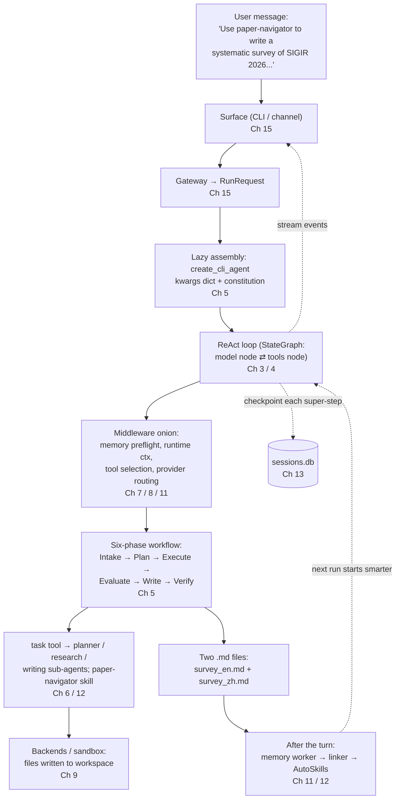

# Chapter 17 — One Request, End to End

> **This chapter answers:**
> - What actually happens, in order, when a real research request runs from a user's message to a finished bilingual survey?
> - How do the pieces the book taught separately — the ReAct loop, the middleware onion, sub-agents, EvoMemory, persistence, streaming, surfaces — act as *one* machine?
> - Where does each mechanism enter the story, and which chapter owns it?

You have read sixteen chapters. Each one zoomed into a single region of the master diagram from Chapter 2 — the ReAct loop, the middleware onion, the sub-agent team, EvoMemory, the checkpointer, the gateway, the surfaces — and taught it until you understood not just *what* it does but *why* it was built that way. What you have not yet seen is all of it moving at once. A system is not the sum of its diagrams; it is the *ordering* of their interactions on a real input. Sixteen static parts, correctly wired, become one machine only when a request flows through them.

This is that chapter. We re-traverse the entire master diagram — every region, in causal order — by following one real request end to end. Not a hypothetical request: a request whose artifacts are checked into the repository. In `docs/examples/survey-literature/`, EvoScientist was asked to produce a systematic survey of SIGIR 2026 papers on arXiv, in English and then Chinese, saved as local Markdown. The two output files exist — `SIGIR2026_public_arxiv_systematic_survey_en.md` (356 lines) and `_zh.md` (354 lines) — and cover 68 papers across ten sections. We know the input (the README quotes the exact prompt), and we know the output (we can read it). Between them lies the machine. Our job is to walk the space between input and output, scene by scene, and at each scene drop a **🔍 机制回看 / Mechanism recall** box naming the chapter that owns what just happened.

A note on honesty before we start, because this chapter demands it more than any other. Much of what follows is *runtime behavior* — the sequence of events inside a live process — and the repository does not record a per-step trace of this particular run. What it *does* record is the code that produces such a run, the system prompt that steers it, and the final artifacts. Wherever we quote code with `path:line`, that is law. Wherever we describe what the model *chose* to do on this input — which sub-agent it delegated to, when it searched — that is inference from the prompt and the artifacts, and it is marked as inference. The code wins; the narrative fills the gaps the code leaves.

Read this diagram top-down: a request enters at a surface and descends into the agent; the same path, read bottom-up, is the constraint chain — the loop's shape limits the onion, the onion limits what the sub-agents see, and so on. We will descend it once, then let the machine climb back out with a finished survey.



---

## Scene 1 — The request arrives at a surface

A user opens EvoScientist. The README for this example shows the exact ritual: `EvoSci onboard` to pick a provider (this run used OpenRouter with `gpt-4`), `/evoskills` to install the `paper-navigator` skill, and then a pasted prompt (`docs/examples/survey-literature/README.md:52-58`):

> Use paper-navigator to write a systematic survey of SIGIR 2026 papers publicly available on arXiv. Generate the English version first, then translate it into Chinese. Save both as local .md files.

Where does that text land? Whatever the surface — the Rich terminal, the WebUI, or one of the ten chat channels — the answer is the same, and that sameness is the whole point of Chapter 15. Every surface is a thin renderer over one seam: the **gateway (GraphGateway)** (the seam giving every surface one thread/stream API over local or remote graph execution — Ch 15). The surface's only real job is to package the message into a **RunRequest** and hand it to the gateway. You can read that dataclass directly at `EvoScientist/gateway/types.py:36-43`: a `RunRequest` carries a `message`, a `thread_id`, optional `metadata`, `media`, and a `target`. Nothing in it names a UI. A terminal request and a Telegram request are indistinguishable at this boundary — which is exactly why one compiled agent can serve them all.

The `thread_id` is worth pausing on, because it is the thread the whole run hangs from. It is the id grouping one conversation's chain of checkpoints (Ch 3), and here it will be a full UUID (Ch 13 explains why: `langgraph-api` rejects non-UUID ids, which is what lets the WebUI later list and resume a session the CLI started). If this request had arrived over a **channel** (one chat-platform integration behind a common `Channel` base class — Ch 15) rather than the CLI, one extra step would precede it: the channel would derive a `session_key` (`"{channel}:{chat_id}"`) and the `InboundConsumer` would map that sender to their own thread through an LRU table, so each Telegram user gets a private conversation over the one shared agent. The prompt in our example was pasted at the CLI, so the surface hands the gateway a fresh `thread_id` and the pipeline begins.

> **🔍 机制回看 — Chapter 15 (One Engine, Many Surfaces)**
> The surface does almost nothing: it wraps the message in a `RunRequest` (`gateway/types.py:36`) and calls `gateway.stream_events(request)`. The gateway — local in-process or remote against `langgraph dev` — is the one authority for graph runs. If the request came via a channel, a `session_key` and per-sender thread (Ch 13's thread concept, Ch 15's routing) would have been resolved first. Everything downstream is UI-agnostic from here.

---

## Scene 2 — The agent is assembled (lazily, on first use)

The gateway needs an agent to run the request against. In a fresh CLI session, that agent does not exist yet — and that is deliberate. EvoScientist uses a **lazy factory** (building the agent only on first use so fast CLI commands don't pay the cost — Ch 5): `EvoSci config list` and `--help` must stay instant, so nothing heavy is built until a real turn demands it. This first turn is that demand.

For an interactive CLI session the factory is `create_cli_agent` (`EvoScientist/EvoScientist.py:910`) — one of **the two factories** (Ch 5): the checkpointer-bearing one used for `/new`, `/resume`, and `/model`, as opposed to the no-checkpointer `_get_default_agent()` used by notebooks and `langgraph dev`. We need durability here, so the CLI factory is the one that runs. Its tail is the exact seam the whole book has been circling (`EvoScientist.py:1046-1049`):

```python
    return create_deep_agent(
        **kwargs,
        checkpointer=checkpointer,
    ).with_config({"recursion_limit": cfg.recursion_limit})
```

This one call is where three layers meet. `create_deep_agent` is **deepagents** (the batteries-included framework wrapping `create_agent` — Ch 4); it will call LangChain's `create_agent`, which compiles a **StateGraph** (Ch 3): a `"model"` node and a `"tools"` node wired into the **ReAct loop** (the reason→act→observe cycle — Ch 3). The `checkpointer=checkpointer` argument is EvoScientist's **PruningCheckpointer** (Ch 13), which will snapshot state after every super-step so this run survives a crash. And `.with_config({"recursion_limit": cfg.recursion_limit})` overrides the loop guard so a deep, multi-phase survey does not trip deepagents' default ceiling.

Everything specific to *this* agent — the part that makes it a scientist rather than a generic deep agent — arrives through `**kwargs`, the eight-key dict that is "configure, don't build" made literal. You can read it assembled at `EvoScientist.py:516-525`:

```python
    return {
        "name": "EvoScientist",
        "model": chat_model if chat_model is not None else _ensure_chat_model(),
        "tools": list(base_tools),
        "backend": base_backend,
        "subagents": subs,
        "middleware": base_middleware,
        "system_prompt": _configured_system_prompt(cfg),
        "skills": list(DEFAULT_SKILL_SOURCES),
    }
```

Eight keys, and each one is a chapter: `middleware` is the onion (Ch 4, Ch 7), `subagents` is the team (Ch 6), `backend` is the sandbox (Ch 9), `skills` is the skill catalog (Ch 12), `model` is the provider layer (Ch 8), and `system_prompt` is the constitution (Ch 5). That `system_prompt` is where the survey's whole strategy is written before a single token is generated: `_configured_system_prompt` stacks the seven constants of `prompts.py`, among them `EXPERIMENT_WORKFLOW` — the **six-phase workflow** with its exact labels **Intake → Plan → Execute & Debug → Evaluate & Iterate → Write Report → Verify** (`prompts.py:189` is literally `## Step 6: Verify`). The model has not run yet, but it already has its marching orders. One more detail belongs to this scene: because `cfg.auto_approve` is not set for an interactive session, `create_cli_agent` appends one extra middleware the default stack omits — `HumanInTheLoopMiddleware`, attached *main-agent-only* on purpose (`EvoScientist.py:1025-1034`), for reasons Chapter 7 made vivid.

> **🔍 机制回看 — Chapter 5 (Assembling the Agent) + Chapters 3–4 (the borrowed loop)**
> `create_cli_agent` (`EvoScientist.py:910`) builds the eight-key kwargs dict (`:516`) and passes it to `create_deep_agent` → LangChain `create_agent` → a LangGraph `StateGraph` (Ch 3/4). Lazy factory + keyed cache means this cost is paid once, now. The `system_prompt` key bakes in the six-phase workflow (Ch 5); the `checkpointer` and `recursion_limit` overrides (`:1046-1049`) come from Ch 13 and Ch 3. HITL is appended here, main-agent-only (Ch 7).

---

## Scene 3 — The first model call flows through the onion

The gateway now has a compiled agent and a `RunRequest`. It starts the graph. The `"model"` node is about to make the first call to `gpt-4` — but the call does not go straight to the network. It passes, outermost-first, through the **onion / middleware stack** (the ordered list of middleware wrapping each model/tool call — Ch 4), the thirteen-odd middleware assembled by `_get_default_middleware` (`EvoScientist.py:659`). This is where EvoScientist's domain cleverness lives, layered onto the borrowed loop.

Several things happen to this first request as it descends the onion, and the order matters. `RuntimeContextMiddleware` injects per-turn values the constitution can't hard-code — today's date, the timezone — so the prompt is fresh rather than frozen. `EvoMemoryMiddleware` performs the **memory preflight** (the agent's prompt-mandated "check memory before acting" routine — Ch 11): it rewrites the request to inject an always-on `<observation_memory>` index, the push half of push/pull retrieval, so the model can see what past runs learned before it plans this one. On a truly first run the index is empty; but the mechanism is unconditional, and by the *second* survey it is the reason the machine starts smarter. If EvoScientist's tool count crossed the ~26 threshold — which it can once `paper-navigator` and MCP tools are loaded — the **tool selector (adaptive tools)** (a middleware that, above ~26 tools, LLM-picks a relevant subset per turn — Ch 7) would fire an extra cheap LLM call to trim the toolset to what this turn needs, always keeping `think_tool`, `task`, and the memory tools.

At the bottom of the onion, the chosen model is resolved. The `model` key was `gpt-4` via OpenRouter, and that resolution is **provider routing** (Ch 8's mechanism for turning one config into the right vendor call). OpenRouter is not one of the base-URL-swap `_OPENAI_ROUTED_PROVIDERS`; it has its own first-class branch in `get_chat_model` (`EvoScientist/llm/models.py:628`) that goes through the `langchain-openrouter` integration, reads `OPENROUTER_API_KEY`, and attaches OpenRouter-specific app-attribution kwargs (`app_url`/`app_title`/`app_categories`, `models.py:644-647`) so usage is credited to EvoScientist. It is the same book-wide idea — one registry, one `get_chat_model` door, a per-provider branch behind it — just realized as a dedicated provider rather than a routed one. The call goes out; the first `AIMessage` comes back.

> **🔍 机制回看 — Chapters 11, 8, 7 (the onion at work)**
> One model call, several interceptions, in onion order: `RuntimeContextMiddleware` adds date/tz; `EvoMemoryMiddleware.wrap_model_call` pushes the `<observation_memory>` index (Ch 11's push retrieval); the tool selector trims tools if there are more than ~26 (Ch 7); and at the innermost layer, provider routing resolves `gpt-4`-over-OpenRouter through its dedicated `langchain-openrouter` branch (Ch 8). "Order is behavior" — the same middleware in a different order would be a different agent.

---

## Scene 4 — The agent works the six phases

Now the constitution takes over. The model reads `EXPERIMENT_WORKFLOW` and begins the six phases — and here the checked-in artifacts let us read the machine's decisions off the output, though the exact tool sequence is inference from the prompt.

**Intake.** Step 1 of the workflow is unambiguous (`prompts.py:82-88`): "Save the original proposal to `research_request.md`." So the agent's first act is almost certainly a `write_file` capturing the SIGIR-2026 prompt. That file matters later — Verify will re-read it. **Plan.** Step 2 says "Delegate planning to planner-agent, start your message with `MODE: PLAN`" (`prompts.py:95, 118`). The main agent — **the orchestrator** — calls the **task tool** (the tool the main agent calls to delegate to a sub-agent — Ch 6) targeting `planner-agent`, one of the six research **sub-agents** whose YAML lives in `EvoScientist/subagents/` (`planner.yaml` is right there next to `research.yaml`, `writing.yaml`, and four others). The planner decomposes "SIGIR 2026 survey" into the thematic taxonomy you can see realized in the output: five theme blocks, four method fronts (`docs/examples/survey-literature/README.md:29` — "abstract → thematic map → 4 method fronts → …").

Here the **paper-navigator skill** enters — a **skill / SKILL.md** (a self-contained capability package — Ch 12) the user installed via `/evoskills` before running. The workflow prompt tells the agent to prefer installed skills and read their `SKILL.md` (`prompts.py:57`). The README's "What it does" list is the skill's procedure showing through in the output: decompose the topic into 4–6 variant queries, discover papers via arXiv, deduplicate and cluster, read each with structured evaluation, draft section-by-section with numbered citations. That is progressive disclosure in action — the skill's name and description were always in context; its body loaded once the agent triggered it.

**Execute — the research.** The taxonomy needs papers, and web search is delegated: the constitution says "Prefer the research-agent for web search; avoid searching directly" (`prompts.py:124`). The orchestrator calls `task(research-agent, …)`, and the research sub-agent runs `tavily_search` (`EvoScientist/tools/search.py:58`) to discover the 68 arXiv papers that anchor the survey. This delegation is a **nested stateless invoke** — the sub-agent gets a fresh state whose messages are a single `HumanMessage(description)`, runs its own ReAct loop synchronously inside the parent's tool node, and returns its last `AIMessage` as one `ToolMessage` (Ch 6). It is "stateless in conversation, not in workspace": the research-agent never sees the orchestrator's history, but the files both write land in the same shared workspace.

> **🔍 机制回看 — Chapters 5, 6, 12 (workflow, delegation, skills)**
> The six-phase workflow (Ch 5, literally `prompts.py`) drives the run: Intake writes `research_request.md`, Plan delegates to `planner-agent` via the task tool (Ch 6), Execute delegates web search to `research-agent` running `tavily_search` (`tools/search.py:58`). The `task` tool is a nested stateless sub-graph invoke (Ch 6). The `paper-navigator` skill supplies the survey recipe through progressive disclosure (Ch 12) — its `SKILL.md` body loads only once triggered.

---

## Scene 5 — Tools run in the sandbox; files land in the workspace

Every `write_file`, every `execute`, every search result the agents produce goes through the **backend (BackendProtocol)** — the uniform file+shell interface the agent's tools run against (Ch 4) — not the raw operating system. The kwargs `backend` key was a **CompositeBackend** (a backend that routes calls by path prefix — Ch 4), built by `_get_default_backend` (`EvoScientist.py:616-656`): the default route is the workspace **sandbox** (the confined virtual `/` — Ch 9), while `/skills/` routes to the merged skills backend and `/memories/` to the memory backend.

So when the writing phase produces `SIGIR2026_public_arxiv_systematic_survey_en.md`, that path is confined to the workspace by `CustomSandboxBackend` (`EvoScientist.py:635-640`, `virtual_mode=True`), which auto-corrects the model's absolute-path mistakes and rejects escapes — unless the session ran in **dangerous mode** (which drops confinement for real-filesystem access — Ch 9), which this benign survey does not need. The README confirms the destination: "The two Markdown files will be written into your current workspace." No cloud store, no database — just files in a routed virtual filesystem, exactly as Chapter 9 described.

Two sub-agents in the roster carry `async: true` in their YAML — `writing` and `data_analysis` (plus `scheduler`). Had `langgraph dev` been running with async sub-agents enabled, `_maybe_swap_async_subagents` (`EvoScientist.py:515`) would have swapped the writing-agent for a remote **async sub-agent** (a sub-agent run as a separate remote graph, non-blocking — Ch 6), so drafting 700-plus lines of bilingual survey would not have blocked the orchestrator. In the default CLI session it runs synchronously — same YAML, a different execution mechanism chosen by runtime topology (Ch 6).

> **🔍 机制回看 — Chapter 9 (backends & sandbox) + Chapter 6 (async sub-agents)**
> Tool file I/O flows through `CompositeBackend` (`EvoScientist.py:616`), which routes by prefix: workspace-sandboxed default, `/skills/` and `/memories/` confined even in dangerous mode. The survey `.md` files land in the workspace sandbox (Ch 9), auto-corrected and escape-checked. The `writing` sub-agent's `async: true` (Ch 6) could make its long draft non-blocking if `langgraph dev` were up — otherwise it runs synchronously as a nested invoke.

---

## Scene 6 — Streaming and checkpointing, continuously

Two things run underneath every scene so far, quietly, on every super-step. They deserve their own scene because they are what make the run *observable* and *survivable*.

As the agent works, the surface is not staring at a blank screen. `agent.astream_events(version="v3")` (Ch 3) feeds a raw event stream that `_V3EventProcessor` normalizes into **streaming events** (normalized dicts with a `type` discriminator — Ch 15): `text`, `thinking`, `tool_call`, `tool_result`, `subagent_*`, and so on. The user watches the planner delegate, the research-agent search, the writing-agent draft — live, token by token — because the same gateway that started the run is streaming its events back through whichever of the three renderers this surface uses. Local and remote emit *identical* events, which is why a survey you launch from the CLI looks the same streamed to a WebUI resuming the thread.

Simultaneously, after each **super-step** (one round of the graph advancing all active nodes — Ch 3), the **checkpointer** snapshots the full graph state into `~/.evoscientist/sessions.db`. This is the **PruningCheckpointer** (Ch 13), and its subtlety is why the survey is resumable: LangGraph stores messages as a **delta channel** (periodic snapshots plus incremental writes — Ch 13), so naïvely pruning to the newest N rows could delete the snapshot ancestor a resume needs to replay, leaving `/resume` empty. The pruner walks to the snapshot ancestor before cutting. If your machine died halfway through the survey — say during the Chinese translation — `/resume <thread-id>` would replay to the latest good checkpoint and continue drafting, because every super-step up to the crash was already on disk.

> **🔍 机制回看 — Chapters 15 and 13 (streaming & persistence, in parallel)**
> Underneath every phase: `astream_events(v3)` → `_V3EventProcessor` mints normalized events (Ch 15) that render live across the surface; and after each super-step the PruningCheckpointer writes bounded, delta-channel-aware snapshots to `sessions.db` (Ch 13). Streaming makes the run visible; checkpointing makes it resumable. Neither is in the request path — both are cross-cutting, always on.

---

## Scene 7 — Write Report, then Verify

By now the papers are discovered, clustered, and read. Steps 5 and 6 of the workflow close the loop. **Write Report** (`prompts.py:183-187`) delegates drafting to the `writing-agent`, the sixth research sub-agent, which produces the survey itself. This is not a summary you take on faith — it is a checked-in artifact you can open. The English file leads with an abstract and a "Core observation" paragraph (`survey_en.md:5`), builds a "Unified Information Access Formula" with real LaTeX (`survey_en.md:35`), and lays out five theme blocks in Table 1 (`survey_en.md:32-40`) with per-theme paper counts totaling 68. The prompt asked for English first, then Chinese; the writing-agent produced both, and `_zh.md` is a faithful translation carrying the same tables, the same `[4,6,27,28]`-style numbered citations, and the same 68-entry reference list linking back to arXiv (`survey_en.md:220` onward is the reference list; `survey_zh.md` mirrors it).

**Verify** (`prompts.py:189-191`) is deliberately the last step and deliberately cheap: "Re-read `research_request.md` to ensure coverage. Confirm the report answers the proposal." The agent re-opens the very file it wrote in Intake and checks the output against the original request — did it cover SIGIR 2026 arXiv papers, produce both languages, save both as local `.md`? Three yeses, and the turn is done. The workflow that started by saving the request ends by re-reading it: the six phases are a loop that closes on itself.

> **🔍 机制回看 — Chapter 5 (the six-phase workflow, closing beats)**
> Write Report (`prompts.py:183`) delegates to the `writing-agent` (Ch 6), whose output is the real `survey_en.md` / `survey_zh.md` — bilingual, 68 papers, ten sections, numbered citations, arXiv reference list. Verify (`prompts.py:189`) re-reads the `research_request.md` from Intake to confirm coverage. Intake and Verify are the same file, read twice: the constitution owns this arc (Ch 5).

---

## Scene 8 — After the turn: the machine gets smarter

The user has their two files. From their point of view the request is over. From the *system's* point of view, the most distinctive thing EvoScientist does is only now beginning — this is where "self-evolving" stops being a slogan.

When the graph reaches `after_agent`, the **memory worker** (a background LLM agent that distills a finished turn into observations — Ch 11) fires. It runs on the cheaper **auxiliary model** (Ch 5) as a background run, reads the whole trajectory of this survey — *as data, not as instructions*, the prompt-injection defense from Chapter 11 — and distills it into **observations** (atomic Markdown notes with YAML frontmatter and content-hash ids — Ch 11). A survey run is rich distillate: a *procedural* observation like "for a venue survey, decompose into 4–6 variant queries before searching," a *semantic* one like "SIGIR 2026 recommendation work centers on generative recommendation." Each is written to `/memories/observations/` with a deterministic id, so re-recording the same insight is a no-op. Then the **observation linker** (a background agent that adds relation edges — Ch 11) adds typed edges — `complements`, `contradicts`, `supersedes` — turning loose notes into a graph that lives distributed across the files' frontmatter.

And over time, the loop closes structurally. Once enough observations accumulate, **AutoSkills** (the process that mines skill proposals from clusters in the observation graph, for human approval — Ch 12) runs on a nightly `langgraph dev` **cron** (Ch 14): it finds **connected components** of the observation graph (Ch 12) larger than `MIN_CLUSTER_SIZE=3` with at least `MIN_PROCEDURAL=2` procedural notes — a cheap classical filter *before* any expensive LLM judgment — and drafts a new `SKILL.md` proposal for a human to approve. A cluster of survey-writing observations could become a new survey skill. That is the point the machine has been building toward all along: the *next* survey starts with this one's lessons already in the observation index (pushed in Scene 3) and, eventually, packaged as a skill (loaded in Scene 4). Under human-on-the-loop review at every gate, the machine that just ran is not the machine that will run next time.

> **🔍 机制回看 — Chapters 11, 12, 14 (the self-evolving loop closing)**
> `after_agent` fires the memory worker (Ch 11) on the auxiliary model (Ch 5); it distills this survey into observations (trajectory-as-data defense), the observation linker adds relation edges (Ch 11), and — on a nightly `langgraph dev` cron (Ch 14) — AutoSkills mines connected components of the graph (Ch 12) into a `SKILL.md` proposal for human approval. This is the region no other agent framework has: the loop that makes run N+1 start smarter than run N.

---

## Closing: the whole machine, and what you can now do with it

Step back to the master diagram from Chapter 2. Trace what we just touched. The **surface** and **gateway** (Ch 15). The **assembly** and **constitution** (Ch 5) on the borrowed **ReAct loop** (Ch 3) inside the **deepagents** wrapper (Ch 4). The **middleware onion** with memory preflight, runtime context, and adaptive tools (Ch 7, Ch 11), resolving a model through **provider routing** (Ch 8). The **six-phase workflow** driving delegation to the **sub-agent team** via the **task tool** (Ch 6), using a **skill** (Ch 12), writing through the **sandbox backend** (Ch 9). **Streaming** and **checkpointing** running underneath every super-step (Ch 15, Ch 13). And after the turn, **EvoMemory** and **AutoSkills** on the **langgraph dev** subprocess (Ch 11, Ch 12, Ch 14). Every region of the map was on the path of one request. The only region we did not walk was the build-and-CI machinery drawn to the side (Ch 16) — because that region is *how the machine is made*, not part of any run.

Now restate the thesis, because you have finally seen it execute. **"Configure, don't build."** Almost none of the agent-ness in this run is EvoScientist's own code — the loop is LangChain's, the filesystem and delegation are deepagents'. What EvoScientist contributes is *disciplined configuration*: the eight-key kwargs dict, the thirteen middleware, the seven YAML sub-agents, the seven-constant constitution. And **self-evolving**: the run did not just answer a question; it distilled itself into memory and, over time, into skills — under human review at every gate. Those two ideas are not decorations on a chatbot. They are the difference between a system that answers once and a system that gets better at answering.

You could now modify this machine, and you would know exactly where to reach. To **add a provider**, register an entry in `_MODEL_ENTRIES` and, if it is a base-URL variant, add it to a routing table — Scene 3's resolution step (Ch 8). To **write a middleware**, subclass `AgentMiddleware`, pick your hook, and splice it into `_get_default_middleware` at the right onion depth, remembering that order is behavior — Scene 3's onion (Ch 7). To **define a sub-agent**, drop a `.yaml` into `EvoScientist/subagents/` and let `load_subagents` pick it up — Scene 4's delegation (Ch 6). To **debug a checkpoint**, open `sessions.db` and walk the delta channel to its snapshot ancestor — Scene 6's persistence (Ch 13). Each of these is a one-file change in a system whose every seam you have now watched carry a real request from a pasted prompt to a finished, bilingual, 68-paper survey. You understand EvoScientist. Go configure it.

---

## 要点 / Takeaways (and a whole-book recap)

- **A request is UI-agnostic the moment it becomes a `RunRequest`.** The surface wraps the message and hands it to the gateway; from there, CLI, WebUI, and ten channels are indistinguishable (Ch 15). The `thread_id` it carries is the spine every later mechanism hangs from (Ch 3, Ch 13).
- **One factory call unites three layers.** `create_cli_agent` → `create_deep_agent` → `create_agent` → a `StateGraph` running the ReAct loop, with the eight-key kwargs dict supplying everything domain-specific (Ch 3–5). "Configure, don't build" is that dict, made literal.
- **The onion is where the cleverness lives, and order is behavior.** Every model call is intercepted, outermost-first, for memory preflight, runtime context, adaptive tool selection, and provider routing before it ever reaches the network (Ch 7, 8, 11).
- **The six-phase workflow is the run's script, written in `prompts.py`.** Intake saves the request, Plan/Execute delegate to sub-agents via the task tool (a nested stateless invoke), a skill supplies the recipe, Write produces the artifact, and Verify re-reads Intake's file to close the loop (Ch 5, 6, 12).
- **Streaming and checkpointing are always-on and cross-cutting.** `astream_events(v3)` normalized events make the run visible; PruningCheckpointer's delta-channel-aware snapshots make it resumable — neither is in the request path, both run every super-step (Ch 13, 15).
- **The turn ends where "self-evolving" begins.** After `after_agent`, the memory worker distills the run into observations, the linker builds the graph, and AutoSkills eventually mines skills from it — all under human review, so run N+1 starts smarter than run N (Ch 11, 12, 14).
- **You now know where to reach to change it.** Adding a provider, writing a middleware, defining a sub-agent, and debugging a checkpoint are each a one-file change at a seam you have watched carry a real request end to end.
- **When book and code disagree, the code wins.** This chapter grounded every claim it could in `path:line`; where it described live runtime behavior the repo does not record, it said so. The repository is the law; this book is the guide to reading it.

---

## Sources

| Topic | File(s) | Owning chapter |
|---|---|---|
| The real run (input prompt, procedure, config, outputs) | `docs/examples/survey-literature/README.md`, `SIGIR2026_public_arxiv_systematic_survey_en.md`, `_zh.md` | Ch 17 |
| Surface → gateway → RunRequest | `EvoScientist/gateway/types.py:36`, `gateway/local.py:146` | Ch 15 |
| The two factories; kwargs dict; assembly | `EvoScientist/EvoScientist.py:516`, `:910`, `:1046` | Ch 5 |
| Borrowed loop: `create_deep_agent` / `create_agent` / StateGraph / recursion_limit | `EvoScientist/EvoScientist.py:886`, `:1046-1049` | Ch 3, 4 |
| Middleware onion & the stack | `EvoScientist/EvoScientist.py:659` (`_get_default_middleware`) | Ch 4, 7 |
| HITL appended main-agent-only | `EvoScientist/EvoScientist.py:1022-1034` | Ch 7 |
| Provider routing (gpt-4 over OpenRouter) | `EvoScientist/llm/models.py`, `patches.py` | Ch 8 |
| Six-phase workflow / constitution | `EvoScientist/prompts.py:48`, `:82`, `:183`, `:189` | Ch 5 |
| Sub-agent roster, task tool, async swap | `EvoScientist/subagents/*.yaml`, `EvoScientist.py:506`, `:515` | Ch 6 |
| Web search tool | `EvoScientist/tools/search.py:58` | Ch 6, 10 |
| paper-navigator skill (progressive disclosure) | `docs/examples/survey-literature/README.md:44-49` | Ch 12 |
| Backends / sandbox / CompositeBackend | `EvoScientist/EvoScientist.py:616-656` | Ch 9 |
| Streaming events (astream_events v3 → normalized) | `EvoScientist/stream/`, `gateway/` `_V3EventProcessor` | Ch 15 |
| PruningCheckpointer / delta channel / sessions.db | `EvoScientist/sessions.py` | Ch 13 |
| EvoMemory: worker, linker, observations | `EvoScientist/memory/` | Ch 11 |
| AutoSkills: connected-component mining, cron | `EvoScientist/skills/`, `EvoScientist/cron/` | Ch 12, 14 |

*When this book and the code disagree, the code wins.*
